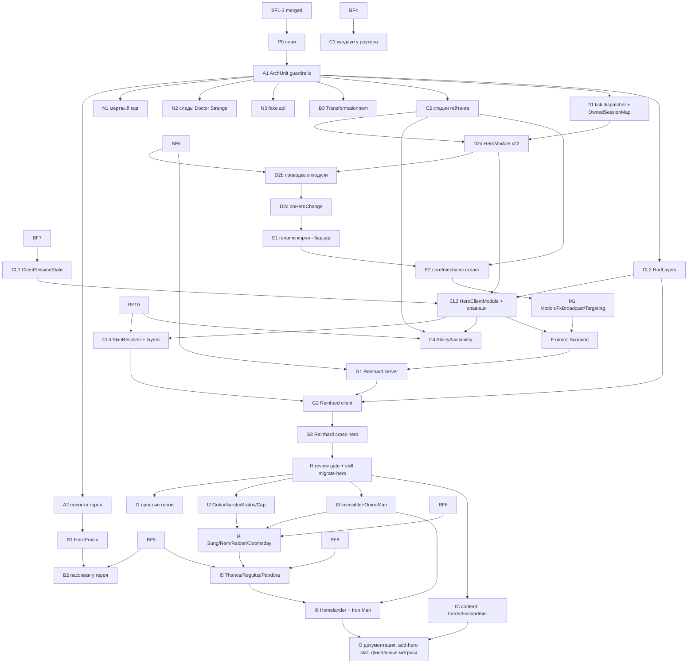

# Codex Superheroes — архитектурная миграция к hero-модулям: Implementation Plan

> **For agentic workers:** REQUIRED SUB-SKILL: Use superpowers:subagent-driven-development (recommended) or superpowers:executing-plans to implement this plan task-by-task. Steps use checkbox (`- [ ]`) syntax for tracking.

**Goal:** Сделать героя единицей владения — вертикальным модулем `hero/<id>/` (+ `client/hero/<id>/`), который подключается к общему ядру через узкие реестры и хуки, так что общий код больше не знает конкретных героев, а добавление героя или способности не требует правок в десятке shared-файлов.

**Architecture:** Последовательная миграция маленькими PR поверх seams, которые уже создал bugfix-pass (`HeroDataStore`, `PlayerLifecycle`, `EntityControlLock`, `BoundWeapons`, GameTest lane). Сначала guardrails (ArchUnit с замороженным baseline), затем данные героя (`HeroProfile`), контракт способности (стадии гейтинга), единый tick-dispatcher и `HeroModule`, клиентские реестры; потом пилот Scorpion, stress-test Reinhard, review gate и волны остальных героев. Каждая стадия оставляет один способ делать вещь — старый путь удаляется в том же PR.

**Tech Stack:** Java 21, Minecraft 1.21.1 (Mojang mappings), Fabric Loader 0.19.2, Fabric API 0.116.12+1.21.1, Fabric Loom 1.16-SNAPSHOT, JUnit 5.10.2, Fabric GameTest API, ArchUnit 1.5.1 (новая test-зависимость, стадия A1), Veil 4.1.2 (опционально на клиенте), GeckoLib ≥4.5.0.

## Global Constraints

- Mod id: `superheroes` — не меняется никогда.
- Персистентные идентификаторы не меняются: id способностей (`superheroes:<ability>`), предметов, сущностей, звуков (`sounds.json`), MobEffect, типов урона, attachments (`hero_data`, `reinhard_state`, `doomsday_progress`, `regulus_madness`, `regulus_bonus_life`, `admin_build`, `suit_variant`, `nano_form`, `control_lock_shadow`, `pandora_revived` и др.), data component `superheroes:bound_weapon`, **ResourceLocation-ы attribute-модификаторов** (`modifiers/<hero>/<stat>` — permanent-пассивки лежат в NBT игроков), имена `KeyMapping` (`key.superheroes.*` — лежат в `options.txt`), lang-ключи.
- Id сетевых payload'ов не персистентны: их можно менять только при семантически оправданном слиянии (стадия L2).
- Геймплей и баланс не меняются в архитектурных PR. Любое изменение поведения — отдельный коммит с пометкой `behavior:` в сообщении и отдельным пунктом в описании PR.
- Server-authoritative: всё клиентское — в `src/client`; `src/main` загружается выделенным сервером.
- Только публичные API: `net.fabricmc.fabric.api.*`, никакого `net.fabricmc.fabric.impl.*`.
- Сеть — типизированные `CustomPacketPayload` + `StreamCodec`.
- `HeroDataStore` — единственный писатель `HERO_DATA` (`ProjectSanityTest.assertHeroDataHasSingleWriter`).
- Lifecycle-очистка — только через `PlayerLifecycle` (серверный поток), никогда через `ServerPlayConnectionEvents.DISCONNECT`.
- Mixins: узкие, `@Unique` для внедрённых членов, `@WrapOperation` предпочтительнее `@Redirect`.
- Звуки только OGG Vorbis; перед новыми ассетами проверять `art-source/`.
- `en_us.json` и `ru_ru.json` меняются вместе.
- `src/main/generated/` — только через `./gradlew runDatagen --no-daemon`; diff обязан быть пустым, если стадия не меняет данные намеренно.
- Финишный гейт каждого PR: `./gradlew qualityGate --no-daemon` зелёный.
- Runtime-изменения (ввод, рендер, HUD, сеть, VFX, сущности) — `./gradlew runClient --no-daemon`; если окружение не может запустить клиент, PR прямо это говорит.
- Никаких Gradle-модулей на героя, никакого big-bang rewrite, никакой перестановки файлов без смены владения.
- PR: заголовок на русском, тело начинается с «Для игрока», ниже — полная техническая часть; коммиты `feat(scope):`/`fix(scope):`/`refactor(scope):`/`test(scope):`/`docs(scope):` на английском.
- `SESSION.md` обновляется в каждом PR этого плана; статус стадии отмечается в таблице «Статус стадий» этого файла.

---

## 0. Как пользоваться этим планом

- План — единый roadmap всей миграции. Стадии имеют id (`A1`, `B1`, `D2b`, `F`, `G1` …). Одна стадия = один PR, если не сказано «PR-units».
- Стадии волны 1 (`A1`, `A2`, `N1`–`N3`, `B1`, `B3`, `C2`, `D1`, `D2a`) расписаны по шагам TDD с кодом. Более поздние стадии содержат паспорт (цель, зависимости, файлы, что создаётся/мигрируется/удаляется, запреты, тесты, acceptance, риски, откат), интерфейсы с точными сигнатурами и код ключевых тестов. Их конкретные строки в legacy-файлах зависят от того, что к тому моменту сделает bugfix-pass (этапы BF4–BF10), поэтому **первый шаг каждой поздней стадии — «Сверка»**: перечитать перечисленные файлы на актуальном `main` и обновить список касаний в описании PR. Это не перепланирование архитектуры: интерфейсы и правила зафиксированы здесь.
- Если на актуальном коде проблема уже решена иначе, чем здесь описано, — используем существующее решение и фиксируем это в PR и в разделе «Журнал решений» (§2) этого файла. Откатывать рабочее решение ради буквального соответствия плану нельзя.
- Пути: `M/` = `src/main/java/com/example/superheroes/`, `C/` = `src/client/java/com/example/superheroes/client/`, `T/` = `src/test/java/com/example/superheroes/`, `G/` = `src/gametest/java/com/example/superheroes/gametest/`. После стадии `E1` корень пакета меняется (см. `E1`), относительные пути остаются теми же.

### Статус стадий

| Стадия | Статус | PR |
| :-- | :-- | :-- |
| P0 план + аудиты в репозитории | 🟡 PR открыт | этот PR |
| остальные | ⏳ | |

---

## 1. Исходное состояние (проверено на `origin/hoplite/kroton-d9205130--lifecycle` @ `e538282`, вершина стека #37→#38→#39)

### 1.1 Что уже сделал bugfix-pass (открытые PR, в `main` ещё не влиты)

| Этап BF | PR | Что закрыто | Seam, который план переиспользует |
| :-- | :-- | :-- | :-- |
| BF1 | #37 | B1, B7, GameTest lane | `item/bound/` (`BoundWeapons`, `BoundWeaponItem`, `BoundWeaponToken`, `BOUND_WEAPON_ISSUES`), один `PlayerBoundWeaponDropMixin`; `src/gametest` + `runGametest` в `qualityGate`; `G/TestPlayers` |
| BF2 | #38 | B2, долг 2, часть долга 5 | `transform/HeroDataStore` (`get`, `update(player, fn)`, `syncFull`, фаза `hero_data_flush`), `resource/ResourcePayment`, `ResourceController.charge/refund`, `AbilityRouter.deactivate` «флаг → onDeactivate» |
| BF3 | #39 | B3, B4, B8, B17, B23, N1–N3 | `lifecycle/PlayerLifecycle` (`onJoin/onLeave/onDeath/onRespawn/onServerStopped`), `lifecycle/EntityControlLock` + `ControlLockShadow`, `AttributeModifierSet.Builder.abilityScoped()` (transient), `HeroTransformService.clearHeroRuntimeState`, attachment `TRANSFORM_TICK` |

Проверенный объём: закрыто 8 из 23 багов (B1–B4, B7, B8, B17, B23) и 3 новые находки; долг 2 закрыт, долг 5 частично. Оценка «~70%» по коду не подтверждается состоянием удалённого репозитория: этапы BF4–BF12 не начаты (ни веток, ни PR на момент проверки).

### 1.2 Что осталось bugfix-pass (не планируется здесь, но является зависимостью)

| Этап BF | Закрывает | Нужен стадиям плана |
| :-- | :-- | :-- |
| BF4 | B5 (кулдауны в персистентный attachment), B6 (Snap тратит камни) | `C1` |
| BF5 | B9, B20, B21 (damage pipeline, `AFTER_DAMAGE`/`ALLOW_DEATH`, фазы), B11 (глобальный tick rate Reinhard) | `D2b`, `G1`, `I4` |
| BF6 | B10 `WorldDestructionPolicy` | `I5` (Thanos), `I4` (Doomsday) |
| BF7 | B15 клиентская сессия, клавиши, Iris, чат | `CL1`, `CL3` |
| BF8 | B13 House of Vanity server authority | `I5` (Pandora) |
| BF9 | B12 reconciler пассивок, B16 fall-иммунитет | `B2`, `I5` (Regulus) |
| BF10 | B14 synced attachment публичного вида героя | `CL4`, `C4` |
| BF12 | гигиена: `fabric.mod.json` зависимости, модель `horde_crystal`, lang 5 сущностей | — |

**Этап BF11 («Hero hooks / lifecycle events / tick dispatcher», долг 1–4) поглощается этим планом** (стадии `C2`, `D1`, `D2a`–`D2c`). Bugfix-pass не должен начинать BF11 — иначе появятся две конкурирующие реализации одного seam. Документационная часть BF12 (AGENTS.md §2) переходит в стадию `O`.

### 1.3 Замеры на вершине стека (baseline для критериев §9)

| Метрика | Значение | Как мерить |
| :-- | :-- | :-- |
| `.init()` в `SuperheroesMod.onInitialize` | 76 | `grep -c '\.init()' M/SuperheroesMod.java` |
| регистраций `PlayerLifecycle.on*` в `SuperheroesMod` | 56 (+29 `resetAll()` в `onServerStopped`) | `grep -c 'PlayerLifecycle.on' M/SuperheroesMod.java` |
| регистраций `END_SERVER_TICK`/`START_SERVER_TICK`/`END_WORLD_TICK` в `M/` | 53 | `grep -rn 'END_SERVER_TICK.register\|START_SERVER_TICK.register\|END_WORLD_TICK.register' M/` |
| per-player `serverTick` в bootstrap-цикле | 13 + 2 условных (`NARUTO_SAGE_MODE`, `GOKU_SUPER_SAIYAN_AURA`) | `M/SuperheroesMod.java` |
| `ALLOW_DAMAGE` слушателей | 13 | `grep -rn 'ALLOW_DAMAGE.register' M/` |
| статических `Map/Set<UUID…>` в `M/` / `C/` | 104 / 10 | `grep -rEc 'static (final )?(Map\|Set\|ConcurrentMap\|WeakHashMap\|HashMap\|ConcurrentHashMap)<UUID'` |
| `Ability`-классов с `AbilityCooldowns.isOnCooldown` | 85 | `grep -rl 'AbilityCooldowns.isOnCooldown' M/ability` |
| payload'ов / регистраций типов / клиентских receiver'ов | 43 / 44 / 36 | `M/network`, `C/network/ClientNetworking.java` |
| `Client*State` / с reset/clear | 26 / 13 | `C/Client*State.java` |
| HUD-классов / использующих `HudLayoutManager` | 37 / 9 | `C/hud` |
| mixins main / client | 11 / 19 | `superheroes.mixins.json`, `superheroes.client.mixins.json` |
| таблиц героев в shared-коде | 9: `HeroTheme` (11 констант), `HeroHudConfig` (20), `HeroAttributes` (наборы), `CombatImpactEngine.styleFor/heroPower`, `JarvisThreatClass.HERO_THREATS`, `AbilityDescriptions.HERO_PASSIVE_COUNT`, `PassiveIcons.MAP`, `SuperJumpController.ALLOWED_HEROES`, `HeroBleedingController` switch | §B1 |
| shared-файлов, которые трогает Scorpion / Reinhard | 12 / ~20 | §1.4 |

### 1.4 Проверенные footprints пилотов

**Scorpion** (свои файлы: `M/hero/ScorpionHero`, `M/ability/Scorpion{Spear,Hellfire,FireTeleport,HellBreath}Ability`, `M/effect/ScorpionController` (264 строки, статические `SPEAR_PULLS`, `BREATHS`, собственный `END_SERVER_TICK`, `isScorpion`-проверка), `M/effect/ScorpionFx`, `M/item/ScorpionKunaiItem` (предмет трансформации), `M/network/ScorpionFxS2CPayload`, `C/fx/ClientScorpionFx`, `C/fx/VeilScorpionFx`). Shared-касания: `SuperheroesMod:44`, `AbilityIds:139-142`, `AbilityRegistry:139-142,262-265`, `HeroAttributes:402-407,437-443`, `HeroHudConfig:49`, `HeroTheme:233`, `Heroes:32,59`, `ModItemGroups:71`, `ModItems:210-212`, `ModNetworking:55`, `ModSounds:33`, `ClientNetworking:86-87`. `SPEAR_PULLS`/`BREATHS` не очищаются ни на leave, ни на `SERVER_STOPPED` (не попали в списки BF3).

**Reinhard**: 37 своих файлов (8 способностей, 8 контроллеров в `effect/`, `ReinhardState` + attachment `REINHARD_STATE`, 7 payload'ов, `ReinhardSuitItem`, `RoyalIcicleItem` (bound weapon), 5 `ClientReinhard*State`, 3 HUD-оверлея, `ReinhardWishScreen`, `ReinhardScabbardLayer`) и shared-касания: `AbilityIds.isReinhardSwordOnly:153-158`, `SuperJumpController:38`, `HeavensStrikeController:38` (мёртвый `Variant.REINHARD`), `AdminAbilityDebug:11`, `RadialMenuHud:275-278`, `SoundEngineMixin:16-20`, `HeroTransformService:156,195`, `ReinhardController:419-424` (перечень чужих лучевых типов урона), `ReinhardTimeSlowController:135` (`setTickRate`, B11), `CombatImpactEngine:316`, `JarvisThreatClass:46`, `HeroAttributes`, `HeroTheme`, `HeroHudConfig`, `Heroes`, `ModItems`, `ModItemGroups`, `ModAttachments`, `ModNetworking`, `ModSounds`, `ClientNetworking`, `SuperheroesClient:102`, `AbilityDescriptions`, `PassiveIcons`.

---

## 2. Синтез аудитов и журнал решений

Источники: аудит 1 — `docs/audits/2026-09-25-opus-architecture-audit.md` (баги B1–B23, долг 1–9); аудит 2 — два документа, написанных параллельно и дополняющих друг друга: `docs/audits/2026-09-25-hero-modularity-audit.md` (локальность героя, `HeroModule`, `HeroProfile`, пилот Scorpion, stress-test Reinhard, целевая структура `core/mechanic/hero/content/compat`) и `docs/audits/2026-09-25-hoplite-structural-audit.md` (граф пакетов и циклы, S1–S17, реестры вместо списков, контракт роутера, сервисы вместо идиом, mixin policy, payload'ы, M1–M11). Оба документа добавлены в репозиторий этим PR с ветвей `hoplite/phaistos-c8f77e4f` и `hoplite/sestos-ea593710`.

| # | Вопрос / расхождение | Что говорит код сейчас | Решение |
| :-- | :-- | :-- | :-- |
| D1 | Opus: `HeroLifecycleEvents`; модульный аудит: хуки в `HeroModule` | BF3 уже создал `PlayerLifecycle` — здоровый хаб на серверных событиях | Второй системы не создаём. `PlayerLifecycle` остаётся хабом; добавляется одно событие `onHeroChange`; модули регистрируются через `LifecycleRegistrar`, который делегирует в `PlayerLifecycle`. |
| D2 | Opus: хуки в `Hero`; модульный аудит: `HeroModule`; структурный: хуки `Hero` + per-hero пакет | — | Разделение ответственности: `Hero` — данные и правила, которые ядро спрашивает во время игры (`profile()`, `getAbilities()`, `gate(...)`, пассивки, размеры, скин, `onLanded`). `HeroModule` — только bootstrap-проводка через узкие registrar'ы. Ни один из них не становится god-object: registrar'ы — отдельные маленькие интерфейсы. |
| D3 | Модульный: ветки роутера → `canUseAbility`; структурный: роутер владеет гейтингом | Порядок проверок в `AbilityRouter.activate` поведенчески значим (toggle-off идёт до Iron Fists и кулдауна) | Четыре точки ровно там, где сейчас стоят ветки: `AbilityRules.blocker` (до membership: Snap, Vanity, aftermath), `Hero.checkAccess` (до toggle-off: тиры Doomsday, камни Thanos, дом Pandora), `AbilityRules.activationBlocker` (после toggle-off, до кулдауна: Iron Fists), `Hero.allowsPayment` (при оплате: резерв Unibeam). Глобальные правила регистрирует модуль-владелец состояния. |
| D4 | Структурный M3: `Ability.cooldownTicks()` | 98 вызовов `setCooldownTicks` с разными моментами установки (после канала, по условию) | Роутер владеет **проверкой** кулдауна (уже так); дубли `isOnCooldown(own id)` в `canActivate` удаляются (единственный вызывающий `canActivate` — роутер, проверено). **Установку** кулдауна оставляем способности — унификация момента установки изменила бы баланс. |
| D5 | Opus: `HeroTickDispatcher`; модульный: тики через `registerHooks` | 53 собственных `END_SERVER_TICK` + цикл в bootstrap | Один `core.tick.HeroTickDispatcher` с фазами `EARLY/NORMAL/LATE` и тремя видами хуков (`server`, `players`, `hero(id)`), регистрируется через `TickRegistrar` модуля. Мёртвые игроки пропускаются централизованно (правило B17). Фаза `hero_data_flush` у `HeroDataStore` остаётся как есть. |
| D6 | Структурный M5 предлагает сначала рвать кольцо пакетов; модульный — переименовать корень до переносов | Bugfix-pass ещё активно правит десятки файлов | Разрыв колец делается владением, а не переименованием: state-record'ы уезжают к героям в их миграциях, `core`/`mechanic` рождаются новыми пакетами со строгими правилами. Переименование корня `E1` — один механический PR на барьере, когда нет открытых PR с `src/`. |
| D7 | Модульный: всё геройское в `hero/<id>/`; Veil — `compat/veil` | `VeilScorpionFx` используется только Scorpion; `WildShaders`/`WildRenderer` — общая инфраструктура | Код опциональной библиотеки, нужный ровно одному герою, живёт в `client/hero/<id>/fx/veil/` за guard'ом `isModLoaded`; общая Veil-инфраструктура — `client/core/fx/veil/`. `compat/` — только интеграции с чужими модами (falbiks, Iris). |
| D8 | Модульный: `ProjectSanityTest` + source-check импортов; SESSION: «ArchUnit намеренно не портирован» | Код массово использует FQN-ссылки (`com.example.superheroes.effect.X.init()`), grep по `import` их не видит; сам `ProjectSanityTest` велит структурные правила выносить в отдельный инструмент | Архитектурные правила — ArchUnit (`src/test`) с `FreezingArchRule`: текущие нарушения заморожены в `src/test/resources/archunit_store/`, новые ломают гейт, исправленные автоматически уходят из store; `qualityGate` требует, чтобы store был закоммичен (ratchet только вниз). `ProjectSanityTest` остаётся честным grep по исходникам/JSON. |
| D9 | Модульный §6: пассивки Scorpion/Pandora «выпали» из таблиц | Scorpion имеет lang `hero.superheroes.scorpion.passive.1..3`, но показывается 0 пассивок; угроза C, стиль `DEFAULT`, сила 1.0 | `HeroProfile` у Scorpion и Pandora фиксирует **текущие** фактические значения (дефолты). Показ реальных пассивок Scorpion и калибровка его боевого профиля — отдельный content-PR после `B1` (не архитектура). |
| D10 | Opus: runtime-attachment вместо ~105 статических коллекций | Часть статики — индексы по жертве, которые надо итерировать каждый тик | Правило размещения: per-player session state → non-persistent attachment на игроке; активные эффекты, которые итерируются тиком, → `core.lifecycle.OwnedSessionMap` (автоочистка на leave/death/hero change/`SERVER_STOPPED`). Ручные `resetAll()`/`clear` в bootstrap исчезают. |
| D11 | Структурный M6: `Feedback.actionBar` | `displayClientMessage` — однострочный ванильный вызов без правил | Сервис `Feedback` не создаём (нет правила, которое могло бы разойтись). `Motion`, `Targeting`, `FxBroadcast` создаём — у них есть правила (синхронизация скорости, PvP/союзники/спектаторы, адресаты). |
| D12 | Структурный M10: объединять «метровые» payload'ы | Формы метров различаются | Лучевые payload'ы (`LaserFired`, `RepulsorBlast`, `ThanosCosmicBeam` — одинаковая семантика «отрезок луча от стрелка») сливаются в `BeamFxS2CPayload(style, …)`. Метры не сливаются в один payload: долгоживущее состояние, видимое клиенту, переводится на synced attachment героя; разовые FX-события остаются payload'ами модуля. |
| D13 | `api/` — «фикция» (структурный S12) | `docs/api.md` удалён ревайвлом; единственный потребитель — `RepulsorChargeController` | `api/` удаляется в `N3`. Публичный аддон-API проектируется позже поверх `HeroModule` (Fabric entrypoint), когда появится реальный потребитель. |
| D14 | Имя нового корневого пакета | `com.example.superheroes` | Предлагаемое по умолчанию: `io.github.grebeshok105.codex`. Это решение владельца; `E1` не стартует без подтверждения, остальные стадии от имени не зависят. |

---

## 3. Целевая архитектура

### 3.1 Раскладка пакетов (конечное состояние, корень `<root>` — см. D14)

```text
<root>/
  SuperheroesMod                 # ≤ 40 строк: core bootstrap, HeroModules.bootstrap(), content, compat
  ModId
  core/
    hero/        Hero, HeroProfile (+CombatProfile, BleedProfile, ThreatClass, PassiveGlyph), HeroTheme, HeroHudConfig,
                 AttributeModifierSet, LandingImpact, Heroes (реестр)
    module/      HeroModule, HeroModuleContext, HeroModules (явный список, одна строка на героя)
    ability/     Ability, AbilityDenial, AbilityBlocker, AbilityRules, AbilitySink, AbilityAvailability,
                 AbilityRouter (без веток героев), AbilityRegistry, AbilityCooldowns
    resource/    ResourceController, ResourcePayment, ResourceKind, EnergyLocks
    transform/   HeroData, HeroDataStore, HeroTransformService, TransformationItem
    lifecycle/   PlayerLifecycle, LifecycleRegistrar, OwnedSessionMap, EntityControlLock (+ state/shadow)
    tick/        HeroTickDispatcher, TickRegistrar, TickPhase
    net/         общие payload'ы (активация, привязка, sync HeroData/ресурсов, кулдауны, тряска экрана), PayloadRegistrar
    attachment/  только общие attachments (HERO_DATA, CONTROL_LOCKS, TRANSFORM_TICK, …)
  mechanic/
    flight/ impact/ damage/ (BF5) world/ (BF6) targeting/ motion/ fx/ boundweapon/ charge/ strike/ summon/ shockwave/
    ability/     общие способности (FLIGHT, VILTRUMITE_RECOVERY)
  hero/<id>/
    <Id>Module  <Id>Hero  <Id>Abilities (id-константы)
    ability/  runtime/ (бывшие *Controller)  item/  entity/  net/  mixin/ (только если нельзя заменить общим хуком)
  content/      horde/  boss/homelander/  admin/ (AdminBuildSync, AdminAbilityDebug)  command/
  compat/       falbiks/  iris/ (серверная часть, если есть)
client/
  SuperheroesClient              # ≤ 40 строк: client core bootstrap, HeroClientModules.bootstrap(), compat
  core/
    module/  HeroClientModule, HeroClientContext, HeroClientModules
    session/ ClientSessionState, ClientSessionStates
    hud/     HudLayer, HudLayers, MovableHud, HUD-фреймворк, HudLayoutManager (из реестра)
    input/   ModKeys (только общие клавиши), HeroActionKeys
    render/  SkinResolver, SkinProvider, PlayerLayers, BeamRenderer
    fx/      CustomParticleGate, veil/ (общая инфраструктура)
    mixin/   только общие mixins с делегированием в реестры
  hero/<id>/ <Id>ClientModule  state/  hud/  render/  screen/  fx/  mixin/ (исключения)
  compat/    iris/
```

### 3.2 Правила зависимостей (проверяются ArchUnit, стадии A1 и E2)

| Из \ В | core | mechanic | hero.X | hero.Y | content | compat | client.* |
| :-- | :-- | :-- | :-- | :-- | :-- | :-- | :-- |
| core | ✅ | ❌ | ❌ | ❌ | ❌ | ❌ | ❌ |
| mechanic | ✅ | ✅ | ❌ | ❌ | ❌ | ❌ | ❌ |
| hero.X | ✅ | ✅ | ✅ | ❌ (только строковые id) | ❌ | ❌ | ❌ |
| content | ✅ | ✅ | ❌ | ❌ | ✅ | ❌ | ❌ |
| compat | ✅ | ✅ | только через хуки, которые герой зарегистрировал | | ❌ | ✅ | ❌ |
| client.core | ✅ | ✅ | ❌ | ❌ | ❌ | ❌ | client.core |
| client.hero.X | ✅ | ✅ | ✅ (свой) | ❌ | ❌ | ❌ | client.core, client.hero.X |

Единственные классы, которым разрешено ссылаться на `hero.<id>`: `core.module.HeroModules` (main) и `client.core.module.HeroClientModules` (client).

### 3.3 Ownership: кто что решает при активации способности

| Решение | Владелец | Где |
| :-- | :-- | :-- |
| Эффект-блокировщик на игроке (Snap, Vanity strip, aftermath) | модуль, объявивший эффект → `AbilityRules.blocker` | `AbilityRouter.activate`, до membership |
| Способность принадлежит герою | `Hero.getAbilities()` | роутер |
| Разблокирована ли (тиры Doomsday, камни Thanos, «только в доме» Pandora, «только с мечом» Reinhard) | `Hero.checkAccess` | роутер, до toggle-off |
| Toggle-off активной | роутер | |
| Эксклюзивность (Iron Fists) | модуль Homelander → `AbilityRules.activationBlocker` | роутер, после toggle-off, до кулдауна |
| Кулдаун: проверка | роутер (`AbilityCooldowns`) | |
| Кулдаун: установка | способность | `setCooldownTicks` в момент, определённый дизайном способности |
| Energy lock | роутер (`EnergyLocks`) | |
| Ситуативные предусловия (цель, предмет, земля) | `Ability.canActivate` | |
| Бесплатность стоимости (безумие Homelander) | `AbilityRules.freeCost(...)` модуля-владельца | роутер + `ResourceController` |
| Резерв ресурса (Unibeam) | `Hero.allowsPayment` | роутер, в `canPayActivationCost` |
| Списание/возврат | роутер (`ResourceController.charge/refund`) | |
| Флаг активности toggle | роутер через `HeroDataStore` | |

---

## 4. File Structure (что создаётся и зачем)

Файлы, создаваемые детально расписанными стадиями волны 1:

| Файл | Ответственность | Стадия |
| :-- | :-- | :-- |
| `T/architecture/ArchitectureRulesTest.java` | ArchUnit-правила main (замороженные и строгие) | A1 |
| `T/architecture/ClientArchitectureRulesTest.java` | ArchUnit-правила client | A1 |
| `T/architecture/CodexClasses.java` | импорт классов main/client из путей, переданных Gradle | A1 |
| `src/test/resources/archunit.properties` | конфиг freeze store | A1 |
| `src/test/resources/archunit_store/**` | замороженный baseline нарушений | A1 |
| `G/HeroCompletenessGameTests.java` | полнота героя: способности зарегистрированы, lang-ключи есть, профиль задан | A2, B1 |
| `M/hero/HeroProfile.java` (+ `CombatProfile`, `BleedProfile`) | данные героя, которые читает shared-код | B1 |
| `M/hero/ThreatClass.java` | бывший `JarvisThreatClass` без таблицы героев | B1 |
| `M/hero/PassiveGlyph.java` | бывший `HudIcons.PassiveGlyph` (чистый enum) | B1 |
| `src/gametest/resources/golden/hero_presentation.txt` + `G/HeroProfileGameTests.java` | snapshot значений старых таблиц | B1 |
| `M/core/ability/{AbilityDenial,AbilityBlocker,AbilityRules}.java`, `G/AbilityGateGameTests.java`, `G/TestHeroes.java` | точки гейтинга и их характеризационные тесты | C2 |
| `M/core/tick/{TickPhase,TickRegistrar,HeroTickDispatcher}.java` | единый tick | D1 |
| `M/core/lifecycle/{LifecycleRegistrar,OwnedSessionMap}.java` | регистрация lifecycle из модулей, session state | D1 |
| `M/core/module/{HeroModule,HeroModuleContext,HeroModules}.java`, `M/core/ability/AbilitySink.java` | модульный seam | D2a |
| `M/hero/<id>/<Id>Module.java` ×22 | проводка героя | D2a |

Поздние стадии создают `C/core/**`, `mechanic/**`, `hero/<id>/**` по таблице §3.1; конкретные файлы перечислены в паспортах.

---

## 5. Граф зависимостей стадий и параллельность



Параллельные дорожки (разные файлы, конфликты только тривиальные):

- Сразу после `P0` и параллельно с BF4–BF6: `A1` → { `A2` → `B1`, `B3`, `N1`, `N2`, `N3`, `C2`, `D1`, `CL2` }.
- `C1` — как только влит BF4. `B2` — как только влиты BF9 и `B1`.
- `D2a` — после `D1` и `C2`. `D2b`/`D2c` — после BF5.
- Клиентская дорожка `CL1`→`CL3`→`CL4`/`C4` идёт параллельно с серверной `D2b`→`D2c`.
- Барьер `E1`: ни одного открытого PR, трогающего `src/`; координируется с bugfix-pass.
- Волны `I1`, `I2`, `I3`, `IC` после `H` — параллельны (разные герои); мерж последовательный с rebase (конфликты — удаление строк из общих файлов).
- Bugfix-pass (BF4–BF10) идёт параллельно всему до `E1`; каждый BF-этап, влитый после старта стадии, требует rebase стадии и перепроверки её «Сверки».

Оценка объёма: ~40 PR.

---

## 6. Стадии

Шаблон паспорта: **Цель · Почему · Зависит от · Затрагивает · Создаётся · Мигрируется · Удаляется · Старые пути, которых больше нет · Нельзя менять · Тесты · Runtime · Acceptance · Риски · Страховка.** Общие для всех стадий требования — Global Constraints; они не повторяются в паспортах.

Каждая стадия заканчивается одинаково (шаги не повторяются в каждой задаче):

- [ ] `./gradlew qualityGate --no-daemon` → `BUILD SUCCESSFUL`.
- [ ] Если стадия трогала datagen-источники: `./gradlew runDatagen --no-daemon` и `git diff --stat src/main/generated` → пусто (или только намеренные изменения, перечисленные в PR).
- [ ] Обновить таблицу «Статус стадий» (§0), `SESSION.md`, при необходимости «Журнал решений» (§2).
- [ ] PR по правилам AGENTS.md §12; в технической части — метрики §1.3 «до/после» для затронутых строк.

---

### Стадия A1 — ArchUnit guardrails с замороженным baseline

- **Цель:** механически запретить новые архитектурные нарушения и сделать каждое устранённое нарушение необратимым.
- **Почему:** без гейта каждый параллельный агент может добавить ещё одну ветку `XHero.ID.equals` в shared-код (именно так Scorpion и Pandora выпали из таблиц — аудит 2, S2). grep по `import` не видит FQN-ссылок, которыми полон bootstrap (D8).
- **Зависит от:** P0; BF1–BF3 влиты в `main` (иначе baseline придётся пересобирать).
- **Затрагивает:** `build.gradle`, `src/test/**`, `AGENTS.md` §10 (одна строка про `verifyArchitectureBaseline`).
- **Создаётся:** `T/architecture/CodexClasses.java`, `T/architecture/ArchitectureRulesTest.java`, `T/architecture/ClientArchitectureRulesTest.java`, `T/architecture/PackageCycleRatchetTest.java`, `src/test/resources/archunit.properties`, `src/test/resources/archunit_store/` (сгенерировано), `src/test/resources/architecture/package-cycles-baseline.txt`, Gradle-задача `verifyArchitectureBaseline`.
- **Мигрируется / удаляется:** ничего.
- **Нельзя менять:** production-код; существующие проверки `ProjectSanityTest`.
- **Тесты:** сами правила; проверка «зубов» — временное нарушение должно ронять тест (шаг 7).
- **Runtime:** не нужен.
- **Acceptance:** `qualityGate` зелёный; store закоммичен; временная ссылка `ScorpionHero.ID` из `M/flight/FlightTuning.java` роняет `sharedCodeDoesNotDependOnConcreteHeroes`; удаление одной замороженной зависимости и повторный прогон меняет store, а `verifyArchitectureBaseline` падает, пока изменение не закоммичено.
- **Риски:** сигнатуры предикатов ArchUnit 1.5.1 могут отличаться от указанных — семантику правил сохранять, компилировать по javadoc 1.5.1. Хрупкость freeze-описаний циклов — поэтому циклы ведёт собственный ratchet (задача A1.4), а не `FreezingArchRule`.
- **Страховка:** стадия не трогает production; откат — revert PR.

#### Task A1.1: подключить ArchUnit и импорт классов main/client

**Files:**
- Modify: `build.gradle` (блок `dependencies`, задача `test`)
- Create: `src/test/java/com/example/superheroes/architecture/CodexClasses.java`
- Create: `src/test/resources/archunit.properties`
- Test: `src/test/java/com/example/superheroes/architecture/ArchitectureRulesTest.java`

**Interfaces:**
- Produces: `CodexClasses.ROOT` (`String`), `CodexClasses.main()` → `JavaClasses` (только `src/main`), `CodexClasses.mainAndClient()` → `JavaClasses`.

- [ ] **Step 1: Написать падающий smoke-тест**

```java
package com.example.superheroes.architecture;

import org.junit.jupiter.api.Test;

import static org.junit.jupiter.api.Assertions.assertTrue;

class ArchitectureRulesTest {
	@Test
	void importsTheWholeMainSourceSet() {
		assertTrue(CodexClasses.main().size() > 400, "expected >400 main classes, got " + CodexClasses.main().size());
	}
}
```

- [ ] **Step 2: Убедиться, что падает**

Run: `./gradlew test --no-daemon --tests '*ArchitectureRulesTest*'`
Expected: FAIL — `cannot find symbol CodexClasses`.

- [ ] **Step 3: Зависимость и проброс путей в `build.gradle`**

В `dependencies` рядом с JUnit:

```groovy
	testImplementation "com.tngtech.archunit:archunit-junit5:1.5.1"
```

Расширить существующую конфигурацию задачи `test` (там, где стоит `useJUnitPlatform()`):

```groovy
tasks.named('test') {
	dependsOn tasks.named('clientClasses')
	systemProperty 'codex.mainClasses', sourceSets.main.output.classesDirs.asPath
	systemProperty 'codex.clientClasses', sourceSets.client.output.classesDirs.asPath
	// One-off store creation: ./gradlew test -Darchunit.freeze.store.default.allowStoreCreation=true
	systemProperties System.properties.findAll { it.key.toString().startsWith('archunit.') }
	inputs.dir('src/test/resources/archunit_store').optional()
}
```

- [ ] **Step 4: `CodexClasses`**

```java
package com.example.superheroes.architecture;

import com.tngtech.archunit.core.domain.JavaClasses;
import com.tngtech.archunit.core.importer.ClassFileImporter;

import java.io.File;
import java.nio.file.Files;
import java.nio.file.Path;
import java.util.ArrayList;
import java.util.List;

/** Imports compiled main/client classes from the directories Gradle passes in; see build.gradle `test`. */
final class CodexClasses {
	static final String ROOT = "com.example.superheroes";

	private static JavaClasses main;
	private static JavaClasses mainAndClient;

	private CodexClasses() {
	}

	static synchronized JavaClasses main() {
		if (main == null) {
			main = importDirs("codex.mainClasses");
		}
		return main;
	}

	static synchronized JavaClasses mainAndClient() {
		if (mainAndClient == null) {
			mainAndClient = importDirs("codex.mainClasses", "codex.clientClasses");
		}
		return mainAndClient;
	}

	private static JavaClasses importDirs(String... properties) {
		List<Path> dirs = new ArrayList<>();
		for (String property : properties) {
			String value = System.getProperty(property);
			if (value == null || value.isBlank()) {
				throw new IllegalStateException(property + " is not set — run through Gradle, not the IDE runner");
			}
			for (String entry : value.split(File.pathSeparator)) {
				Path dir = Path.of(entry);
				if (Files.isDirectory(dir)) {
					dirs.add(dir);
				}
			}
		}
		if (dirs.isEmpty()) {
			throw new IllegalStateException("no class directories found for " + String.join(", ", properties));
		}
		return new ClassFileImporter().importPaths(dirs);
	}
}
```

- [ ] **Step 5: `src/test/resources/archunit.properties`**

```properties
freeze.store.default.path=src/test/resources/archunit_store
freeze.store.default.allowStoreCreation=false
freeze.store.default.allowStoreUpdate=true
freeze.refreeze=false
archRule.failOnEmptyShould=true
resolveMissingDependenciesFromClassPath=false
```

- [ ] **Step 6: Прогнать**

Run: `./gradlew test --no-daemon --tests '*ArchitectureRulesTest*'`
Expected: PASS.

- [ ] **Step 7: Commit**

```bash
git add build.gradle src/test/java/com/example/superheroes/architecture src/test/resources/archunit.properties
git commit -m "test(arch): import main and client classes for ArchUnit rules"
```

#### Task A1.2: замороженные правила на текущий долг

**Files:**
- Modify: `T/architecture/ArchitectureRulesTest.java`
- Create: `src/test/resources/archunit_store/**` (генерируется)

**Interfaces:**
- Consumes: `CodexClasses.main()`, `CodexClasses.ROOT`.
- Produces: предикаты `ArchitectureRulesTest.IN_HERO_MODULE`, `ArchitectureRulesTest.CONCRETE_HERO` (package-private static, переиспользуются в `ClientArchitectureRulesTest`).

- [ ] **Step 1: Добавить правила**

```java
package com.example.superheroes.architecture;

import com.example.superheroes.hero.Hero;
import com.tngtech.archunit.base.DescribedPredicate;
import com.tngtech.archunit.core.domain.JavaClass;
import com.tngtech.archunit.core.domain.JavaModifier;
import com.tngtech.archunit.library.freeze.FreezingArchRule;
import org.junit.jupiter.api.Test;

import static com.tngtech.archunit.base.DescribedPredicate.not;
import static com.tngtech.archunit.core.domain.JavaCall.Predicates.target;
import static com.tngtech.archunit.core.domain.JavaClass.Predicates.simpleName;
import static com.tngtech.archunit.core.domain.properties.HasName.Predicates.nameStartingWith;
import static com.tngtech.archunit.core.domain.properties.HasOwner.Predicates.With.owner;
import static com.tngtech.archunit.lang.syntax.ArchRuleDefinition.noClasses;
import static org.junit.jupiter.api.Assertions.assertTrue;

class ArchitectureRulesTest {
	static final String ROOT = CodexClasses.ROOT;

	/** {@code <root>.hero.<id>..} — a hero module package (not the flat legacy {@code <root>.hero}). */
	static final DescribedPredicate<JavaClass> IN_HERO_MODULE = new DescribedPredicate<>("reside in a hero module package") {
		@Override
		public boolean test(JavaClass c) {
			return c.getPackageName().startsWith(ROOT + ".hero.");
		}
	};

	static final DescribedPredicate<JavaClass> CONCRETE_HERO = new DescribedPredicate<>("are concrete Hero implementations") {
		@Override
		public boolean test(JavaClass c) {
			return c.isAssignableTo(Hero.class) && !c.isInterface() && !c.getModifiers().contains(JavaModifier.ABSTRACT);
		}
	};

	@Test
	void importsTheWholeMainSourceSet() {
		assertTrue(CodexClasses.main().size() > 400, "expected >400 main classes, got " + CodexClasses.main().size());
	}

	@Test
	void sharedCodeDoesNotDependOnConcreteHeroes() {
		FreezingArchRule.freeze(noClasses().that(not(IN_HERO_MODULE))
				.should().dependOnClassesThat(CONCRETE_HERO)
				.as("shared code asks Heroes/HeroProfile/hooks, never a concrete hero class"))
				.check(CodexClasses.main());
	}

	@Test
	void mainDoesNotDependOnClientCode() {
		FreezingArchRule.freeze(noClasses()
				.should().dependOnClassesThat().resideInAnyPackage(
						"net.minecraft.client..", "com.mojang.blaze3d..", "net.fabricmc.fabric.api.client..", ROOT + ".client..")
				.as("src/main loads on a dedicated server"))
				.check(CodexClasses.main());
	}

	@Test
	void onlyTheDispatcherRegistersServerTicks() {
		String events = "net.fabricmc.fabric.api.event.lifecycle.v1.ServerTickEvents";
		FreezingArchRule.freeze(noClasses()
				.that().doNotHaveSimpleName("HeroTickDispatcher").and().doNotHaveSimpleName("HeroDataStore")
				.should().accessField(events, "END_SERVER_TICK")
				.orShould().accessField(events, "START_SERVER_TICK")
				.orShould().accessField(events, "END_WORLD_TICK")
				.orShould().accessField(events, "START_WORLD_TICK")
				.as("server ticks go through core.tick.HeroTickDispatcher"))
				.check(CodexClasses.main());
	}

	@Test
	void lifecycleHooksAreRegisteredByModulesOrCore() {
		FreezingArchRule.freeze(noClasses()
				.that().resideOutsideOfPackages(ROOT + ".lifecycle..", ROOT + ".core..")
				.should().callMethodWhere(target(owner(simpleName("PlayerLifecycle"))).and(target(nameStartingWith("on"))))
				.as("lifecycle hooks are registered through a module's LifecycleRegistrar"))
				.check(CodexClasses.main());
	}
}
```

- [ ] **Step 2: Убедиться, что без store правила падают**

Run: `./gradlew test --no-daemon --tests '*ArchitectureRulesTest*'`
Expected: FAIL — `Creating new violation store is disabled`.

- [ ] **Step 3: Создать baseline**

Run: `./gradlew test --no-daemon --tests '*ArchitectureRulesTest*' -Darchunit.freeze.store.default.allowStoreCreation=true`
Expected: PASS; появился `src/test/resources/archunit_store/stored.rules` и файлы нарушений.

- [ ] **Step 4: Проверить содержимое baseline** — `grep -c . src/test/resources/archunit_store/*` и выборочно убедиться, что там есть `SuperheroesMod`, `CombatImpactEngine`, `JarvisThreatClass`, `AbilityRouter`, `Heroes`; в PR записать число нарушений на правило.

- [ ] **Step 5: Commit**

```bash
git add src/test/java/com/example/superheroes/architecture src/test/resources/archunit_store
git commit -m "test(arch): freeze current hero coupling, client leakage, tick and lifecycle wiring"
```

#### Task A1.3: строгие правила для новых пакетов (пустые сейчас, обязательные с первого класса)

**Files:**
- Modify: `T/architecture/ArchitectureRulesTest.java`
- Create: `T/architecture/ClientArchitectureRulesTest.java`

**Interfaces:**
- Consumes: `IN_HERO_MODULE`, `CONCRETE_HERO`, `CodexClasses.mainAndClient()`.
- Produces: правило «hero-модуль виден только своему модулю и спискам модулей» — на нём держатся acceptance стадий F, G, I.

- [ ] **Step 1: Добавить в `ArchitectureRulesTest`**

```java
	// imports: com.tngtech.archunit.core.domain.Dependency, com.tngtech.archunit.lang.ArchCondition,
	// com.tngtech.archunit.lang.ConditionEvents, com.tngtech.archunit.lang.SimpleConditionEvent,
	// static ...ArchRuleDefinition.classes, static ...library.dependencies.SlicesRuleDefinition.slices

	static String heroModuleRoot(String packageName, String prefix) {
		String rest = packageName.substring(prefix.length());
		int dot = rest.indexOf('.');
		return prefix + (dot < 0 ? rest : rest.substring(0, dot));
	}

	/**
	 * @param modulePrefix {@code ROOT + ".hero."} for main modules or {@code ROOT + ".client.hero."} for client modules;
	 *                     the target's hero id is the first package segment after it.
	 */
	static ArchCondition<JavaClass> onlyReferencedByOwnModuleOr(String modulePrefix, String... allowedClasses) {
		java.util.Set<String> allowed = java.util.Set.of(allowedClasses);
		return new ArchCondition<>("be referenced only from the same hero module or " + allowed) {
			@Override
			public void check(JavaClass target, ConditionEvents events) {
				String heroId = heroModuleRoot(target.getPackageName(), modulePrefix).substring(modulePrefix.length());
				String mainModule = ROOT + ".hero." + heroId;
				String clientModule = ROOT + ".client.hero." + heroId;
				for (Dependency dependency : target.getDirectDependenciesToSelf()) {
					JavaClass origin = dependency.getOriginClass();
					String pkg = origin.getPackageName();
					boolean ok = pkg.equals(mainModule) || pkg.startsWith(mainModule + ".")
							|| pkg.equals(clientModule) || pkg.startsWith(clientModule + ".")
							|| allowed.contains(origin.getName());
					if (!ok) {
						events.add(SimpleConditionEvent.violated(dependency, dependency.getDescription()));
					}
				}
			}
		};
	}

	@Test
	void heroModulesAreReferencedOnlyByThemselvesAndTheModuleList() {
		classes().that(IN_HERO_MODULE)
				.should(onlyReferencedByOwnModuleOr(ROOT + ".hero.", ROOT + ".core.module.HeroModules"))
				.allowEmptyShould(true)
				.check(CodexClasses.main());
	}

	@Test
	void heroModulesDoNotDependOnEachOther() {
		slices().matching(ROOT + ".hero.(*)..").should().notDependOnEachOther()
				.allowEmptyShould(true)
				.check(CodexClasses.main());
	}

	@Test
	void coreDependsOnNothingAboveIt() {
		noClasses().that().resideInAPackage(ROOT + ".core..")
				.should().dependOnClassesThat().resideInAnyPackage(
						ROOT + ".mechanic..", ROOT + ".content..", ROOT + ".compat..")
				.orShould().dependOnClassesThat(IN_HERO_MODULE)
				.orShould().dependOnClassesThat(CONCRETE_HERO)
				.allowEmptyShould(true)
				.check(CodexClasses.main());
	}

	@Test
	void mechanicsDependOnlyOnCore() {
		noClasses().that().resideInAPackage(ROOT + ".mechanic..")
				.should().dependOnClassesThat().resideInAnyPackage(ROOT + ".content..", ROOT + ".compat..")
				.orShould().dependOnClassesThat(IN_HERO_MODULE)
				.orShould().dependOnClassesThat(CONCRETE_HERO)
				.allowEmptyShould(true)
				.check(CodexClasses.main());
	}
```

- [ ] **Step 2: `ClientArchitectureRulesTest`**

```java
package com.example.superheroes.architecture;

import com.tngtech.archunit.base.DescribedPredicate;
import com.tngtech.archunit.core.domain.JavaClass;
import com.tngtech.archunit.library.freeze.FreezingArchRule;
import org.junit.jupiter.api.Test;

import static com.example.superheroes.architecture.ArchitectureRulesTest.CONCRETE_HERO;
import static com.example.superheroes.architecture.ArchitectureRulesTest.IN_HERO_MODULE;
import static com.example.superheroes.architecture.ArchitectureRulesTest.ROOT;
import static com.example.superheroes.architecture.ArchitectureRulesTest.onlyReferencedByOwnModuleOr;
import static com.tngtech.archunit.base.DescribedPredicate.not;
import static com.tngtech.archunit.lang.syntax.ArchRuleDefinition.classes;
import static com.tngtech.archunit.lang.syntax.ArchRuleDefinition.noClasses;
import static com.tngtech.archunit.library.dependencies.SlicesRuleDefinition.slices;

class ClientArchitectureRulesTest {
	static final DescribedPredicate<JavaClass> IN_CLIENT_HERO_MODULE = new DescribedPredicate<>("reside in a client hero module") {
		@Override
		public boolean test(JavaClass c) {
			return c.getPackageName().startsWith(ROOT + ".client.hero.");
		}
	};

	static final DescribedPredicate<JavaClass> CLIENT_CODE = new DescribedPredicate<>("are client classes") {
		@Override
		public boolean test(JavaClass c) {
			return c.getPackageName().startsWith(ROOT + ".client");
		}
	};

	@Test
	void sharedClientCodeDoesNotDependOnConcreteHeroes() {
		FreezingArchRule.freeze(noClasses().that(CLIENT_CODE).and(not(IN_CLIENT_HERO_MODULE))
				.should().dependOnClassesThat(CONCRETE_HERO)
				.as("shared client code reads the hero registry/profile, never a concrete hero"))
				.check(CodexClasses.mainAndClient());
	}

	@Test
	void clientCoreDoesNotKnowHeroModules() {
		noClasses().that().resideInAPackage(ROOT + ".client.core..")
				.should().dependOnClassesThat(IN_CLIENT_HERO_MODULE)
				.orShould().dependOnClassesThat(IN_HERO_MODULE)
				.allowEmptyShould(true)
				.check(CodexClasses.mainAndClient());
	}

	@Test
	void clientHeroModulesDoNotDependOnEachOther() {
		slices().matching(ROOT + ".client.hero.(*)..").should().notDependOnEachOther()
				.allowEmptyShould(true)
				.check(CodexClasses.mainAndClient());
	}

	@Test
	void clientHeroModulesAreReferencedOnlyByThemselvesAndTheModuleList() {
		classes().that(IN_CLIENT_HERO_MODULE)
				.should(onlyReferencedByOwnModuleOr(ROOT + ".client.hero.", ROOT + ".client.core.module.HeroClientModules"))
				.allowEmptyShould(true)
				.check(CodexClasses.mainAndClient());
	}

	@Test
	void mainHeroModulesAreNotReferencedByForeignClientCode() {
		classes().that(IN_HERO_MODULE)
				.should(onlyReferencedByOwnModuleOr(ROOT + ".hero.", ROOT + ".core.module.HeroModules"))
				.allowEmptyShould(true)
				.check(CodexClasses.mainAndClient());
	}
}
```

Условие разрешает ссылки из `hero.<id>..` и `client.hero.<id>..` того же `<id>`: клиентский модуль героя законно видит серверные классы своего героя (payload'ы, id), но не чужого.

- [ ] **Step 3: Создать baseline клиентского freeze-правила и прогнать всё**

Run: `./gradlew test --no-daemon --tests '*Architecture*' -Darchunit.freeze.store.default.allowStoreCreation=true`, затем без флага.
Expected: PASS оба раза.

- [ ] **Step 4: Commit**

```bash
git add src/test/java/com/example/superheroes/architecture src/test/resources/archunit_store
git commit -m "test(arch): strict layering rules for core, mechanic and hero modules"
```

#### Task A1.4: ratchet циклов пакетов

**Files:**
- Create: `T/architecture/PackageCycleRatchetTest.java`
- Create: `src/test/resources/architecture/package-cycles-baseline.txt`

**Interfaces:**
- Consumes: `CodexClasses.main()`, `CodexClasses.mainAndClient()`.
- Produces: файл baseline со строками вида `ability <-> hero` (относительно корня, отсортировано).

- [ ] **Step 1: Написать тест**

```java
package com.example.superheroes.architecture;

import com.tngtech.archunit.core.domain.Dependency;
import com.tngtech.archunit.core.domain.JavaClass;
import org.junit.jupiter.api.Test;

import java.io.IOException;
import java.nio.file.Files;
import java.nio.file.Path;
import java.util.HashSet;
import java.util.Set;
import java.util.TreeSet;

import static org.junit.jupiter.api.Assertions.assertEquals;

/**
 * Bidirectional package pairs may only disappear. A new pair fails; a pair that no longer exists
 * must be removed from the baseline in the same PR, so the ratchet never loosens silently.
 */
class PackageCycleRatchetTest {
	private static final Path BASELINE = Path.of("src/test/resources/architecture/package-cycles-baseline.txt");

	@Test
	void bidirectionalPackagePairsOnlyShrink() throws IOException {
		Set<String> edges = new HashSet<>();
		for (JavaClass origin : CodexClasses.mainAndClient()) {
			String from = relative(origin.getPackageName());
			if (from == null) {
				continue;
			}
			for (Dependency dependency : origin.getDirectDependenciesFromSelf()) {
				String to = relative(dependency.getTargetClass().getPackageName());
				if (to != null && !to.equals(from)) {
					edges.add(from + " -> " + to);
				}
			}
		}
		Set<String> pairs = new TreeSet<>();
		for (String edge : edges) {
			String[] parts = edge.split(" -> ");
			if (edges.contains(parts[1] + " -> " + parts[0])) {
				pairs.add(parts[0].compareTo(parts[1]) < 0 ? parts[0] + " <-> " + parts[1] : parts[1] + " <-> " + parts[0]);
			}
		}
		Set<String> baseline = new TreeSet<>(Files.readAllLines(BASELINE));
		baseline.removeIf(String::isBlank);
		assertEquals(String.join("\n", baseline), String.join("\n", pairs),
				"package 2-cycles changed: new pairs are forbidden; removed pairs must be deleted from " + BASELINE);
	}

	private static String relative(String packageName) {
		String root = CodexClasses.ROOT;
		if (packageName.equals(root)) {
			return "(root)";
		}
		return packageName.startsWith(root + ".") ? packageName.substring(root.length() + 1) : null;
	}
}
```

- [ ] **Step 2: Прогнать с пустым baseline** — создать пустой `package-cycles-baseline.txt`.

Run: `./gradlew test --no-daemon --tests '*PackageCycleRatchetTest*'`
Expected: FAIL; в сообщении — фактический список пар (ориентир аудита 2: 36 пар).

- [ ] **Step 3: Записать фактический список в baseline, прогнать** → PASS.

- [ ] **Step 4: Commit**

```bash
git add src/test/java/com/example/superheroes/architecture/PackageCycleRatchetTest.java src/test/resources/architecture
git commit -m "test(arch): ratchet bidirectional package dependencies"
```

#### Task A1.5: `verifyArchitectureBaseline` в `qualityGate`

**Files:**
- Modify: `build.gradle` (задачи `qualityGate`, новая `verifyArchitectureBaseline`)
- Modify: `AGENTS.md` §10 (одна фраза)

- [ ] **Step 1: Задача**

```groovy
// ArchUnit removes fixed violations from the store while tests run; an uncommitted shrink would let the
// same violation return later, so the gate requires the store to match what is committed.
tasks.register('verifyArchitectureBaseline') {
	group = 'verification'
	description = 'Fails when the frozen ArchUnit baseline differs from the committed one'
	dependsOn tasks.named('test')
	doLast {
		def status = providers.exec {
			commandLine 'git', 'status', '--porcelain', '--', 'src/test/resources/archunit_store', 'src/test/resources/architecture'
		}.standardOutput.asText.get().trim()
		if (!status.isEmpty()) {
			throw new GradleException("Architecture baseline changed — review and commit it:\n" + status)
		}
	}
}
```

В `qualityGate` добавить `dependsOn tasks.named('verifyArchitectureBaseline')`.

- [ ] **Step 2: Проверить зубы (временное нарушение, не коммитить)** — добавить в любой метод `M/flight/FlightTuning.java` строку `Object probe = com.example.superheroes.hero.ScorpionHero.ID;`.

Run: `./gradlew test --no-daemon --tests '*ArchitectureRulesTest*'`
Expected: FAIL в `sharedCodeDoesNotDependOnConcreteHeroes` с упоминанием `FlightTuning`. Откатить строку.

- [ ] **Step 3: Полный гейт** — `./gradlew qualityGate --no-daemon` → PASS.

- [ ] **Step 4: AGENTS.md §10** — к описанию `qualityGate` дописать: «…and the ArchUnit architecture rules (`src/test/.../architecture`) with a frozen, shrink-only baseline in `src/test/resources/archunit_store` (`verifyArchitectureBaseline` fails until a shrunk baseline is committed)».

- [ ] **Step 5: Commit**

```bash
git add build.gradle AGENTS.md
git commit -m "build(arch): require a committed architecture baseline in qualityGate"
```

---

### Стадия A2 — полнота героя и проводки как проверяемые инварианты

- **Цель:** новый герой не может «тихо выпасть» из способностей и lang; проверка проводки контроллеров перестаёт цементировать `SuperheroesMod`.
- **Почему:** `assertControllersAreWired` требует `Name.init()` строкой в `SuperheroesMod` (аудит 2, S1) — любая миграция к модулям начинается с падения гейта; `assertEveryHeroRegistered` читает текст `Heroes.java`.
- **Зависит от:** A1.
- **Затрагивает:** `T/ProjectSanityTest.java`, `G/HeroCompletenessGameTests.java` (новый), `src/gametest/resources/fabric.mod.json`, lang-файлы (только если тест найдёт реальные пропуски).
- **Создаётся:** `HeroCompletenessGameTests`.
- **Мигрируется:** `assertControllersAreWired` принимает вызов `init()` из `SuperheroesMod` **или** из любого `M/**/*Module.java`.
- **Удаляется:** ничего (сама проверка удаляется в `D2b`, `assertEveryHeroRegistered` — в `D2a`).
- **Нельзя менять:** тексты существующих lang-ключей.
- **Тесты:** GameTest полноты; негативная проверка — временно убрать `register(SCORPION_SPEAR)` → тест падает.
- **Runtime:** не нужен.
- **Acceptance:** все 22 героя проходят; если найдены пропуски lang — добавлены в оба языка и перечислены в PR как content-fix.
- **Риски:** найденные пропуски потребуют текста — писать по фактическому поведению способности, помечать в PR.
- **Страховка:** revert.

#### Task A2.1: GameTest полноты героя

**Files:**
- Create: `src/gametest/java/com/example/superheroes/gametest/HeroCompletenessGameTests.java`
- Modify: `src/gametest/resources/fabric.mod.json` (entrypoint `fabric-gametest`)

**Interfaces:**
- Consumes: `Heroes.all()`, `AbilityRegistry.get(ResourceLocation)`, `Hero.getAbilities()`.
- Produces: `HeroCompletenessGameTests.lang(String)` → `JsonObject` (переиспользуется в B1).

- [ ] **Step 1: Сверка ключей** — `grep -rn '"ability\.\|"hero\.' src/client/java/com/example/superheroes/client/hud | head -40`: какие ключи HUD реально читает для способности и героя. Ожидаемо (проверено для Scorpion): `hero.<ns>.<id>`, `ability.<ns>.<ability>`, `ability.<ns>.<ability>.desc`. Если HUD читает другие — тест проверяет именно их.

- [ ] **Step 2: Написать тест**

```java
package com.example.superheroes.gametest;

import com.example.superheroes.ability.AbilityRegistry;
import com.example.superheroes.hero.Hero;
import com.example.superheroes.hero.Heroes;
import com.google.gson.JsonObject;
import com.google.gson.JsonParser;
import net.fabricmc.fabric.api.gametest.v1.FabricGameTest;
import net.minecraft.gametest.framework.GameTest;
import net.minecraft.gametest.framework.GameTestHelper;
import net.minecraft.resources.ResourceLocation;

import java.io.InputStream;
import java.io.InputStreamReader;
import java.nio.charset.StandardCharsets;
import java.util.ArrayList;
import java.util.List;

/** A hero that compiles must also be complete: registered abilities and lang in both languages. */
public final class HeroCompletenessGameTests implements FabricGameTest {
	static JsonObject lang(String code) {
		String path = "/assets/superheroes/lang/" + code + ".json";
		try (InputStream in = HeroCompletenessGameTests.class.getResourceAsStream(path)) {
			if (in == null) {
				throw new IllegalStateException("missing " + path);
			}
			return JsonParser.parseReader(new InputStreamReader(in, StandardCharsets.UTF_8)).getAsJsonObject();
		} catch (java.io.IOException e) {
			throw new IllegalStateException(e);
		}
	}

	@GameTest(template = EMPTY_STRUCTURE)
	public void everyListedAbilityIsRegistered(GameTestHelper helper) {
		List<String> problems = new ArrayList<>();
		for (Hero hero : Heroes.all().values()) {
			for (ResourceLocation id : hero.getAbilities()) {
				if (AbilityRegistry.get(id) == null) {
					problems.add(hero.getId() + " lists unregistered " + id);
				}
			}
		}
		helper.assertTrue(problems.isEmpty(), String.join("; ", problems));
		helper.succeed();
	}

	@GameTest(template = EMPTY_STRUCTURE)
	public void everyHeroAndAbilityHasLangInBothLanguages(GameTestHelper helper) {
		List<String> problems = new ArrayList<>();
		for (String code : List.of("en_us", "ru_ru")) {
			JsonObject json = lang(code);
			for (Hero hero : Heroes.all().values()) {
				ResourceLocation heroId = hero.getId();
				require(json, code, "hero." + heroId.getNamespace() + "." + heroId.getPath(), problems);
				for (ResourceLocation id : hero.getAbilities()) {
					String base = "ability." + id.getNamespace() + "." + id.getPath();
					require(json, code, base, problems);
					require(json, code, base + ".desc", problems);
				}
			}
		}
		helper.assertTrue(problems.isEmpty(), String.join("; ", problems));
		helper.succeed();
	}

	private static void require(JsonObject json, String code, String key, List<String> problems) {
		if (!json.has(key)) {
			problems.add(code + " missing " + key);
		}
	}
}
```

Добавить `"com.example.superheroes.gametest.HeroCompletenessGameTests"` в `entrypoints.fabric-gametest`.

- [ ] **Step 3: Прогнать** — `./gradlew runGametest --no-daemon`. Expected: PASS или список реальных пропусков. Пропуски исправить в обоих lang-файлах отдельным коммитом `fix(lang): …`, повторить → PASS.

- [ ] **Step 4: Негативная проверка** — временно закомментировать `register(SCORPION_SPEAR);` в `AbilityRegistry.init()` → `runGametest` FAIL с `scorpion lists unregistered superheroes:scorpion_spear`; вернуть.

- [ ] **Step 5: Commit**

```bash
git add src/gametest
git commit -m "test(gametest): assert every hero is complete in registry and lang"
```

#### Task A2.2: проводка контроллеров допускает модули

**Files:**
- Modify: `src/test/java/com/example/superheroes/ProjectSanityTest.java` (метод `assertControllersAreWired`)

- [ ] **Step 1: Заменить источник проводки**

```java
	// Convention: a *Controller that declares `public static void init()` must have that init() invoked
	// from SuperheroesMod.onInitialize() or from a hero/shared module (*Module.java). Removed in stage D2b,
	// when ticks and lifecycle move behind HeroModuleContext and no controller keeps a static init().
	private static void assertControllersAreWired() throws IOException {
		StringBuilder wiring = new StringBuilder(Files.readString(SUPERHEROES_MOD));
		try (Stream<Path> files = Files.walk(MAIN_JAVA)) {
			for (Path module : files.filter(p -> p.getFileName().toString().endsWith("Module.java")).toList()) {
				wiring.append('\n').append(Files.readString(module));
			}
		}
		String wiringSource = wiring.toString();
		int controllers = 0;
		try (Stream<Path> files = Files.walk(MAIN_JAVA)) {
			for (Path file : files.filter(path -> path.getFileName().toString().endsWith("Controller.java")).toList()) {
				if (!STATIC_INIT.matcher(Files.readString(file)).find()) {
					continue;
				}
				controllers++;
				String name = file.getFileName().toString().replace(".java", "");
				assert wiringSource.contains(name + ".init()")
						: file.getFileName() + " declares public static void init() but " + name
								+ ".init() is called neither from SuperheroesMod nor from a *Module";
			}
		}
		assert controllers > 0 : "no *Controller with static init() found; this check would pass vacuously";
	}
```

- [ ] **Step 2: Прогнать** — `./gradlew testProjectSanity --no-daemon` → PASS.

- [ ] **Step 3: Commit**

```bash
git add src/test/java/com/example/superheroes/ProjectSanityTest.java
git commit -m "test(sanity): accept controller wiring from modules"
```

---

### Стадия N1 — мёртвый и недостижимый код

- **Цель:** удалить код без владельца, чтобы миграция не переносила мусор.
- **Почему:** аудит 2 (S13): `ViltrumiteThunderClapAbility`, `C/hud/LowResourceVignetteHud`, `C/hud/ResourceBarHud`, `C/render/horde/HordeGeoRenderer` без ссылок; 5 `AbilityIds` без регистрации (`VILTRUMITE_THUNDER_CLAP`, `IRON_MAN_NANO_REPAIR`, `NARUTO_KURAMA_CLOAK`, `NARUTO_TAILED_BEAST_BOMB`, `NARUTO_FLYING_RAIJIN`); `METEOR_SLAM`, `SHOCKWAVE_PULSE` зарегистрированы, но ни у одного героя, при этом `MeteorSlamAbility.serverTick` работает каждый тик на каждого игрока, а `InvincibleHero` чистит его состояние.
- **Зависит от:** A1 (store фиксирует исчезновение ссылок).
- **Затрагивает:** перечисленные файлы, `AbilityIds`, `AbilityRegistry`, `SuperheroesMod` (tick/leave/death/stop для `MeteorSlamAbility`), `InvincibleHero`, lang (ключи удалённых способностей — удалить в обоих файлах), текстуры иконок удалённых способностей (если есть).
- **Удаляется:** всё перечисленное. Перед удалением каждого класса — `grep -rn '<ClassName>' src/` = только сам класс.
- **Нельзя менять:** ни одного достижимого id. `HeroData.CODEC` декодирует неизвестные id способностей (проверено: `ResourceLocation.CODEC`), поэтому старые сохранения с этими id безопасны.
- **Тесты:** GameTest `HeroDataGameTests.decodesUnknownAbilityIds` — `HeroData.CODEC.parse(NbtOps.INSTANCE, <nbt с active=[superheroes:meteor_slam]>)` → success; `AbilityRouter.activate(player, METEOR_SLAM id)` для героя без неё — no-op.
- **Runtime:** не нужен (ничего достижимого).
- **Acceptance:** `grep -rn 'METEOR_SLAM\|SHOCKWAVE_PULSE\|THUNDER_CLAP\|NANO_REPAIR\|KURAMA_CLOAK\|TAILED_BEAST_BOMB\|FLYING_RAIJIN' src/` пусто (кроме удаляемых lang-ключей, которых тоже нет); ArchUnit store уменьшился; `SuperheroesMod` потерял 4 строки `MeteorSlamAbility`.
- **Риски:** `ShockwavePulseAbility`/`MeteorSlamAbility` могут переиспользоваться другими классами как утилиты — тогда утилиту переносят к потребителю, а способность удаляют.
- **Страховка:** revert.

### Стадия N2 — следы Doctor Strange и вводящие в заблуждение имена (только Java)

- **Цель:** имена классов соответствуют владельцу, persisted id не трогаются.
- **Почему:** модульный аудит §3 (Pandora): `DoctorStrangeSuitItem`, `STRANGE_HP`, неиспользуемая `textures/entity/hero/doctor_strange.png`, комментарий `// Doctor Strange` в `AbilityIds`.
- **Зависит от:** A1.
- **Мигрируется:** `DoctorStrangeSuitItem` → `PandoraSuitItem`, поле `ModItems.DOCTOR_STRANGE_SUIT` → `ModItems.PANDORA_SUIT` (регистрационный id **остаётся** `doctor_strange_suit`, модель `models/item/doctor_strange_suit.json` и lang-ключи `item.superheroes.doctor_strange_suit*` остаются); константа `HeroAttributes.STRANGE_HP` → `PANDORA_HP` (ResourceLocation-значение **не меняется**); комментарии.
- **Удаляется:** `textures/entity/hero/doctor_strange.png` после `grep -rn 'doctor_strange.png\|entity/hero/doctor_strange' src/` = пусто.
- **Нельзя менять:** `doctor_strange_suit`, любые `modifiers/...` id, lang-ключи.
- **Тесты:** существующий `assertItemModelsResolveToTextures`; GameTest `pandoraSuitIdIsStable`: `BuiltInRegistries.ITEM.getKey(ModItems.PANDORA_SUIT)` == `superheroes:doctor_strange_suit`.
- **Acceptance:** `grep -rni 'strange' src/main/java src/client/java` → только строковые id `doctor_strange_suit` (с комментарием «persisted id kept from the Doctor Strange era»).
- Переименования `Madness*` (Homelander) vs `RegulusMadness*` делаются в волнах I5/I6 вместе с переносом, а не здесь (иначе два переноса одного файла).

### Стадия N3 — удаление фиктивного `api/`

- **Цель:** убрать «публичный API», у которого нет ни документации, ни внешних потребителей (D13).
- **Зависит от:** A1.
- **Затрагивает:** `M/api/{HeroApi,AbilityApi,CreativeTabIds,package-info}.java`, `M/ability/RepulsorChargeController.java` (единственный потребитель; заменить вызовы `HeroApi`/`AbilityApi` прямыми `HeroDataStore.get`/`Heroes.get`/`AbilityRegistry.get`/`ResourceController.charge`), `README.md` (если упоминает API).
- **Сверка:** `grep -rn 'superheroes.api' src/ README.md docs/` и поиск по GitHub-коду (`gh search code "com.example.superheroes.api"`) — если найден внешний потребитель, стадия останавливается и вопрос уходит владельцу.
- **Удаляется:** весь пакет `api/`.
- **Тесты:** `CreativeTabIds` может держать id вкладки — если так, id переезжает в `ModItemGroups` без изменения значения; GameTest проверяет id вкладки.
- **Acceptance:** пакета `api` нет; пара `ability <-> api` исчезла из cycle baseline.

---

### Стадия B1 — `HeroProfile`: данные героя живут в герое

- **Цель:** все данные «про героя», которые читает shared-код, объявляет сам герой; компилятор требует их у каждого героя.
- **Почему:** 9 таблиц с тихими дефолтами (§1.3); рейтинг силы записан дважды (`CombatImpactEngine` и `JarvisThreatClass`); две конвенции тем (аудит 2, S2/S3/S15).
- **Зависит от:** A1, A2.
- **Затрагивает:** `M/hero/*Hero.java` ×22, `M/hero/Hero.java`, `M/hero/HeroTheme.java`, `M/hero/HeroHudConfig.java`, `M/physics/CombatImpactEngine.java`, `M/jarvis/JarvisThreatClass.java` (+ его потребители), `M/effect/SuperJumpController.java`, `M/effect/HeroBleedingController.java`, `M/effect/HeroMeleeImpactController.java` (вызов bleed), `C/hud/AbilityDescriptions.java`, `C/hud/PassiveIcons.java`, `C/hud/HudIcons.java`, `C/ClientHeroState.java`, `C/hud/AbilityBarHud.java`, `C/hud/HeroInfoPanelHud.java`.
- **Создаётся:** `M/hero/HeroProfile.java`, `M/hero/CombatProfile.java`, `M/hero/BleedProfile.java`, `M/hero/ThreatClass.java` (бывший `JarvisThreatClass`), `M/hero/PassiveGlyph.java` (бывший `HudIcons.PassiveGlyph`), `G/HeroProfileGameTests.java`, `src/gametest/resources/golden/hero_presentation.txt`.
- **Мигрируется:** `Hero.getTheme()`/`getHudConfig()` → `Hero.profile().theme()/.hud()`; `CombatImpactEngine.styleFor/heroPower` → `profile().combat()`; `JarvisThreatClass.forHero` → `profile().threat()`; `HERO_PASSIVE_COUNT` + `PassiveIcons.MAP` → `profile().passives()`; `SuperJumpController.ALLOWED_HEROES` → `profile().superJump()`; `HeroBleedingController` switch → `Hero.meleeBleed(ServerPlayer)` (дефолт `profile().bleed()`, Doomsday переопределяет с проверкой тира). Константы `HeroTheme.<HERO>` и `HeroHudConfig.<HERO>` переезжают в `private static final` поля своих героев. `PandoraHero` перестаёт ссылаться на `RegulusHero.THEME` — копирует значения (с комментарием, что палитра намеренно совпадает с Регулусом).
- **Удаляется:** `Hero.getTheme()`, `Hero.getHudConfig()`, все константы героев в `HeroTheme` и `HeroHudConfig` (остаются только `HeroTheme.DEFAULT` — литерал, равный текущей палитре Homelander, — и `HeroHudConfig.DEFAULT`), `CombatImpactEngine.styleFor/heroPower/heroPowerOf` и все импорты героев из него (кроме ветки нано-молота Iron Man `:99` — она уходит в I6), `JarvisThreatClass` (класс), `PassiveIcons` (класс), `AbilityDescriptions.HERO_PASSIVE_COUNT`, `SuperJumpController.ALLOWED_HEROES`, switch в `HeroBleedingController`, параметр `doomsdayTier` у `tryApplyBleeding`.
- **Старые пути, которых больше нет:** «добавить героя в таблицу X» для всех 9 таблиц.
- **Нельзя менять:** ни одно значение (стиль, сила, угроза, глифы и их порядок, суперпрыжок, шанс/уровень кровотечения, цвета, HUD-строки). Scorpion и Pandora получают **текущие фактические** значения: стиль `DEFAULT`, сила `1.0`, угроза `C`, 0 пассивок, без суперпрыжка, без кровотечения; Pandora — `HeroHudConfig.DEFAULT` и палитра Регулуса (D9). `HeroAttributes` не трогается (стадия B2).
- **Тесты:** `HeroProfileGameTests` (литеральная таблица + golden-файл палитр/HUD, сгенерированный из legacy-кода до удаления).
- **Runtime:** `runClient`: панель героя, радиалка, HUD энергии для Homelander, Iron Man, Pandora, Scorpion выглядят как до стадии; Jarvis показывает те же классы угрозы.
- **Acceptance:** в `M/` и `C/` нет ни одной таблицы героев из списка; ArchUnit store потерял все записи `CombatImpactEngine → *Hero` (кроме нано-молота), `JarvisThreatClass → *Hero`, `SuperJumpController → *Hero`; golden-тест зелёный.
- **Риски:** опечатка при переносе значений — ловится тестом, который сначала проверяется против legacy-источников (шаг B1.2).
- **Страховка:** стадия делится на 3 коммита (профиль с legacy-значениями → потребители → удаление таблиц); каждый зелёный.

#### Task B1.1: типы профиля

**Files:**
- Create: `M/hero/HeroProfile.java`, `M/hero/CombatProfile.java`, `M/hero/BleedProfile.java`, `M/hero/ThreatClass.java`, `M/hero/PassiveGlyph.java`
- Modify: `M/hero/Hero.java`, `C/hud/HudIcons.java` (удалить вложенный enum, импортировать `hero.PassiveGlyph`)

**Interfaces:**
- Produces:
  - `record HeroProfile(HeroTheme theme, HeroHudConfig hud, CombatProfile combat, ThreatClass threat, List<PassiveGlyph> passives, boolean superJump, @Nullable BleedProfile bleed)` + `HeroProfile.builder()`.
  - `record CombatProfile(ImpactStyle style, double power)`, `CombatProfile.DEFAULT`.
  - `record BleedProfile(float chance, int amplifier)`.
  - `enum ThreatClass { S, A, B, C, D }` с теми же `label()`, `colorCode()`, `russianDesc()`, `usesExcitedSound()`, что у `JarvisThreatClass`.
  - `enum PassiveGlyph` с теми же константами в том же порядке, что `HudIcons.PassiveGlyph`.
  - `Hero.profile()` — абстрактный; `Hero.meleeBleed(ServerPlayer attacker)` — `default @Nullable BleedProfile`.

- [ ] **Step 1: Код типов**

```java
package com.example.superheroes.hero;

import com.example.superheroes.physics.ImpactStyle;

/** Melee impact identity of a hero: how its hits feel and how hard they scale. */
public record CombatProfile(ImpactStyle style, double power) {
	public static final CombatProfile DEFAULT = new CombatProfile(ImpactStyle.DEFAULT, 1.0);
}
```

```java
package com.example.superheroes.hero;

/** Chance and amplifier of the bleeding a hero's melee hit applies. */
public record BleedProfile(float chance, int amplifier) {
}
```

```java
package com.example.superheroes.hero;

import org.jetbrains.annotations.Nullable;

import java.util.List;
import java.util.Objects;

/**
 * Everything shared code reads about a hero. Every hero declares it explicitly: there is no silent
 * default table a new hero can be forgotten in.
 */
public record HeroProfile(
		HeroTheme theme,
		HeroHudConfig hud,
		CombatProfile combat,
		ThreatClass threat,
		List<PassiveGlyph> passives,
		boolean superJump,
		@Nullable BleedProfile bleed
) {
	public HeroProfile {
		Objects.requireNonNull(theme, "theme");
		Objects.requireNonNull(hud, "hud");
		Objects.requireNonNull(combat, "combat");
		Objects.requireNonNull(threat, "threat");
		passives = List.copyOf(passives);
	}

	public static Builder builder() {
		return new Builder();
	}

	public static final class Builder {
		private HeroTheme theme = HeroTheme.DEFAULT;
		private HeroHudConfig hud = HeroHudConfig.DEFAULT;
		private CombatProfile combat = CombatProfile.DEFAULT;
		private ThreatClass threat = ThreatClass.C;
		private List<PassiveGlyph> passives = List.of();
		private boolean superJump;
		private @Nullable BleedProfile bleed;

		private Builder() {
		}

		public Builder theme(HeroTheme theme) { this.theme = theme; return this; }
		public Builder hud(HeroHudConfig hud) { this.hud = hud; return this; }
		public Builder combat(com.example.superheroes.physics.ImpactStyle style, double power) { this.combat = new CombatProfile(style, power); return this; }
		public Builder threat(ThreatClass threat) { this.threat = threat; return this; }
		public Builder passives(PassiveGlyph... passives) { this.passives = List.of(passives); return this; }
		public Builder superJump() { this.superJump = true; return this; }
		public Builder bleed(float chance, int amplifier) { this.bleed = new BleedProfile(chance, amplifier); return this; }

		public HeroProfile build() {
			return new HeroProfile(theme, hud, combat, threat, passives, superJump, bleed);
		}
	}
}
```

`ThreatClass` — скопировать `JarvisThreatClass` целиком, удалив `HERO_THREATS` и `forHero`. `PassiveGlyph` — `public enum PassiveGlyph { HEART, FEATHER, STAR, EYE, SHIELD, FLAME, BOLT, FIST, SWORD, MAGIC, LEAF, SPIRAL, ICE, BEAST, SKULL, SHADOW, REACTOR, COSMIC, GENERIC }`.

В `Hero.java`:

```java
	/** Data shared systems read about this hero (HUD, impact, Jarvis, passives, super jump, bleeding). */
	HeroProfile profile();

	/** Bleeding this hero's melee hit applies right now; {@code null} for none. */
	@Nullable
	default BleedProfile meleeBleed(ServerPlayer attacker) {
		return profile().bleed();
	}
```

- [ ] **Step 2: Компиляция падает** — `./gradlew compileJava --no-daemon` → FAIL: 22 героя не реализуют `profile()`. Это ожидаемо: следующий шаг заполняет их.

#### Task B1.2: профили героев со значениями из legacy-источников и golden-тест

**Files:**
- Modify: `M/hero/*Hero.java` ×22
- Create: `G/HeroProfileGameTests.java`, `src/gametest/resources/golden/hero_presentation.txt`
- Modify: `src/gametest/resources/fabric.mod.json`

**Interfaces:**
- Consumes: `HeroProfile.builder()`, `CombatImpactEngine.styleOf(ResourceLocation)` и `CombatImpactEngine.heroPowerOf(ResourceLocation)` (оба public, уже есть), `JarvisThreatClass.forHero`.

- [ ] **Step 1: Временная реализация через legacy-источники** — в каждом герое:

```java
	@Override
	public HeroProfile profile() {
		return PROFILE;
	}
```

с `private static final HeroProfile PROFILE = HeroProfile.builder().theme(getTheme()-значение героя).hud(getHudConfig()-значение героя).combat(CombatImpactEngine.styleOf(ID), CombatImpactEngine.heroPowerOf(ID)).threat(ThreatClass.valueOf(JarvisThreatClass.forHero(ID).name())).passives(...).build();` — глифы пассивок, `.superJump()` (regulus, doomsday, kratos, thanos, naruto, reinhard) и `.bleed(chance, amplifier)` (battle_beast 0.30/0, kratos 0.25/0, omniman 0.40/1, invincible 0.20/0, doomsday 0.50/1) — из таблицы `EXPECTED` шага 2 (клиентская таблица глифов и приватные списки суперпрыжка/кровотечения недоступны серверному тесту, поэтому переносятся литералами). Поле объявлять **после** `ID` и констант темы (порядок static-инициализации).

- [ ] **Step 2: Написать тест с литеральными ожиданиями**

```java
package com.example.superheroes.gametest;

import com.example.superheroes.hero.BleedProfile;
import com.example.superheroes.hero.Hero;
import com.example.superheroes.hero.HeroProfile;
import com.example.superheroes.hero.Heroes;
import com.example.superheroes.hero.PassiveGlyph;
import com.example.superheroes.hero.ThreatClass;
import com.example.superheroes.physics.ImpactStyle;
import net.fabricmc.fabric.api.gametest.v1.FabricGameTest;
import net.minecraft.gametest.framework.GameTest;
import net.minecraft.gametest.framework.GameTestHelper;

import java.io.BufferedReader;
import java.io.InputStreamReader;
import java.nio.charset.StandardCharsets;
import java.util.HashMap;
import java.util.List;
import java.util.Map;

import static com.example.superheroes.hero.PassiveGlyph.*;
import static com.example.superheroes.hero.ThreatClass.*;
import static com.example.superheroes.physics.ImpactStyle.*;
import static java.util.Map.entry;

/** Pins every hero's profile to the values the legacy shared tables held before stage B1. */
public final class HeroProfileGameTests implements FabricGameTest {
	private record Expected(ImpactStyle style, double power, ThreatClass threat, List<PassiveGlyph> passives,
			boolean superJump, BleedProfile bleed) {
	}

	private static Expected e(ImpactStyle s, double p, ThreatClass t, List<PassiveGlyph> g, boolean jump, BleedProfile b) {
		return new Expected(s, p, t, g, jump, b);
	}

	private static final Map<String, Expected> EXPECTED = Map.ofEntries(
			entry("homelander", e(BRUTAL, 1.15, A, List.of(HEART, FLAME, FEATHER), false, null)),
			entry("iron_man", e(ENERGY, 1.00, B, List.of(SHIELD, FEATHER, REACTOR), false, null)),
			entry("regulus", e(DEFAULT, 1.10, S, List.of(HEART, SHIELD, STAR, SKULL), true, null)),
			entry("sung_jinwoo", e(DEFAULT, 1.12, A, List.of(SHADOW, SHIELD, EYE, HEART), false, null)),
			entry("doomsday", e(BRUTAL, 1.34, S, List.of(FIST, STAR, HEART, BOLT, SKULL), true, new BleedProfile(0.50f, 1))),
			entry("goku", e(DEFAULT, 1.20, A, List.of(FIST, BOLT, FEATHER), false, null)),
			entry("naruto", e(DEFAULT, 1.00, B, List.of(FIST, BOLT, SKULL), true, null)),
			entry("captain_america", e(DEFAULT, 0.88, B, List.of(SHIELD, FIST, FEATHER), false, null)),
			entry("kratos", e(DEFAULT, 1.16, C, List.of(FIST, SWORD, SHIELD, BOLT), true, new BleedProfile(0.25f, 0))),
			entry("loki", e(DEFAULT, 0.95, D, List.of(MAGIC, FEATHER, BOLT), false, null)),
			entry("thanos", e(DEFAULT, 1.25, S, List.of(FIST, SHIELD, STAR, COSMIC), true, null)),
			entry("reinhard", e(DEFAULT, 1.05, S, List.of(FEATHER, SHIELD, STAR, SWORD, HEART, BOLT), true, null)),
			entry("raiden_shogun", e(WEAPON, 1.05, C, List.of(), false, null)),
			entry("invincible", e(BRUTAL, 1.22, A, List.of(SHIELD, FIST, FEATHER, HEART), false, new BleedProfile(0.20f, 0))),
			entry("omniman", e(BRUTAL, 1.27, S, List.of(FIST, BOLT, FEATHER, HEART), false, new BleedProfile(0.40f, 1))),
			entry("kazuha", e(DEFAULT, 0.95, D, List.of(LEAF, SWORD, FEATHER), false, null)),
			entry("scaramouche", e(DEFAULT, 0.92, D, List.of(SPIRAL, FIST, FEATHER), false, null)),
			entry("battle_beast", e(BRUTAL, 1.28, S, List.of(BEAST, FIST, FLAME), false, new BleedProfile(0.30f, 0))),
			entry("rem", e(WEAPON, 1.08, C, List.of(ICE, SKULL, HEART), false, null)),
			entry("a_train", e(SPEED, 0.95, C, List.of(BOLT, HEART, FIST), false, null)),
			// Scorpion and Pandora were missing from every legacy table: they keep the defaults they had (D9).
			entry("scorpion", e(DEFAULT, 1.00, C, List.of(), false, null)),
			entry("pandora", e(DEFAULT, 1.00, C, List.of(), false, null))
	);

	@GameTest(template = EMPTY_STRUCTURE)
	public void profilesMatchPreMigrationTables(GameTestHelper helper) {
		helper.assertTrue(Heroes.all().size() == EXPECTED.size(),
				"expected " + EXPECTED.size() + " heroes, got " + Heroes.all().keySet());
		for (Hero hero : Heroes.all().values()) {
			Expected expected = EXPECTED.get(hero.getId().getPath());
			helper.assertTrue(expected != null, "no expectation for " + hero.getId());
			HeroProfile p = hero.profile();
			String id = hero.getId().getPath();
			helper.assertTrue(p.combat().style() == expected.style(), id + " style " + p.combat().style());
			helper.assertTrue(p.combat().power() == expected.power(), id + " power " + p.combat().power());
			helper.assertTrue(p.threat() == expected.threat(), id + " threat " + p.threat());
			helper.assertTrue(p.passives().equals(expected.passives()), id + " passives " + p.passives());
			helper.assertTrue(p.superJump() == expected.superJump(), id + " superJump " + p.superJump());
			helper.assertTrue(java.util.Objects.equals(p.bleed(), expected.bleed()), id + " bleed " + p.bleed());
		}
		helper.succeed();
	}

	/** Theme colors and HUD strings, captured from the legacy HeroTheme/HeroHudConfig tables (Task B1.2 step 4). */
	@GameTest(template = EMPTY_STRUCTURE)
	public void themesAndHudMatchGolden(GameTestHelper helper) {
		Map<String, String> golden = new HashMap<>();
		try (BufferedReader in = new BufferedReader(new InputStreamReader(
				HeroProfileGameTests.class.getResourceAsStream("/golden/hero_presentation.txt"), StandardCharsets.UTF_8))) {
			in.lines().filter(line -> !line.isBlank()).forEach(line -> {
				int bar = line.indexOf('|');
				golden.put(line.substring(0, bar), line.substring(bar + 1));
			});
		} catch (java.io.IOException ex) {
			throw new IllegalStateException(ex);
		}
		for (Hero hero : Heroes.all().values()) {
			String id = hero.getId().getPath();
			helper.assertTrue(presentation(hero.profile()).equals(golden.get(id)), id + " theme/hud changed");
		}
		helper.succeed();
	}

	static String presentation(HeroProfile p) {
		return p.theme().toString() + "|" + p.hud().energyName() + "|" + p.hud().energyIcon() + "|"
				+ p.hud().hasUltimate() + "|" + p.hud().ultimateName();
	}
}
```

Зарегистрировать класс в `src/gametest/resources/fabric.mod.json`.

- [ ] **Step 3: Прогнать против legacy-значений** — временно добавить в тест метод `dumpPresentation` (`@GameTest`), который пишет `id + "|" + presentation(hero.profile())` для каждого героя в `build/golden/hero_presentation.txt` и вызывает `helper.succeed()`.

Run: `./gradlew runGametest --no-daemon`
Expected: `profilesMatchPreMigrationTables` PASS — это доказывает, что литералы теста совпадают с legacy-таблицами (профили в шаге 1 читают legacy-источники). Если FAIL — ошибка в литералах теста, исправить тест, а не героя. `themesAndHudMatchGolden` FAIL (golden ещё пуст).

- [ ] **Step 4: Зафиксировать golden** — скопировать `build/golden/hero_presentation.txt` в `src/gametest/resources/golden/hero_presentation.txt`, удалить `dumpPresentation`. Run `./gradlew runGametest --no-daemon` → PASS.

- [ ] **Step 5: Commit**

```bash
git add src/main/java src/client/java src/gametest
git commit -m "feat(hero): declare HeroProfile on every hero, pinned to legacy tables"
```

#### Task B1.3: потребители читают профиль

**Files:**
- Modify: `M/physics/CombatImpactEngine.java`, потребители `JarvisThreatClass` (`grep -rln JarvisThreatClass src/`), `M/effect/SuperJumpController.java`, `M/effect/HeroBleedingController.java`, `M/effect/HeroMeleeImpactController.java`, `C/hud/AbilityDescriptions.java`, потребители `PassiveIcons.glyph` (`grep -rln 'PassiveIcons' src/client`), `C/ClientHeroState.java`, `C/hud/AbilityBarHud.java`, `C/hud/HeroInfoPanelHud.java`, `M/hero/DoomsdayHero.java`.

- [ ] **Step 1: Переключить чтение**
  - `CombatImpactEngine`: `Hero hero = Heroes.get(heroId); CombatProfile combat = hero != null ? hero.profile().combat() : CombatProfile.DEFAULT;` вместо `styleFor/heroPower`; внешние вызовы `heroPowerOf/styleOf` → профиль.
  - Jarvis: `hero.profile().threat()`; при `hero == null` — `ThreatClass.C` (как `getOrDefault`).
  - `SuperJumpController`: `Hero hero = Heroes.get(data.heroId()); if (hero == null || !hero.profile().superJump()) return;`.
  - `HeroBleedingController.tryApplyBleeding(Hero hero, ServerPlayer attacker, LivingEntity target)`: `BleedProfile bleed = hero.meleeBleed(attacker); if (bleed == null) return; if (random < bleed.chance()) target.addEffect(new MobEffectInstance(ModEffects.BLEEDING, 80, bleed.amplifier(), false, true, true));`. В `DoomsdayHero` переопределить `meleeBleed`: вычислить тир тем же способом, что сейчас `HeroMeleeImpactController` (сверка строк `:252-257`), вернуть `null` при тире `< 3`, иначе `profile().bleed()`.
  - `AbilityDescriptions.passiveCount(heroId)` → `Heroes.get(heroId)` → `profile().passives().size()` (0 для неизвестного); `passiveKey` без изменений.
  - `PassiveIcons.glyph(heroId, index)` у вызывающих → `profile().passives()` с теми же границами (`index < 0 || index >= size` → `PassiveGlyph.GENERIC`); вынести в `static PassiveGlyph glyph(Hero hero, int index)` рядом с отрисовкой в `HudIcons`.
  - `ClientHeroState`, `AbilityBarHud`, `HeroInfoPanelHud`: `hero.profile().theme()` / `.hud()`; для `hero == null` — `HeroTheme.DEFAULT`.
- [ ] **Step 2: Прогнать** — `./gradlew runGametest --no-daemon` → PASS; `./gradlew test --no-daemon` → ArchUnit store уменьшился (не коммитить store отдельно — он коммитится в шаге 4 задачи B1.4).

#### Task B1.4: удалить таблицы, значения — в героях

- [ ] **Step 1:** В каждом герое заменить legacy-вызовы в `PROFILE` литералами из таблицы теста (`.combat(ImpactStyle.BRUTAL, 1.15).threat(ThreatClass.A)` …); константы тем и HUD перенести из `HeroTheme`/`HeroHudConfig` в `private static final HeroTheme THEME` / `HeroHudConfig HUD` своего героя (герои с inline-темами уже так устроены — привести к той же форме). Pandora: `THEME` — копия значений `RegulusHero` с комментарием `// Same palette as Regulus on purpose (House of Vanity shares his madness colors).`, `HUD` — `HeroHudConfig.DEFAULT`.
- [ ] **Step 2:** Удалить `getTheme()`/`getHudConfig()` из `Hero` и всех героев; удалить константы героев из `HeroTheme` (оставить `DEFAULT` литералом с палитрой Homelander и javadoc «neutral fallback for no hero»), `HeroHudConfig` (оставить `DEFAULT`); удалить `JarvisThreatClass`, `PassiveIcons`, `HERO_PASSIVE_COUNT`, `ALLOWED_HEROES`, `styleFor`, `heroPower`, `heroPowerOf`, `styleOf`.
- [ ] **Step 3:** `./gradlew runGametest --no-daemon` → PASS (оба теста); `./gradlew qualityGate --no-daemon` → FAIL на `verifyArchitectureBaseline` (store уменьшился) — ожидаемо.
- [ ] **Step 4: Commit** (включая store)

```bash
git add -A src/main/java src/client/java src/test/resources/archunit_store src/test/resources/architecture
git commit -m "refactor(hero): move theme, hud, combat, threat and passive tables into heroes"
```

- [ ] **Step 5:** `./gradlew qualityGate --no-daemon` → PASS.

**Follow-up (не часть стадии, отдельный content-PR после B1):** показать 3 пассивки Scorpion (lang `hero.superheroes.scorpion.passive.1..3` уже есть) и откалибровать боевой профиль/угрозу Scorpion и Pandora — это изменение того, что видит игрок, решение по значениям за владельцем.

---

### Стадия B2 — наборы пассивных атрибутов принадлежат герою

- **Цель:** `HeroAttributes` (483 строки, наборы 17+ героев) исчезает; каждый герой держит свой `AttributeModifierSet`.
- **Почему:** последний общий файл с данными каждого героя; STRANGE-хвост; ownership пассивок нужен reconciler'у BF9.
- **Зависит от:** B1, **BF9** (reconciler пассивок меняет `applyPassives/removePassives`; делать после него, чтобы не конфликтовать и опереться на его контракт).
- **Сверка:** прочитать, как BF9 устроил reconciler (какой метод `Hero` он вызывает). Если BF9 ввёл `Hero.passiveModifiers()` или аналог — использовать его имя; иначе ввести `AttributeModifierSet Hero.passiveAttributes()` и выразить `applyPassives/removePassives` через него там, где они сводятся к `HeroAttributes.X.apply/remove`.
- **Мигрируется:** для каждого героя: константы `HeroAttributes.<HERO>_*` (ResourceLocation-ы) и набор `HeroAttributes.<HERO>` → `private static final` поля героя; id-строки копируются **байт-в-байт**.
- **Удаляется:** `M/hero/HeroAttributes.java`.
- **Нельзя менять:** ни одной строки `modifiers/<hero>/<stat>` (permanent-модификаторы в сохранениях), значения и операции модификаторов, `abilityScoped()`-наборы (transient, BF3).
- **Тесты:** GameTest `PassiveAttributeIdsAreStable`: для каждого героя применить пассивки к `TestPlayers.join` → собрать `(attribute, id, amount, operation)` всех модификаторов с namespace `superheroes` → сравнить с golden-файлом `golden/passive_modifiers.txt`, сгенерированным **до** переноса (тот же приём, что в B1.2 шаги 3–4).
- **Acceptance:** `HeroAttributes` нет; golden зелёный; пара `hero <-> …` циклов не выросла.
- **Риски:** static-init порядок (набор ссылается на id-константы) — объявлять id выше набора.

### Стадия B3 — предмет трансформации без подкласса на героя

- **Цель:** 22 `*SuitItem` (и `ScorpionKunaiItem`) перестают быть отдельными классами, если отличаются только lore.
- **Почему:** аудит 2, S17: новый герой = новый Java-класс ради 4 lang-ключей.
- **Зависит от:** A1.
- **Сверка:** для каждого подкласса `TransformationItem` (`grep -rln 'extends TransformationItem' M/`) сравнить тело с `M/item/GokuGiItem.java`. Классы, где кроме `appendHoverText` есть другое поведение (`use`, `inventoryTick`, компоненты), **остаются** и переезжают в модуль героя в его волне.
- **Мигрируется:** `TransformationItem` получает конструктор `(ResourceLocation heroId, Properties properties, List<String> loreKeys)` и реализует `appendHoverText` по переданному списку ключей (ключи — ровно те, что сейчас выводит каждый подкласс, в том же порядке и с тем же стилем). `ModItems` создаёт `new TransformationItem(<Hero>.ID, props, List.of(...))`.
- **Удаляется:** подклассы без собственного поведения.
- **Нельзя менять:** id предметов, lang-ключи, стили строк lore, свойства предметов (`stacksTo`, `rarity`, `fireResistant`).
- **Тесты:** GameTest `TransformationItemLoreIsStable`: для каждого предмета трансформации вызвать `appendHoverText(stack, Item.TooltipContext.EMPTY, lines, TooltipFlag.NORMAL)` и сравнить список `(translation key, style)` с golden, снятым до изменения.
- **Runtime:** `runClient` — tooltip трёх предметов (Goku, Scorpion, Pandora) совпадает со скриншотом до стадии.
- **Acceptance:** число подклассов `TransformationItem` = число классов с реальным поведением (записать в PR).

---

### Стадия C1 — роутер единолично проверяет кулдаун

- **Цель:** удалить 85 дублей `AbilityCooldowns.isOnCooldown(player, <своё id>)` из `canActivate`.
- **Почему:** аудит 2, S4; D4. Единственный вызывающий `canActivate` — `AbilityRouter.activate:77`, и он проверяет кулдаун раньше (проверено).
- **Зависит от:** **BF4** (кулдауны переезжают в персистентный attachment — API `AbilityCooldowns` может измениться).
- **Сверка:** `grep -rn '\.canActivate(' src/main/java` — по-прежнему только роутер; порядок в `activate`: кулдаун до `canActivate`.
- **Мигрируется:** в каждом `Ability.canActivate` удалить проверку кулдауна **собственного** id (`getId()` или константа того же id). Проверки кулдауна **другого** id не трогать и перечислить в PR.
- **Создаётся:** замороженное ArchUnit-правило `abilitiesDoNotCheckCooldowns`: классы, реализующие `Ability`, не вызывают `AbilityCooldowns.isOnCooldown`; baseline после чистки содержит только легитимные чужие проверки.

```java
	@Test
	void abilitiesDoNotCheckTheirOwnCooldown() {
		FreezingArchRule.freeze(noClasses().that().implement(com.example.superheroes.ability.Ability.class)
				.should().callMethod(com.example.superheroes.ability.AbilityCooldowns.class, "isOnCooldown",
						net.minecraft.server.level.ServerPlayer.class, net.minecraft.resources.ResourceLocation.class)
				.as("AbilityRouter owns the cooldown check; an ability may only check another ability's cooldown"))
				.check(CodexClasses.main());
	}
```

  Baseline для этого правила создаётся **после** чистки (шаг: удалить дубли → создать store с `allowStoreCreation=true` → в store только чужие проверки).
- **Нельзя менять:** момент и длительность установки кулдаунов; поведение способностей, которые смотрят кулдаун другой способности.
- **Тесты:** GameTest `CooldownGateGameTests.routerRejectsAbilityOnCooldown` (Scaramouche: активировать способность, выставить кулдаун, вторая активация — no-op, ресурс не списан) — написать и прогнать **до** удаления дублей (PASS), затем после (PASS).
- **Acceptance:** `grep -rln 'AbilityCooldowns.isOnCooldown' M/ability | wc -l` = число легитимных чужих проверок (в PR).

### Стадия C2 — стадии гейтинга: роутер без веток героев

- **Цель:** `AbilityRouter` и `ResourceController` не знают ни одного героя и ни одного эффекта конкретного героя.
- **Почему:** Opus-долг 4, аудит 2 S4/§4.3: `AbilityRouter` проверяет `DoomsdayHero`, `ThanosHero`, `PandoraHero`, `MirrorDimensionController`, `IRON_FISTS`, `UNIBEAM`, `ModEffects.isAftermath/isMadness`, `DISABLED_ABILITIES`, `VANITY_STRIPPED`.
- **Зависит от:** A1. Не зависит от B1.
- **Затрагивает:** `M/ability/AbilityRouter.java`, `M/resource/ResourceController.java` (ветка безумия), `M/hero/{Hero,DoomsdayHero,ThanosHero,PandoraHero,HomelanderHero,IronManHero}.java`, `M/SuperheroesMod.java` (регистрация правил до появления модулей), `G/AbilityGateGameTests.java`.
- **Создаётся:** `M/core/ability/AbilityDenial.java`, `M/core/ability/AbilityBlocker.java`, `M/core/ability/AbilityRules.java`; два default-хука `Hero` (`checkAccess`, `allowsPayment`).
- **Мигрируется:** каждая ветка роутера → хук в том же месте цепочки (таблица §3.3).
- **Удаляется:** все импорты героев и `ModEffects`/`MirrorDimensionController` из `AbilityRouter`; `ModEffects.isMadness` из `ResourceController`.
- **Старые пути, которых больше нет:** «добавить `instanceof XHero` в роутер».
- **Нельзя менять:** порядок проверок, тексты/цвета сообщений, тихие отказы остаются тихими.
- **Тесты:** характеризационные GameTests пишутся и проходят **до** рефакторинга, затем проходят после.
- **Runtime:** не обязателен (серверная логика покрыта GameTests); желательно `runClient`: Snap-блокировка показывает то же сообщение.
- **Acceptance:** ArchUnit store: 0 записей `AbilityRouter → *` и `ResourceController → *` про героев; `grep -n 'Hero\b\|ModEffects\|IRON_FISTS\|UNIBEAM\|Mirror' M/ability/AbilityRouter.java` → только `Hero`/`Heroes` (интерфейс и реестр).
- **Риски:** порядок регистрации блокировщиков определяет, какое сообщение увидит игрок под двумя эффектами сразу — регистрировать в текущем порядке: aftermath → Snap → Vanity.

#### Task C2.1: характеризационные тесты текущего гейтинга

**Files:**
- Create: `G/AbilityGateGameTests.java`, `G/TestHeroes.java`; Modify: `src/gametest/resources/fabric.mod.json`

**Interfaces:**
- Produces: `TestHeroes.transform(ServerPlayer, ResourceLocation)` — используется всеми последующими GameTests плана.

- [ ] **Step 1: Сверка значений** — прочитать `DoomsdayHero.isAbilityUnlocked`, `ThanosHero.isAbilityUnlocked/notifyMissingStone`, `PandoraHero.isDimensionOnly`, `IronFistsController` (как включается `IRON_FISTS`), `ModEffects.MADNESS`/`isMadness`, чтобы выбрать способности и состояния для тестов.
- [ ] **Step 2: Помощник трансформации** (если D1 влит раньше и уже создал его — переиспользовать):

```java
package com.example.superheroes.gametest;

import com.example.superheroes.transform.HeroTransformService;
import net.minecraft.gametest.framework.GameTestAssertException;
import net.minecraft.resources.ResourceLocation;
import net.minecraft.server.level.ServerPlayer;

/** Transforms through the same service the transformation item uses. */
final class TestHeroes {
	private TestHeroes() {
	}

	static void transform(ServerPlayer player, ResourceLocation heroId) {
		if (!HeroTransformService.transform(player, heroId)) {
			throw new GameTestAssertException("could not transform " + player.getScoreboardName() + " into " + heroId);
		}
	}
}
```

- [ ] **Step 3: Написать тесты** (все через `AbilityRouter.activate`, игрок из `TestPlayers.join`):

```java
	@GameTest(template = EMPTY_STRUCTURE)
	public void snapDisabledPlayerCannotActivate(GameTestHelper helper) {
		ServerPlayer player = TestPlayers.join(helper);
		TestHeroes.transform(player, ScaramoucheHero.ID);
		player.addEffect(new MobEffectInstance(ModEffects.DISABLED_ABILITIES, 200));
		float before = HeroDataStore.get(player).energy();
		AbilityRouter.activate(player, AbilityIds.SCARAMOUCHE_WIND_PRISON);
		helper.assertFalse(HeroDataStore.get(player).isActive(AbilityIds.SCARAMOUCHE_WIND_PRISON), "blocked by Snap");
		helper.assertTrue(HeroDataStore.get(player).energy() == before, "nothing charged");
		helper.succeed();
	}

	@GameTest(template = EMPTY_STRUCTURE)
	public void lockedDoomsdayTierAbilityIsRejectedSilently(GameTestHelper helper) {
		ServerPlayer player = TestPlayers.join(helper);
		TestHeroes.transform(player, DoomsdayHero.ID); // fresh Doomsday starts below tier 7
		AbilityRouter.activate(player, AbilityIds.DOOMSDAY_DOOM_GRIP);
		helper.assertFalse(AbilityCooldowns.isOnCooldown(player, AbilityIds.DOOMSDAY_DOOM_GRIP), "never started");
		helper.succeed();
	}

	@GameTest(template = EMPTY_STRUCTURE)
	public void madnessMakesActivationFree(GameTestHelper helper) {
		ServerPlayer player = TestPlayers.join(helper);
		TestHeroes.transform(player, HomelanderHero.ID);
		player.addEffect(new MobEffectInstance(ModEffects.MADNESS, 200));
		HeroDataStore.update(player, d -> d.withResources(0f, d.mana()));
		AbilityRouter.activate(player, AbilityIds.STUNNING_ROAR);
		helper.assertTrue(AbilityCooldowns.isOnCooldown(player, AbilityIds.STUNNING_ROAR),
				"madness pays for the roar");
		helper.succeed();
	}
```

  Плюс по тому же шаблону: `vanityStrippedPlayerCannotActivate`, `pandoraDimensionOnlyAbilityOutsideHouseIsRejected`, `ironFistsBlocksOtherAbilities` (с активным `IRON_FISTS` другая способность не стартует, а сам `IRON_FISTS` выключается повторным нажатием), `unibeamReserveBlocksOtherEnergyAbilities` (Iron Man с энергией `< cost + 100` не может активировать энерго-способность, кроме `UNIBEAM`), `aftermathBlocksSilently`. Константы способностей и эффекта aftermath взять при сверке (шаг 1); если выбранная способность требует цели или предмета — выбрать другую, без ситуативных предусловий.

- [ ] **Step 4:** `./gradlew runGametest --no-daemon` → все PASS на текущем коде. Commit: `test(gametest): characterize ability gating before extracting hero hooks`.

#### Task C2.2: хуки и правила

**Files:**
- Create: `M/core/ability/AbilityDenial.java`, `M/core/ability/AbilityBlocker.java`, `M/core/ability/AbilityRules.java`
- Modify: `M/hero/Hero.java`, `M/ability/AbilityRouter.java`, `M/resource/ResourceController.java`, `M/hero/{DoomsdayHero,ThanosHero,PandoraHero,HomelanderHero,IronManHero}.java`, `M/SuperheroesMod.java`

**Interfaces:**
- Produces:
  - `record AbilityDenial(@Nullable Component message)`, `AbilityDenial.SILENT`, `AbilityDenial.of(Component)`, `void notify(ServerPlayer)`.
  - `@FunctionalInterface interface AbilityBlocker { @Nullable AbilityDenial check(ServerPlayer player, ResourceLocation abilityId); }`
  - `final class AbilityRules { static void blocker(AbilityBlocker); static void activationBlocker(AbilityBlocker); static void freeCost(Predicate<ServerPlayer>); static @Nullable AbilityDenial firstBlock(ServerPlayer, ResourceLocation); static @Nullable AbilityDenial firstActivationBlock(ServerPlayer, ResourceLocation); static boolean isFree(ServerPlayer); }`
  - `Hero.checkAccess(ServerPlayer, ResourceLocation) → @Nullable AbilityDenial` (default `null`), `Hero.allowsPayment(ServerPlayer, ResourceLocation, ResourceKind, float, HeroData) → boolean` (default `true`).

- [ ] **Step 1: Типы**

```java
package com.example.superheroes.core.ability;

import net.minecraft.network.chat.Component;
import net.minecraft.server.level.ServerPlayer;
import org.jetbrains.annotations.Nullable;

/** Why an activation was refused; {@link #SILENT} refuses without telling the player. */
public record AbilityDenial(@Nullable Component message) {
	public static final AbilityDenial SILENT = new AbilityDenial(null);

	public static AbilityDenial of(Component message) {
		return new AbilityDenial(message);
	}

	public void notify(ServerPlayer player) {
		if (message != null) {
			player.displayClientMessage(message, true);
		}
	}
}
```

```java
package com.example.superheroes.core.ability;

import net.minecraft.resources.ResourceLocation;
import net.minecraft.server.level.ServerPlayer;
import org.jetbrains.annotations.Nullable;

/** A state on the player (usually an effect some hero applied) that forbids every ability. */
@FunctionalInterface
public interface AbilityBlocker {
	@Nullable
	AbilityDenial check(ServerPlayer player, ResourceLocation abilityId);
}
```

```java
package com.example.superheroes.core.ability;

import net.minecraft.resources.ResourceLocation;
import net.minecraft.server.level.ServerPlayer;
import org.jetbrains.annotations.Nullable;

import java.util.ArrayList;
import java.util.List;
import java.util.function.Predicate;

/**
 * Cross-hero activation rules owned by whoever declares the state (Snap, Vanity strip, madness).
 * Registration order is evaluation order.
 */
public final class AbilityRules {
	private static final List<AbilityBlocker> BLOCKERS = new ArrayList<>();
	private static final List<AbilityBlocker> ACTIVATION_BLOCKERS = new ArrayList<>();
	private static final List<Predicate<ServerPlayer>> FREE_COST = new ArrayList<>();

	private AbilityRules() {
	}

	/** Checked before hero membership — states that forbid every ability. */
	public static void blocker(AbilityBlocker blocker) {
		BLOCKERS.add(blocker);
	}

	/** Checked after an active toggle got its chance to switch off, before cooldown and payment. */
	public static void activationBlocker(AbilityBlocker blocker) {
		ACTIVATION_BLOCKERS.add(blocker);
	}

	public static void freeCost(Predicate<ServerPlayer> rule) {
		FREE_COST.add(rule);
	}

	@Nullable
	public static AbilityDenial firstBlock(ServerPlayer player, ResourceLocation abilityId) {
		return first(BLOCKERS, player, abilityId);
	}

	@Nullable
	public static AbilityDenial firstActivationBlock(ServerPlayer player, ResourceLocation abilityId) {
		return first(ACTIVATION_BLOCKERS, player, abilityId);
	}

	@Nullable
	private static AbilityDenial first(List<AbilityBlocker> blockers, ServerPlayer player, ResourceLocation abilityId) {
		for (AbilityBlocker blocker : blockers) {
			AbilityDenial denial = blocker.check(player, abilityId);
			if (denial != null) {
				return denial;
			}
		}
		return null;
	}

	public static boolean isFree(ServerPlayer player) {
		for (Predicate<ServerPlayer> rule : FREE_COST) {
			if (rule.test(player)) {
				return true;
			}
		}
		return false;
	}
}
```

- [ ] **Step 2: Роутер** — начало `activate` и точки хуков:

```java
	public static void activate(ServerPlayer player, ResourceLocation abilityId) {
		AbilityDenial blocked = AbilityRules.firstBlock(player, abilityId);
		if (blocked != null) {
			blocked.notify(player);
			return;
		}
		HeroData data = HeroDataStore.get(player);
		if (!data.hasHero()) {
			return;
		}
		Hero hero = Heroes.get(data.heroId());
		if (hero == null || !hero.getAbilities().contains(abilityId)) {
			return;
		}
		AbilityDenial access = hero.checkAccess(player, abilityId);
		if (access != null) {
			access.notify(player);
			return;
		}
		Ability ability = AbilityRegistry.get(abilityId);
		if (ability == null) {
			return;
		}
		if (ability.isToggle() && data.isActive(abilityId)) {
			deactivate(player, abilityId);
			return;
		}
		AbilityDenial activation = AbilityRules.firstActivationBlock(player, abilityId);
		if (activation != null) {
			activation.notify(player);
			return;
		}
		// … cooldown, binding, EnergyLocks, canActivate, payment, tryActivate — unchanged
	}
```

  `canPayActivationCost`: `if (cost <= 0f || AbilityRules.isFree(player)) return true; if (!hero.allowsPayment(player, abilityId, binding, cost, data)) return false; return ResourcePayment.pay(...).success();`. В `ResourceController` заменить `ModEffects.isMadness(player)` на `AbilityRules.isFree(player)`.

- [ ] **Step 3: Хуки героев** (тела — ровно перенесённые ветки):
  - `DoomsdayHero.checkAccess`: `return isAbilityUnlocked(player, abilityId) ? null : AbilityDenial.SILENT;`
  - `ThanosHero.checkAccess`: `if (isAbilityUnlocked(player, abilityId)) return null; notifyMissingStone(player, abilityId); return AbilityDenial.SILENT;`
  - `PandoraHero.checkAccess`: `if (isDimensionOnly(abilityId) && !MirrorDimensionController.hasActiveHouse(player)) return AbilityDenial.of(Component.translatable("ability.superheroes.pandora.not_in_house").withStyle(ChatFormatting.DARK_GRAY)); return null;`
  - `IronManHero.allowsPayment`: `return abilityId.equals(AbilityIds.UNIBEAM) || binding != ResourceKind.ENERGY || data.energy() >= cost + 100f;`

  Iron Fists остаётся глобальным правилом (как и сейчас, оно смотрит на флаг у любого героя) — регистрируется в шаге 4 через `activationBlocker`. Ветка Unibeam сейчас срабатывает для героя, у которого `UNIBEAM` в `getAbilities()`; сверка: это только `IronManHero` — тогда `allowsPayment` эквивалентен.

- [ ] **Step 4: Регистрация правил** — до появления модулей (D2a) в `SuperheroesMod.onInitialize()` сразу после `ModEffects.init()`:

```java
		// Owned by the heroes whose effects they are; move into their modules in D2b.
		AbilityRules.blocker((player, id) -> ModEffects.isAftermath(player) ? AbilityDenial.SILENT : null);
		AbilityRules.blocker((player, id) -> player.hasEffect(ModEffects.DISABLED_ABILITIES)
				? AbilityDenial.of(Component.translatable("ability.superheroes.disabled_by_snap").withStyle(ChatFormatting.DARK_PURPLE)) : null);
		AbilityRules.blocker((player, id) -> player.hasEffect(ModEffects.VANITY_STRIPPED)
				? AbilityDenial.of(Component.translatable("ability.superheroes.vanity_stripped").withStyle(ChatFormatting.DARK_PURPLE)) : null);
		AbilityRules.freeCost(ModEffects::isMadness);
		AbilityRules.activationBlocker((player, id) -> HeroDataStore.get(player).isActive(AbilityIds.IRON_FISTS)
				&& !id.equals(AbilityIds.IRON_FISTS) ? AbilityDenial.SILENT : null);
```

- [ ] **Step 5:** `./gradlew runGametest --no-daemon` → все тесты C2.1 PASS; `./gradlew qualityGate --no-daemon` → FAIL только на `verifyArchitectureBaseline`; закоммитить store.

- [ ] **Step 6: Commit**

```bash
git add -A src/main/java src/test/resources/archunit_store src/test/resources/architecture
git commit -m "refactor(ability): replace hero branches in AbilityRouter with gate hooks and rules"
```

### Стадия C4 — клиент получает доступность способностей от сервера

- **Цель:** удалить `C/ClientAbilityFilter` (клиентская копия тиров Doomsday, камней Thanos, дома Pandora, режима Rem).
- **Почему:** дублирование серверных правил на клиенте (Opus-долг 4, аудит 2 §4.3); расхождение уже есть (таблица тиров записана дважды).
- **Зависит от:** C2, CL3, **BF10** (паттерн synced attachment).
- **Сверка:** прочитать `ClientAbilityFilter.visible()` и всех его потребителей: какие состояния нужны (скрыта / показана заблокированной / доступна).
- **Создаётся:** `M/core/ability/AbilityAvailability.java` — `record AbilityAvailability(Map<ResourceLocation, Visibility> entries)` с `enum Visibility { AVAILABLE, LOCKED, HIDDEN }`, `CODEC` и `STREAM_CODEC`; attachment `superheroes:ability_availability` (non-persistent, sync только владельцу — тем же механизмом, что выбрал BF10); хук `Hero.visibility(ServerPlayer, ResourceLocation) → Visibility` (default `AVAILABLE`), реализации у Doomsday, Thanos, Pandora, Rem — ровно логика `ClientAbilityFilter`, переписанная на серверные источники; dispatcher-хук `players(LATE, …)` пересчитывает и пишет attachment **только при изменении**.
- **Удаляется:** `C/ClientAbilityFilter.java`, клиентские копии таблиц тиров.
- **Нельзя менять:** что игрок видит в радиалке/панели при каждом состоянии.
- **Тесты:** GameTest: Doomsday тир 1 → `DOOMSDAY_DOOM_GRIP` = `HIDDEN|LOCKED` (как сейчас на клиенте); после повышения тира — `AVAILABLE`; attachment меняется не чаще, чем меняется состояние.
- **Runtime:** `runClient`: радиалка Doomsday/Thanos/Pandora/Rem на разных состояниях совпадает со скриншотами до стадии.

---

### Стадия D1 — единый tick-dispatcher и `OwnedSessionMap`

- **Цель:** один серверный тик с явными фазами вместо 53 независимых регистраций и ручного per-player цикла; session state, который сам очищается.
- **Почему:** Opus-долг 3 и 1 (порядок строк `init()` = семантика; 29 `resetAll()` и ~50 `clear` вручную); структурный S16 (bootstrap знает конкретные способности).
- **Зависит от:** A1.
- **Затрагивает:** `M/SuperheroesMod.java` (цикл `END_SERVER_TICK` и регистрации `CapShieldSlamAbility`), `M/ability/CapShieldSlamAbility.java` (демонстрационный потребитель `OwnedSessionMap`), `src/test/**`, `src/gametest/**`.
- **Создаётся:** `M/core/tick/{TickPhase,TickRegistrar,HeroTickDispatcher}.java`, `M/core/lifecycle/{LifecycleRegistrar,PlayerLifecycleRegistrar,OwnedSessionMap}.java`, `T/core/lifecycle/OwnedSessionMapTest.java`, `G/TickDispatcherGameTests.java`.
- **Мигрируется:** лямбда `END_SERVER_TICK` из `SuperheroesMod` → регистрации в dispatcher (фаза `NORMAL`, тот же порядок); условные `NARUTO_SAGE_MODE`/`GOKU_SUPER_SAIYAN_AURA` → `players(NORMAL, …)` с той же проверкой активности; `CapShieldSlamAbility` → `OwnedSessionMap` (удаляются его строки `onLeave/onDeath/resetAll` в bootstrap).
- **Удаляется:** собственный `END_SERVER_TICK.register` в `SuperheroesMod`; проверка `isDeadOrDying` в bootstrap (переезжает в dispatcher).
- **Нельзя менять:** порядок вызовов внутри тика; то, что контроллеры с собственными листенерами (зарегистрированными раньше в `init()`) выполняются до bootstrap-цикла — dispatcher регистрирует свой листенер **в той же точке** `onInitialize`, где был старый (после `SuperheroesCommands.init()`).
- **Тесты:** JUnit `OwnedSessionMapTest`; GameTest порядка фаз, пропуска мёртвых, фильтра по герою и изоляции исключений.
- **Runtime:** не нужен (серверная логика), но в PR — прогон `runGametest` с Kamehameha/Rasengan charge-тестом, если такие есть; иначе GameTest «Rasengan charge tick advances» через `players`-хук.
- **Acceptance:** ArchUnit `onlyTheDispatcherRegistersServerTicks`: запись `SuperheroesMod` ушла из store; в `SuperheroesMod` нет цикла по игрокам.
- **Риски:** изоляция исключений меняет режим отказа (раньше исключение в тик-хуке роняло тик сервера, теперь логируется). Это осознанное изменение: `PlayerLifecycle` уже так работает; в dev/GameTest исключения по-прежнему видны в логе и GameTest-проверках. Отмечается в PR как `behavior:`.
- **Страховка:** revert одного PR.

#### Task D1.1: `OwnedSessionMap` (чистая логика + привязка к lifecycle)

**Files:**
- Create: `M/core/lifecycle/LifecycleRegistrar.java`, `M/core/lifecycle/PlayerLifecycleRegistrar.java`, `M/core/lifecycle/OwnedSessionMap.java`
- Test: `src/test/java/com/example/superheroes/core/lifecycle/OwnedSessionMapTest.java`

**Interfaces:**
- Produces:
  - `interface LifecycleRegistrar { void onJoin(Consumer<ServerPlayer>); void onLeave(Consumer<ServerPlayer>); void onDeath(Consumer<ServerPlayer>); void onRespawn(Consumer<ServerPlayer>); void onServerStopped(Consumer<MinecraftServer>); static LifecycleRegistrar global(); }` (`onHeroChange`, `onHeroApplied` добавляются в D2c).
  - `final class OwnedSessionMap<K, V>`: `static <K, V> OwnedSessionMap<K, V> create(LifecycleRegistrar lifecycle, Set<OwnedSessionMap.ClearOn> clearOn)`, `void put(K key, UUID owner, V value)`, `@Nullable V get(K key)`, `@Nullable V remove(K key)`, `boolean containsKey(K key)`, `int size()`, `Iterator<Map.Entry<K, V>> iterator()` (поддерживает `remove`), `void removeOwnedBy(UUID owner)`, `void clear()`; `enum ClearOn { LEAVE, DEATH }` (`HERO_CHANGE` добавляется в D2c).

- [ ] **Step 1: Падающий тест**

```java
package com.example.superheroes.core.lifecycle;

import org.junit.jupiter.api.Test;

import java.util.Iterator;
import java.util.Map;
import java.util.UUID;

import static org.junit.jupiter.api.Assertions.assertEquals;
import static org.junit.jupiter.api.Assertions.assertFalse;
import static org.junit.jupiter.api.Assertions.assertNull;
import static org.junit.jupiter.api.Assertions.assertTrue;

class OwnedSessionMapTest {
	private final UUID alice = UUID.randomUUID();
	private final UUID bob = UUID.randomUUID();

	@Test
	void removingAnOwnerDropsEveryEntryItOwns() {
		OwnedSessionMap<String, Integer> map = OwnedSessionMap.unbound();
		map.put("pull-1", alice, 1);
		map.put("pull-2", alice, 2);
		map.put("pull-3", bob, 3);

		map.removeOwnedBy(alice);

		assertNull(map.get("pull-1"));
		assertNull(map.get("pull-2"));
		assertEquals(3, map.get("pull-3"));
	}

	@Test
	void reputtingAKeyMovesItToTheNewOwner() {
		OwnedSessionMap<String, Integer> map = OwnedSessionMap.unbound();
		map.put("target", alice, 1);
		map.put("target", bob, 2);

		map.removeOwnedBy(alice);

		assertEquals(2, map.get("target"));
	}

	@Test
	void iteratorRemovalKeepsTheOwnerIndexConsistent() {
		OwnedSessionMap<String, Integer> map = OwnedSessionMap.unbound();
		map.put("a", alice, 1);
		for (Iterator<Map.Entry<String, Integer>> it = map.iterator(); it.hasNext(); ) {
			it.next();
			it.remove();
		}
		map.put("a", bob, 2);
		map.removeOwnedBy(alice);
		assertTrue(map.containsKey("a"));
		map.clear();
		assertFalse(map.containsKey("a"));
		assertEquals(0, map.size());
	}
}
```

Run: `./gradlew test --no-daemon --tests '*OwnedSessionMapTest*'` → FAIL (класса нет).

- [ ] **Step 2: Реализация**

```java
package com.example.superheroes.core.lifecycle;

import net.minecraft.server.MinecraftServer;
import net.minecraft.server.level.ServerPlayer;

import java.util.function.Consumer;

/** Where modules subscribe to player/server lifecycle; backed by {@link com.example.superheroes.lifecycle.PlayerLifecycle}. */
public interface LifecycleRegistrar {
	void onJoin(Consumer<ServerPlayer> hook);

	void onLeave(Consumer<ServerPlayer> hook);

	void onDeath(Consumer<ServerPlayer> hook);

	void onRespawn(Consumer<ServerPlayer> hook);

	void onServerStopped(Consumer<MinecraftServer> hook);

	static LifecycleRegistrar global() {
		return PlayerLifecycleRegistrar.INSTANCE;
	}
}
```

```java
package com.example.superheroes.core.lifecycle;

import com.example.superheroes.lifecycle.PlayerLifecycle;
import net.minecraft.server.MinecraftServer;
import net.minecraft.server.level.ServerPlayer;

import java.util.function.Consumer;

enum PlayerLifecycleRegistrar implements LifecycleRegistrar {
	INSTANCE;

	@Override public void onJoin(Consumer<ServerPlayer> hook) { PlayerLifecycle.onJoin(hook); }
	@Override public void onLeave(Consumer<ServerPlayer> hook) { PlayerLifecycle.onLeave(hook); }
	@Override public void onDeath(Consumer<ServerPlayer> hook) { PlayerLifecycle.onDeath(hook); }
	@Override public void onRespawn(Consumer<ServerPlayer> hook) { PlayerLifecycle.onRespawn(hook); }
	@Override public void onServerStopped(Consumer<MinecraftServer> hook) { PlayerLifecycle.onServerStopped(hook); }
}
```

```java
package com.example.superheroes.core.lifecycle;

import org.jetbrains.annotations.Nullable;

import java.util.EnumSet;
import java.util.HashMap;
import java.util.HashSet;
import java.util.Iterator;
import java.util.LinkedHashMap;
import java.util.Map;
import java.util.Set;
import java.util.UUID;

/**
 * Runtime state that belongs to an online player (the owner) and must never outlive them: entries are
 * dropped when the owner leaves/dies (per {@link ClearOn}) and all entries on server stop. Replaces the
 * hand-maintained static maps plus clear/resetAll registrations. Iteration order is insertion order.
 */
public final class OwnedSessionMap<K, V> implements Iterable<Map.Entry<K, V>> {
	public enum ClearOn { LEAVE, DEATH }

	private record Slot<V>(UUID owner, V value) {
	}

	private final Map<K, Slot<V>> entries = new LinkedHashMap<>();
	private final Map<UUID, Set<K>> byOwner = new HashMap<>();

	private OwnedSessionMap() {
	}

	public static <K, V> OwnedSessionMap<K, V> create(LifecycleRegistrar lifecycle, Set<ClearOn> clearOn) {
		OwnedSessionMap<K, V> map = new OwnedSessionMap<>();
		EnumSet<ClearOn> policy = clearOn.isEmpty() ? EnumSet.noneOf(ClearOn.class) : EnumSet.copyOf(clearOn);
		if (policy.contains(ClearOn.LEAVE)) {
			lifecycle.onLeave(player -> map.removeOwnedBy(player.getUUID()));
		}
		if (policy.contains(ClearOn.DEATH)) {
			lifecycle.onDeath(player -> map.removeOwnedBy(player.getUUID()));
		}
		lifecycle.onServerStopped(server -> map.clear());
		return map;
	}

	/** Not bound to any lifecycle — for unit tests only. */
	static <K, V> OwnedSessionMap<K, V> unbound() {
		return new OwnedSessionMap<>();
	}

	public void put(K key, UUID owner, V value) {
		remove(key);
		entries.put(key, new Slot<>(owner, value));
		byOwner.computeIfAbsent(owner, o -> new HashSet<>()).add(key);
	}

	@Nullable
	public V get(K key) {
		Slot<V> slot = entries.get(key);
		return slot == null ? null : slot.value();
	}

	@Nullable
	public V remove(K key) {
		Slot<V> slot = entries.remove(key);
		if (slot == null) {
			return null;
		}
		unindex(slot.owner(), key);
		return slot.value();
	}

	public boolean containsKey(K key) {
		return entries.containsKey(key);
	}

	public int size() {
		return entries.size();
	}

	public void removeOwnedBy(UUID owner) {
		Set<K> keys = byOwner.remove(owner);
		if (keys != null) {
			keys.forEach(entries::remove);
		}
	}

	public void clear() {
		entries.clear();
		byOwner.clear();
	}

	@Override
	public Iterator<Map.Entry<K, V>> iterator() {
		Iterator<Map.Entry<K, Slot<V>>> raw = entries.entrySet().iterator();
		return new Iterator<>() {
			private Map.Entry<K, Slot<V>> current;

			@Override
			public boolean hasNext() {
				return raw.hasNext();
			}

			@Override
			public Map.Entry<K, V> next() {
				current = raw.next();
				return Map.entry(current.getKey(), current.getValue().value());
			}

			@Override
			public void remove() {
				raw.remove();
				unindex(current.getValue().owner(), current.getKey());
			}
		};
	}

	private void unindex(UUID owner, K key) {
		Set<K> keys = byOwner.get(owner);
		if (keys != null) {
			keys.remove(key);
			if (keys.isEmpty()) {
				byOwner.remove(owner);
			}
		}
	}
}
```

`Map.entry` не допускает `null`-значений: `put` с `value == null` запрещён (`Objects.requireNonNull(value)` в начале `put`).

- [ ] **Step 3:** Run тест → PASS. Commit: `feat(lifecycle): add OwnedSessionMap for self-clearing per-owner runtime state`.

#### Task D1.2: `HeroTickDispatcher`

**Files:**
- Create: `M/core/tick/TickPhase.java`, `M/core/tick/TickRegistrar.java`, `M/core/tick/HeroTickDispatcher.java`
- Test: `G/TickDispatcherGameTests.java`

**Interfaces:**
- Produces: `enum TickPhase { EARLY, NORMAL, LATE }`; `interface TickRegistrar { void server(TickPhase, Consumer<MinecraftServer>); void players(TickPhase, Consumer<ServerPlayer>); void hero(ResourceLocation heroId, TickPhase, Consumer<ServerPlayer>); }`; `final class HeroTickDispatcher implements TickRegistrar` с `public static final HeroTickDispatcher INSTANCE`, `public HeroTickDispatcher()`, `public static void init()`, `public void tick(MinecraftServer server)`.
- Порядок внутри тика: для каждой фазы по порядку — все `server`-хуки (порядок регистрации), затем для каждого **живого** игрока в порядке `PlayerList` — его `players`-хуки, затем `hero`-хуки, чей `heroId` равен текущему герою игрока.

- [ ] **Step 1: Падающий GameTest**

```java
package com.example.superheroes.gametest;

import com.example.superheroes.core.tick.HeroTickDispatcher;
import com.example.superheroes.core.tick.TickPhase;
import com.example.superheroes.hero.ScaramoucheHero;
import net.fabricmc.fabric.api.gametest.v1.FabricGameTest;
import net.minecraft.gametest.framework.GameTest;
import net.minecraft.gametest.framework.GameTestHelper;
import net.minecraft.server.level.ServerPlayer;

import java.util.ArrayList;
import java.util.List;

public final class TickDispatcherGameTests implements FabricGameTest {
	@GameTest(template = EMPTY_STRUCTURE)
	public void phasesRunInOrderAndHeroHooksOnlyForThatHero(GameTestHelper helper) {
		ServerPlayer scaramouche = TestPlayers.join(helper);
		ServerPlayer nobody = TestPlayers.join(helper);
		TestHeroes.transform(scaramouche, ScaramoucheHero.ID);
		List<String> log = new ArrayList<>();
		HeroTickDispatcher dispatcher = new HeroTickDispatcher();
		dispatcher.server(TickPhase.LATE, s -> log.add("late-server"));
		dispatcher.players(TickPhase.NORMAL, p -> log.add("player:" + (p == scaramouche ? "s" : "n")));
		dispatcher.hero(ScaramoucheHero.ID, TickPhase.NORMAL, p -> log.add("hero:" + (p == scaramouche ? "s" : "n")));
		dispatcher.server(TickPhase.EARLY, s -> log.add("early-server"));

		dispatcher.tick(helper.getLevel().getServer());

		helper.assertTrue(log.get(0).equals("early-server"), "EARLY first: " + log);
		helper.assertTrue(log.contains("hero:s") && !log.contains("hero:n"), "hero hook filtered: " + log);
		helper.assertTrue(log.indexOf("player:s") < log.indexOf("hero:s"), "players before hero hooks: " + log);
		helper.assertTrue(log.get(log.size() - 1).equals("late-server"), "LATE last: " + log);
		helper.succeed();
	}

	@GameTest(template = EMPTY_STRUCTURE)
	public void deadPlayersAreSkippedAndFailingHooksDoNotStopOthers(GameTestHelper helper) {
		ServerPlayer dead = TestPlayers.join(helper);
		dead.setHealth(0f);
		List<ServerPlayer> seen = new ArrayList<>();
		HeroTickDispatcher dispatcher = new HeroTickDispatcher();
		dispatcher.server(TickPhase.NORMAL, s -> { throw new IllegalStateException("boom"); });
		dispatcher.players(TickPhase.NORMAL, seen::add);

		dispatcher.tick(helper.getLevel().getServer());

		helper.assertFalse(seen.contains(dead), "dead players get no ability ticks (B17)");
		helper.succeed();
	}
}
```

`TestHeroes.transform(player, heroId)` создаётся в C2.1 (шаг 2); если D1 вливается раньше C2 — создать `G/TestHeroes.java` здесь тем же кодом.

Run: `./gradlew runGametest --no-daemon` → FAIL (компиляция).

- [ ] **Step 2: Реализация**

```java
package com.example.superheroes.core.tick;

/** Order inside one server tick. EARLY holds hooks that previously ran as their own listeners before the bootstrap loop. */
public enum TickPhase {
	EARLY,
	NORMAL,
	LATE
}
```

```java
package com.example.superheroes.core.tick;

import net.minecraft.resources.ResourceLocation;
import net.minecraft.server.MinecraftServer;
import net.minecraft.server.level.ServerPlayer;

import java.util.function.Consumer;

public interface TickRegistrar {
	/** Once per server tick. */
	void server(TickPhase phase, Consumer<MinecraftServer> hook);

	/** Once per living player per tick. */
	void players(TickPhase phase, Consumer<ServerPlayer> hook);

	/** Once per living player whose current hero is {@code heroId}. */
	void hero(ResourceLocation heroId, TickPhase phase, Consumer<ServerPlayer> hook);
}
```

```java
package com.example.superheroes.core.tick;

import com.example.superheroes.SuperheroesMod;
import com.example.superheroes.transform.HeroData;
import com.example.superheroes.transform.HeroDataStore;
import net.fabricmc.fabric.api.event.lifecycle.v1.ServerTickEvents;
import net.minecraft.resources.ResourceLocation;
import net.minecraft.server.MinecraftServer;
import net.minecraft.server.level.ServerPlayer;

import java.util.ArrayList;
import java.util.Collections;
import java.util.EnumMap;
import java.util.IdentityHashMap;
import java.util.List;
import java.util.Map;
import java.util.Set;
import java.util.function.Consumer;

/**
 * The mod's only END_SERVER_TICK listener for gameplay. Dead players get no ability ticks (audit B17).
 * A failing hook is logged once and skipped, so one hero cannot stop every other hero's tick.
 */
public final class HeroTickDispatcher implements TickRegistrar {
	public static final HeroTickDispatcher INSTANCE = new HeroTickDispatcher();

	private record HeroHook(ResourceLocation heroId, Consumer<ServerPlayer> hook) {
	}

	private final Map<TickPhase, List<Consumer<MinecraftServer>>> server = new EnumMap<>(TickPhase.class);
	private final Map<TickPhase, List<Consumer<ServerPlayer>>> players = new EnumMap<>(TickPhase.class);
	private final Map<TickPhase, List<HeroHook>> heroes = new EnumMap<>(TickPhase.class);
	private final Set<Object> reported = Collections.newSetFromMap(new IdentityHashMap<>());

	public HeroTickDispatcher() {
		for (TickPhase phase : TickPhase.values()) {
			server.put(phase, new ArrayList<>());
			players.put(phase, new ArrayList<>());
			heroes.put(phase, new ArrayList<>());
		}
	}

	public static void init() {
		ServerTickEvents.END_SERVER_TICK.register(INSTANCE::tick);
	}

	@Override
	public void server(TickPhase phase, Consumer<MinecraftServer> hook) {
		server.get(phase).add(hook);
	}

	@Override
	public void players(TickPhase phase, Consumer<ServerPlayer> hook) {
		players.get(phase).add(hook);
	}

	@Override
	public void hero(ResourceLocation heroId, TickPhase phase, Consumer<ServerPlayer> hook) {
		heroes.get(phase).add(new HeroHook(heroId, hook));
	}

	public void tick(MinecraftServer minecraftServer) {
		for (TickPhase phase : TickPhase.values()) {
			for (Consumer<MinecraftServer> hook : server.get(phase)) {
				run(hook, minecraftServer);
			}
			List<Consumer<ServerPlayer>> playerHooks = players.get(phase);
			List<HeroHook> heroHooks = heroes.get(phase);
			if (playerHooks.isEmpty() && heroHooks.isEmpty()) {
				continue;
			}
			for (ServerPlayer player : List.copyOf(minecraftServer.getPlayerList().getPlayers())) {
				// Checked per player like the legacy loop: a player killed by an earlier player's hook is skipped.
				if (player.isDeadOrDying()) {
					continue;
				}
				for (Consumer<ServerPlayer> hook : playerHooks) {
					run(hook, player);
				}
				if (heroHooks.isEmpty()) {
					continue;
				}
				HeroData data = HeroDataStore.get(player);
				if (!data.hasHero()) {
					continue;
				}
				for (HeroHook heroHook : heroHooks) {
					if (heroHook.heroId().equals(data.heroId())) {
						run(heroHook.hook(), player);
					}
				}
			}
		}
	}

	private <T> void run(Consumer<T> hook, T argument) {
		try {
			hook.accept(argument);
		} catch (Throwable t) {
			if (reported.add(hook)) {
				SuperheroesMod.LOGGER.error("Tick hook {} failed; further failures of this hook are not logged", hook, t);
			}
		}
	}
}
```

Проверка `isDeadOrDying()` стоит в начале итерации каждого игрока — ровно как в текущем bootstrap-цикле. Копия списка защищает от изменения `PlayerList` хуком (текущий цикл итерирует живой список; поведение совпадает, пока хук не кикает игрока).

- [ ] **Step 3:** Run `./gradlew runGametest --no-daemon` → PASS. Commit: `feat(tick): add HeroTickDispatcher with phases and hero-scoped hooks`.

#### Task D1.3: bootstrap-цикл → dispatcher; первый потребитель `OwnedSessionMap`

**Files:**
- Modify: `M/SuperheroesMod.java`, `M/ability/CapShieldSlamAbility.java`

- [ ] **Step 1:** Заменить регистрацию `END_SERVER_TICK` в `SuperheroesMod` (в той же точке `onInitialize`):

```java
		HeroTickDispatcher ticks = HeroTickDispatcher.INSTANCE;
		ticks.server(TickPhase.NORMAL, server -> com.example.superheroes.effect.DoomGripController.serverTick());
		ticks.server(TickPhase.NORMAL, com.example.superheroes.effect.PandoraDeathController::serverTick);
		ticks.server(TickPhase.NORMAL, server -> {
			for (net.minecraft.server.level.ServerLevel level : server.getAllLevels()) {
				com.example.superheroes.horde.HordeManager.tick(level);
			}
		});
		ticks.players(TickPhase.NORMAL, com.example.superheroes.ability.ChargeTackleAbility::serverTick);
		ticks.players(TickPhase.NORMAL, com.example.superheroes.ability.ViltrumiteChargeAbility::serverTick);
		ticks.players(TickPhase.NORMAL, com.example.superheroes.ability.OmnimanViltrumiteRushAbility::serverTick);
		ticks.players(TickPhase.NORMAL, com.example.superheroes.ability.OmnimanThinkMarkAbility::serverTick);
		ticks.players(TickPhase.NORMAL, com.example.superheroes.ability.ironman.IronManNanoFormController::serverTick);
		ticks.players(TickPhase.NORMAL, com.example.superheroes.ability.GokuKamehamehaAbility::serverTick);
		ticks.players(TickPhase.NORMAL, com.example.superheroes.ability.GokuSpiritBombAbility::serverTick);
		ticks.players(TickPhase.NORMAL, com.example.superheroes.ability.NarutoRasenganAbility::serverTick);
		ticks.players(TickPhase.NORMAL, com.example.superheroes.ability.NarutoOodamaRasenganAbility::serverTick);
		ticks.players(TickPhase.NORMAL, com.example.superheroes.ability.NarutoRasenshurikenAbility::serverTick);
		ticks.players(TickPhase.NORMAL, com.example.superheroes.ability.CapShieldSlamAbility::serverTick);
		ticks.players(TickPhase.NORMAL, com.example.superheroes.ability.RepulsorChargeController::serverTick);
		ticks.players(TickPhase.NORMAL, p -> {
			if (HeroDataStore.get(p).isActive(com.example.superheroes.ability.AbilityIds.NARUTO_SAGE_MODE)) {
				com.example.superheroes.ability.NarutoSageModeAbility.serverTick(p);
			}
		});
		ticks.players(TickPhase.NORMAL, p -> {
			if (HeroDataStore.get(p).isActive(com.example.superheroes.ability.AbilityIds.GOKU_SUPER_SAIYAN_AURA)) {
				com.example.superheroes.ability.GokuSuperSaiyanAuraAbility.serverTick(p);
			}
		});
		HeroTickDispatcher.init();
```

  (`MeteorSlamAbility` к этому моменту удалён стадией N1; если N1 ещё не влита — оставить её строку на своём месте.) Сверка до правки: сравнить список с текущим циклом построчно — порядок один в один.

- [ ] **Step 2: `CapShieldSlamAbility`** — сверка: прочитать её статические карты, `serverTick`, `clear`, `resetAll`. Если состояние — одна `Map<UUID, X>` по игроку: заменить на `private static final OwnedSessionMap<UUID, X> STATE = OwnedSessionMap.create(LifecycleRegistrar.global(), EnumSet.of(ClearOn.LEAVE, ClearOn.DEATH));`, удалить `clear`/`resetAll` и их три регистрации в `SuperheroesMod`. Если структура сложнее — выбрать другой потребитель из `registerPlayerLifecycle` с одной картой и теми же тремя хуками (например, `NarutoRasenganAbility`) и записать выбор в PR.

- [ ] **Step 3:** `./gradlew qualityGate --no-daemon` → FAIL только на baseline; закоммитить store → PASS. Commit: `refactor(tick): route the bootstrap tick loop through HeroTickDispatcher`.

---

### Стадия D2a — `HeroModule`: у каждого героя появляется точка владения

- **Цель:** 22 модуля `hero/<id>/<Id>Module` регистрируют своего героя и его способности; `Heroes.init()` и список `AbilityRegistry.init()` исчезают.
- **Почему:** модульный аудит §5, структурный M7; D2. Это первая смена владения проводкой, после которой физические переносы (F, G, I) становятся локальными.
- **Зависит от:** D1, C2.
- **Затрагивает:** `M/hero/Heroes.java`, `M/ability/AbilityRegistry.java`, `M/SuperheroesMod.java`, `T/ProjectSanityTest.java` (удалить `assertEveryHeroRegistered`), `T/architecture/ArchitectureRulesTest.java`, `G/HeroCompletenessGameTests.java`.
- **Создаётся:** `M/core/module/{HeroModule,HeroModuleContext,CoreModuleContext,HeroModules,SharedAbilities}.java`, `M/core/ability/AbilitySink.java`, `M/hero/<id>/<Id>Module.java` ×22.
- **Мигрируется:** регистрация героев и способностей.
- **Удаляется:** `Heroes.init()`, тело-список `AbilityRegistry.init()` (метод удаляется), `assertEveryHeroRegistered`.
- **Остаётся временно:** статические поля `Heroes.<HERO>` и `AbilityRegistry.<ABILITY>` (на них ссылаются другие классы); они переезжают в модули в физических миграциях героев.
- **Нельзя менять:** порядок героев в реестре (`Heroes.all()` — порядок `HeroModules.ALL` = текущий порядок `Heroes.init()`), состав способностей героя, порядок `getAbilities()` (порядок слотов).
- **Тесты:** GameTest `modulesCoverEveryHero` (порядок и состав), расширение `HeroCompletenessGameTests`: модуль регистрирует ровно способности своего героя (кроме `SharedAbilities`); ArchUnit: каждый `HeroModule` упомянут в `HeroModules`.
- **Acceptance:** `SuperheroesMod` не вызывает `Heroes.init()`/`AbilityRegistry.init()`; ArchUnit store: исчезла запись `Heroes.init → *Hero`.
- **Риски:** `AbilityRegistry.all()` меняет порядок итерации (было — порядок `init()`, станет — shared, затем по героям). Сверка: `grep -rn 'AbilityRegistry.all()' src/` — если порядок где-то виден игроку (список в команде), в PR это отмечается; значения не меняются.

#### Task D2a.1: API модулей

**Files:**
- Create: `M/core/ability/AbilitySink.java`, `M/core/module/HeroModule.java`, `M/core/module/HeroModuleContext.java`, `M/core/module/CoreModuleContext.java`

**Interfaces:**
- Consumes: `TickRegistrar`, `LifecycleRegistrar` (D1).
- Produces:
  - `@FunctionalInterface interface AbilitySink { void register(Ability ability); }`
  - `interface HeroModule { Hero hero(); void register(HeroModuleContext ctx); }`
  - `interface HeroModuleContext { AbilitySink abilities(); TickRegistrar ticks(); LifecycleRegistrar lifecycle(); }` — расширяется только новыми узкими registrar'ами (`content()`, `payloads()` в F; `attachments()` в G1), никаких «универсальных» методов.
  - `final class CoreModuleContext implements HeroModuleContext` с `public static final CoreModuleContext INSTANCE`.

```java
package com.example.superheroes.core.module;

import com.example.superheroes.hero.Hero;

/**
 * Bootstrap-time wiring of one hero: it registers the hero's abilities, ticks and lifecycle hooks through
 * narrow registrars. Runtime rules live on {@link Hero}; this interface never grows gameplay methods.
 */
public interface HeroModule {
	Hero hero();

	void register(HeroModuleContext ctx);
}
```

```java
package com.example.superheroes.core.module;

import com.example.superheroes.core.ability.AbilitySink;
import com.example.superheroes.core.lifecycle.LifecycleRegistrar;
import com.example.superheroes.core.tick.TickRegistrar;

public interface HeroModuleContext {
	AbilitySink abilities();

	TickRegistrar ticks();

	LifecycleRegistrar lifecycle();
}
```

```java
package com.example.superheroes.core.module;

import com.example.superheroes.ability.AbilityRegistry;
import com.example.superheroes.core.ability.AbilitySink;
import com.example.superheroes.core.lifecycle.LifecycleRegistrar;
import com.example.superheroes.core.tick.HeroTickDispatcher;
import com.example.superheroes.core.tick.TickRegistrar;

public final class CoreModuleContext implements HeroModuleContext {
	public static final CoreModuleContext INSTANCE = new CoreModuleContext();

	private CoreModuleContext() {
	}

	@Override
	public AbilitySink abilities() {
		return AbilityRegistry::register;
	}

	@Override
	public TickRegistrar ticks() {
		return HeroTickDispatcher.INSTANCE;
	}

	@Override
	public LifecycleRegistrar lifecycle() {
		return LifecycleRegistrar.global();
	}
}
```

#### Task D2a.2: модули героев и список

**Files:**
- Create: `M/hero/<id>/<Id>Module.java` ×22, `M/core/module/HeroModules.java`, `M/core/module/SharedAbilities.java`
- Modify: `M/hero/Heroes.java`, `M/ability/AbilityRegistry.java`, `M/SuperheroesMod.java`

- [ ] **Step 1: Падающий GameTest** (в `HeroCompletenessGameTests`):

```java
	@GameTest(template = EMPTY_STRUCTURE)
	public void modulesCoverEveryHeroInRegistryOrder(GameTestHelper helper) {
		List<ResourceLocation> fromModules = HeroModules.ALL.stream().map(m -> m.hero().getId()).toList();
		List<ResourceLocation> registered = List.copyOf(Heroes.all().keySet());
		helper.assertTrue(fromModules.equals(registered), "modules " + fromModules + " vs registry " + registered);
		helper.succeed();
	}
```

- [ ] **Step 2: Сверка общих способностей** — определить id, которые перечислены у двух и более героев:

Run: `grep -ho 'AbilityIds\.[A-Z_]*' src/main/java/com/example/superheroes/hero/*Hero.java | sort | uniq -c | awk '$1>1'`
Expected: как минимум `FLIGHT` (4 героя) и `VILTRUMITE_RECOVERY` (2). Каждая такая способность регистрируется в `SharedAbilities`, ни один модуль её не регистрирует.

- [ ] **Step 3: Код**

```java
package com.example.superheroes.core.module;

import com.example.superheroes.hero.Heroes;

import java.util.List;

/** The only place that names hero modules. One line per hero; order = registry order = creative/HUD order. */
public final class HeroModules {
	public static final List<HeroModule> ALL = List.of(
			new com.example.superheroes.hero.homelander.HomelanderModule(),
			new com.example.superheroes.hero.ironman.IronManModule(),
			new com.example.superheroes.hero.regulus.RegulusModule(),
			new com.example.superheroes.hero.sungjinwoo.SungJinwooModule(),
			new com.example.superheroes.hero.doomsday.DoomsdayModule(),
			new com.example.superheroes.hero.goku.GokuModule(),
			new com.example.superheroes.hero.naruto.NarutoModule(),
			new com.example.superheroes.hero.captainamerica.CaptainAmericaModule(),
			new com.example.superheroes.hero.kratos.KratosModule(),
			new com.example.superheroes.hero.loki.LokiModule(),
			new com.example.superheroes.hero.thanos.ThanosModule(),
			new com.example.superheroes.hero.reinhard.ReinhardModule(),
			new com.example.superheroes.hero.raiden.RaidenModule(),
			new com.example.superheroes.hero.invincible.InvincibleModule(),
			new com.example.superheroes.hero.omniman.OmnimanModule(),
			new com.example.superheroes.hero.kazuha.KazuhaModule(),
			new com.example.superheroes.hero.scaramouche.ScaramoucheModule(),
			new com.example.superheroes.hero.battlebeast.BattleBeastModule(),
			new com.example.superheroes.hero.rem.RemModule(),
			new com.example.superheroes.hero.atrain.ATrainModule(),
			new com.example.superheroes.hero.scorpion.ScorpionModule(),
			new com.example.superheroes.hero.pandora.PandoraModule()
	);

	private HeroModules() {
	}

	public static void bootstrap(HeroModuleContext ctx) {
		for (HeroModule module : ALL) {
			Heroes.register(module.hero());
		}
		SharedAbilities.register(ctx.abilities());
		for (HeroModule module : ALL) {
			module.register(ctx);
		}
	}
}
```

  Имена пакетов героев — id героя без `_` (`sung_jinwoo` → `sungjinwoo`, `captain_america` → `captainamerica`, `battle_beast` → `battlebeast`, `a_train` → `atrain`, `iron_man` → `ironman`, `raiden_shogun` → `raiden`). Правило фиксируется в `add-hero` skill (стадия O).

```java
package com.example.superheroes.hero.scorpion;

import com.example.superheroes.ability.AbilityRegistry;
import com.example.superheroes.core.module.HeroModule;
import com.example.superheroes.core.module.HeroModuleContext;
import com.example.superheroes.hero.Hero;
import com.example.superheroes.hero.Heroes;

public final class ScorpionModule implements HeroModule {
	@Override
	public Hero hero() {
		return Heroes.SCORPION;
	}

	@Override
	public void register(HeroModuleContext ctx) {
		ctx.abilities().register(AbilityRegistry.SCORPION_SPEAR);
		ctx.abilities().register(AbilityRegistry.SCORPION_HELLFIRE);
		ctx.abilities().register(AbilityRegistry.SCORPION_FIRE_TELEPORT);
		ctx.abilities().register(AbilityRegistry.SCORPION_HELL_BREATH);
	}
}
```

  Остальные 21 модуль — та же форма: `hero()` возвращает поле `Heroes.<HERO>`, `register` регистрирует ровно те поля `AbilityRegistry`, чьи id есть в `<Hero>.getAbilities()` и которых нет в `SharedAbilities`, **в порядке текущего `AbilityRegistry.init()`**. `SharedAbilities.register(AbilitySink sink)` регистрирует общие способности из шага 2 в порядке `init()`. Затем удалить `Heroes.init()` и `AbilityRegistry.init()`; в `SuperheroesMod` на месте `Heroes.init(); AbilityRegistry.init();` — `HeroModules.bootstrap(CoreModuleContext.INSTANCE);`.

- [ ] **Step 4: ArchUnit-правило «каждый модуль в списке»** (в `ArchitectureRulesTest`):

```java
	@Test
	void everyHeroModuleIsListed() {
		classes().that().implement(com.example.superheroes.core.module.HeroModule.class)
				.should(new ArchCondition<>("be instantiated in HeroModules.ALL") {
					@Override
					public void check(JavaClass module, ConditionEvents events) {
						boolean listed = module.getDirectDependenciesToSelf().stream()
								.anyMatch(d -> d.getOriginClass().getName().equals(ROOT + ".core.module.HeroModules"));
						if (!listed) {
							events.add(SimpleConditionEvent.violated(module, module.getName() + " is not listed in HeroModules.ALL"));
						}
					}
				})
				.check(CodexClasses.main());
	}
```

  Удалить `assertEveryHeroRegistered` из `ProjectSanityTest.main` и сам метод.

- [ ] **Step 5:** `./gradlew qualityGate --no-daemon` → baseline уменьшился → закоммитить → PASS.
- [ ] **Step 6: Commit** — `feat(module): wire every hero through a HeroModule`.

### Стадия D2b — проводка героев переезжает из `SuperheroesMod` в модули

- **Цель:** в `SuperheroesMod` не остаётся ни одного hero-контроллера, тика, lifecycle-хука или правила способности.
- **Почему:** Opus-долг 3; модульный аудит §4.1; ArchUnit-правила `onlyTheDispatcherRegistersServerTicks` и `lifecycleHooksAreRegisteredByModulesOrCore` должны опустеть.
- **Зависит от:** D2a, **BF5** (damage pipeline определяет, как регистрируются `ALLOW_DAMAGE`/`ALLOW_DEATH`/`AFTER_DAMAGE`-слушатели; переносим их уже в его API).
- **Сверка:** перечитать `SuperheroesMod` и все `init()` контроллеров на актуальном `main`; обновить таблицу ниже, если BF4–BF10 добавили/убрали контроллеры.
- **Мигрируется (рецепт для каждого контроллера):**

```java
// before
public static void init() {
	ServerTickEvents.END_SERVER_TICK.register(server -> { tickA(server); tickB(server); });
	UseItemCallback.EVENT.register(ScorpionController::onUse);
}

// after — called from the owning module's register(ctx); non-tick Fabric events stay as they are
public static void register(HeroModuleContext ctx) {
	ctx.ticks().server(TickPhase.EARLY, server -> { tickA(server); tickB(server); });
	UseItemCallback.EVENT.register(ScorpionController::onUse);
}
```

  Собственные тик-листенеры контроллеров → `server(EARLY, …)`: раньше они выполнялись до bootstrap-цикла (`NORMAL`), порядок между ними внутри одного героя сохраняется; между героями становится порядком `HeroModules.ALL`. Сверка: для каждого контроллера проверить, читает ли его тик состояние, которое в том же тике пишет контроллер **другого** героя (ожидаемо — нет; если да — перечислить в PR и сохранить относительный порядок явной фазой). Строки `registerPlayerLifecycle` → `ctx.lifecycle().onX(...)` в модуле-владельце; `resetAll()` из `onServerStopped` → `ctx.lifecycle().onServerStopped(s -> X.resetAll())` в модуле-владельце. Правила из C2 (шаг 4) → `HomelanderModule` (aftermath, madness free cost, Iron Fists), `ThanosModule` (Snap), `PandoraModule` (Vanity) — порядок модулей совпадает с текущим порядком правил. Блок `onDeath/onLeave` для per-player строк bootstrap-тика (`ChargeTackle`, `Kamehameha`, …) → модуль-владелец.
- **Классификация текущих `init()`** (по вершине стека; сверить):

| Владелец | Контроллеры / строки |
| :-- | :-- |
| core (остаётся в `SuperheroesMod`) | `ModAttachments`, `EntityControlLock`, `PlayerLifecycle`, `ModEffects`, `ModEntities`, `HordeEntities`, `ModDataComponents`, `ModItems`, `ModItemGroups`, `ModParticles`, `ModSounds`, `ModNetworking`, `HeroDataStore`, `ResourceController`, `HeroTickDispatcher`, `SuperheroesCommands` |
| общие механики → `core.module.SharedMechanics.register(ctx)` | `HeroLandingTracker`, `HeroEquipmentLock`, `SuperJumpController`, `AutoSaturationController`, `HeroPassiveRegenController`, `HeroMeleeImpactController`, `BallisticBodyTracker`, `FlightController`, `HeavensStrikeController` (механика с вариантами; владелец вариантов — Raiden) |
| content → `SharedMechanics` до стадии IC | `HordeManager` (тик), `AdminBuildSyncController` |
| Scorpion | `ScorpionController` |
| Pandora | `MirrorDimensionController`, `SpatialBindController`, `PandoraDeathController` (тик, damage/death через BF5) |
| Homelander | `MadnessFlightController`, `MadnessAftermathController`, `HomelanderRegenController`, `IronFistsController`, `UraniumDefenseController`, `UraniumOffhandController` |
| Iron Man | `UnibeamController`, `IronManReactorTracker`, `IronManAutoEjectController`, `IronManJarvisController`, `IronManNanoFormController`, `IronManSuitSyncController`, тики `IronManNanoFormController`, `RepulsorChargeController` |
| Regulus | `RegulusTotemController`, `RegulusGreedController`, `GreedCageController`, `RegulusMadnessController` |
| Invincible | `InvincibleCombatController`, тик `ViltrumiteChargeAbility` (если только у Invincible; иначе `SharedMechanics`) |
| Omni-Man | `OmnimanMomentumController`, тики `OmnimanViltrumiteRushAbility`, `OmnimanThinkMarkAbility` |
| Battle Beast | `BattleBeastCurseController` |
| Rem | `RemDemonismController`, `RamCompanionController` |
| Sung Jinwoo | `SungJinwooController`, `MonarchsDomainController` |
| Doomsday | `DoomsdayAdaptationController`, `DoomsdayFootstepsController`, `DoomsdayTierController`, `DoomsdayKryptoniteController`, тики `DoomGripController`, `ChargeTackleAbility` |
| Goku | `GokuKiStackController`, `GokuKiResilienceController`, тики `GokuKamehamehaAbility`, `GokuSpiritBombAbility`, `GokuSuperSaiyanAuraAbility` |
| Naruto | `NarutoWallRunController`, `KawarimiController`, тики трёх Rasengan, `NarutoSageModeAbility` |
| Thanos | `ThanosGauntletStateController`, `ThanosStoneRewardController`, `ThanosSnapWindupController` |
| Kratos | `KratosRageController`, `KratosHandStrikeFxController` |
| Reinhard | `ReinhardTimeSlowController`, `ReinhardController`, `ReinhardSwordDrawCeremonyController`, `ReinhardSwordDrawGateController`, `ReinhardSwordDeathMarkController`, `ReinhardSpeedJudgmentController` |
| Raiden | `RaidenBurstController`, `RaidenAuraController`, `RaidenPlungingLandingController`, `RaidenMusouIsshinController` |
| Captain America | тик `CapShieldSlamAbility` |

- **PR-units:** D2b-1 — тики и `init()` (все герои, механическая правка); D2b-2 — lifecycle-хуки, `resetAll`, правила способностей, damage-слушатели в API BF5.
- **Удаляется:** `SuperheroesMod.registerPlayerLifecycle`; все `public static void init()` у контроллеров (становятся `register(HeroModuleContext)`); `ProjectSanityTest.assertControllersAreWired` (последний шаг D2b-1: после конверсии проверка стала бы вакуумной).
- **Нельзя менять:** порядок хуков внутри героя; порядок правил способностей; семантику damage-слушателей (она определена BF5).
- **Тесты:** весь существующий GameTest-набор (BF1–BF3 покрывают lifecycle-очистку, B2 — тик активных способностей) должен пройти без изменений; ArchUnit-store правил тиков и lifecycle пуст; новое строгое правило «у контроллеров нет статического `init()`»:

```java
	@Test
	void controllersHaveNoStaticInit() {
		noMethods().that().areDeclaredInClassesThat().haveSimpleNameEndingWith("Controller")
				.and().areStatic()
				.should().haveName("init")
				.as("controllers are wired by their module's register(HeroModuleContext)")
				.check(CodexClasses.main());
	}
```

  Если контроллер без регистрации перестаёт работать, это ловят поведенческие GameTests BF-этапов; для героев без GameTest-покрытия — runtime smoke ниже.
- **Runtime:** `runClient` — короткий smoke по 5 героям с тиками (Homelander полёт, Iron Man Unibeam, Doomsday тиры, Reinhard time slow, Pandora дом): поведение как до стадии.
- **Acceptance:** в `SuperheroesMod` ≤ 60 строк тела `onInitialize`; ArchUnit store правил `onlyTheDispatcherRegistersServerTicks` и `lifecycleHooksAreRegisteredByModulesOrCore` пуст (кроме `HeroDataStore`, которому правило разрешает); `grep -c 'effect\.' M/SuperheroesMod.java` = 0.
- **Риски:** межгеройский порядок тиков (см. сверку); забытая регистрация — правило `controllersHaveNoStaticInit` не даёт оставить старый `init()`, а поведение ловят GameTests и smoke.
- **Страховка:** D2b-1 и D2b-2 откатываются независимо.

### Стадия D2c — событие смены героя вместо ручных списков в `HeroTransformService`

- **Цель:** `HeroTransformService` не называет ни одного контроллера и ни одного героя.
- **Почему:** Opus-долг 1 (B23 закрыт симметричным списком, но список ручной — новый герой его забудет); `SuperheroesMod` `AFTER_DEATH` содержит `DoomsdayHero.ID`; `onPlayerRespawn` вызывает `ReinhardController.onRespawn`; `reapplyLifecyclePassives` содержит `DoomsdayHero.ID`; `transform` вызывает `HeroReactionController.onTransformed`.
- **Зависит от:** D2b.
- **Создаётся:** в `PlayerLifecycle`: `onHeroChange(Consumer<ServerPlayer>)` + `fireHeroChange(ServerPlayer)` и `onHeroApplied(BiConsumer<ServerPlayer, ResourceLocation>)` + `fireHeroApplied(ServerPlayer, ResourceLocation)`; те же методы в `LifecycleRegistrar`; `OwnedSessionMap.ClearOn.HERO_CHANGE`; `Hero.keepsHeroOnDeath()` (default `false`, `DoomsdayHero` → `true`); `Hero.reapplyPassivesAfterRespawn(ServerPlayer)` (default `removePassives` + `applyPassives`, `DoomsdayHero` → только `applyPassives`) — **только если BF9 не заменил этот путь** (сверка).
- **Мигрируется:** тело `clearHeroRuntimeState` → `AbilityCooldowns.clearAndSync(player); PlayerLifecycle.fireHeroChange(player);` плюс core-очистки (`EntityControlLock`, если он там вызывается напрямую); каждая удалённая строка — `ctx.lifecycle().onHeroChange(...)` в модуле-владельце, **в том же относительном порядке внутри героя**. `onPlayerLeave`: core-строки (`AbilityCooldowns.clear`, `EnergyLocks.clear`) остаются; `RemDemonismController.clear`, `UnibeamController.clearState` → `onLeave` в модулях Rem/Iron Man. Сверка: эти два метода не читают `HeroData.activeAbilities` (иначе порядок относительно `clearActive` важен — тогда они остаются вызовами до `clearActive` через `onLeave`-хук, зарегистрированный ядром **до** `HeroTransformService.onPlayerLeave`). `ReinhardController.onRespawn` → `onRespawn` в модуле Reinhard. `AFTER_DEATH`-слушатель в `SuperheroesMod` остаётся последним зарегистрированным, проверка Doomsday → `hero.keepsHeroOnDeath()`. `HeroReactionController.onTransformed` → `PlayerLifecycle.fireHeroApplied` в конце `transform`; `HeroReactionController` регистрируется из `SharedMechanics` до волн I3/I6.
- **Удаляется:** все FQN-вызовы контроллеров из `HeroTransformService`; `DoomsdayHero` из `SuperheroesMod` и `HeroTransformService`.
- **Нельзя менять:** порядок очистки внутри героя; то, что `forceUntransform` на смерти идёт после всех death-хуков.
- **Тесты:** существующие `LifecycleGameTests` (B23 симметрия) должны пройти без изменений; новый GameTest `heroChangeFiresOnceForTransformAndUntransform` (хук-счётчик, зарегистрированный тестом через `PlayerLifecycle.onHeroChange`, срабатывает ровно 1 раз на `transform` A→B и 1 раз на `untransform`).
- **Acceptance:** `grep -n 'Controller\|Hero\.ID' M/transform/HeroTransformService.java` → пусто; ArchUnit store — нет записей `HeroTransformService → *Hero`, `SuperheroesMod → *Hero`.

---

### Стадия CL1 — клиентское состояние сбрасывается само

- **Цель:** каждый `Client*State` зарегистрирован в одном месте сброса; новый стейт не может «залипнуть» между мирами.
- **Почему:** Opus B15 / долг 9, структурный S8: 26 стейтов, ручной сброс 9–13 из них в `SuperheroesClient`.
- **Зависит от:** **BF7** (клиентская сессия с TTL). Если BF7 создал хаб сброса — `ClientSessionStates` **не создаётся**, используется хаб BF7, а ниже меняются только имена; второй хаб запрещён.
- **Создаётся:** `C/core/session/ClientSessionState.java`, `C/core/session/ClientSessionStates.java`.

```java
package com.example.superheroes.client.core.session;

/** Client state that belongs to one connection and must be dropped when it ends or a new one starts. */
@FunctionalInterface
public interface ClientSessionState {
	void reset();
}
```

```java
package com.example.superheroes.client.core.session;

import com.example.superheroes.SuperheroesMod;
import net.fabricmc.fabric.api.client.networking.v1.ClientPlayConnectionEvents;

import java.util.ArrayList;
import java.util.List;

public final class ClientSessionStates {
	private static final List<ClientSessionState> STATES = new ArrayList<>();

	private ClientSessionStates() {
	}

	public static void register(ClientSessionState state) {
		STATES.add(state);
	}

	public static void init() {
		ClientPlayConnectionEvents.DISCONNECT.register((handler, client) -> resetAll());
		ClientPlayConnectionEvents.JOIN.register((handler, sender, client) -> resetAll());
	}

	static void resetAll() {
		for (ClientSessionState state : STATES) {
			try {
				state.reset();
			} catch (Throwable t) {
				SuperheroesMod.LOGGER.error("client session state reset failed", t);
			}
		}
	}
}
```

- **Мигрируется:** блок `ClientPlayConnectionEvents.DISCONNECT` в `SuperheroesClient` → `ClientSessionStates.register(X::clear)` для каждого стейта; 13 стейтов без `clear/reset` получают `static void reset()` (обнуление ровно тех полей, что сбрасывает отключение/новый мир). Сброс на `JOIN` — новое поведение (защищает от краша клиента без `DISCONNECT`) → `behavior:` коммит.
- **Создаётся правило (замороженное):** классы `C/Client*State` имеют статический метод `reset` или `clear`.

```java
	@Test
	void clientStatesCanBeReset() {
		FreezingArchRule.freeze(classes().that().haveSimpleNameStartingWith("Client").and().haveSimpleNameEndingWith("State")
				.should(new ArchCondition<>("declare a static reset() or clear()") {
					@Override
					public void check(JavaClass c, ConditionEvents events) {
						boolean ok = c.getMethods().stream().anyMatch(m -> m.getModifiers().contains(JavaModifier.STATIC)
								&& (m.getName().equals("reset") || m.getName().equals("clear")) && m.getRawParameterTypes().isEmpty());
						if (!ok) {
							events.add(SimpleConditionEvent.violated(c, c.getName() + " cannot be reset"));
						}
					}
				}))
				.check(CodexClasses.mainAndClient());
	}
```

- **Тесты:** JUnit недоступен для клиентских классов (нет клиента в тестовом classpath) — проверка через правило выше и runtime.
- **Runtime:** `runClient`: войти в мир как Reinhard, включить Time Slow, выйти в меню, зайти в другой мир — звуки мира слышны (Opus B15); повторить для Pandora-ролика.
- **Acceptance:** в `SuperheroesClient` нет ручного списка сброса; store правила пуст.

### Стадия CL2 — реестр HUD-слоёв

- **Цель:** порядок отрисовки, перемещаемость и превью в редакторе выводятся из одного реестра.
- **Почему:** структурный S9: 24 жёстких вызова HUD в `SuperheroesClient:161-199`, фиксированный `HudLayoutManager.ALL`, `HudEditScreen` с копией layout-математики каждого HUD (`:198-243`).
- **Зависит от:** A1.
- **Сверка:** прочитать `SuperheroesClient` (регистрация HUD), `HudLayoutManager`, `HudEditScreen`; выписать текущий порядок HUD и 7 id перемещаемых элементов (id **персистентны** — лежат в клиентском конфиге раскладки).
- **Создаётся:** `C/core/hud/{HudLayer,MovableHud,HudBounds,HudLayers}.java`.

```java
package com.example.superheroes.client.core.hud;

import net.minecraft.client.DeltaTracker;
import net.minecraft.client.gui.GuiGraphics;

@FunctionalInterface
public interface HudLayer {
	void render(GuiGraphics graphics, DeltaTracker delta);
}
```

```java
package com.example.superheroes.client.core.hud;

/** A HUD element the player can drag in the HUD editor. {@link #layoutId()} is persisted in the layout config. */
public interface MovableHud {
	String layoutId();

	/** Where the element is drawn at the current offset — the same math its render uses. */
	HudBounds bounds(int screenWidth, int screenHeight);
}
```

```java
package com.example.superheroes.client.core.hud;

public record HudBounds(int x, int y, int width, int height) {
}
```

```java
package com.example.superheroes.client.core.hud;

import net.fabricmc.fabric.api.client.rendering.v1.HudRenderCallback;
import net.minecraft.resources.ResourceLocation;
import org.jetbrains.annotations.Nullable;

import java.util.ArrayList;
import java.util.Comparator;
import java.util.List;

/** Single HudRenderCallback for the mod; layers draw in ascending {@code order}, ties in registration order. */
public final class HudLayers {
	public record Entry(int order, ResourceLocation id, HudLayer layer, @Nullable MovableHud movable) {
	}

	private static final List<Entry> ENTRIES = new ArrayList<>();
	private static List<Entry> sorted = List.of();

	private HudLayers() {
	}

	public static void register(int order, ResourceLocation id, HudLayer layer) {
		add(new Entry(order, id, layer, null));
	}

	public static void registerMovable(int order, ResourceLocation id, HudLayer layer, MovableHud movable) {
		add(new Entry(order, id, layer, movable));
	}

	public static void init() {
		HudRenderCallback.EVENT.register((graphics, delta) -> {
			for (Entry entry : sorted) {
				entry.layer().render(graphics, delta);
			}
		});
	}

	public static List<MovableHud> movables() {
		return sorted.stream().map(Entry::movable).filter(java.util.Objects::nonNull).toList();
	}

	private static void add(Entry entry) {
		ENTRIES.add(entry);
		List<Entry> copy = new ArrayList<>(ENTRIES);
		copy.sort(Comparator.comparingInt(Entry::order));
		sorted = List.copyOf(copy);
	}
}
```

- **Мигрируется:** каждый вызов HUD в `SuperheroesClient` → `HudLayers.register(order, id, X::render)` с `order` = позиция в текущем списке × 100 (оставляет место для вставок); 5 перемещаемых HUD реализуют `MovableHud` (их `bounds` — та же математика, что сейчас продублирована в `HudEditScreen`); `HudLayoutManager.ALL` → `HudLayers.movables()`; `HudEditScreen` итерирует `movables()` и рисует `bounds(...)`. Обёртка `MeleeChargeHud` из `SuperheroesClient.java:187-194` становится его собственным `MovableHud`.
- **Удаляется:** жёсткий список HUD в `SuperheroesClient`, `switch` с копией математики в `HudEditScreen`, `HudLayoutManager.ALL`.
- **Нельзя менять:** z-order, id раскладки, внешний вид. Геройские HUD на этой стадии регистрируются **из `SuperheroesClient`** (они переедут в client-модули в CL3b/волнах).
- **Runtime:** `runClient`: скриншоты HUD Homelander, Iron Man, Reinhard, Regulus до/после совпадают; редактор HUD показывает те же 7 элементов в тех же рамках; перетаскивание сохраняется между перезапусками.
- **Acceptance:** `grep -c 'Hud.render\|Hud::render' C/SuperheroesClient.java` → 0 (только `HudLayers.register`).

### Стадия CL3 — `HeroClientModule`: клиентская точка владения героя

- **Цель:** у каждого героя есть `client/hero/<id>/<Id>ClientModule`, через который он регистрирует receiver'ы своих payload'ов, клавиши-действия, HUD-слои, рендереры сущностей и сброс стейтов.
- **Почему:** модульный аудит §5 (client), структурный S10 (клавиши героев в entrypoint, ветки `IronManHero.ID` в `SuperheroesClient`), Opus-долг 9.
- **Зависит от:** CL1, CL2, D2a.
- **Создаётся:** `C/core/module/{HeroClientModule,HeroClientContext,CoreClientContext,HeroClientModules}.java`, `C/core/input/HeroActionKeys.java`, 22 `C/hero/<id>/<Id>ClientModule.java`.

```java
package com.example.superheroes.client.core.module;

import net.minecraft.resources.ResourceLocation;

public interface HeroClientModule {
	ResourceLocation heroId();

	void register(HeroClientContext ctx);
}
```

```java
package com.example.superheroes.client.core.module;

import com.example.superheroes.client.core.hud.HudLayer;
import com.example.superheroes.client.core.hud.MovableHud;
import com.example.superheroes.client.core.session.ClientSessionState;
import net.fabricmc.fabric.api.client.networking.v1.ClientPlayNetworking;
import net.minecraft.client.KeyMapping;
import net.minecraft.client.Minecraft;
import net.minecraft.network.protocol.common.custom.CustomPacketPayload;
import net.minecraft.resources.ResourceLocation;

import java.util.function.Consumer;

public interface HeroClientContext {
	<T extends CustomPacketPayload> void receive(CustomPacketPayload.Type<T> type, ClientPlayNetworking.PlayPayloadHandler<T> handler);

	void sessionState(ClientSessionState state);

	void hud(int order, ResourceLocation id, HudLayer layer);

	void movableHud(int order, ResourceLocation id, HudLayer layer, MovableHud movable);

	/**
	 * Registers a hero action key. {@code onPress} runs once per press, only while the local player is this module's
	 * hero. The mapping's name must stay the one already in players' options.txt.
	 */
	KeyMapping actionKey(KeyMapping mapping, Consumer<Minecraft> onPress);
}
```

  `CoreClientContext` создаётся на каждый модуль (`new CoreClientContext(module.heroId())`), потому что `actionKey` фильтрует по герою модуля; `HeroActionKeys` держит пары `(mapping, heroId, onPress)`, регистрирует `KeyBindingHelper.registerKeyBinding` и один `ClientTickEvents.END_CLIENT_TICK`, в котором `while (mapping.consumeClick())` вызывает `onPress`, если текущий герой = `heroId` (механизм опроса — тот, что выбрал BF7; если BF7 перевёл клавиши на `consumeClick`, использовать его реализацию).
- **PR-units:**
  - **CL3a:** API + 22 тонких client-модуля + `HeroClientModules` (явный список в том же порядке, что `HeroModules`) + перенос **hero-specific receiver'ов** из `C/network/ClientNetworking` в client-модули (core-receiver'ы — активация, привязка, `HeroData`, ресурсы, кулдауны, тряска — остаются в `ClientNetworking`, который становится `C/core/net`-частью в E2).
  - **CL3b:** клавиши `RAIDEN_SWORD_DRAW`, `NANO_WEAPON`, `ESP_TOGGLE` → `actionKey` модулей Raiden/Iron Man (имена `KeyMapping` без изменений); ветки `IronManHero.ID.equals` в `SuperheroesClient:248-252,296-317` → обработчики модуля Iron Man; регистрации геройских HUD (из CL2) → `ctx.hud`; рендереры геройских сущностей (`ShadowSoldier`, `KageBunshin`, `ShieldProjectile`, `SmartMissile`, `Ram`, `IronLegionDrone`) → их client-модули; стейты → `ctx.sessionState`.
- **Удаляется:** hero-specific строки в `ClientNetworking`, `ModKeys`, `SuperheroesClient`.
- **Нельзя менять:** имена `KeyMapping` и дефолтные клавиши; число слотов способностей (8) и их подписи; поведение клавиш.
- **Тесты:** ArchUnit `sharedClientCodeDoesNotDependOnConcreteHeroes` — store теряет записи `SuperheroesClient`, `ClientNetworking`, `ModKeys`; `clientHeroModulesAreReferencedOnlyByThemselvesAndTheModuleList` строго зелёное.
- **Runtime:** `runClient`: у Raiden срабатывает Sword Draw, у Iron Man — нано-оружие и ESP; у другого героя эти клавиши ничего не делают (как раньше); `options.txt` после перезапуска сохраняет переназначенные клавиши.
- **Acceptance:** `SuperheroesClient` не импортирует ни одного героя; `ClientNetworking` содержит только core-receiver'ы.

### Стадия CL4 — скины и слои игрока через резолвер

- **Цель:** два skin-миксина и регистрация feature-слоёв не знают героев.
- **Почему:** модульный аудит §3 (Sung: второй скин выбирается в двух миксинах по разным условиям), структурный S7/S8; Opus B14.
- **Зависит от:** **BF10** (synced публичный вид героя), CL3.
- **Сверка:** тип публичного вида героя, который ввёл BF10 (ниже — `PublicHeroView`; если BF10 назвал иначе — использовать его тип и имя в сигнатурах), и точные условия в `AbstractClientPlayerSkinMixin:26-56`, `PlayerRendererMixin:39-58`, `PlayerModelPoseMixin`.
- **Создаётся:** `C/core/render/{SkinProvider,SkinResolver,PlayerLayers}.java`.

```java
package com.example.superheroes.client.core.render;

import net.minecraft.client.player.AbstractClientPlayer;
import net.minecraft.resources.ResourceLocation;
import org.jetbrains.annotations.Nullable;

/** Hero-owned skin choice. Both methods return {@code null} to fall back to the hero's default skin / vanilla model. */
public interface SkinProvider {
	@Nullable
	ResourceLocation skin(AbstractClientPlayer player, PublicHeroView view);

	@Nullable
	default Boolean slimModel(AbstractClientPlayer player, PublicHeroView view) {
		return null;
	}
}
```

  `SkinResolver.register(ResourceLocation heroId, SkinProvider provider)` (через `HeroClientContext.skin(SkinProvider)`, метод добавляется в контекст этой стадией) и `SkinResolver.resolve(AbstractClientPlayer)`: вид героя → провайдер его героя → `Hero.getSkinTexture()` → `null`. Миксины вызывают только `SkinResolver`. `PlayerLayers.register(Function<PlayerRenderer, RenderLayer<…>>)` (через `HeroClientContext.playerLayer(...)`) заменяет перечисление `RemOniHornFeatureRenderer`, `ReinhardScabbardLayer`, `IronManNanoFormLayer`, `NanoSuitUpLayer` в `SuperheroesClient:99-104`.
- **Мигрируется:** ветки Homelander/Sung/Thanos/Iron Man из skin-миксинов → `SkinProvider` соответствующих client-модулей; **оба** текущих условия Sung (`hasShadows` для текстуры, `isPhase2` для рендера) сохраняются как есть, каждое в своём методе провайдера, с комментарием о расхождении (выравнивание — отдельное решение владельца).
- **Нельзя менять:** какой скин видит владелец и другие игроки в каждом состоянии.
- **Runtime:** `runClient` + второй клиент (или `runClient` с ботом-игроком через `/player`, если доступен Carpet — иначе один клиент и F5): Sung фаза 1/2, Thanos с камнями, Iron Man варианты костюма, Homelander.
- **Acceptance:** ArchUnit store: нет записей skin-миксинов → героев.

---

### Стадия E1 — переименование корневого пакета (барьер)

- **Цель:** убрать `com.example` из идентичности кода одним механическим PR.
- **Почему:** SESSION «Open work»; модульный аудит §7.0; все последующие физические переносы происходят уже в финальном корне.
- **Зависит от:** D2c; решение D14 (имя) подтверждено владельцем; **ни одного открытого PR, трогающего `src/`** (координация с bugfix-pass: этот PR сливается в окно, когда BF-ветки влиты или ещё не начаты).
- **Мигрируется:** `git mv` дерева `com/example/superheroes` → `<root>` во всех source set'ах (`main`, `client`, `test`, `gametest`, datagen); `package`/`import`/FQN-строки; `superheroes.mixins.json` и `superheroes.client.mixins.json` (`package`); `fabric.mod.json` entrypoints (main, client, fabric-datagen); `src/gametest/resources/fabric.mod.json`; `gradle.properties` `maven_group`; `ProjectSanityTest` пути (`SUPERHEROES_MOD`, `Heroes.java`); `CodexClasses.ROOT`; ArchUnit store — заменить старый корень новым (`sed` по файлам store; описания нарушений содержат FQN); `package-cycles-baseline.txt` не меняется (он относительный).
- **Нельзя менять:** mod id `superheroes`, id gametest-мода `superheroes-gametest`, ни одного ресурса и ассета.
- **Тесты:** весь `qualityGate`; `auditReleaseJarIsolation` проверяет, что в jar нет старого корня (`grep -c 'com/example' <jar list>` = 0 — добавить в задачу аудита).
- **Runtime:** `runClient` — мир загружается, герой из существующего сохранения на месте (persisted id не затронуты).
- **Acceptance:** `grep -rn 'com\.example' src/ build.gradle gradle.properties` → пусто.
- **Риски:** массовые конфликты — отсюда барьер. Внешние моды, ссылающиеся на классы по имени (falbiks), — сверка `grep -rn 'superheroes' src/main/java/**/falbiks src/main/java/**/ThanosCrossModSnapHook*` (там наши имена не используются, только чужие).
- **Страховка:** механический PR, откат revert; перед мержем — rebase на свежий `main` и повторный `qualityGate`.

### Стадия E2 — скелет `core/` и `mechanic/` со строгими слоями

- **Цель:** контракты ядра физически отделены; строгие правила `coreDependsOnNothingAboveIt`/`mechanicsDependOnlyOnCore` начинают охранять реальный код.
- **Почему:** структурный §2.2 (кольцо `ability ↔ hero ↔ effect ↔ transform ↔ network ↔ resource ↔ attachment`), M5; D6.
- **Зависит от:** E1, C2 (роутер без героев), D2c (transform без героев).
- **Мигрируется (только классы, которые проходят строгие правила; каждый перенос — вместе с владением):**
  - `hero/{Hero,Heroes,HeroProfile,CombatProfile,BleedProfile,ThreatClass,PassiveGlyph,HeroTheme,HeroHudConfig,AttributeModifierSet,LandingImpact}` + `physics/ImpactStyle` → `core/hero/`;
  - `ability/{Ability,AbilityRouter,AbilityRegistry,AbilityCooldowns}` → `core/ability/` (`AbilityIds` остаётся в `ability/` до раздела по героям);
  - `resource/*` → `core/resource/`; `transform/*` → `core/transform/`; `lifecycle/*` → `core/lifecycle/`;
  - shared attachments (`HERO_DATA`, `HERO_DATA_RESOURCES_DIRTY`, `CONTROL_LOCKS`, `HELD_LOCKS`, `CONTROL_LOCK_SHADOW`, `TRANSFORM_TICK`) → `core/attachment/CoreAttachments`; геройские остаются в `attachment/ModAttachments` до своих волн; id не меняются;
  - core-payload'ы и их регистрация (`ModNetworking`: активация, привязка, `HeroData`/ресурсы, кулдауны, тряска экрана, обломки) → `core/net/`; появляется `core/net/PayloadRegistrar` (сигнатуры в стадии F);
  - `item/bound/*` → `mechanic/boundweapon/`.
- **Не мигрируется здесь:** `flight/`, `physics/CombatImpactEngine` (ветка Iron Man), `effect/*` — они переедут с владельцами.
- **Удаляется:** пустые legacy-пакеты.
- **Нельзя менять:** поведение; id.
- **Тесты:** весь `qualityGate`; baseline циклов должен **уменьшиться** (записать число пар до/после).
- **Acceptance:** `coreDependsOnNothingAboveIt` и `mechanicsDependOnlyOnCore` проверяют > 0 классов (временно выключить `allowEmptyShould` в PR и убедиться, что правило не пустое, затем вернуть).

### Стадия M1 — сервисы механик: `Motion`, `FxBroadcast`, `Targeting`

- **Цель:** правила синхронизации скорости, адресатов FX и выбора целей живут в одном месте; герои используют их, а не копируют идиомы.
- **Почему:** структурный S5/S11: 124 `hurtMarked = true`, 78 ручных `ClientboundSetEntityMotionPacket`, 5 копий цикла `PlayerLookup.tracking`, 100 inline-предикатов целей (Opus B19 — PvP/союзники игнорируются в 21 копии).
- **Зависит от:** E2.
- **Создаётся:** `mechanic/motion/Motion.java`, `mechanic/fx/FxBroadcast.java`, `mechanic/targeting/{Targeting,TargetFilter}.java`, JUnit/GameTests.

```java
package <root>.mechanic.motion;

import net.minecraft.network.protocol.game.ClientboundSetEntityMotionPacket;
import net.minecraft.server.level.ServerPlayer;
import net.minecraft.world.entity.Entity;
import net.minecraft.world.phys.Vec3;

/** Server-side velocity changes that clients must see this tick. */
public final class Motion {
	public enum Sync {
		/** Mark only: vanilla's entity tracker sends the velocity on its next update. */
		MARK,
		/** Mark and push a motion packet to the entity itself right now if it is a player (client-authoritative movement). */
		MARK_AND_SEND_TO_PLAYER
	}

	private Motion() {
	}

	public static void set(Entity entity, Vec3 velocity, Sync sync) {
		entity.setDeltaMovement(velocity);
		entity.hurtMarked = true;
		if (sync == Sync.MARK_AND_SEND_TO_PLAYER && entity instanceof ServerPlayer player) {
			player.connection.send(new ClientboundSetEntityMotionPacket(player));
		}
	}

	public static void add(Entity entity, Vec3 delta, Sync sync) {
		set(entity, entity.getDeltaMovement().add(delta), sync);
	}
}
```

```java
package <root>.mechanic.fx;

import net.fabricmc.fabric.api.networking.v1.PlayerLookup;
import net.fabricmc.fabric.api.networking.v1.ServerPlayNetworking;
import net.minecraft.network.protocol.common.custom.CustomPacketPayload;
import net.minecraft.server.level.ServerLevel;
import net.minecraft.server.level.ServerPlayer;
import net.minecraft.world.entity.Entity;
import net.minecraft.world.phys.Vec3;

/** Who receives a visual-only payload. Pick the variant the call site used before; do not widen audiences silently. */
public final class FxBroadcast {
	private FxBroadcast() {
	}

	public static void tracking(Entity source, CustomPacketPayload payload) {
		for (ServerPlayer observer : PlayerLookup.tracking(source)) {
			ServerPlayNetworking.send(observer, payload);
		}
	}

	public static void trackingAndSelf(ServerPlayer source, CustomPacketPayload payload) {
		tracking(source, payload);
		ServerPlayNetworking.send(source, payload);
	}

	public static void around(ServerLevel level, Vec3 center, double radius, CustomPacketPayload payload) {
		for (ServerPlayer near : PlayerLookup.around(level, center, radius)) {
			ServerPlayNetworking.send(near, payload);
		}
	}
}
```

```java
package <root>.mechanic.targeting;

import net.minecraft.world.entity.Entity;
import net.minecraft.world.entity.LivingEntity;
import org.jetbrains.annotations.Nullable;

import java.util.function.Predicate;

/**
 * Explicit target rules. Every flag defaults to "off" so migrating a call site keeps its old predicate exactly;
 * turning on {@link #respectPvp}/{@link #excludeAllies} is a gameplay change (audit B19) and ships separately.
 */
public record TargetFilter(@Nullable Entity owner, boolean excludeOwner, boolean aliveOnly, boolean excludeSpectators,
		boolean respectPvp, boolean excludeAllies, @Nullable Predicate<LivingEntity> extra) {
	public static TargetFilter of(@Nullable Entity owner) {
		return new TargetFilter(owner, false, false, false, false, false, null);
	}

	public TargetFilter withoutOwner() { return new TargetFilter(owner, true, aliveOnly, excludeSpectators, respectPvp, excludeAllies, extra); }
	public TargetFilter alive() { return new TargetFilter(owner, excludeOwner, true, excludeSpectators, respectPvp, excludeAllies, extra); }
	public TargetFilter withoutSpectators() { return new TargetFilter(owner, excludeOwner, aliveOnly, true, respectPvp, excludeAllies, extra); }
	public TargetFilter and(Predicate<LivingEntity> more) { return new TargetFilter(owner, excludeOwner, aliveOnly, excludeSpectators, respectPvp, excludeAllies, extra == null ? more : extra.and(more)); }

	public boolean test(LivingEntity candidate) {
		if (excludeOwner && candidate == owner) return false;
		if (aliveOnly && !candidate.isAlive()) return false;
		if (excludeSpectators && candidate.isSpectator()) return false;
		if (respectPvp && owner instanceof net.minecraft.server.level.ServerPlayer attacker
				&& candidate instanceof net.minecraft.world.entity.player.Player victim && !attacker.canHarmPlayer(victim)) return false;
		if (excludeAllies && owner != null && owner.isAlliedTo(candidate)) return false;
		return extra == null || extra.test(candidate);
	}
}
```

  `Targeting.living(ServerLevel level, AABB box, TargetFilter filter)` → `level.getEntitiesOfClass(LivingEntity.class, box, filter::test)`.
- **Мигрируется в этой стадии:** 5 циклов `PlayerLookup.tracking` в `core/net`/`ModNetworking` → `FxBroadcast` (тот же набор адресатов в каждом месте). Геройские вызовы мигрируют в своих волнах (не big-bang).
- **Создаётся правило (замороженное):** `noClasses().that().doNotHaveSimpleName("Motion").should().callConstructor(ClientboundSetEntityMotionPacket.class, Entity.class)` + то же для `PlayerLookup.tracking`/`around` вне `FxBroadcast` и `core.net`.
- **Тесты:** GameTest `Motion.set(zombie, v, MARK)` → `zombie.hurtMarked` и скорость; `TargetFilter` — GameTest с зомби, наблюдателем-спектатором и владельцем: каждый флаг отсекает ровно своё.
- **Acceptance:** в `core/net` нет собственных циклов рассылки.

---

### Стадия F — пилот: Scorpion становится модулем

- **Цель:** первый герой, который целиком живёт в `hero/scorpion/` + `client/hero/scorpion/` и касается shared-кода ровно двумя строками (`HeroModules`, `HeroClientModules`).
- **Почему:** модульный аудит §7.3 — Scorpion сравнительно изолирован (≈1000 строк, 10 своих файлов, 12 shared-касаний, нет межгеройских ссылок); на нём дешевле всего обнаружить недостающие registrar'ы.
- **Зависит от:** M1, CL3, D2c (и E2 — чтобы файлы переезжали один раз). B2 желательна; если B2 ещё не влита, набор атрибутов Scorpion переносится здесь с байт-в-байт id.
- **Затрагивает:** все файлы footprint'а Scorpion (§1.4), `M/core/module/HeroModuleContext.java` (+`content()`, `payloads()`), `M/item/ModItemGroups.java`, `M/sound/ModSounds.java`, `M/item/ModItems.java`, `M/ability/AbilityIds.java`, `M/ability/AbilityRegistry.java`, `M/hero/Heroes.java`, `C/network/ClientNetworking.java`.
- **Создаётся:**

```text
<root>/hero/scorpion/
  ScorpionModule.java          ScorpionHero.java           ScorpionAbilities.java (4 id)
  ScorpionItems.java           ScorpionSounds.java
  ability/ ScorpionSpearAbility, ScorpionHellfireAbility, ScorpionFireTeleportAbility, ScorpionHellBreathAbility
  runtime/ ScorpionController.java   (spear pulls, breath, passive — state in OwnedSessionMap)
  item/    ScorpionKunaiItem.java    (если B3 не свела его к TransformationItem)
  net/     ScorpionFxS2CPayload.java, ScorpionFx.java
<root>/client/hero/scorpion/
  ScorpionClientModule.java
  fx/ ClientScorpionFx.java   fx/veil/VeilScorpionFx.java
<root>/core/content/ ContentRegistrar.java, ModContent.java, CreativeTabContents.java
<root>/core/net/     PayloadRegistrar.java
```

- **Удаляется:** Scorpion-строки из `AbilityIds`, `AbilityRegistry`, `Heroes` (поле `SCORPION`), `ModItems`, `ModItemGroups`, `ModSounds`, `ModNetworking`/`core/net`, `ClientNetworking`; старые файлы в `ability/`, `effect/`, `item/`, `network/`, `client/fx/`.
- **Старые пути, которых больше нет:** для Scorpion — любые правки в перечисленных shared-файлах.
- **Нельзя менять:** id `scorpion`, `scorpion_spear`, `scorpion_hellfire`, `scorpion_fire_teleport`, `scorpion_hell_breath`, `scorpion_kunai`, `scorpion_fx` (payload — можно было бы, но причины нет), звук `scorpion.get_over_here`, модификаторы `modifiers/scorpion/*`, баланс (константы `ScorpionController`), поведение Veil/ванильного fallback.
- **Поведенческие изменения (отдельные коммиты `behavior:`):** состояние притяжения и дыхания очищается при выходе/смерти владельца и на `SERVER_STOPPED` (сейчас не очищается — класс B8/B17); порядок кунаи во вкладке творчества становится «после legacy-предметов» до конца миграции (косметика; финальный порядок = порядок модулей).
- **Тесты:** `G/ScorpionGameTests.java`; ArchUnit строгие правила модулей теперь проверяют реальные классы.
- **Runtime:** `runClient` с Veil и без него (для второго прогона временно отфильтровать Veil из `runtimeClasspath` клиентского run-конфига тем же приёмом, что `build.gradle` уже применяет к GameTest-серверу; не коммитить): трансформация кунаем; 4 способности; «GET OVER HERE»; FX; кунай во вкладке; перезаход во время дыхания — после входа дыхания нет.
- **Acceptance:** `grep -rli scorpion src/main/java src/client/java | grep -v '/hero/scorpion/'` → только `core/module/HeroModules.java` и `client/core/module/HeroClientModules.java`; ArchUnit store — 0 записей со `scorpion`; `runDatagen` diff пуст.
- **Риски:** static-init: предмет должен регистрироваться во время `onInitialize` (модуль вызывает `ScorpionItems.register(ctx.content())`, что инициализирует класс); datagen провайдеры моделей предметов должны находить кунай через реестр, а не через `ModItems` (сверка `M/datagen/ModItemModelProvider`).
- **Страховка:** PR делится на F1 (server) и F2 (client) — откатываются независимо, F2 зависит от F1.

#### Task F.1: registrar'ы контента и payload'ов

**Files:**
- Create: `M/core/content/{ContentRegistrar,ModContent,CreativeTabContents}.java`, `M/core/net/PayloadRegistrar.java`
- Modify: `M/core/module/{HeroModuleContext,CoreModuleContext}.java`, `M/item/ModItemGroups.java`

**Interfaces:**
- Produces:
  - `final class ModContent { static <T extends Item> T item(String path, T item); static SoundEvent sound(String path); }` — ровно то, что сейчас делают `ModItems.register` и `ModSounds.register` (сверка: скопировать их тела, включая способ создания `SoundEvent`).
  - `interface ContentRegistrar { void creativeTab(ItemLike item); }`; `CreativeTabContents.all()` → `List<ItemLike>` в порядке регистрации.
  - `interface PayloadRegistrar { <T extends CustomPacketPayload> void s2c(CustomPacketPayload.Type<T> type, StreamCodec<? super RegistryFriendlyByteBuf, T> codec); <T extends CustomPacketPayload> void c2s(CustomPacketPayload.Type<T> type, StreamCodec<? super RegistryFriendlyByteBuf, T> codec, ServerPlayNetworking.PlayPayloadHandler<T> handler); }`
  - `HeroModuleContext.content()` → `ContentRegistrar`, `HeroModuleContext.payloads()` → `PayloadRegistrar`.

```java
package <root>.core.net;

import net.fabricmc.fabric.api.networking.v1.PayloadTypeRegistry;
import net.fabricmc.fabric.api.networking.v1.ServerPlayNetworking;
import net.minecraft.network.RegistryFriendlyByteBuf;
import net.minecraft.network.codec.StreamCodec;
import net.minecraft.network.protocol.common.custom.CustomPacketPayload;

public interface PayloadRegistrar {
	<T extends CustomPacketPayload> void s2c(CustomPacketPayload.Type<T> type, StreamCodec<? super RegistryFriendlyByteBuf, T> codec);

	<T extends CustomPacketPayload> void c2s(CustomPacketPayload.Type<T> type, StreamCodec<? super RegistryFriendlyByteBuf, T> codec,
			ServerPlayNetworking.PlayPayloadHandler<T> handler);

	PayloadRegistrar FABRIC = new PayloadRegistrar() {
		@Override
		public <T extends CustomPacketPayload> void s2c(CustomPacketPayload.Type<T> type, StreamCodec<? super RegistryFriendlyByteBuf, T> codec) {
			PayloadTypeRegistry.playS2C().register(type, codec);
		}

		@Override
		public <T extends CustomPacketPayload> void c2s(CustomPacketPayload.Type<T> type, StreamCodec<? super RegistryFriendlyByteBuf, T> codec,
				ServerPlayNetworking.PlayPayloadHandler<T> handler) {
			PayloadTypeRegistry.playC2S().register(type, codec);
			ServerPlayNetworking.registerGlobalReceiver(type, handler);
		}
	};
}
```

  `ModItemGroups`: после legacy-списка `for (ItemLike item : CreativeTabContents.all()) output.accept(item);`.

- [ ] **Step 1:** GameTest `ContentRegistrationGameTests.moduleItemsAppearInTheModTab`: `CreativeTabContents.all()` содержит кунай после F.2 — на этом шаге тест падает (кунай ещё в `ModItems`). Commit вместе с F.2.

#### Task F.2: перенос сервера Scorpion

- [ ] **Step 1: Характеризационные тесты до переноса** — `G/ScorpionGameTests.java`:

```java
public final class ScorpionGameTests implements FabricGameTest {
	@GameTest(template = EMPTY_STRUCTURE)
	public void scorpionOwnsExactlyItsFourAbilitiesInSlotOrder(GameTestHelper helper) {
		Hero scorpion = Heroes.get(ModId.of("scorpion"));
		helper.assertTrue(scorpion != null, "scorpion registered");
		helper.assertTrue(scorpion.getAbilities().equals(List.of(ModId.of("scorpion_spear"), ModId.of("scorpion_hellfire"),
				ModId.of("scorpion_fire_teleport"), ModId.of("scorpion_hell_breath"))), "slot order " + scorpion.getAbilities());
		for (ResourceLocation id : scorpion.getAbilities()) {
			helper.assertTrue(AbilityRegistry.get(id) != null, id + " registered");
		}
		helper.succeed();
	}

	@GameTest(template = EMPTY_STRUCTURE, timeoutTicks = 120)
	public void hellBreathEndsAfterItsDuration(GameTestHelper helper) {
		ServerPlayer player = TestPlayers.join(helper);
		TestHeroes.transform(player, ModId.of("scorpion"));
		AbilityRouter.activate(player, ModId.of("scorpion_hell_breath"));
		helper.assertTrue(ScorpionController.isBreathing(player), "breath started");
		helper.runAfterDelay(60, () -> {
			helper.assertFalse(ScorpionController.isBreathing(player), "50-tick breath is over");
			helper.succeed();
		});
	}
}
```

  `ScorpionController` импортируется из текущего пакета `effect` до переноса и из `hero.scorpion.runtime` после. Сверка: если `SCORPION_HELL_BREATH` требует ситуативного условия в `canActivate`, вызвать `ScorpionController.startBreath(player)` напрямую. Run `runGametest` → PASS на старом коде.

- [ ] **Step 2: Перенос файлов** (`git mv`, чтобы сохранить историю): способности, `ScorpionHero`, `ScorpionController` → `runtime/`, `ScorpionFx` + payload → `net/`, `ScorpionKunaiItem` → `item/`. `AbilityIds.SCORPION_*` → `ScorpionAbilities` (`public static final ResourceLocation SPEAR = ModId.of("scorpion_spear");` …); все ссылки обновить.

- [ ] **Step 3: Модуль**

```java
package <root>.hero.scorpion;

public final class ScorpionModule implements HeroModule {
	private static final ScorpionHero HERO = new ScorpionHero();

	@Override
	public Hero hero() {
		return HERO;
	}

	@Override
	public void register(HeroModuleContext ctx) {
		ctx.abilities().register(new ScorpionSpearAbility());
		ctx.abilities().register(new ScorpionHellfireAbility());
		ctx.abilities().register(new ScorpionFireTeleportAbility());
		ctx.abilities().register(new ScorpionHellBreathAbility());
		ScorpionItems.register(ctx.content());
		ScorpionSounds.register();
		ctx.payloads().s2c(ScorpionFxS2CPayload.TYPE, ScorpionFxS2CPayload.STREAM_CODEC);
		ScorpionController.register(ctx);
	}
}
```

```java
package <root>.hero.scorpion;

public final class ScorpionItems {
	public static final ScorpionKunaiItem KUNAI = ModContent.item("scorpion_kunai",
			new ScorpionKunaiItem(new Item.Properties().stacksTo(1).fireResistant().rarity(Rarity.EPIC)));

	private ScorpionItems() {
	}

	static void register(ContentRegistrar content) {
		content.creativeTab(KUNAI);
	}
}
```

  `ScorpionSounds.GET_OVER_HERE = ModContent.sound("scorpion.get_over_here")`, `register()` — пустой метод, вызов которого инициализирует класс (javadoc: «forces registration during onInitialize»). Удалить `Heroes.SCORPION`, поля/регистрации Scorpion в `AbilityRegistry`, `ModItems`, `ModItemGroups`, `ModSounds`, `ModNetworking`.

- [ ] **Step 4: Runtime state** — в `ScorpionController`:

```java
	private static final OwnedSessionMap<UUID, SpearPull> SPEAR_PULLS =
			OwnedSessionMap.create(LifecycleRegistrar.global(), EnumSet.of(OwnedSessionMap.ClearOn.LEAVE, OwnedSessionMap.ClearOn.DEATH));
	private static final OwnedSessionMap<UUID, Breath> BREATHS =
			OwnedSessionMap.create(LifecycleRegistrar.global(), EnumSet.of(OwnedSessionMap.ClearOn.LEAVE, OwnedSessionMap.ClearOn.DEATH));

	static void register(HeroModuleContext ctx) {
		ctx.ticks().server(TickPhase.EARLY, server -> {
			tickSpearPulls(server);
			tickBreaths(server);
		});
		ctx.ticks().hero(ScorpionHero.ID, TickPhase.EARLY, ScorpionController::tickPassive);
	}
```

  `SPEAR_PULLS.put(target.getUUID(), player.getUUID(), new SpearPull(...))` (ключ — жертва, владелец — Scorpion); `BREATHS.put(player.getUUID(), player.getUUID(), …)`. Итерации `HashMap.entrySet().iterator()` → `SPEAR_PULLS.iterator()` (порядок становится порядком вставки — отметить в PR). Остальное — по текущему коду `ScorpionController` (проверено на вершине стека):

```java
	// was tickPassives(server): loop over all players + isScorpion(); the hero hook already filters by hero
	private static void tickPassive(ServerPlayer player) {
		long tick = player.server.getTickCount();
		if (tick % PASSIVE_REFRESH_INTERVAL == 0) {
			player.addEffect(new MobEffectInstance(MobEffects.FIRE_RESISTANCE, 60, 0, true, false, false));
			if (player.isOnFire()) {
				player.clearFire();
			}
		}
		if (tick % 5 == 0) {
			player.serverLevel().sendParticles(ParticleTypes.SMALL_FLAME,
					player.getX(), player.getY() + 0.15, player.getZ(), 2, 0.30, 0.05, 0.30, 0.01);
		}
	}

	// was: setDeltaMovement + hurtMarked + motion packet to a pulled player
	private static void setPullMotion(LivingEntity target, Vec3 motion) {
		Motion.set(target, motion, Motion.Sync.MARK_AND_SEND_TO_PLAYER);
	}

	// was: target != owner && isAlive && !isSpectator && !(creative player)
	private static boolean isValidTarget(ServerPlayer owner, LivingEntity target) {
		return TargetFilter.of(owner).withoutOwner().alive().withoutSpectators()
				.and(candidate -> !(candidate instanceof Player player && player.isCreative()))
				.test(target);
	}
```

  Единственное отличие `tickPassive` от старого цикла: мёртвый Scorpion не получает Fire Resistance и частицы (dispatcher пропускает мёртвых, B17) — отметить в PR. `ScorpionFx.broadcast` → `FxBroadcast.around(level, center, 64.0, payload)` (тот же радиус и тот же `PlayerLookup.around`).

- [ ] **Step 5: Поведенческий тест очистки** (коммит `behavior(scorpion): drop pulls and breaths when the owner leaves or dies`):

```java
	@GameTest(template = EMPTY_STRUCTURE)
	public void spearPullIsReleasedWhenScorpionLeaves(GameTestHelper helper) {
		ServerPlayer scorpion = TestPlayers.join(helper);
		TestHeroes.transform(scorpion, ModId.of("scorpion"));
		Zombie zombie = helper.spawn(EntityType.ZOMBIE, 3, 1, 3);
		ScorpionController.startSpearPull(scorpion, zombie);
		TestPlayers.leave(scorpion);
		helper.assertFalse(ScorpionController.isPulled(zombie), "pull dies with its owner's session");
		helper.succeed();
	}
```

  `static boolean isPulled(LivingEntity target)` — новый запрос в `ScorpionController` (`SPEAR_PULLS.containsKey(target.getUUID())`), используется тестом.

- [ ] **Step 6:** `./gradlew qualityGate --no-daemon` (baseline уменьшился → закоммитить) → PASS; `./gradlew runDatagen --no-daemon` → diff пуст. Commit: `refactor(scorpion): move Scorpion into its hero module`.

#### Task F.3: клиент Scorpion

- [ ] **Step 1:** `git mv` `C/fx/ClientScorpionFx` → `client/hero/scorpion/fx/`, `C/fx/VeilScorpionFx` → `client/hero/scorpion/fx/veil/`.
- [ ] **Step 2:**

```java
package <root>.client.hero.scorpion;

public final class ScorpionClientModule implements HeroClientModule {
	@Override
	public ResourceLocation heroId() {
		return ScorpionHero.ID;
	}

	@Override
	public void register(HeroClientContext ctx) {
		ctx.receive(ScorpionFxS2CPayload.TYPE, (payload, context) -> context.client().execute(() -> ClientScorpionFx.play(payload)));
	}
}
```

  Удалить receiver из `ClientNetworking`, заменить строку в `HeroClientModules` на `new ScorpionClientModule()` (если CL3a создал тонкий модуль — он и дописывается).
- [ ] **Step 3:** runtime-чек-лист стадии; скриншоты FX с Veil и без — в PR.
- [ ] **Step 4:** acceptance-команда стадии → только два файла-списка. Commit: `refactor(scorpion): move Scorpion client FX into its client module`.

---

### Стадии G1–G3 — Reinhard: stress-test всех точек расширения

Reinhard использует почти каждый seam: persistent+copyOnDeath attachment (`REINHARD_STATE`), bound weapon (Royal Icicle), control locks (церемония), C2S + экран (`ReinhardWishConfirmC2SPayload`, `ReinhardWishScreen`), 7 payload'ов, 5 клиентских стейтов, 3 HUD, feature-слой, звуковой mixin, кросс-геройские знания (лучевые типы урона), гейт «только с мечом», суперпрыжок, time slow (B11), respawn-хук, admin-debug. Если какой-то seam не выдерживает — это выясняется здесь, до массовой миграции.

#### G1 — сервер Reinhard

- **Зависит от:** F; **BF5** (B11: time slow больше не меняет глобальный tick rate; без этого перенос `ReinhardTimeSlowController` перенесёт баг).
- **Создаётся:** `hero/reinhard/{ReinhardModule,ReinhardHero,ReinhardAbilities,ReinhardItems,ReinhardSounds,ReinhardAttachments}`, `ability/` (8), `runtime/` (`ReinhardController`, `ReinhardTimeSlowController`, `ReinhardSwordDrawCeremonyController`, `ReinhardSwordDrawGateController`, `ReinhardSwordDeathMarkController`, `ReinhardSpeedJudgmentController`, `ReinhardWorthyOpponent`, `ReinhardState`), `item/` (`RoyalIcicleItem` extends `mechanic.boundweapon.BoundWeaponItem`, suit), `net/` (7 payload'ов + C2S handler wish confirm); `HeroModuleContext.attachments()` → `AttachmentRegistrar` (новый узкий registrar: `<A> AttachmentType<A> persistent(String path, Codec<A> codec, boolean copyOnDeath)` и `<A> AttachmentType<A> transientType(String path)` — тела копируют текущие вызовы `AttachmentRegistry.<A>builder()…buildAndRegister(ModId.of(path))`).
- **Мигрируется:** `REINHARD_STATE` → `ReinhardAttachments.STATE` (id `reinhard_state` — байт-в-байт, persistent + copyOnDeath как сейчас); `AbilityIds.isReinhardSwordOnly` → `ReinhardHero.checkAccess` (сверка: где сейчас вызывается `isReinhardSwordOnly` и какой отказ — повторить отказ в той же точке цепочки; если проверка стоит внутри способностей, а не в роутере, она остаётся в способностях и лишь переезжает в `ReinhardAbilities`); `HeroTransformService:156` `onRespawn` → `ctx.lifecycle().onRespawn`; `clearAdaptations` → `onHeroChange`; `ReinhardController:419-424` — явный перечень чужих лучевых типов урона → тег типов урона `#superheroes:beam` (datagen, `ModDamageTypeTagProvider`), в который входят **ровно** перечисленные сейчас ключи (`eye_laser`, `repulsor`, `unibeam`, `homelander_eye_laser`, `homelander_heat_vision`, `goku_kamehameha`); эвристика по пути (`laser`/`beam`/`heat_vision`) остаётся — она генерическая и ловит типы урона других модов; `AdminAbilityDebug.MOB_TARGET_ABILITIES` → `AdminAbilityDebug.allowMobTarget(ResourceLocation)`, вызываемый модулем Reinhard (`content/admin` владеет механизмом, Reinhard — данными).
- **Удаляется:** все Reinhard-строки из `AbilityIds`, `AbilityRegistry`, `Heroes`, `ModItems`, `ModItemGroups`, `ModAttachments`, `ModNetworking`, `ModSounds`, `SuperJumpController` (уже через профиль после B1), `HeroTransformService`, `AdminAbilityDebug`, `ReinhardController` → чужие типы урона.
- **Нельзя менять:** id `reinhard_state`, `royal_icicle`, `reinhard_*` способностей/звуков/payload'ов, значения, тексты, поведение церемонии/меча/метки/time slow (кроме того, что изменил BF5).
- **Тесты:** существующие BF-тесты Reinhard (`BoundWeaponGameTests` Royal Icicle, lifecycle-церемония) — без изменений; новые: `ReinhardGameTests.stateSurvivesDeath` (persistent+copyOnDeath сохранены: выставить значение в `STATE`, убить, респавн — значение на месте), `beamTagMatchesLegacyList` (тег содержит ровно 6 ключей), `swordOnlyAbilitiesRequireTheSword` (характеризационный, до переноса).
- **Runtime:** `runClient`: церемония меча, 8 способностей, Wish-экран (C2S), time slow, метка смерти, перезаход с активным состоянием.
- **Acceptance:** `grep -rliE 'reinhard|royal_?icicle' src/main/java | grep -v '/hero/reinhard/'` → `HeroModules.java` + (временно) `HeavensStrikeController.java` (уходит в G3).

#### G2 — клиент Reinhard

- **Зависит от:** G1, CL2, CL4.
- **Создаётся:** `client/hero/reinhard/{ReinhardClientModule, state/ (5 стейтов), hud/ (3 оверлея), screen/ReinhardWishScreen, render/ReinhardScabbardLayer}`; в client core — `client/core/audio/ClientSoundFilters` (`register(Predicate<SoundInstance> mute)`; общий `SoundEngineMixin` в `client/core/mixin` спрашивает реестр) и `client/core/hud/AbilityDecorations` (`register(ResourceLocation abilityId, AbilityDecoration)`; `RadialMenuHud` рисует зарегистрированные декорации вместо ветки `REINHARD_SWORD_DRAW` в `:275-278`).
- **Мигрируется:** `SoundEngineMixin` → общий mixin + фильтр, который регистрирует Reinhard (условие `ClientReinhardTimeSlowState.active()` и исключение `superheroes:reinhard` — байт-в-байт); ореол «меч готов» → `AbilityDecoration` модуля Reinhard; receiver'ы 7 payload'ов, стейты (`ctx.sessionState`), HUD (`ctx.hud` с прежним `order`), слой ножен (`ctx.playerLayer`).
- **Удаляется:** Reinhard-ветки в `SoundEngineMixin`, `RadialMenuHud`, `SuperheroesClient`, `ClientNetworking`, `AbilityDescriptions`/`PassiveIcons` (уже B1).
- **Нельзя менять:** звук во время time slow, внешний вид радиалки и HUD.
- **Runtime:** скриншоты радиалки с ореолом, 3 HUD-оверлеев, Wish-экрана до/после; time slow: мир тихий, звуки Reinhard слышны.
- **Acceptance:** `grep -rliE 'reinhard' src/client/java | grep -v '/client/hero/reinhard/'` → `HeroClientModules.java`.

#### G3 — межгеройские знания и остатки

- **Мигрируется/удаляется:** `HeavensStrikeController.Variant.REINHARD` — сверка `grep -rn 'Variant.REINHARD' src/` = только объявление → удалить (мёртвый); `HeavensStrikeController` остаётся общей механикой с вариантами (владелец вариантов — Raiden, перенос в I4 как `mechanic/strike`); потребители тега `#superheroes:beam` вне Reinhard (Doomsday адаптация — в I4) пока используют старый список — отметить в SESSION.
- **Acceptance G (итог):** Reinhard касается shared-кода только строками в `HeroModules`, `HeroClientModules`, тегом `data/superheroes/tags/damage_type/beam.json` (datagen) и lang/ассетами. Число shared-файлов со ссылками на Reinhard: было ~20 → стало 2 (записать в PR командой из acceptance G1/G2).

---

### Стадия H — architecture review gate (обязательный барьер перед волнами)

- **Цель:** решить на фактах, выдержал ли seam Reinhard, прежде чем тиражировать его на 19 героев.
- **Зависит от:** G3.
- **Процедура:**
  1. Независимое ревью субагентом профиля `review` (не автором F/G): вход — этот план, диффы F1–F3, G1–G3, ArchUnit store, метрики §1.3 до/после; вопросы — ниже.
  2. Замер метрик §9 на текущем `main` (таблица в PR).
  3. Решения по каждому пункту чек-листа фиксируются в §2 «Журнал решений».
- **Чек-лист go/no-go:**
  - [ ] Для Scorpion и Reinhard shared-касания ровно те, что в acceptance F и G.
  - [ ] Ни один registrar не содержит геройских понятий; каждый новый registrar/хук имеет ≥ 2 правдоподобных потребителя в оставшихся героях (перечислить) или помечен «single-consumer, оправдано потому что…».
  - [ ] `HeroModuleContext` ≤ 7 методов, каждый возвращает узкий интерфейс; `Hero` не получил методов, нужных только одному герою.
  - [ ] Не появилось второго способа делать то же самое (два lifecycle-хаба, два сброса клиентских стейтов, два способа регистрировать тики).
  - [ ] Стоимость переноса: сколько строк shared-кода пришлось **добавить** для Reinhard (кроме удалений) — если > 150, найти, что должно было быть общим механизмом раньше.
  - [ ] `qualityGate` время прогона выросло не более чем на 20% относительно A1.
  - [ ] Поведенческие изменения F/G все помечены `behavior:` и перечислены.
- **Выход:** PR `docs(architecture): review gate after Reinhard` с (а) обновлением плана, если seam меняется, (б) новым skill `.agents/skills/migrate-hero/SKILL.md` — процедура переноса героя, выведенная из F и G (чек-лист файлов, порядок коммитов, характеризационные тесты до переноса, команды acceptance, типовые ловушки static-init/datagen/порядка тиков), (в) подтверждённым порядком волн.
- **No-go:** волны не начинаются; исправления seam — отдельные PR, затем повтор гейта.

---

### Волны I1–I6 и IC — остальные герои

Общее для каждой волны (процедура — skill `migrate-hero` из стадии H; ниже — только то, что специфично):

- до переноса — характеризационные GameTests для поведения, которое трогает перенос (lifecycle-очистка, гейты, тики);
- перенос сервера и клиента героя в `hero/<id>/` и `client/hero/<id>/`; id-константы → `<Id>Abilities`; экземпляры способностей создаются в модуле; `Heroes.<HERO>` и `AbilityRegistry.<ABILITY>` поля удаляются;
- статические `Map/Set<UUID…>` героя → `OwnedSessionMap` или non-persistent attachment на игроке (§7.3); ручные `clear`/`resetAll` исчезают;
- геройские вызовы `hurtMarked`/motion-пакетов/рассылок/поиска целей → `Motion`/`FxBroadcast`/`Targeting` с сохранением точной семантики каждого места;
- долгоживущее состояние, которое сейчас гоняется «метровым» payload'ом + `Client*State`, → synced attachment героя, если BF10 подтвердил механизм (§7.2); разовые FX остаются payload'ами модуля;
- acceptance волны: `grep -rliE '<id-паттерны героя>' src/main/java src/client/java | grep -v '/hero/<id>/'` → только списки модулей (+ перечисленные исключения волны); ArchUnit store без записей героя; baseline циклов не вырос;
- runtime: `runClient`-чек-лист каждой способности героя + HUD/скин; в PR — скриншоты.

| Волна | Герои (PR) | Доп. зависимости | Специфика (что именно уходит из shared-кода и что появляется) | Поведенческие риски |
| :-- | :-- | :-- | :-- | :-- |
| **I1** | I1a Kazuha + Scaramouche; I1b Loki + A-Train; I1c Battle Beast | H | Минимальные герои (6–7 файлов). A-Train: стиль `SPEED` уже в профиле. Battle Beast: `BattleBeastCurseController.reapplyOnJoin` → `onJoin` модуля; curse-модификаторы уже transient (BF3). Scaramouche: Wind Prison — регрессия B2 (`windPrisonEndsWhenItsZoneExpires`) должна остаться зелёной. | низкие |
| **I2** | I2a Goku + Naruto (вместе); I2b Kratos; I2c Captain America | H | I2a создаёт `mechanic/charge/ChargeSession` — общая механика «накопить → выпустить» (≥ 5 потребителей: Kamehameha, Spirit Bomb, три Rasengan; далее Repulsor, ChargeTackle, ViltrumiteCharge, CapShieldSlam): per-player состояние в `OwnedSessionMap`, тик через dispatcher, отмена на death/leave; каждая способность сохраняет свои тайминги. Условные тики `NARUTO_SAGE_MODE`/`GOKU_SUPER_SAIYAN_AURA` → `hero()`-хуки модулей с той же проверкой активности (сверка: не дублируют ли они `onTickActive` — если да, это баг двойного тика, отдельный `behavior:` коммит с тестом). I2b: `SpartanRageHud` содержит ветку Kratos+Rem — разделить на `KratosRageHud` (Kratos) и оставить Rem-часть до I4 в том же классе под именем Rem. | тайминги зарядов — характеризационные тесты «через N тиков выпущено» до переноса |
| **I3** | Invincible + Omni-Man (вместе) | H | Общие способности `FLIGHT` (4 героя), `VILTRUMITE_RECOVERY` (2), `ViltrumiteCharge` → `mechanic/ability/` + `mechanic/ability/SharedAbilityIds` (иконка под героя уже поддерживается `AbilityIcons`). `InvincibleCombatController:55` (проверка `IRON_FISTS`) и `:117` (звук Homelander) → строковые id через `ModId.of(...)`/звук по id, без импорта чужих классов. `HeroReactionController` (реплики Homelander↔Omni-Man) → по одному правилу в модулях Omni-Man и Homelander через `onHeroApplied`, id другого героя — строкой. Think Mark уже на `EntityControlLock` (BF3). | нет |
| **I4** | I4a Sung Jinwoo; I4b Rem; I4c Raiden; I4d Doomsday | I2, I3, **BF5**, **BF6** (Doomsday ломает блоки) | I4a: `mechanic/summon/` — `OwnableEntity` для `ShadowSoldier` (и позже Ram, дроны, клоны); армия в статике (Opus B18) → owner-scoped состояние; B18-фикс (армия не спавнится повторно после рестарта) — отдельный `behavior:` PR после переноса. Два условия скина Sung уже в `SkinProvider` (CL4). I4b: `RemDemonismController`, `RamCompanionController` (живая ссылка на сущность → UUID + поиск, Opus «Ram может дублироваться» — `behavior:` фикс отдельно), Rem-часть `SpartanRageHud`, Rem-ветки `ClientAbilityFilter` уже ушли в C4. I4c: `HeavensStrikeController` → `mechanic/strike/HeavensStrike` + `Variant` задаёт Raiden; `RaidenState` attachment → модуль. I4d: тиры → `DoomsdayHero.checkAccess/visibility` (C2/C4 уже), `DoomsdayAdaptationController:71-81` → тег `#superheroes:beam` и новые теги урона, если нужны; `LivingEntityEffectMixin`, `KryptoniteShardPickupMixin` → `mixin/hero/doomsday/` либо общий хук (§7.1); `SuperheroesCommands:63-67,283-298` → `HeroModuleContext.commands()`-registrar (появляется здесь; `CommandRegistrationCallback` внутри). | B18/Ram — только отдельными PR |
| **I5** | I5a Thanos; I5b Regulus; I5c Pandora | I4, **BF6**, **BF8**, **BF9** | I5a: соответствие «герой → камень» в 7 местах (`ThanosStoneRewardController:36-41` + `TooltipFrame.containsStone` в предметах 6 героев) → данные модуля Thanos (`InfinityStones.rewardFor(ResourceLocation heroId)`, id героев строками) + клиентский tooltip-хук (`ItemTooltipCallback` в client-модуле Thanos) — предметы других героев больше не вызывают `TooltipFrame`; `ThanosBlockBreakingMixin` → `WorldDestructionPolicy` BF6 + `mixin/hero/thanos/` если хук невозможен; `ThanosCrossModSnapHook` → `compat/falbiks/`; лучевой payload Thanos — в L2 вместе с I6. I5b: HUD/миксины безумия (`BloodRainHud`, `ClientHudGlitch`, `CracksOverlayHud`, `GuiVanillaGlitchMixin`, `GameRendererFovMixin`) → client-модуль Regulus через реестры `client/core` (`FovModifiers`, `HudJitter` — создаются здесь, §7.1); `RegulusMadnessController:138-146` (выключает `IRON_MAN_FLIGHT`/`SUPERSONIC` по id) → `FlightAbilityState.isFlightAbility`; `LivingEntityFallDamageMixin` — после BF9 (per-player fall-иммунитет); `AbilitiesTooltipHud:225` ветка → `AbilityDecorations`. I5c: 4 `PandoraCinematic*Mixin` → общий `client/core/input/InputLock` (один набор миксинов, причина блокировки регистрирует Pandora; отпускание клавиш не отменяется — Opus B15); `FontVanityCipherMixin` → `client/core/text/TextObfuscationLayers` + правило Pandora; `HeroComponentStripMixin` → `compat/falbiks/` без `@Shadow` на чужом поле (`@Pseudo`, `require = 0`, доступ через accessor-интерфейс или рефлексию с кешем); Iris-мост → `client/compat/iris/`; остатки Doctor Strange уже убраны N2. | InputLock — `runClient` ролика целиком |
| **I6** | I6a Homelander; I6b Iron Man | I3, I5 | Подсистема полёта наполовину принадлежит им: `FlightMode.IRON_MAN/SUPERSONIC`, `FlightAbilityState:13-33`, `FlightProfiles:10-28`, `FlightController:34,147,173-232`, `FlightAbility:37-38`, `LocalPlayerFlightMixin:44` → `mechanic/flight/FlightProfiles` становится реестром профилей и модификаторов, которые регистрируют Homelander (лимиты, уран, «молочное безумие») и Iron Man (режимы костюма); healthy-математика `flight/` и её 4 теста переезжают в `mechanic/flight/` без изменений. I6a: переименование Java-классов безумия Homelander (`MadnessFlightController` → `HomelanderMadnessFlightController` и т. д.; id эффекта `madness` не меняется); уран-предметы; `SunWindupHud`; `LowResourceVignetteHud` удалён N1. I6b: Jarvis (`jarvis/`, `JarvisOverlayHud`, угроза из профиля B1) → модуль Iron Man; `HeroInfoPanelHud` панель костюма → HUD-слой Iron Man; `GuiHotbarMixin:48` → хук hotbar-оверлея; нано-молот `CombatImpactEngine:99-108` → `Hero.modifyImpact(ImpactContext)` (default — без изменений) → после этого `CombatImpactEngine` переезжает в `mechanic/impact/`; сущности дронов/ракет; ESP. L2 (лучи) — здесь. | полёт — характеризационные JUnit на `FlightMotionMath` уже есть; добавить GameTest режимов Iron Man до переноса |
| **IC** | IC1 `content/horde/`; IC2 `content/boss/homelander/`; IC3 `content/admin/` + `content/command/` | H (параллельно I1–I3) | Орда (собственный реестр 25 сущностей, `HordeManager`, GeckoLib) — content-модуль с `ContentModule` (тот же registrar-контракт без `Hero`); GeckoLib: `BaseHordeEntity implements GeoEntity` при ванильных рендерерах и неиспользуемом `HordeGeoRenderer` (N1) — удалить зависимость **только** если `runClient` показывает, что ни одна модель не рендерится через GeckoLib (решение фиксируется в журнале; иначе оставить); босс Хоумлендер (сущность, 10 AI-целей, рендерер, Vought Signal, типы урона `HOMELANDER_*`) отделяется от героя Homelander; `AdminBuildSyncController`, `AdminAbilityDebug`, `SuperheroesCommands` → `content/admin`, `content/command`. | орда без игроков (Opus «потенциальные») — не трогать в рамках переноса |

Волны внутри одной строки можно вести параллельно разными агентами; мерж — последовательный, с rebase (конфликты сводятся к удалению строк из общих списков, которых к I6 почти не остаётся).

---

### Стадия O — документация, `add-hero`, финальная приёмка

- **Зависит от:** I6, IC.
- **Мигрируется:** `AGENTS.md` §2 — описание текущей раскладки заменяется новой моделью: герой = `hero/<id>/<Id>Module` + `client/hero/<id>/<Id>ClientModule`; `HeroProfile`; хуки `Hero`; registrar'ы; `HeroTickDispatcher`; `PlayerLifecycle`/`OwnedSessionMap`; ArchUnit как гейт архитектуры. `AGENTS.md` §7 — ссылка на §3.2 правил зависимостей и на `ArchitectureRulesTest`. `README.md` — раздел для разработчиков (если описывает структуру).
- **Создаётся:** `.agents/skills/add-hero/SKILL.md` — шаблон модуля (server + client), чек-лист ресурсов (`lang` ×2, `models/item/<item>.json`, `textures/entity/hero/<id>.png`, `textures/gui/abilities/<ability>.png`, `sounds.json`, `sounds/<id>/`), правило имени пакета (D2a), обязательные GameTests (профиль в golden, полнота), команды проверки; раздел «добавить способность существующему герою» (файлы только внутри `hero/<id>/` + lang + иконка).
- **Удаляется:** `.agents/skills/migrate-hero/` (процедура миграции больше не нужна); пустой `ability/AbilityIds` (общие id — в `mechanic/ability/SharedAbilityIds`); legacy-пакеты `effect/`, `network/`, `item/` (кроме общих предметов), `physics/`, `flight/`, `jarvis/`, `attachment/ModAttachments` (если опустел); `ClientNetworking` в корне клиента; ArchUnit freeze-store правил, которые опустели (правило становится строгим — `FreezingArchRule.freeze(...)` снимается); `package-cycles-baseline.txt` → пустой (правило остаётся).
- **Acceptance:** метрики §9 выполнены и записаны в PR; `SESSION.md` передаёт проект в режим «новый контент».

---

## 7. Сквозные политики

### 7.1 Mixin policy

1. Общий mixin (`mixin/`, `client/core/mixin/`) не знает героев: он делегирует в реестр/хук ядра (`InputLock`, `FovModifiers`, `ClientSoundFilters`, `SkinResolver`, `HudJitter`, `TextObfuscationLayers`, `WorldDestructionPolicy`, fall-иммунитет BF9). Проверяется правилами `sharedCodeDoesNotDependOnConcreteHeroes`/`sharedClientCodeDoesNotDependOnConcreteHeroes` (mixin-пакеты — shared).
2. Реестр создаётся в той волне, где появляется **первый** потребитель, и только если у механизма есть правдоподобный второй потребитель; иначе mixin героя живёт в `mixin/hero/<id>/` или `client/hero/<id>/mixin/` и записан в mixin-конфиге в блоке, подписанном id героя.
3. `@Pseudo`-миксины к чужим модам — только в `compat/<mod>/mixin/`, `require = 0`, без `@Shadow` на чужих полях.
4. Внедрённые члены — `@Unique`; `@WrapOperation` предпочтительнее `@Redirect`; `@Inject(cancellable)` не отменяет «отпускание» ввода (урок Opus B15).
5. Accessor, нужный только клиенту (`LightningBoltAccessor` используется `client.render.lightning`), переезжает в клиентский mixin-конфиг (стадия CL3b) — это разрывает ребро `client.render.lightning → mixin`.
6. Судьба текущих миксинов: `PlayerBoundWeaponDropMixin` — общий (BF1) ✔; `PlayerDimensionsMixin` — общий, после BF10 читает synced вид; `PlayerFlightPoseMixin`, `LivingEntityFallFlyingMixin`, `LivingEntityHealBlockMixin` — общие (сверить ветки в волнах); `LivingEntityFallDamageMixin` — BF9 → общий; `LivingEntityEffectMixin`, `KryptoniteShardPickupMixin` — I4d; `ThanosBlockBreakingMixin` — I5a; `falbiks.HeroComponentStripMixin` — I5c → compat; client: skin/renderer/pose — CL4; `SoundEngineMixin` — G2; `GameRendererFovMixin`, `GuiVanillaGlitchMixin` — I5b; `GuiHotbarMixin` — I6b; `LocalPlayerFlightMixin` — I6a; `PandoraCinematic*` ×4, `FontVanityCipherMixin` — I5c; `CameraMixin`, `MinecraftHeroMeleeChargeMixin`, `GuiOverlayMessageMixin`, `ChatComponentMixin` (Opus B15 чат — BF7), `GuiEffectsMixin`, `GameRendererBlurMixin` — сверить ветки героев в той волне, где они встретятся; без веток — остаются общими.

### 7.2 Сеть и синхронизация

1. **Владение payload'ом:** payload героя, его `STREAM_CODEC`, серверный sender и клиентский receiver живут в модулях героя (`hero/<id>/net/`, `client/hero/<id>/`); регистрация — `ctx.payloads()` и `HeroClientContext.receive`. В `core/net` — только общие (активация, привязка, `HeroData`/ресурсы, кулдауны, тряска экрана, обломки, BeamFx после L2).
2. **Правило «S2C payload героя имеет receiver в его client-модуле»** (строгое ArchUnit, появляется в F):

```java
	@Test
	void everyHeroS2CPayloadHasAClientReceiverInItsModule() {
		classes().that(IN_HERO_MODULE).and().haveSimpleNameEndingWith("S2CPayload")
				.should(new ArchCondition<>("be referenced by the matching client hero module") {
					@Override
					public void check(JavaClass payload, ConditionEvents events) {
						String heroId = heroModuleRoot(payload.getPackageName(), ROOT + ".hero.").substring((ROOT + ".hero.").length());
						boolean received = payload.getDirectDependenciesToSelf().stream()
								.anyMatch(d -> d.getOriginClass().getPackageName().startsWith(ROOT + ".client.hero." + heroId));
						if (!received) {
							events.add(SimpleConditionEvent.violated(payload, payload.getName() + " has no receiver in client.hero." + heroId));
						}
					}
				})
				.allowEmptyShould(true)
				.check(CodexClasses.mainAndClient());
	}
```

3. **Synced attachments vs payload:** долгоживущее состояние игрока, которое клиент показывает (метры, режимы, тиры), — synced attachment героя (механизм подтверждает BF10; `HERO_DATA` остаётся на собственном sync `HeroDataStore` — у него coalescing ресурсов, который `syncWith` потерял бы). Разовые события (лучи, вспышки, звуки) — payload'ы. Объединять payload'ы можно только при одинаковой семантике (D12).
4. **L2 — лучи** (в I5a/I6): `LaserFiredS2CPayload`, `RepulsorBlastS2CPayload`, `ThanosCosmicBeamS2CPayload` (все `(UUID shooter, Vec3 start, Vec3 end)`) → `core/net/BeamFxS2CPayload(ResourceLocation style, UUID shooter, Vec3 start, Vec3 end)`; три рендерера → `client/core/render/BeamRenderer` + реестр стилей, которые регистрируют Homelander, Iron Man, Thanos (цвет, ширина, время жизни — байт-в-байт из текущих рендереров). Тест: GameTest/скриншоты трёх лучей до/после.
5. **C2S:** каждый C2S-handler проверяет, что игрок сейчас тот герой и та способность/состояние, для которых пакет имеет смысл (помощник `core/net/C2SGuards.requireHero(ServerPlayer, ResourceLocation heroId)` и `requireActiveAbility(...)`, появляются в G1 для `ReinhardWishConfirmC2SPayload`); GameTest на каждый C2S: пакет от игрока «не того» героя — no-op.

### 7.3 Размещение runtime state

| Состояние | Где живёт | Очистка |
| :-- | :-- | :-- |
| Persistent данные героя (прогресс, тиры, флаги ролика) | persistent attachment, объявленный модулем (`ctx.attachments()`), id не меняется | по дизайну (copyOnDeath как сейчас) |
| Per-player сессионное состояние (заряд, окно, режим) | non-persistent attachment на игроке **или** `OwnedSessionMap<UUID, V>` модуля | автоматически: смерть сущности/выход; `OwnedSessionMap` — по `ClearOn` |
| Активные эффекты на чужих сущностях, которые тикаются (притяжение, метка, захват) | `OwnedSessionMap<UUID жертвы, V>` с владельцем-кастером | leave/death/hero change владельца, `SERVER_STOPPED` |
| Флаги сущностей, сохраняемые в NBT (NoAI, NoGravity, invulnerable) | только `EntityControlLock` (BF3) | lock-refcount |
| Ссылки на `ServerLevel`/`Entity` | запрещены в статике; хранить UUID + `ResourceKey<Level>` | — |
| Клиентское состояние сессии | статика `Client*State` + `ClientSessionStates.register` (CL1) или synced attachment | `DISCONNECT`/`JOIN` |

Метрика: статических `Map/Set<UUID…>` в `src/main` — с 104 до 0 вне `OwnedSessionMap` (§9).

### 7.4 Протокол поведенческих изменений

- Архитектурный коммит не меняет наблюдаемое поведение. Если перенос вскрывает баг, фикс — отдельный коммит `behavior(<scope>): …` с GameTest, который падает на старом поведении.
- Каждое `behavior:` перечисляется в разделе PR «Изменения поведения» (для игрока — в «Для игрока», если заметно).
- Изменения баланса/контента (показ пассивок Scorpion, калибровка профилей Scorpion/Pandora, PvP-правила B19, армия Sung B18) — не в архитектурных PR.

---

## 8. Риски программы и страховка

| Риск | Где | Страховка |
| :-- | :-- | :-- |
| Параллельный bugfix-pass и миграция правят одни файлы | до E1 | стадии до E1 малы и механичны; каждая начинается со «Сверки» на свежем `main`; BF11 поглощён планом (§1.2) |
| Две конкурирующие архитектуры надолго | D2a→I6 | с D2a **все** герои уже идут через `HeroModule`; различие между мигрированными и нет — только физическое расположение файлов и shared-касания, а не способ проводки |
| Изменение порядка тиков/хуков | D1, D2b | порядок фиксируется фазами и списком модулей; сверка межгеройских зависимостей в D2b |
| Потеря persisted id при переносе | B2, E1, F, G, I | Global Constraints; golden-тесты id модификаторов и предметов; GameTest загрузки состояния |
| ArchUnit-правило неверно сформулировано и пропускает нарушения | A1 | шаг «зубы» в A1.5; строгие правила проверяются на непустоту в E2 |
| Разрастание `HeroModuleContext`/`Hero` в god-object | D2a→I | чек-лист H; лимит ≤ 7 методов контекста; новые хуки только с ≥ 2 потребителями или записанным обоснованием |
| Нет дисплея для `runClient` в песочнице | все runtime-стадии | PR прямо указывает, что не проверено в игре; клиентские изменения, не покрытые правилами, ждут ручной проверки владельцем перед мержем |

---

## 9. Конечные измеримые критерии архитектуры

| # | Критерий | Цель | Как проверяется |
| :-- | :-- | :-- | :-- |
| 1 | Shared-таблиц с данными конкретных героев | **0** (было 9) | ArchUnit `sharedCodeDoesNotDependOnConcreteHeroes` — строгое, store удалён; `HeroProfile` абстрактный у каждого героя |
| 2 | Импорты героев из `core`/`mechanic`/`content`/`compat`/`client.core` | **0**, строгие правила | `coreDependsOnNothingAboveIt`, `mechanicsDependOnlyOnCore`, `clientCoreDoesNotKnowHeroModules` |
| 3 | Кто может ссылаться на `hero.<id>` | только `hero.<id>` и `client.hero.<id>` того же героя, `HeroModules`, `HeroClientModules` | `heroModulesAreReferencedOnlyByThemselvesAndTheModuleList`, клиентские аналоги |
| 4 | Зависимости герой → герой | **0** классовых; допустимы только строковые id (`ModId.of("homelander")`) и теги | `heroModulesDoNotDependOnEachOther`, `clientHeroModulesDoNotDependOnEachOther` |
| 5 | Файлы, которые меняются при добавлении героя | новые `hero/<id>/**` + `client/hero/<id>/**`; **1 строка** в `HeroModules`, **1 строка** в `HeroClientModules`; `en_us.json` + `ru_ru.json`; ассеты в `<тип>/<id>/`; по строке в `HeroProfileGameTests.EXPECTED` и `golden/hero_presentation.txt`. Ноль других Java-файлов в `src/main`/`src/client` | skill `add-hero`; ревью PR первого нового героя |
| 6 | Файлы при добавлении способности существующему герою | только внутри `hero/<id>/` (и `client/hero/<id>/`, если есть клиент) + lang ×2 + иконка | то же |
| 7 | `SuperheroesMod` | ≤ 40 строк тела: core-bootstrap (attachments, lifecycle, dispatcher, сеть, ресурсы, трансформация), `SharedMechanics.register`, `HeroModules.bootstrap`, content-модули, compat, команды; **0** ссылок на героев и контроллеры | ArchUnit + `wc -l` |
| 8 | `SuperheroesClient` | ≤ 40 строк тела: client core (`ClientSessionStates`, `HudLayers`, `HeroActionKeys`, `SkinResolver`, core-receiver'ы, частицы/рендереры общих сущностей), `HeroClientModules.bootstrap`, compat; **0** ссылок на героев | то же |
| 9 | Серверные тик-регистрации вне `HeroTickDispatcher`/`HeroDataStore` | **0** | `onlyTheDispatcherRegistersServerTicks` — строгое |
| 10 | Lifecycle-регистрации вне модулей/ядра | **0** | `lifecycleHooksAreRegisteredByModulesOrCore` — строгое |
| 11 | Статические `Map/Set<UUID…>` в `src/main` вне `OwnedSessionMap` | **0** (было 104) | `grep -rEc 'static (final )?(Map\|Set\|ConcurrentMap\|WeakHashMap\|HashMap\|ConcurrentHashMap)<UUID' src/main/java` |
| 12 | Двунаправленные пары пакетов | **0** (было ≈36) | `PackageCycleRatchetTest`, baseline пуст |
| 13 | Ветки героев в `AbilityRouter`, `ResourceController`, `HeroTransformService`, `CombatImpactEngine`, `FlightController`, skin-миксинах, `RadialMenuHud`, `HeroInfoPanelHud`, `AbilitiesTooltipHud` | **0** | правило 1 + grep |
| 14 | Hero-specific mixins в общих mixin-пакетах | **0**; оставшиеся — в `mixin/hero/<id>/` с записанным обоснованием | ArchUnit правило 1 для mixin-пакетов; ревью mixin-конфигов |
| 15 | `Client*State` без сброса | **0** | `clientStatesCanBeReset` — строгое |
| 16 | Дубли правил клиента и сервера (`ClientAbilityFilter`) | **0** | файла нет; C4 |
| 17 | Payload'ы героя без receiver'а в его client-модуле | **0** | `everyHeroS2CPayloadHasAClientReceiverInItsModule` |
| 18 | Что ломает `qualityGate` автоматически | любое из: новая зависимость shared → герой; герой → герой; core/mechanic → выше; `src/main` → client; тик/lifecycle вне seam; `Client*State` без сброса; S2C без receiver'а; модуль вне `HeroModules`; новая пара циклов пакетов; незакоммиченное сокращение baseline; герой без профиля (компиляция); профиль/палитра/id модификаторов/lore отличаются от golden; способность героя не зарегистрирована или без lang | все правила §6 A1–O |

---

## 10. Покрытие обязательных тем и пунктов аудитов

| Тема (из задачи) | Стадии |
| :-- | :-- |
| 1. Guardrails и dependency rules | A1, A2, E2, §3.2, §9 |
| 2. `HeroProfile` | B1 (+ B2 атрибуты) |
| 3. Контракт `Ability` | C1, C2, C4, D2a (`AbilitySink`) |
| 4. Ownership cooldown/resource/gating | §3.3, C1, C2 |
| 5. `HeroModule` | D2a, D2b, F, G |
| 6. Lifecycle героя и игрока | D1 (`LifecycleRegistrar`, `OwnedSessionMap`), D2c (`onHeroChange`, `onHeroApplied`, `keepsHeroOnDeath`), переиспользует BF3 `PlayerLifecycle` |
| 7. Tick dispatcher вместо bootstrap | D1, D2b |
| 8. Hero-specific ветки из shared core | B1, C2, C4, D2c, CL3, CL4, G, I4–I6, §9 п.13 |
| 9. Runtime state из static collections | §7.3, D1, F, волны, §9 п.11 |
| 10. Server authoritative state | §7.2 п.5 (C2S), C4 (доступность считает сервер), BF8 (B13) как зависимость I5c |
| 11. Synced attachments и network ownership | §7.2, C4, CL4 (на BF10), L2 |
| 12. Client state lifecycle | CL1 |
| 13. HUD registry | CL2, CL3 |
| 14. Input/actions registry | CL3 (`HeroActionKeys`), I5c (`InputLock`) |
| 15. Skin/render ownership | CL4, G2 (`PlayerLayers`), L2 (`BeamRenderer`) |
| 16. Mixin policy | §7.1, G2, I4d, I5, I6 |
| 17. Shared mechanics | M1, I2a (`charge`), I3 (`mechanic/ability`), I4a (`summon`), I4c (`strike`), I6 (`flight`, `impact`), BF1 `boundweapon` |
| 18. Damage/targeting/motion/world services | BF5 (damage, зависимость), BF6 (world, зависимость), M1 (motion, targeting, fx) |
| 19. Разрыв package cycles | A1.4 ratchet, E2, волны, §9 п.12 |
| 20. Dead code / Doctor Strange / fake API / compat | N1, N2, N3, I5a/I5c (compat), IC (GeckoLib) |
| 21. Документация и `add-hero` | H (`migrate-hero`), O (`add-hero`, AGENTS.md §2/§7) |

| Пункт аудитов | Где закрывается |
| :-- | :-- |
| Opus долг 1 (lifecycle) | BF3 + D1/D2c |
| Opus долг 2 (единый писатель) | BF2 ✔ |
| Opus долг 3 (bootstrap/tick) | D1, D2b |
| Opus долг 4 (ветки героев) | B1, C2, C4, D2c, CL3, CL4, волны |
| Opus долг 5 (sync-протокол) | BF2 (частично), BF10, §7.2, L2 |
| Opus долг 6 (пассивки) | BF9, B2 |
| Opus долг 7 (тонкий `Ability`) | C1, C2, M1, I2a |
| Opus долг 8 (дубли механик) | BF1 (no-drop), M1, I2a, I4a, L2 |
| Opus долг 9 (клиент-монолит) | CL1–CL4 |
| Opus B1–B23 | BF-этапы (§1.2); B18/B19 — отдельные `behavior:` PR после I4a/M1 |
| Структурный S1 (гейт цементирует god-object) | A2, D2a, D2b |
| S2/S3/S15 (тихие дефолты, две конвенции тем, пассивки по индексу) | B1 |
| S4 (двусмысленный `Ability`) | C1, C2 |
| S5 (идиомы вместо сервисов) | M1 + волны |
| S6 (нет единицы владения) | D2a, F, G, волны |
| S7 (mixins как фичи) | §7.1 |
| S8 (три копии правды на клиенте) | BF10, CL4 |
| S9 (HUD-геометрия) | CL2 |
| S10 (клавиши героев) | CL3 |
| S11 (одинаковые payload'ы) | L2 |
| S12 (фиктивный API) | N3 |
| S13 (мёртвый код) | N1, IC (GeckoLib) |
| S14 (cross-mod в ядре) | I5a, I5c |
| S16 (bootstrap знает способности) | D1 |
| S17 (22 `*SuitItem`) | B3 |
| Модульный §7.0–7.4 | A1/A2 (0), B1 (1), C2/D (2), F/G/I (3), H/O (4) |

---

## 11. Self-review

- **Покрытие:** каждая тема задачи и каждый пункт обоих аудитов имеют стадию (§10). Баги B-серии не перепланированы — они за bugfix-pass (§1.2); план лишь фиксирует зависимости от них.
- **Плейсхолдеры:** значения, которые нельзя знать без BF4–BF10 (API кулдаунов после BF4, API damage pipeline BF5, тип публичного вида героя BF10, хаб сброса BF7), вынесены в явный шаг «Сверка» с правилом выбора, а не оставлены как TBD; все новые типы плана определены с сигнатурами в стадии, где появляются.
- **Согласованность имён:** `HeroProfile`/`CombatProfile`/`BleedProfile`/`ThreatClass`/`PassiveGlyph` (B1); `AbilityDenial`/`AbilityBlocker`/`AbilityRules.blocker/activationBlocker/freeCost/firstBlock/firstActivationBlock/isFree`, `Hero.checkAccess/allowsPayment` (C2); `TickPhase`/`TickRegistrar.server/players/hero`/`HeroTickDispatcher.INSTANCE/init/tick` (D1); `LifecycleRegistrar.onJoin/onLeave/onDeath/onRespawn/onServerStopped` (D1) + `onHeroChange/onHeroApplied` (D2c); `OwnedSessionMap.create/put/get/remove/containsKey/size/iterator/removeOwnedBy/clear`, `ClearOn.LEAVE/DEATH` (+`HERO_CHANGE` в D2c); `HeroModule.hero/register`, `HeroModuleContext.abilities/ticks/lifecycle` (+`content/payloads` в F, `attachments` в G1, `commands` в I4d), `HeroModules.ALL/bootstrap`, `CoreModuleContext.INSTANCE`, `SharedAbilities.register` (D2a); `ClientSessionState.reset`, `ClientSessionStates.register/init` (CL1); `HudLayer`, `MovableHud.layoutId/bounds`, `HudBounds`, `HudLayers.register/registerMovable/init/movables` (CL2); `HeroClientModule.heroId/register`, `HeroClientContext.receive/sessionState/hud/movableHud/actionKey` (+`skin`, `playerLayer` в CL4) (CL3); `Motion.set/add` + `Motion.Sync`, `FxBroadcast.tracking/trackingAndSelf/around`, `TargetFilter`, `Targeting.living` (M1); `ModContent.item/sound`, `ContentRegistrar.creativeTab`, `CreativeTabContents.all`, `PayloadRegistrar.s2c/c2s/FABRIC` (F).
- **Известные ограничения плана:** строки legacy-файлов указаны по вершине стека #39 и сдвинутся после BF4–BF10; `runClient` в песочнице без дисплея может быть недоступен — тогда runtime-пункты стадий проверяет владелец до мержа.

---

## 12. Execution Handoff

План сохранён в `docs/design/2026-09-25-architecture-migration-plan.md`. Варианты исполнения:

1. **Subagent-Driven (рекомендуется)** — свежий субагент на каждую стадию/задачу, ревью между задачами (superpowers:subagent-driven-development).
2. **Inline Execution** — стадии исполняются в одной сессии с контрольными точками (superpowers:executing-plans).

Первыми можно запускать `A1` (сразу после вливания BF1–BF3 в `main`), затем параллельно `A2`, `N1`–`N3`, `B3`, `C2`, `D1`, `CL2`.
