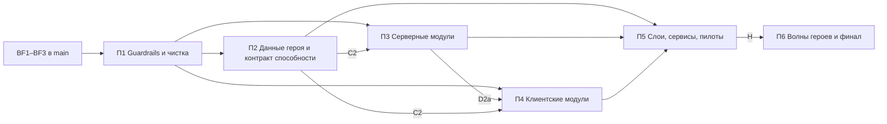

# Архитектурная миграция Codex Superheroes: обзор и карта планов

Этот файл — карта и общий контекст, а не план исполнения. Работа ведётся по шести планам ниже. Каждый план самодостаточен: в нём есть Global Constraints, контекст, стадии с шагами, тестами и критериями приёмки.

Исходный сводный план `docs/design/2026-09-25-architecture-migration-plan.md` сохранён без изменений как архив. По нему не работают, статусы в нём не обновляют. Всё его содержание разнесено по этому файлу и шести планам. Решения, которые там назывались D1–D14, здесь называются **R1–R14**, чтобы не путать их со стадиями D1, D2a…

## 1. Как работать

- Агент читает этот файл и **ровно один** план — тот, стадию которого он исполняет.
- Одна стадия = один PR, если в плане не сказано «PR-units».
- Статус стадии обновляется в таблице «Статус стадий» её плана. Когда план целиком закончен — ещё и в таблице §2 здесь.
- Решение, которое затрагивает несколько планов, записывается в §4 этого файла. Решение внутри одного плана — в разделе «Решения» этого плана.

Источники: аудит 1 — `docs/audits/2026-09-25-opus-architecture-audit.md` (баги B1–B23, долг 1–9); аудит 2 — два документа, написанных параллельно и дополняющих друг друга: `docs/audits/2026-09-25-hero-modularity-audit.md` (локальность героя, `HeroModule`, `HeroProfile`, пилот Scorpion, stress-test Reinhard, целевая структура `core/mechanic/hero/content/compat`) и `docs/audits/2026-09-25-hoplite-structural-audit.md` (граф пакетов и циклы, S1–S17, реестры вместо списков, контракт роутера, сервисы вместо идиом, mixin policy, payload'ы, M1–M11). Оба документа добавлены в репозиторий этим PR с ветвей `hoplite/phaistos-c8f77e4f` и `hoplite/sestos-ea593710`.

## 2. Планы

| План | Файл | Стадии | Что даёт |
| :-- | :-- | :-- | :-- |
| П1 | [`01-guardrails-and-cleanup.md`](01-guardrails-and-cleanup.md) | A1, A2, N1, N2, N3 | ArchUnit-гейт с замороженным baseline, полнота героя, удаление мёртвого кода, следов Doctor Strange и фиктивного `api/` |
| П2 | [`02-hero-data-and-ability-contract.md`](02-hero-data-and-ability-contract.md) | B1, B2, B3, C1, C2 | `HeroProfile` вместо 9 общих таблиц; пассивки и предмет трансформации у героя; роутер способностей без веток героев |
| П3 | [`03-server-modules-ticks-lifecycle.md`](03-server-modules-ticks-lifecycle.md) | D1, D2a, D2b, D2c | `HeroTickDispatcher`, `OwnedSessionMap`, `HeroModule` ×22, вся проводка героев из `SuperheroesMod` в модули, `onHeroChange` |
| П4 | [`04-client-modules.md`](04-client-modules.md) | CL1, CL2, CL3, CL4, C4 | Автосброс клиентских стейтов, реестр HUD, `HeroClientModule`, клавиши, скины, доступность способностей с сервера |
| П5 | [`05-layers-services-pilots.md`](05-layers-services-pilots.md) | E1, E2, M1, F, G1–G3, H | Переименование корня, слои `core`/`mechanic`, сервисы механик, пилот Scorpion, stress-test Reinhard, review gate |
| П6 | [`06-hero-waves-and-finish.md`](06-hero-waves-and-finish.md) | I1–I6, IC, L2, O | Перенос остальных 20 героев и контента, слияние лучевых payload'ов, документация и `add-hero` |

### Статус планов

| План | Статус |
| :-- | :-- |
| П1–П6 | ⏳ не начат |

### Граф планов



- После стадии A1 (П1) параллельно могут идти: П2 (B1 — после A2; B3, C2 — сразу), П3 (D1), П4 (CL2).
- П3 D2a ждёт C2 из П2. П4 CL3 ждёт D2a; CL1 ждёт BF7; CL4 и C4 ждут BF10.
- П5 начинается, когда П2–П4 закончены: его первая стадия E1 — барьер, при котором не должно быть открытых PR, трогающих `src/`.
- П6 начинается только после review gate H (П5).
- Bugfix-pass (BF4–BF10) идёт параллельно П1–П4. Каждый BF-этап, влитый после старта стадии, требует rebase стадии и повторной «Сверки».
- Оценка объёма: ~40 PR.

## 3. Исходное состояние (проверено на `origin/hoplite/kroton-d9205130--lifecycle` @ `e538282`, вершина стека #37→#38→#39)

### 3.1 Что уже сделал bugfix-pass (открытые PR, в `main` ещё не влиты)

| Этап BF | PR | Что закрыто | Seam, который план переиспользует |
| :-- | :-- | :-- | :-- |
| BF1 | #37 | B1, B7, GameTest lane | `item/bound/` (`BoundWeapons`, `BoundWeaponItem`, `BoundWeaponToken`, `BOUND_WEAPON_ISSUES`), один `PlayerBoundWeaponDropMixin`; `src/gametest` + `runGametest` в `qualityGate`; `G/TestPlayers` |
| BF2 | #38 | B2, долг 2, часть долга 5 | `transform/HeroDataStore` (`get`, `update(player, fn)`, `syncFull`, фаза `hero_data_flush`), `resource/ResourcePayment`, `ResourceController.charge/refund`, `AbilityRouter.deactivate` «флаг → onDeactivate» |
| BF3 | #39 | B3, B4, B8, B17, B23, N1–N3 | `lifecycle/PlayerLifecycle` (`onJoin/onLeave/onDeath/onRespawn/onServerStopped`), `lifecycle/EntityControlLock` + `ControlLockShadow`, `AttributeModifierSet.Builder.abilityScoped()` (transient), `HeroTransformService.clearHeroRuntimeState`, attachment `TRANSFORM_TICK` |

Проверенный объём: закрыто 8 из 23 багов (B1–B4, B7, B8, B17, B23) и 3 новые находки; долг 2 закрыт, долг 5 частично. Оценка «~70%» по коду не подтверждается состоянием удалённого репозитория: этапы BF4–BF12 не начаты (ни веток, ни PR на момент проверки).

### 3.2 Что осталось bugfix-pass (не планируется здесь, но является зависимостью)

| Этап BF | Закрывает | Нужен стадиям плана |
| :-- | :-- | :-- |
| BF4 | B5 (кулдауны в персистентный attachment), B6 (Snap тратит камни) | `C1` |
| BF5 | B9, B20, B21 (damage pipeline, `AFTER_DAMAGE`/`ALLOW_DEATH`, фазы), B11 (глобальный tick rate Reinhard) | `D2b`, `G1`, `I4` |
| BF6 | B10 `WorldDestructionPolicy` | `I5` (Thanos), `I4` (Doomsday) |
| BF7 | B15 клиентская сессия, клавиши, Iris, чат | `CL1`, `CL3` |
| BF8 | B13 House of Vanity server authority | `I5` (Pandora) |
| BF9 | B12 reconciler пассивок, B16 fall-иммунитет | `B2`, `I5` (Regulus) |
| BF10 | B14 synced attachment публичного вида героя | `CL4`, `C4` |
| BF12 | гигиена: `fabric.mod.json` зависимости, модель `horde_crystal`, lang 5 сущностей | — |

**Этап BF11 («Hero hooks / lifecycle events / tick dispatcher», долг 1–4) поглощается этой миграцией** (стадии `C2` — план 2, `D1`, `D2a`–`D2c` — план 3). Bugfix-pass не должен начинать BF11 — иначе появятся две конкурирующие реализации одного seam. Документационная часть BF12 (AGENTS.md §2) переходит в стадию `O`.

### 3.3 Замеры на вершине стека (baseline для критериев §8)

| Метрика | Значение | Как мерить |
| :-- | :-- | :-- |
| `.init()` в `SuperheroesMod.onInitialize` | 76 | `grep -c '\.init()' M/SuperheroesMod.java` |
| регистраций `PlayerLifecycle.on*` в `SuperheroesMod` | 56 (+29 `resetAll()` в `onServerStopped`) | `grep -c 'PlayerLifecycle.on' M/SuperheroesMod.java` |
| регистраций `END_SERVER_TICK`/`START_SERVER_TICK`/`END_WORLD_TICK` в `M/` | 53 | `grep -rn 'END_SERVER_TICK.register\|START_SERVER_TICK.register\|END_WORLD_TICK.register' M/` |
| per-player `serverTick` в bootstrap-цикле | 13 + 2 условных (`NARUTO_SAGE_MODE`, `GOKU_SUPER_SAIYAN_AURA`) | `M/SuperheroesMod.java` |
| `ALLOW_DAMAGE` слушателей | 13 | `grep -rn 'ALLOW_DAMAGE.register' M/` |
| статических `Map/Set<UUID…>` в `M/` / `C/` | 104 / 10 | `grep -rEc 'static (final )?(Map\|Set\|ConcurrentMap\|WeakHashMap\|HashMap\|ConcurrentHashMap)<UUID'` |
| `Ability`-классов с `AbilityCooldowns.isOnCooldown` | 85 | `grep -rl 'AbilityCooldowns.isOnCooldown' M/ability` |
| payload'ов / регистраций типов / клиентских receiver'ов | 43 / 44 / 36 | `M/network`, `C/network/ClientNetworking.java` |
| `Client*State` / с reset/clear | 26 / 13 | `C/Client*State.java` |
| HUD-классов / использующих `HudLayoutManager` | 37 / 9 | `C/hud` |
| mixins main / client | 11 / 19 | `superheroes.mixins.json`, `superheroes.client.mixins.json` |
| таблиц героев в shared-коде | 9: `HeroTheme` (11 констант), `HeroHudConfig` (20), `HeroAttributes` (наборы), `CombatImpactEngine.styleFor/heroPower`, `JarvisThreatClass.HERO_THREATS`, `AbilityDescriptions.HERO_PASSIVE_COUNT`, `PassiveIcons.MAP`, `SuperJumpController.ALLOWED_HEROES`, `HeroBleedingController` switch | стадия B1 (план 2) |
| shared-файлов, которые трогает Scorpion / Reinhard | 12 / ~20 | план 5, «Контекст» |

## 4. Межплановые решения

| # | Вопрос / расхождение | Что говорит код сейчас | Решение |
| :-- | :-- | :-- | :-- |
| R2 | Opus: хуки в `Hero`; модульный аудит: `HeroModule`; структурный: хуки `Hero` + per-hero пакет | — | Разделение ответственности: `Hero` — данные и правила, которые ядро спрашивает во время игры (`profile()`, `getAbilities()`, `gate(...)`, пассивки, размеры, скин, `onLanded`). `HeroModule` — только bootstrap-проводка через узкие registrar'ы. Ни один из них не становится god-object: registrar'ы — отдельные маленькие интерфейсы. |
| R6 | Структурный M5 предлагает сначала рвать кольцо пакетов; модульный — переименовать корень до переносов | Bugfix-pass ещё активно правит десятки файлов | Разрыв колец делается владением, а не переименованием: state-record'ы уезжают к героям в их миграциях, `core`/`mechanic` рождаются новыми пакетами со строгими правилами. Переименование корня `E1` — один механический PR на барьере, когда нет открытых PR с `src/`. |
| R7 | Модульный: всё геройское в `hero/<id>/`; Veil — `compat/veil` | `VeilScorpionFx` используется только Scorpion; `WildShaders`/`WildRenderer` — общая инфраструктура | Код опциональной библиотеки, нужный ровно одному герою, живёт в `client/hero/<id>/fx/veil/` за guard'ом `isModLoaded`; общая Veil-инфраструктура — `client/core/fx/veil/`. `compat/` — только интеграции с чужими модами (falbiks, Iris). |
| R10 | Opus: runtime-attachment вместо ~105 статических коллекций | Часть статики — индексы по жертве, которые надо итерировать каждый тик | Правило размещения: per-player session state → non-persistent attachment на игроке; активные эффекты, которые итерируются тиком, → `core.lifecycle.OwnedSessionMap` (автоочистка на leave/death/hero change/`SERVER_STOPPED`). Ручные `resetAll()`/`clear` в bootstrap исчезают. |
| R12 | Структурный M10: объединять «метровые» payload'ы | Формы метров различаются | Лучевые payload'ы (`LaserFired`, `RepulsorBlast`, `ThanosCosmicBeam` — одинаковая семантика «отрезок луча от стрелка») сливаются в `BeamFxS2CPayload(style, …)`. Метры не сливаются в один payload: долгоживущее состояние, видимое клиенту, переводится на synced attachment героя; разовые FX-события остаются payload'ами модуля. |

Решения, принятые внутри одного плана, лежат в его разделе «Решения»: R8, R13 — П1; R3, R4, R9 — П2; R1, R5 — П3; R11, R14 — П5.

**Открытое решение владельца:** R14 — имя нового корневого пакета (П5). Нужно до стадии E1, остальные стадии от него не зависят.

## 5. Целевая архитектура

### 5.1 Раскладка пакетов (конечное состояние, корень `<root>` — см. R14 в П5)

```text
<root>/
  SuperheroesMod                 # ≤ 40 строк: core bootstrap, HeroModules.bootstrap(), content, compat
  ModId
  core/
    hero/        Hero, HeroProfile (+CombatProfile, BleedProfile, ThreatClass, PassiveGlyph), HeroTheme, HeroHudConfig,
                 AttributeModifierSet, LandingImpact, Heroes (реестр)
    module/      HeroModule, HeroModuleContext, HeroModules (явный список, одна строка на героя)
    ability/     Ability, AbilityDenial, AbilityBlocker, AbilityRules, AbilitySink, AbilityAvailability,
                 AbilityRouter (без веток героев), AbilityRegistry, AbilityCooldowns
    resource/    ResourceController, ResourcePayment, ResourceKind, EnergyLocks
    transform/   HeroData, HeroDataStore, HeroTransformService, TransformationItem
    lifecycle/   PlayerLifecycle, LifecycleRegistrar, OwnedSessionMap, EntityControlLock (+ state/shadow)
    tick/        HeroTickDispatcher, TickRegistrar, TickPhase
    net/         общие payload'ы (активация, привязка, sync HeroData/ресурсов, кулдауны, тряска экрана), PayloadRegistrar
    attachment/  только общие attachments (HERO_DATA, CONTROL_LOCKS, TRANSFORM_TICK, …)
  mechanic/
    flight/ impact/ damage/ (BF5) world/ (BF6) targeting/ motion/ fx/ boundweapon/ charge/ strike/ summon/ shockwave/
    ability/     общие способности (FLIGHT, VILTRUMITE_RECOVERY)
  hero/<id>/
    <Id>Module  <Id>Hero  <Id>Abilities (id-константы)
    ability/  runtime/ (бывшие *Controller)  item/  entity/  net/  mixin/ (только если нельзя заменить общим хуком)
  content/      horde/  boss/homelander/  admin/ (AdminBuildSync, AdminAbilityDebug)  command/
  compat/       falbiks/  iris/ (серверная часть, если есть)
client/
  SuperheroesClient              # ≤ 40 строк: client core bootstrap, HeroClientModules.bootstrap(), compat
  core/
    module/  HeroClientModule, HeroClientContext, HeroClientModules
    session/ ClientSessionState, ClientSessionStates
    hud/     HudLayer, HudLayers, MovableHud, HUD-фреймворк, HudLayoutManager (из реестра)
    input/   ModKeys (только общие клавиши), HeroActionKeys
    render/  SkinResolver, SkinProvider, PlayerLayers, BeamRenderer
    fx/      CustomParticleGate, veil/ (общая инфраструктура)
    mixin/   только общие mixins с делегированием в реестры
  hero/<id>/ <Id>ClientModule  state/  hud/  render/  screen/  fx/  mixin/ (исключения)
  compat/    iris/
```

### 5.2 Правила зависимостей (проверяются ArchUnit: П1 A1, П5 E2)

| Из \ В | core | mechanic | hero.X | hero.Y | content | compat | client.* |
| :-- | :-- | :-- | :-- | :-- | :-- | :-- | :-- |
| core | ✅ | ❌ | ❌ | ❌ | ❌ | ❌ | ❌ |
| mechanic | ✅ | ✅ | ❌ | ❌ | ❌ | ❌ | ❌ |
| hero.X | ✅ | ✅ | ✅ | ❌ (только строковые id) | ❌ | ❌ | ❌ |
| content | ✅ | ✅ | ❌ | ❌ | ✅ | ❌ | ❌ |
| compat | ✅ | ✅ | только через хуки, которые герой зарегистрировал | | ❌ | ✅ | ❌ |
| client.core | ✅ | ✅ | ❌ | ❌ | ❌ | ❌ | client.core |
| client.hero.X | ✅ | ✅ | ✅ (свой) | ❌ | ❌ | ❌ | client.core, client.hero.X |

Единственные классы, которым разрешено ссылаться на `hero.<id>`: `core.module.HeroModules` (main) и `client.core.module.HeroClientModules` (client).

## 6. Сквозные политики

Действуют во всех планах. Конкретные задачи, которые из них вытекают, лежат в планах: accessor молний (П4 CL3b), правило «у S2C payload героя есть receiver» (П5 F.4), `C2SGuards` (П5 G1), слияние лучей (П6 L2).

### 6.1 Mixin policy

1. Общий mixin (`mixin/`, `client/core/mixin/`) не знает героев: он делегирует в реестр/хук ядра (`InputLock`, `FovModifiers`, `ClientSoundFilters`, `SkinResolver`, `HudJitter`, `TextObfuscationLayers`, `WorldDestructionPolicy`, fall-иммунитет BF9). Проверяется правилами `sharedCodeDoesNotDependOnConcreteHeroes`/`sharedClientCodeDoesNotDependOnConcreteHeroes` (mixin-пакеты — shared).
2. Реестр создаётся в той волне, где появляется **первый** потребитель, и только если у механизма есть правдоподобный второй потребитель; иначе mixin героя живёт в `mixin/hero/<id>/` или `client/hero/<id>/mixin/` и записан в mixin-конфиге в блоке, подписанном id героя.
3. `@Pseudo`-миксины к чужим модам — только в `compat/<mod>/mixin/`, `require = 0`, без `@Shadow` на чужих полях.
4. Внедрённые члены — `@Unique`; `@WrapOperation` предпочтительнее `@Redirect`; `@Inject(cancellable)` не отменяет «отпускание» ввода (урок Opus B15).
6. Судьба текущих миксинов: `PlayerBoundWeaponDropMixin` — общий (BF1) ✔; `PlayerDimensionsMixin` — общий, после BF10 читает synced вид; `PlayerFlightPoseMixin`, `LivingEntityFallFlyingMixin`, `LivingEntityHealBlockMixin` — общие (сверить ветки в волнах); `LivingEntityFallDamageMixin` — BF9 → общий; `LivingEntityEffectMixin`, `KryptoniteShardPickupMixin` — I4d; `ThanosBlockBreakingMixin` — I5a; `falbiks.HeroComponentStripMixin` — I5c → compat; client: skin/renderer/pose — CL4; `SoundEngineMixin` — G2; `GameRendererFovMixin`, `GuiVanillaGlitchMixin` — I5b; `GuiHotbarMixin` — I6b; `LocalPlayerFlightMixin` — I6a; `PandoraCinematic*` ×4, `FontVanityCipherMixin` — I5c; `CameraMixin`, `MinecraftHeroMeleeChargeMixin`, `GuiOverlayMessageMixin`, `ChatComponentMixin` (Opus B15 чат — BF7), `GuiEffectsMixin`, `GameRendererBlurMixin` — сверить ветки героев в той волне, где они встретятся; без веток — остаются общими.

### 6.2 Сеть и синхронизация

1. **Владение payload'ом:** payload героя, его `STREAM_CODEC`, серверный sender и клиентский receiver живут в модулях героя (`hero/<id>/net/`, `client/hero/<id>/`); регистрация — `ctx.payloads()` и `HeroClientContext.receive`. В `core/net` — только общие (активация, привязка, `HeroData`/ресурсы, кулдауны, тряска экрана, обломки, BeamFx после L2).
3. **Synced attachments vs payload:** долгоживущее состояние игрока, которое клиент показывает (метры, режимы, тиры), — synced attachment героя (механизм подтверждает BF10; `HERO_DATA` остаётся на собственном sync `HeroDataStore` — у него coalescing ресурсов, который `syncWith` потерял бы). Разовые события (лучи, вспышки, звуки) — payload'ы. Объединять payload'ы можно только при одинаковой семантике (R12).
5. **C2S:** каждый C2S-handler проверяет, что игрок сейчас тот герой и та способность/состояние, для которых пакет имеет смысл (помощник `core/net/C2SGuards.requireHero(ServerPlayer, ResourceLocation heroId)` и `requireActiveAbility(...)`, появляются в G1 для `ReinhardWishConfirmC2SPayload`); GameTest на каждый C2S: пакет от игрока «не того» героя — no-op.

### 6.3 Размещение runtime state

| Состояние | Где живёт | Очистка |
| :-- | :-- | :-- |
| Persistent данные героя (прогресс, тиры, флаги ролика) | persistent attachment, объявленный модулем (`ctx.attachments()`), id не меняется | по дизайну (copyOnDeath как сейчас) |
| Per-player сессионное состояние (заряд, окно, режим) | non-persistent attachment на игроке **или** `OwnedSessionMap<UUID, V>` модуля | автоматически: смерть сущности/выход; `OwnedSessionMap` — по `ClearOn` |
| Активные эффекты на чужих сущностях, которые тикаются (притяжение, метка, захват) | `OwnedSessionMap<UUID жертвы, V>` с владельцем-кастером | leave/death/hero change владельца, `SERVER_STOPPED` |
| Флаги сущностей, сохраняемые в NBT (NoAI, NoGravity, invulnerable) | только `EntityControlLock` (BF3) | lock-refcount |
| Ссылки на `ServerLevel`/`Entity` | запрещены в статике; хранить UUID + `ResourceKey<Level>` | — |
| Клиентское состояние сессии | статика `Client*State` + `ClientSessionStates.register` (CL1) или synced attachment | `DISCONNECT`/`JOIN` |

Метрика: статических `Map/Set<UUID…>` в `src/main` — с 104 до 0 вне `OwnedSessionMap` (§8).

### 6.4 Протокол поведенческих изменений

- Архитектурный коммит не меняет наблюдаемое поведение. Если перенос вскрывает баг, фикс — отдельный коммит `behavior(<scope>): …` с GameTest, который падает на старом поведении.
- Каждое `behavior:` перечисляется в разделе PR «Изменения поведения» (для игрока — в «Для игрока», если заметно).
- Изменения баланса/контента (показ пассивок Scorpion, калибровка профилей Scorpion/Pandora, PvP-правила B19, армия Sung B18) — не в архитектурных PR.

## 7. Риски программы и страховка

| Риск | Где | Страховка |
| :-- | :-- | :-- |
| Параллельный bugfix-pass и миграция правят одни файлы | до E1 | стадии до E1 малы и механичны; каждая начинается со «Сверки» на свежем `main`; BF11 поглощён планом (§3.2) |
| Две конкурирующие архитектуры надолго | D2a→I6 | с D2a **все** герои уже идут через `HeroModule`; различие между мигрированными и нет — только физическое расположение файлов и shared-касания, а не способ проводки |
| Изменение порядка тиков/хуков | D1, D2b | порядок фиксируется фазами и списком модулей; сверка межгеройских зависимостей в D2b |
| Потеря persisted id при переносе | B2, E1, F, G, I | Global Constraints; golden-тесты id модификаторов и предметов; GameTest загрузки состояния |
| ArchUnit-правило неверно сформулировано и пропускает нарушения | A1 | шаг «зубы» в A1.5; строгие правила проверяются на непустоту в E2 |
| Разрастание `HeroModuleContext`/`Hero` в god-object | D2a→I | чек-лист H; лимит ≤ 7 методов контекста; новые хуки только с ≥ 2 потребителями или записанным обоснованием |
| Нет дисплея для `runClient` в песочнице | все runtime-стадии | PR прямо указывает, что не проверено в игре; клиентские изменения, не покрытые правилами, ждут ручной проверки владельцем перед мержем |

## 8. Конечные измеримые критерии архитектуры

Проверяются в П5 H (промежуточно) и П6 O (финально).

| # | Критерий | Цель | Как проверяется |
| :-- | :-- | :-- | :-- |
| 1 | Shared-таблиц с данными конкретных героев | **0** (было 9) | ArchUnit `sharedCodeDoesNotDependOnConcreteHeroes` — строгое, store удалён; `HeroProfile` абстрактный у каждого героя |
| 2 | Импорты героев из `core`/`mechanic`/`content`/`compat`/`client.core` | **0**, строгие правила | `coreDependsOnNothingAboveIt`, `mechanicsDependOnlyOnCore`, `clientCoreDoesNotKnowHeroModules` |
| 3 | Кто может ссылаться на `hero.<id>` | только `hero.<id>` и `client.hero.<id>` того же героя, `HeroModules`, `HeroClientModules` | `heroModulesAreReferencedOnlyByThemselvesAndTheModuleList`, клиентские аналоги |
| 4 | Зависимости герой → герой | **0** классовых; допустимы только строковые id (`ModId.of("homelander")`) и теги | `heroModulesDoNotDependOnEachOther`, `clientHeroModulesDoNotDependOnEachOther` |
| 5 | Файлы, которые меняются при добавлении героя | новые `hero/<id>/**` + `client/hero/<id>/**`; **1 строка** в `HeroModules`, **1 строка** в `HeroClientModules`; `en_us.json` + `ru_ru.json`; ассеты в `<тип>/<id>/`; по строке в `HeroProfileGameTests.EXPECTED` и `golden/hero_presentation.txt`. Ноль других Java-файлов в `src/main`/`src/client` | skill `add-hero`; ревью PR первого нового героя |
| 6 | Файлы при добавлении способности существующему герою | только внутри `hero/<id>/` (и `client/hero/<id>/`, если есть клиент) + lang ×2 + иконка | то же |
| 7 | `SuperheroesMod` | ≤ 40 строк тела: core-bootstrap (attachments, lifecycle, dispatcher, сеть, ресурсы, трансформация), `SharedMechanics.register`, `HeroModules.bootstrap`, content-модули, compat, команды; **0** ссылок на героев и контроллеры | ArchUnit + `wc -l` |
| 8 | `SuperheroesClient` | ≤ 40 строк тела: client core (`ClientSessionStates`, `HudLayers`, `HeroActionKeys`, `SkinResolver`, core-receiver'ы, частицы/рендереры общих сущностей), `HeroClientModules.bootstrap`, compat; **0** ссылок на героев | то же |
| 9 | Серверные тик-регистрации вне `HeroTickDispatcher`/`HeroDataStore` | **0** | `onlyTheDispatcherRegistersServerTicks` — строгое |
| 10 | Lifecycle-регистрации вне модулей/ядра | **0** | `lifecycleHooksAreRegisteredByModulesOrCore` — строгое |
| 11 | Статические `Map/Set<UUID…>` в `src/main` вне `OwnedSessionMap` | **0** (было 104) | `grep -rEc 'static (final )?(Map\|Set\|ConcurrentMap\|WeakHashMap\|HashMap\|ConcurrentHashMap)<UUID' src/main/java` |
| 12 | Двунаправленные пары пакетов | **0** (было ≈36) | `PackageCycleRatchetTest`, baseline пуст |
| 13 | Ветки героев в `AbilityRouter`, `ResourceController`, `HeroTransformService`, `CombatImpactEngine`, `FlightController`, skin-миксинах, `RadialMenuHud`, `HeroInfoPanelHud`, `AbilitiesTooltipHud` | **0** | правило 1 + grep |
| 14 | Hero-specific mixins в общих mixin-пакетах | **0**; оставшиеся — в `mixin/hero/<id>/` с записанным обоснованием | ArchUnit правило 1 для mixin-пакетов; ревью mixin-конфигов |
| 15 | `Client*State` без сброса | **0** | `clientStatesCanBeReset` — строгое |
| 16 | Дубли правил клиента и сервера (`ClientAbilityFilter`) | **0** | файла нет; C4 |
| 17 | Payload'ы героя без receiver'а в его client-модуле | **0** | `everyHeroS2CPayloadHasAClientReceiverInItsModule` |
| 18 | Что ломает `qualityGate` автоматически | любое из: новая зависимость shared → герой; герой → герой; core/mechanic → выше; `src/main` → client; тик/lifecycle вне seam; `Client*State` без сброса; S2C без receiver'а; модуль вне `HeroModules`; новая пара циклов пакетов; незакоммиченное сокращение baseline; герой без профиля (компиляция); профиль/палитра/id модификаторов/lore отличаются от golden; способность героя не зарегистрирована или без lang | все правила планов 1–6 |

## 9. Покрытие обязательных тем и пунктов аудитов

Стадии → планы: A1, A2, N1–N3 — П1; B1–B3, C1, C2 — П2; D1, D2a–D2c — П3; CL1–CL4, C4 — П4; E1, E2, M1, F, G1–G3, H — П5; I1–I6, IC, L2, O — П6; BF1–BF12 — bugfix-pass.

| Тема (из задачи) | Стадии |
| :-- | :-- |
| 1. Guardrails и dependency rules | A1, A2, E2, §5.2, §8 |
| 2. `HeroProfile` | B1 (+ B2 атрибуты) |
| 3. Контракт `Ability` | C1, C2, C4, D2a (`AbilitySink`) |
| 4. Ownership cooldown/resource/gating | план 2, «Контекст», C1, C2 |
| 5. `HeroModule` | D2a, D2b, F, G |
| 6. Lifecycle героя и игрока | D1 (`LifecycleRegistrar`, `OwnedSessionMap`), D2c (`onHeroChange`, `onHeroApplied`, `keepsHeroOnDeath`), переиспользует BF3 `PlayerLifecycle` |
| 7. Tick dispatcher вместо bootstrap | D1, D2b |
| 8. Hero-specific ветки из shared core | B1, C2, C4, D2c, CL3, CL4, G, I4–I6, §8 п.13 |
| 9. Runtime state из static collections | §6.3, D1, F, волны, §8 п.11 |
| 10. Server authoritative state | §6.2 п.5 (C2S), C4 (доступность считает сервер), BF8 (B13) как зависимость I5c |
| 11. Synced attachments и network ownership | §6.2, C4, CL4 (на BF10), L2 |
| 12. Client state lifecycle | CL1 |
| 13. HUD registry | CL2, CL3 |
| 14. Input/actions registry | CL3 (`HeroActionKeys`), I5c (`InputLock`) |
| 15. Skin/render ownership | CL4, G2 (`PlayerLayers`), L2 (`BeamRenderer`) |
| 16. Mixin policy | §6.1, G2, I4d, I5, I6 |
| 17. Shared mechanics | M1, I2a (`charge`), I3 (`mechanic/ability`), I4a (`summon`), I4c (`strike`), I6 (`flight`, `impact`), BF1 `boundweapon` |
| 18. Damage/targeting/motion/world services | BF5 (damage, зависимость), BF6 (world, зависимость), M1 (motion, targeting, fx) |
| 19. Разрыв package cycles | A1.4 ratchet, E2, волны, §8 п.12 |
| 20. Dead code / Doctor Strange / fake API / compat | N1, N2, N3, I5a/I5c (compat), IC (GeckoLib) |
| 21. Документация и `add-hero` | H (`migrate-hero`), O (`add-hero`, AGENTS.md §2/§7) |

| Пункт аудитов | Где закрывается |
| :-- | :-- |
| Opus долг 1 (lifecycle) | BF3 + D1/D2c |
| Opus долг 2 (единый писатель) | BF2 ✔ |
| Opus долг 3 (bootstrap/tick) | D1, D2b |
| Opus долг 4 (ветки героев) | B1, C2, C4, D2c, CL3, CL4, волны |
| Opus долг 5 (sync-протокол) | BF2 (частично), BF10, §6.2, L2 |
| Opus долг 6 (пассивки) | BF9, B2 |
| Opus долг 7 (тонкий `Ability`) | C1, C2, M1, I2a |
| Opus долг 8 (дубли механик) | BF1 (no-drop), M1, I2a, I4a, L2 |
| Opus долг 9 (клиент-монолит) | CL1–CL4 |
| Opus B1–B23 | BF-этапы (§3.2); B18/B19 — отдельные `behavior:` PR после I4a/M1 |
| Структурный S1 (гейт цементирует god-object) | A2, D2a, D2b |
| S2/S3/S15 (тихие дефолты, две конвенции тем, пассивки по индексу) | B1 |
| S4 (двусмысленный `Ability`) | C1, C2 |
| S5 (идиомы вместо сервисов) | M1 + волны |
| S6 (нет единицы владения) | D2a, F, G, волны |
| S7 (mixins как фичи) | §6.1 |
| S8 (три копии правды на клиенте) | BF10, CL4 |
| S9 (HUD-геометрия) | CL2 |
| S10 (клавиши героев) | CL3 |
| S11 (одинаковые payload'ы) | L2 |
| S12 (фиктивный API) | N3 |
| S13 (мёртвый код) | N1, IC (GeckoLib) |
| S14 (cross-mod в ядре) | I5a, I5c |
| S16 (bootstrap знает способности) | D1 |
| S17 (22 `*SuitItem`) | B3 |
| Модульный §7.0–7.4 | A1/A2 (0), B1 (1), C2/D (2), F/G/I (3), H/O (4) |

## 10. Известные ограничения

- **Известные ограничения плана:** строки legacy-файлов указаны по вершине стека #39 и сдвинутся после BF4–BF10; `runClient` в песочнице без дисплея может быть недоступен — тогда runtime-пункты стадий проверяет владелец до мержа.
