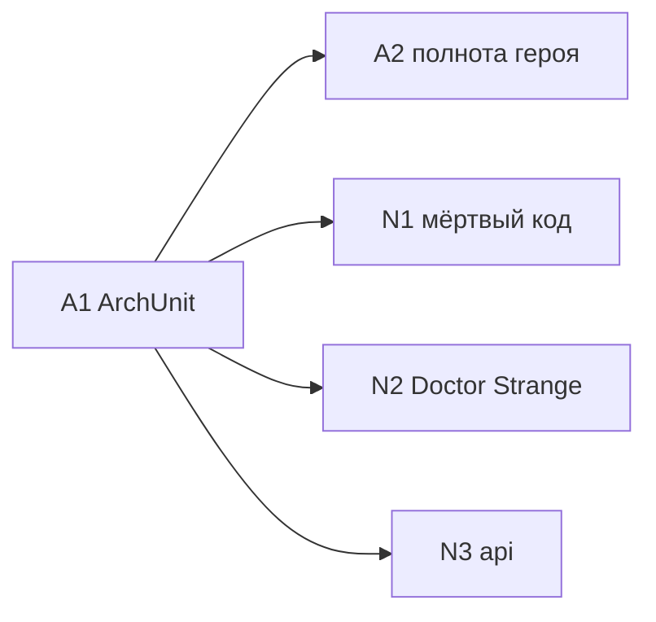

# План 1 — архитектурные guardrails и чистка: Implementation Plan

> **For agentic workers:** REQUIRED SUB-SKILL: Use superpowers:subagent-driven-development (recommended) or superpowers:executing-plans to implement this plan task-by-task. Steps use checkbox (`- [ ]`) syntax for tracking.

**Goal:** Поставить механический гейт на архитектурную связанность, сделать полноту героя проверяемой и до начала миграции убрать мёртвый код, следы Doctor Strange и фиктивный `api/`.

**Architecture:** ArchUnit-правила в `src/test` проверяют скомпилированные классы main и client. Текущие нарушения заморожены в `archunit_store`: новые ломают `qualityGate`, а исправленные нужно закоммитить (ratchet только вниз). Циклы пакетов ведёт собственный ratchet-тест. Полнота героя проверяется GameTest'ом. Чистка удаляет только код без владельца, persisted id не трогает.

**Tech Stack:** Java 21, Minecraft 1.21.1 (Mojang mappings), Fabric Loader 0.19.2, Fabric API 0.116.12+1.21.1, Fabric Loom 1.16-SNAPSHOT, JUnit 5.10.2, Fabric GameTest API, ArchUnit 1.5.1 (новая test-зависимость).

## Global Constraints

- Mod id: `superheroes` — не меняется никогда.
- Персистентные идентификаторы не меняются: id способностей (`superheroes:<ability>`), предметов, сущностей, звуков (`sounds.json`), MobEffect, типов урона, attachments (`hero_data`, `reinhard_state`, `doomsday_progress`, `regulus_madness`, `regulus_bonus_life`, `admin_build`, `suit_variant`, `nano_form`, `control_lock_shadow`, `pandora_revived` и др.), data component `superheroes:bound_weapon`, **ResourceLocation-ы attribute-модификаторов** (`modifiers/<hero>/<stat>` — permanent-пассивки лежат в NBT игроков), имена `KeyMapping` (`key.superheroes.*` — лежат в `options.txt`), lang-ключи.
- Id сетевых payload'ов не персистентны: их можно менять только при семантически оправданном слиянии (стадия L2).
- Геймплей и баланс не меняются в архитектурных PR. Любое изменение поведения — отдельный коммит с пометкой `behavior:` в сообщении и отдельным пунктом в описании PR.
- Server-authoritative: всё клиентское — в `src/client`; `src/main` загружается выделенным сервером.
- Только публичные API: `net.fabricmc.fabric.api.*`, никакого `net.fabricmc.fabric.impl.*`.
- Сеть — типизированные `CustomPacketPayload` + `StreamCodec`.
- `HeroDataStore` — единственный писатель `HERO_DATA` (`ProjectSanityTest.assertHeroDataHasSingleWriter`).
- Lifecycle-очистка — только через `PlayerLifecycle` (серверный поток), никогда через `ServerPlayConnectionEvents.DISCONNECT`.
- Mixins: узкие, `@Unique` для внедрённых членов, `@WrapOperation` предпочтительнее `@Redirect`.
- Звуки только OGG Vorbis; перед новыми ассетами проверять `art-source/`.
- `en_us.json` и `ru_ru.json` меняются вместе.
- `src/main/generated/` — только через `./gradlew runDatagen --no-daemon`; diff обязан быть пустым, если стадия не меняет данные намеренно.
- Финишный гейт каждого PR: `./gradlew qualityGate --no-daemon` зелёный.
- Runtime-изменения (ввод, рендер, HUD, сеть, VFX, сущности) — `./gradlew runClient --no-daemon`; если окружение не может запустить клиент, PR прямо это говорит.
- Никаких Gradle-модулей на героя, никакого big-bang rewrite, никакой перестановки файлов без смены владения.
- PR: заголовок на русском, тело начинается с «Для игрока», ниже — полная техническая часть; коммиты `feat(scope):`/`fix(scope):`/`refactor(scope):`/`test(scope):`/`docs(scope):` на английском.
- `SESSION.md` обновляется в каждом PR этого плана; статус стадии отмечается в таблице «Статус стадий» этого файла.

---

## Как исполнять этот план

- Карта всей миграции, исходное состояние, целевая архитектура и сквозные политики — в [`00-overview.md`](00-overview.md). Другие планы для этой работы читать не нужно.
- Одна стадия = один PR. A1, A2 расписаны по шагам TDD с кодом. N1–N3 заданы паспортами, и их первый шаг — **«Сверка»**: перечитать перечисленные файлы на актуальном `main` и обновить список касаний в описании PR.
- Если на актуальном коде проблема уже решена иначе — используем существующее решение и фиксируем это в PR и в разделе «Решения» этого плана. Откатывать рабочее решение ради буквального соответствия плану нельзя.
- Пути: `M/` = `src/main/java/com/example/superheroes/`, `C/` = `src/client/java/com/example/superheroes/client/`, `T/` = `src/test/java/com/example/superheroes/`, `G/` = `src/gametest/java/com/example/superheroes/gametest/`.
- Шаблон паспорта: **Цель · Почему · Зависит от · Затрагивает · Создаётся · Мигрируется · Удаляется · Старые пути, которых больше нет · Нельзя менять · Тесты · Runtime · Acceptance · Риски · Страховка.** Global Constraints в паспортах не повторяются.

Каждая стадия заканчивается одинаково (шаги не повторяются в каждой задаче):

- [ ] `./gradlew qualityGate --no-daemon` → `BUILD SUCCESSFUL`.
- [ ] Если стадия трогала datagen-источники: `./gradlew runDatagen --no-daemon` и `git diff --stat src/main/generated` → пусто (или только намеренные изменения, перечисленные в PR).
- [ ] Обновить «Статус стадий» этого плана, `SESSION.md` и при необходимости раздел «Решения».
- [ ] PR по правилам AGENTS.md §12; в технической части — baseline-метрики (`00-overview.md` §3.3) «до/после» для затронутых строк.

### Статус стадий

| Стадия | Статус | PR |
| :-- | :-- | :-- |
| A1 ArchUnit guardrails | ⏳ | |
| A2 полнота героя | ⏳ | |
| N1 мёртвый код | ⏳ | |
| N2 следы Doctor Strange | ⏳ | |
| N3 фиктивный `api/` | ⏳ | |

## Контекст

- Seams bugfix-pass, на которые опирается план: GameTest lane (`src/gametest`, `runGametest` в `qualityGate`), `G/TestPlayers`, `ProjectSanityTest` (честный grep по исходникам и JSON; структурные правила сюда не добавляются).
- Внешние зависимости: PR #37–#39 (BF1–BF3) влиты в `main` — иначе baseline придётся пересобирать; PR #41 с планами влит.
- Этот план не трогает production-логику героев. `HeroProfile` — П2, bootstrap и тики — П3, клиент — П4.

### Решения

| # | Вопрос / расхождение | Что говорит код сейчас | Решение |
| :-- | :-- | :-- | :-- |
| R8 | Модульный: `ProjectSanityTest` + source-check импортов; SESSION: «ArchUnit намеренно не портирован» | Код массово использует FQN-ссылки (`com.example.superheroes.effect.X.init()`), grep по `import` их не видит; сам `ProjectSanityTest` велит структурные правила выносить в отдельный инструмент | Архитектурные правила — ArchUnit (`src/test`) с `FreezingArchRule`: текущие нарушения заморожены в `src/test/resources/archunit_store/`, новые ломают гейт, исправленные автоматически уходят из store; `qualityGate` требует, чтобы store был закоммичен (ratchet только вниз). `ProjectSanityTest` остаётся честным grep по исходникам/JSON. |
| R13 | `api/` — «фикция» (структурный S12) | `docs/api.md` удалён ревайвлом; единственный потребитель — `RepulsorChargeController` | `api/` удаляется в `N3`. Публичный аддон-API проектируется позже поверх `HeroModule` (Fabric entrypoint), когда появится реальный потребитель. |

## Зависимости стадий



После A1 стадии A2, N1, N2, N3 независимы и идут параллельно.

## File Structure

| Файл | Ответственность | Стадия |
| :-- | :-- | :-- |
| `T/architecture/ArchitectureRulesTest.java` | ArchUnit-правила main (замороженные и строгие) | A1 |
| `T/architecture/ClientArchitectureRulesTest.java` | ArchUnit-правила client | A1 |
| `T/architecture/CodexClasses.java` | импорт классов main/client из путей, переданных Gradle | A1 |
| `src/test/resources/archunit.properties` | конфиг freeze store | A1 |
| `src/test/resources/archunit_store/**` | замороженный baseline нарушений | A1 |
| `T/architecture/PackageCycleRatchetTest.java`, `src/test/resources/architecture/package-cycles-baseline.txt` | ratchet двунаправленных пар пакетов | A1 |
| `G/HeroCompletenessGameTests.java` | полнота героя: способности зарегистрированы, lang-ключи есть (П2 B1 и П3 D2a добавляют в него проверки) | A2 |
| `G/TestHeroes.java` | трансформация в GameTests через `HeroTransformService` | A2 |

N1–N3 новых production-файлов не создают. Удаляемое перечислено в их паспортах; единственный переименовываемый класс — `DoctorStrangeSuitItem` → `PandoraSuitItem` (N2).

## Стадии

### Стадия A1 — ArchUnit guardrails с замороженным baseline

- **Цель:** механически запретить новые архитектурные нарушения и сделать каждое устранённое нарушение необратимым.
- **Почему:** без гейта каждый параллельный агент может добавить ещё одну ветку `XHero.ID.equals` в shared-код (именно так Scorpion и Pandora выпали из таблиц — аудит 2, S2). grep по `import` не видит FQN-ссылок, которыми полон bootstrap (R8).
- **Зависит от:** P0; BF1–BF3 влиты в `main` (иначе baseline придётся пересобирать).
- **Затрагивает:** `build.gradle`, `src/test/**`, `AGENTS.md` §10 (одна строка про `verifyArchitectureBaseline`).
- **Создаётся:** `T/architecture/CodexClasses.java`, `T/architecture/ArchitectureRulesTest.java`, `T/architecture/ClientArchitectureRulesTest.java`, `T/architecture/PackageCycleRatchetTest.java`, `src/test/resources/archunit.properties`, `src/test/resources/archunit_store/` (сгенерировано), `src/test/resources/architecture/package-cycles-baseline.txt`, Gradle-задача `verifyArchitectureBaseline`.
- **Мигрируется / удаляется:** ничего.
- **Нельзя менять:** production-код; существующие проверки `ProjectSanityTest`.
- **Тесты:** сами правила; проверка «зубов» — временное нарушение должно ронять тест (шаг 7).
- **Runtime:** не нужен.
- **Acceptance:** `qualityGate` зелёный; store закоммичен; временная ссылка `ScorpionHero.ID` из `M/flight/FlightTuning.java` роняет `sharedCodeDoesNotDependOnConcreteHeroes`; удаление одной замороженной зависимости и повторный прогон меняет store, а `verifyArchitectureBaseline` падает, пока изменение не закоммичено.
- **Риски:** сигнатуры предикатов ArchUnit 1.5.1 могут отличаться от указанных — семантику правил сохранять, компилировать по javadoc 1.5.1. Хрупкость freeze-описаний циклов — поэтому циклы ведёт собственный ratchet (задача A1.4), а не `FreezingArchRule`.
- **Страховка:** стадия не трогает production; откат — revert PR.

#### Task A1.1: подключить ArchUnit и импорт классов main/client

**Files:**
- Modify: `build.gradle` (блок `dependencies`, задача `test`)
- Create: `src/test/java/com/example/superheroes/architecture/CodexClasses.java`
- Create: `src/test/resources/archunit.properties`
- Test: `src/test/java/com/example/superheroes/architecture/ArchitectureRulesTest.java`

**Interfaces:**
- Produces: `CodexClasses.ROOT` (`String`), `CodexClasses.main()` → `JavaClasses` (только `src/main`), `CodexClasses.mainAndClient()` → `JavaClasses`.

- [ ] **Step 1: Написать падающий smoke-тест**

```java
package com.example.superheroes.architecture;

import org.junit.jupiter.api.Test;

import static org.junit.jupiter.api.Assertions.assertTrue;

class ArchitectureRulesTest {
	@Test
	void importsTheWholeMainSourceSet() {
		assertTrue(CodexClasses.main().size() > 400, "expected >400 main classes, got " + CodexClasses.main().size());
	}
}
```

- [ ] **Step 2: Убедиться, что падает**

Run: `./gradlew test --no-daemon --tests '*ArchitectureRulesTest*'`
Expected: FAIL — `cannot find symbol CodexClasses`.

- [ ] **Step 3: Зависимость и проброс путей в `build.gradle`**

В `dependencies` рядом с JUnit:

```groovy
	testImplementation "com.tngtech.archunit:archunit-junit5:1.5.1"
```

Расширить существующую конфигурацию задачи `test` (там, где стоит `useJUnitPlatform()`):

```groovy
tasks.named('test') {
	dependsOn tasks.named('clientClasses')
	systemProperty 'codex.mainClasses', sourceSets.main.output.classesDirs.asPath
	systemProperty 'codex.clientClasses', sourceSets.client.output.classesDirs.asPath
	// One-off store creation: ./gradlew test -Darchunit.freeze.store.default.allowStoreCreation=true
	systemProperties System.properties.findAll { it.key.toString().startsWith('archunit.') }
	inputs.dir('src/test/resources/archunit_store').optional()
}
```

- [ ] **Step 4: `CodexClasses`**

```java
package com.example.superheroes.architecture;

import com.tngtech.archunit.core.domain.JavaClasses;
import com.tngtech.archunit.core.importer.ClassFileImporter;

import java.io.File;
import java.nio.file.Files;
import java.nio.file.Path;
import java.util.ArrayList;
import java.util.List;

/** Imports compiled main/client classes from the directories Gradle passes in; see build.gradle `test`. */
final class CodexClasses {
	static final String ROOT = "com.example.superheroes";

	private static JavaClasses main;
	private static JavaClasses mainAndClient;

	private CodexClasses() {
	}

	static synchronized JavaClasses main() {
		if (main == null) {
			main = importDirs("codex.mainClasses");
		}
		return main;
	}

	static synchronized JavaClasses mainAndClient() {
		if (mainAndClient == null) {
			mainAndClient = importDirs("codex.mainClasses", "codex.clientClasses");
		}
		return mainAndClient;
	}

	private static JavaClasses importDirs(String... properties) {
		List<Path> dirs = new ArrayList<>();
		for (String property : properties) {
			String value = System.getProperty(property);
			if (value == null || value.isBlank()) {
				throw new IllegalStateException(property + " is not set — run through Gradle, not the IDE runner");
			}
			for (String entry : value.split(File.pathSeparator)) {
				Path dir = Path.of(entry);
				if (Files.isDirectory(dir)) {
					dirs.add(dir);
				}
			}
		}
		if (dirs.isEmpty()) {
			throw new IllegalStateException("no class directories found for " + String.join(", ", properties));
		}
		return new ClassFileImporter().importPaths(dirs);
	}
}
```

- [ ] **Step 5: `src/test/resources/archunit.properties`**

```properties
freeze.store.default.path=src/test/resources/archunit_store
freeze.store.default.allowStoreCreation=false
freeze.store.default.allowStoreUpdate=true
freeze.refreeze=false
archRule.failOnEmptyShould=true
resolveMissingDependenciesFromClassPath=false
```

- [ ] **Step 6: Прогнать**

Run: `./gradlew test --no-daemon --tests '*ArchitectureRulesTest*'`
Expected: PASS.

- [ ] **Step 7: Commit**

```bash
git add build.gradle src/test/java/com/example/superheroes/architecture src/test/resources/archunit.properties
git commit -m "test(arch): import main and client classes for ArchUnit rules"
```

#### Task A1.2: замороженные правила на текущий долг

**Files:**
- Modify: `T/architecture/ArchitectureRulesTest.java`
- Create: `src/test/resources/archunit_store/**` (генерируется)

**Interfaces:**
- Consumes: `CodexClasses.main()`, `CodexClasses.ROOT`.
- Produces: предикаты `ArchitectureRulesTest.IN_HERO_MODULE`, `ArchitectureRulesTest.CONCRETE_HERO` (package-private static, переиспользуются в `ClientArchitectureRulesTest`).

- [ ] **Step 1: Добавить правила**

```java
package com.example.superheroes.architecture;

import com.example.superheroes.hero.Hero;
import com.tngtech.archunit.base.DescribedPredicate;
import com.tngtech.archunit.core.domain.JavaClass;
import com.tngtech.archunit.core.domain.JavaModifier;
import com.tngtech.archunit.library.freeze.FreezingArchRule;
import org.junit.jupiter.api.Test;

import static com.tngtech.archunit.base.DescribedPredicate.not;
import static com.tngtech.archunit.core.domain.JavaCall.Predicates.target;
import static com.tngtech.archunit.core.domain.JavaClass.Predicates.simpleName;
import static com.tngtech.archunit.core.domain.properties.HasName.Predicates.nameStartingWith;
import static com.tngtech.archunit.core.domain.properties.HasOwner.Predicates.With.owner;
import static com.tngtech.archunit.lang.syntax.ArchRuleDefinition.noClasses;
import static org.junit.jupiter.api.Assertions.assertTrue;

class ArchitectureRulesTest {
	static final String ROOT = CodexClasses.ROOT;

	/** {@code <root>.hero.<id>..} — a hero module package (not the flat legacy {@code <root>.hero}). */
	static final DescribedPredicate<JavaClass> IN_HERO_MODULE = new DescribedPredicate<>("reside in a hero module package") {
		@Override
		public boolean test(JavaClass c) {
			return c.getPackageName().startsWith(ROOT + ".hero.");
		}
	};

	static final DescribedPredicate<JavaClass> CONCRETE_HERO = new DescribedPredicate<>("are concrete Hero implementations") {
		@Override
		public boolean test(JavaClass c) {
			return c.isAssignableTo(Hero.class) && !c.isInterface() && !c.getModifiers().contains(JavaModifier.ABSTRACT);
		}
	};

	@Test
	void importsTheWholeMainSourceSet() {
		assertTrue(CodexClasses.main().size() > 400, "expected >400 main classes, got " + CodexClasses.main().size());
	}

	@Test
	void sharedCodeDoesNotDependOnConcreteHeroes() {
		FreezingArchRule.freeze(noClasses().that(not(IN_HERO_MODULE))
				.should().dependOnClassesThat(CONCRETE_HERO)
				.as("shared code asks Heroes/HeroProfile/hooks, never a concrete hero class"))
				.check(CodexClasses.main());
	}

	@Test
	void mainDoesNotDependOnClientCode() {
		FreezingArchRule.freeze(noClasses()
				.should().dependOnClassesThat().resideInAnyPackage(
						"net.minecraft.client..", "com.mojang.blaze3d..", "net.fabricmc.fabric.api.client..", ROOT + ".client..")
				.as("src/main loads on a dedicated server"))
				.check(CodexClasses.main());
	}

	@Test
	void onlyTheDispatcherRegistersServerTicks() {
		String events = "net.fabricmc.fabric.api.event.lifecycle.v1.ServerTickEvents";
		FreezingArchRule.freeze(noClasses()
				.that().doNotHaveSimpleName("HeroTickDispatcher").and().doNotHaveSimpleName("HeroDataStore")
				.should().accessField(events, "END_SERVER_TICK")
				.orShould().accessField(events, "START_SERVER_TICK")
				.orShould().accessField(events, "END_WORLD_TICK")
				.orShould().accessField(events, "START_WORLD_TICK")
				.as("server ticks go through core.tick.HeroTickDispatcher"))
				.check(CodexClasses.main());
	}

	@Test
	void lifecycleHooksAreRegisteredByModulesOrCore() {
		FreezingArchRule.freeze(noClasses()
				.that().resideOutsideOfPackages(ROOT + ".lifecycle..", ROOT + ".core..")
				.should().callMethodWhere(target(owner(simpleName("PlayerLifecycle"))).and(target(nameStartingWith("on"))))
				.as("lifecycle hooks are registered through a module's LifecycleRegistrar"))
				.check(CodexClasses.main());
	}
}
```

- [ ] **Step 2: Убедиться, что без store правила падают**

Run: `./gradlew test --no-daemon --tests '*ArchitectureRulesTest*'`
Expected: FAIL — `Creating new violation store is disabled`.

- [ ] **Step 3: Создать baseline**

Run: `./gradlew test --no-daemon --tests '*ArchitectureRulesTest*' -Darchunit.freeze.store.default.allowStoreCreation=true`
Expected: PASS; появился `src/test/resources/archunit_store/stored.rules` и файлы нарушений.

- [ ] **Step 4: Проверить содержимое baseline** — `grep -c . src/test/resources/archunit_store/*` и выборочно убедиться, что там есть `SuperheroesMod`, `CombatImpactEngine`, `JarvisThreatClass`, `AbilityRouter`, `Heroes`; в PR записать число нарушений на правило.

- [ ] **Step 5: Commit**

```bash
git add src/test/java/com/example/superheroes/architecture src/test/resources/archunit_store
git commit -m "test(arch): freeze current hero coupling, client leakage, tick and lifecycle wiring"
```

#### Task A1.3: строгие правила для новых пакетов (пустые сейчас, обязательные с первого класса)

**Files:**
- Modify: `T/architecture/ArchitectureRulesTest.java`
- Create: `T/architecture/ClientArchitectureRulesTest.java`

**Interfaces:**
- Consumes: `IN_HERO_MODULE`, `CONCRETE_HERO`, `CodexClasses.mainAndClient()`.
- Produces: правило «hero-модуль виден только своему модулю и спискам модулей» — на нём держатся acceptance стадий F, G, I.

- [ ] **Step 1: Добавить в `ArchitectureRulesTest`**

```java
	// imports: com.tngtech.archunit.core.domain.Dependency, com.tngtech.archunit.lang.ArchCondition,
	// com.tngtech.archunit.lang.ConditionEvents, com.tngtech.archunit.lang.SimpleConditionEvent,
	// static ...ArchRuleDefinition.classes, static ...library.dependencies.SlicesRuleDefinition.slices

	static String heroModuleRoot(String packageName, String prefix) {
		String rest = packageName.substring(prefix.length());
		int dot = rest.indexOf('.');
		return prefix + (dot < 0 ? rest : rest.substring(0, dot));
	}

	/**
	 * @param modulePrefix {@code ROOT + ".hero."} for main modules or {@code ROOT + ".client.hero."} for client modules;
	 *                     the target's hero id is the first package segment after it.
	 */
	static ArchCondition<JavaClass> onlyReferencedByOwnModuleOr(String modulePrefix, String... allowedClasses) {
		java.util.Set<String> allowed = java.util.Set.of(allowedClasses);
		return new ArchCondition<>("be referenced only from the same hero module or " + allowed) {
			@Override
			public void check(JavaClass target, ConditionEvents events) {
				String heroId = heroModuleRoot(target.getPackageName(), modulePrefix).substring(modulePrefix.length());
				String mainModule = ROOT + ".hero." + heroId;
				String clientModule = ROOT + ".client.hero." + heroId;
				for (Dependency dependency : target.getDirectDependenciesToSelf()) {
					JavaClass origin = dependency.getOriginClass();
					String pkg = origin.getPackageName();
					boolean ok = pkg.equals(mainModule) || pkg.startsWith(mainModule + ".")
							|| pkg.equals(clientModule) || pkg.startsWith(clientModule + ".")
							|| allowed.contains(origin.getName());
					if (!ok) {
						events.add(SimpleConditionEvent.violated(dependency, dependency.getDescription()));
					}
				}
			}
		};
	}

	@Test
	void heroModulesAreReferencedOnlyByThemselvesAndTheModuleList() {
		classes().that(IN_HERO_MODULE)
				.should(onlyReferencedByOwnModuleOr(ROOT + ".hero.", ROOT + ".core.module.HeroModules"))
				.allowEmptyShould(true)
				.check(CodexClasses.main());
	}

	@Test
	void heroModulesDoNotDependOnEachOther() {
		slices().matching(ROOT + ".hero.(*)..").should().notDependOnEachOther()
				.allowEmptyShould(true)
				.check(CodexClasses.main());
	}

	@Test
	void coreDependsOnNothingAboveIt() {
		noClasses().that().resideInAPackage(ROOT + ".core..")
				.should().dependOnClassesThat().resideInAnyPackage(
						ROOT + ".mechanic..", ROOT + ".content..", ROOT + ".compat..")
				.orShould().dependOnClassesThat(IN_HERO_MODULE)
				.orShould().dependOnClassesThat(CONCRETE_HERO)
				.allowEmptyShould(true)
				.check(CodexClasses.main());
	}

	@Test
	void mechanicsDependOnlyOnCore() {
		noClasses().that().resideInAPackage(ROOT + ".mechanic..")
				.should().dependOnClassesThat().resideInAnyPackage(ROOT + ".content..", ROOT + ".compat..")
				.orShould().dependOnClassesThat(IN_HERO_MODULE)
				.orShould().dependOnClassesThat(CONCRETE_HERO)
				.allowEmptyShould(true)
				.check(CodexClasses.main());
	}
```

- [ ] **Step 2: `ClientArchitectureRulesTest`**

```java
package com.example.superheroes.architecture;

import com.tngtech.archunit.base.DescribedPredicate;
import com.tngtech.archunit.core.domain.JavaClass;
import com.tngtech.archunit.library.freeze.FreezingArchRule;
import org.junit.jupiter.api.Test;

import static com.example.superheroes.architecture.ArchitectureRulesTest.CONCRETE_HERO;
import static com.example.superheroes.architecture.ArchitectureRulesTest.IN_HERO_MODULE;
import static com.example.superheroes.architecture.ArchitectureRulesTest.ROOT;
import static com.example.superheroes.architecture.ArchitectureRulesTest.onlyReferencedByOwnModuleOr;
import static com.tngtech.archunit.base.DescribedPredicate.not;
import static com.tngtech.archunit.lang.syntax.ArchRuleDefinition.classes;
import static com.tngtech.archunit.lang.syntax.ArchRuleDefinition.noClasses;
import static com.tngtech.archunit.library.dependencies.SlicesRuleDefinition.slices;

class ClientArchitectureRulesTest {
	static final DescribedPredicate<JavaClass> IN_CLIENT_HERO_MODULE = new DescribedPredicate<>("reside in a client hero module") {
		@Override
		public boolean test(JavaClass c) {
			return c.getPackageName().startsWith(ROOT + ".client.hero.");
		}
	};

	static final DescribedPredicate<JavaClass> CLIENT_CODE = new DescribedPredicate<>("are client classes") {
		@Override
		public boolean test(JavaClass c) {
			return c.getPackageName().startsWith(ROOT + ".client");
		}
	};

	@Test
	void sharedClientCodeDoesNotDependOnConcreteHeroes() {
		FreezingArchRule.freeze(noClasses().that(CLIENT_CODE).and(not(IN_CLIENT_HERO_MODULE))
				.should().dependOnClassesThat(CONCRETE_HERO)
				.as("shared client code reads the hero registry/profile, never a concrete hero"))
				.check(CodexClasses.mainAndClient());
	}

	@Test
	void clientCoreDoesNotKnowHeroModules() {
		noClasses().that().resideInAPackage(ROOT + ".client.core..")
				.should().dependOnClassesThat(IN_CLIENT_HERO_MODULE)
				.orShould().dependOnClassesThat(IN_HERO_MODULE)
				.allowEmptyShould(true)
				.check(CodexClasses.mainAndClient());
	}

	@Test
	void clientHeroModulesDoNotDependOnEachOther() {
		slices().matching(ROOT + ".client.hero.(*)..").should().notDependOnEachOther()
				.allowEmptyShould(true)
				.check(CodexClasses.mainAndClient());
	}

	@Test
	void clientHeroModulesAreReferencedOnlyByThemselvesAndTheModuleList() {
		classes().that(IN_CLIENT_HERO_MODULE)
				.should(onlyReferencedByOwnModuleOr(ROOT + ".client.hero.", ROOT + ".client.core.module.HeroClientModules"))
				.allowEmptyShould(true)
				.check(CodexClasses.mainAndClient());
	}

	@Test
	void mainHeroModulesAreNotReferencedByForeignClientCode() {
		classes().that(IN_HERO_MODULE)
				.should(onlyReferencedByOwnModuleOr(ROOT + ".hero.", ROOT + ".core.module.HeroModules"))
				.allowEmptyShould(true)
				.check(CodexClasses.mainAndClient());
	}
}
```

Условие разрешает ссылки из `hero.<id>..` и `client.hero.<id>..` того же `<id>`: клиентский модуль героя законно видит серверные классы своего героя (payload'ы, id), но не чужого.

- [ ] **Step 3: Создать baseline клиентского freeze-правила и прогнать всё**

Run: `./gradlew test --no-daemon --tests '*Architecture*' -Darchunit.freeze.store.default.allowStoreCreation=true`, затем без флага.
Expected: PASS оба раза.

- [ ] **Step 4: Commit**

```bash
git add src/test/java/com/example/superheroes/architecture src/test/resources/archunit_store
git commit -m "test(arch): strict layering rules for core, mechanic and hero modules"
```

#### Task A1.4: ratchet циклов пакетов

**Files:**
- Create: `T/architecture/PackageCycleRatchetTest.java`
- Create: `src/test/resources/architecture/package-cycles-baseline.txt`

**Interfaces:**
- Consumes: `CodexClasses.main()`, `CodexClasses.mainAndClient()`.
- Produces: файл baseline со строками вида `ability <-> hero` (относительно корня, отсортировано).

- [ ] **Step 1: Написать тест**

```java
package com.example.superheroes.architecture;

import com.tngtech.archunit.core.domain.Dependency;
import com.tngtech.archunit.core.domain.JavaClass;
import org.junit.jupiter.api.Test;

import java.io.IOException;
import java.nio.file.Files;
import java.nio.file.Path;
import java.util.HashSet;
import java.util.Set;
import java.util.TreeSet;

import static org.junit.jupiter.api.Assertions.assertEquals;

/**
 * Bidirectional package pairs may only disappear. A new pair fails; a pair that no longer exists
 * must be removed from the baseline in the same PR, so the ratchet never loosens silently.
 */
class PackageCycleRatchetTest {
	private static final Path BASELINE = Path.of("src/test/resources/architecture/package-cycles-baseline.txt");

	@Test
	void bidirectionalPackagePairsOnlyShrink() throws IOException {
		Set<String> edges = new HashSet<>();
		for (JavaClass origin : CodexClasses.mainAndClient()) {
			String from = relative(origin.getPackageName());
			if (from == null) {
				continue;
			}
			for (Dependency dependency : origin.getDirectDependenciesFromSelf()) {
				String to = relative(dependency.getTargetClass().getPackageName());
				if (to != null && !to.equals(from)) {
					edges.add(from + " -> " + to);
				}
			}
		}
		Set<String> pairs = new TreeSet<>();
		for (String edge : edges) {
			String[] parts = edge.split(" -> ");
			if (edges.contains(parts[1] + " -> " + parts[0])) {
				pairs.add(parts[0].compareTo(parts[1]) < 0 ? parts[0] + " <-> " + parts[1] : parts[1] + " <-> " + parts[0]);
			}
		}
		Set<String> baseline = new TreeSet<>(Files.readAllLines(BASELINE));
		baseline.removeIf(String::isBlank);
		assertEquals(String.join("\n", baseline), String.join("\n", pairs),
				"package 2-cycles changed: new pairs are forbidden; removed pairs must be deleted from " + BASELINE);
	}

	private static String relative(String packageName) {
		String root = CodexClasses.ROOT;
		if (packageName.equals(root)) {
			return "(root)";
		}
		return packageName.startsWith(root + ".") ? packageName.substring(root.length() + 1) : null;
	}
}
```

- [ ] **Step 2: Прогнать с пустым baseline** — создать пустой `package-cycles-baseline.txt`.

Run: `./gradlew test --no-daemon --tests '*PackageCycleRatchetTest*'`
Expected: FAIL; в сообщении — фактический список пар (ориентир аудита 2: 36 пар).

- [ ] **Step 3: Записать фактический список в baseline, прогнать** → PASS.

- [ ] **Step 4: Commit**

```bash
git add src/test/java/com/example/superheroes/architecture/PackageCycleRatchetTest.java src/test/resources/architecture
git commit -m "test(arch): ratchet bidirectional package dependencies"
```

#### Task A1.5: `verifyArchitectureBaseline` в `qualityGate`

**Files:**
- Modify: `build.gradle` (задачи `qualityGate`, новая `verifyArchitectureBaseline`)
- Modify: `AGENTS.md` §10 (одна фраза)

- [ ] **Step 1: Задача**

```groovy
// ArchUnit removes fixed violations from the store while tests run; an uncommitted shrink would let the
// same violation return later, so the gate requires the store to match what is committed.
tasks.register('verifyArchitectureBaseline') {
	group = 'verification'
	description = 'Fails when the frozen ArchUnit baseline differs from the committed one'
	dependsOn tasks.named('test')
	doLast {
		def status = providers.exec {
			commandLine 'git', 'status', '--porcelain', '--', 'src/test/resources/archunit_store', 'src/test/resources/architecture'
		}.standardOutput.asText.get().trim()
		if (!status.isEmpty()) {
			throw new GradleException("Architecture baseline changed — review and commit it:\n" + status)
		}
	}
}
```

В `qualityGate` добавить `dependsOn tasks.named('verifyArchitectureBaseline')`.

- [ ] **Step 2: Проверить зубы (временное нарушение, не коммитить)** — добавить в любой метод `M/flight/FlightTuning.java` строку `Object probe = com.example.superheroes.hero.ScorpionHero.ID;`.

Run: `./gradlew test --no-daemon --tests '*ArchitectureRulesTest*'`
Expected: FAIL в `sharedCodeDoesNotDependOnConcreteHeroes` с упоминанием `FlightTuning`. Откатить строку.

- [ ] **Step 3: Полный гейт** — `./gradlew qualityGate --no-daemon` → PASS.

- [ ] **Step 4: AGENTS.md §10** — к описанию `qualityGate` дописать: «…and the ArchUnit architecture rules (`src/test/.../architecture`) with a frozen, shrink-only baseline in `src/test/resources/archunit_store` (`verifyArchitectureBaseline` fails until a shrunk baseline is committed)».

- [ ] **Step 5: Commit**

```bash
git add build.gradle AGENTS.md
git commit -m "build(arch): require a committed architecture baseline in qualityGate"
```

---

### Стадия A2 — полнота героя и проводки как проверяемые инварианты

- **Цель:** новый герой не может «тихо выпасть» из способностей и lang; проверка проводки контроллеров перестаёт цементировать `SuperheroesMod`.
- **Почему:** `assertControllersAreWired` требует `Name.init()` строкой в `SuperheroesMod` (аудит 2, S1) — любая миграция к модулям начинается с падения гейта; `assertEveryHeroRegistered` читает текст `Heroes.java`.
- **Зависит от:** A1.
- **Затрагивает:** `T/ProjectSanityTest.java`, `G/HeroCompletenessGameTests.java` (новый), `src/gametest/resources/fabric.mod.json`, lang-файлы (только если тест найдёт реальные пропуски).
- **Создаётся:** `HeroCompletenessGameTests`, `G/TestHeroes.java` (Task A2.3; нужен П2 C2 и П3 D1, которые идут параллельно, поэтому создаётся здесь).
- **Мигрируется:** `assertControllersAreWired` принимает вызов `init()` из `SuperheroesMod` **или** из любого `M/**/*Module.java`.
- **Удаляется:** ничего (сама проверка удаляется в `D2b`, `assertEveryHeroRegistered` — в `D2a`).
- **Нельзя менять:** тексты существующих lang-ключей.
- **Тесты:** GameTest полноты; негативная проверка — временно убрать `register(SCORPION_SPEAR)` → тест падает.
- **Runtime:** не нужен.
- **Acceptance:** все 22 героя проходят; если найдены пропуски lang — добавлены в оба языка и перечислены в PR как content-fix.
- **Риски:** найденные пропуски потребуют текста — писать по фактическому поведению способности, помечать в PR.
- **Страховка:** revert.

#### Task A2.1: GameTest полноты героя

**Files:**
- Create: `src/gametest/java/com/example/superheroes/gametest/HeroCompletenessGameTests.java`
- Modify: `src/gametest/resources/fabric.mod.json` (entrypoint `fabric-gametest`)

**Interfaces:**
- Consumes: `Heroes.all()`, `AbilityRegistry.get(ResourceLocation)`, `Hero.getAbilities()`.
- Produces: `HeroCompletenessGameTests.lang(String)` → `JsonObject` (переиспользуется в B1).

- [ ] **Step 1: Сверка ключей** — `grep -rn '"ability\.\|"hero\.' src/client/java/com/example/superheroes/client/hud | head -40`: какие ключи HUD реально читает для способности и героя. Ожидаемо (проверено для Scorpion): `hero.<ns>.<id>`, `ability.<ns>.<ability>`, `ability.<ns>.<ability>.desc`. Если HUD читает другие — тест проверяет именно их.

- [ ] **Step 2: Написать тест**

```java
package com.example.superheroes.gametest;

import com.example.superheroes.ability.AbilityRegistry;
import com.example.superheroes.hero.Hero;
import com.example.superheroes.hero.Heroes;
import com.google.gson.JsonObject;
import com.google.gson.JsonParser;
import net.fabricmc.fabric.api.gametest.v1.FabricGameTest;
import net.minecraft.gametest.framework.GameTest;
import net.minecraft.gametest.framework.GameTestHelper;
import net.minecraft.resources.ResourceLocation;

import java.io.InputStream;
import java.io.InputStreamReader;
import java.nio.charset.StandardCharsets;
import java.util.ArrayList;
import java.util.List;

/** A hero that compiles must also be complete: registered abilities and lang in both languages. */
public final class HeroCompletenessGameTests implements FabricGameTest {
	static JsonObject lang(String code) {
		String path = "/assets/superheroes/lang/" + code + ".json";
		try (InputStream in = HeroCompletenessGameTests.class.getResourceAsStream(path)) {
			if (in == null) {
				throw new IllegalStateException("missing " + path);
			}
			return JsonParser.parseReader(new InputStreamReader(in, StandardCharsets.UTF_8)).getAsJsonObject();
		} catch (java.io.IOException e) {
			throw new IllegalStateException(e);
		}
	}

	@GameTest(template = EMPTY_STRUCTURE)
	public void everyListedAbilityIsRegistered(GameTestHelper helper) {
		List<String> problems = new ArrayList<>();
		for (Hero hero : Heroes.all().values()) {
			for (ResourceLocation id : hero.getAbilities()) {
				if (AbilityRegistry.get(id) == null) {
					problems.add(hero.getId() + " lists unregistered " + id);
				}
			}
		}
		helper.assertTrue(problems.isEmpty(), String.join("; ", problems));
		helper.succeed();
	}

	@GameTest(template = EMPTY_STRUCTURE)
	public void everyHeroAndAbilityHasLangInBothLanguages(GameTestHelper helper) {
		List<String> problems = new ArrayList<>();
		for (String code : List.of("en_us", "ru_ru")) {
			JsonObject json = lang(code);
			for (Hero hero : Heroes.all().values()) {
				ResourceLocation heroId = hero.getId();
				require(json, code, "hero." + heroId.getNamespace() + "." + heroId.getPath(), problems);
				for (ResourceLocation id : hero.getAbilities()) {
					String base = "ability." + id.getNamespace() + "." + id.getPath();
					require(json, code, base, problems);
					require(json, code, base + ".desc", problems);
				}
			}
		}
		helper.assertTrue(problems.isEmpty(), String.join("; ", problems));
		helper.succeed();
	}

	private static void require(JsonObject json, String code, String key, List<String> problems) {
		if (!json.has(key)) {
			problems.add(code + " missing " + key);
		}
	}
}
```

Добавить `"com.example.superheroes.gametest.HeroCompletenessGameTests"` в `entrypoints.fabric-gametest`.

- [ ] **Step 3: Прогнать** — `./gradlew runGametest --no-daemon`. Expected: PASS или список реальных пропусков. Пропуски исправить в обоих lang-файлах отдельным коммитом `fix(lang): …`, повторить → PASS.

- [ ] **Step 4: Негативная проверка** — временно закомментировать `register(SCORPION_SPEAR);` в `AbilityRegistry.init()` → `runGametest` FAIL с `scorpion lists unregistered superheroes:scorpion_spear`; вернуть.

- [ ] **Step 5: Commit**

```bash
git add src/gametest
git commit -m "test(gametest): assert every hero is complete in registry and lang"
```

#### Task A2.2: проводка контроллеров допускает модули

**Files:**
- Modify: `src/test/java/com/example/superheroes/ProjectSanityTest.java` (метод `assertControllersAreWired`)

- [ ] **Step 1: Заменить источник проводки**

```java
	// Convention: a *Controller that declares `public static void init()` must have that init() invoked
	// from SuperheroesMod.onInitialize() or from a hero/shared module (*Module.java). Removed in stage D2b,
	// when ticks and lifecycle move behind HeroModuleContext and no controller keeps a static init().
	private static void assertControllersAreWired() throws IOException {
		StringBuilder wiring = new StringBuilder(Files.readString(SUPERHEROES_MOD));
		try (Stream<Path> files = Files.walk(MAIN_JAVA)) {
			for (Path module : files.filter(p -> p.getFileName().toString().endsWith("Module.java")).toList()) {
				wiring.append('\n').append(Files.readString(module));
			}
		}
		String wiringSource = wiring.toString();
		int controllers = 0;
		try (Stream<Path> files = Files.walk(MAIN_JAVA)) {
			for (Path file : files.filter(path -> path.getFileName().toString().endsWith("Controller.java")).toList()) {
				if (!STATIC_INIT.matcher(Files.readString(file)).find()) {
					continue;
				}
				controllers++;
				String name = file.getFileName().toString().replace(".java", "");
				assert wiringSource.contains(name + ".init()")
						: file.getFileName() + " declares public static void init() but " + name
								+ ".init() is called neither from SuperheroesMod nor from a *Module";
			}
		}
		assert controllers > 0 : "no *Controller with static init() found; this check would pass vacuously";
	}
```

- [ ] **Step 2: Прогнать** — `./gradlew testProjectSanity --no-daemon` → PASS.

- [ ] **Step 3: Commit**

```bash
git add src/test/java/com/example/superheroes/ProjectSanityTest.java
git commit -m "test(sanity): accept controller wiring from modules"
```

#### Task A2.3: помощник трансформации для GameTests

**Files:**
- Create: `G/TestHeroes.java`

**Interfaces:**
- Produces: `TestHeroes.transform(ServerPlayer, ResourceLocation)` — используется GameTests всех следующих планов.

- [ ] **Step 1: Код**

```java
package com.example.superheroes.gametest;

import com.example.superheroes.transform.HeroTransformService;
import net.minecraft.gametest.framework.GameTestAssertException;
import net.minecraft.resources.ResourceLocation;
import net.minecraft.server.level.ServerPlayer;

/** Transforms through the same service the transformation item uses. */
final class TestHeroes {
	private TestHeroes() {
	}

	static void transform(ServerPlayer player, ResourceLocation heroId) {
		if (!HeroTransformService.transform(player, heroId)) {
			throw new GameTestAssertException("could not transform " + player.getScoreboardName() + " into " + heroId);
		}
	}
}
```

- [ ] **Step 2:** Заменить прямые вызовы `helper.assertTrue(HeroTransformService.transform(...), ...)` в `BoundWeaponGameTests`, `HeroDataGameTests`, `LifecycleGameTests` на `TestHeroes.transform(...)` там, где тест ожидает успешную трансформацию; места, где тест проверяет **отказ** трансформации (`assertFalse`), не трогать.

- [ ] **Step 3:** `./gradlew runGametest --no-daemon` → PASS. Commit:

```bash
git add src/gametest
git commit -m "test(gametest): share a transform helper across GameTests"
```

---

### Стадия N1 — мёртвый и недостижимый код

- **Цель:** удалить код без владельца, чтобы миграция не переносила мусор.
- **Почему:** аудит 2 (S13): `ViltrumiteThunderClapAbility`, `C/hud/LowResourceVignetteHud`, `C/hud/ResourceBarHud`, `C/render/horde/HordeGeoRenderer` без ссылок; 5 `AbilityIds` без регистрации (`VILTRUMITE_THUNDER_CLAP`, `IRON_MAN_NANO_REPAIR`, `NARUTO_KURAMA_CLOAK`, `NARUTO_TAILED_BEAST_BOMB`, `NARUTO_FLYING_RAIJIN`); `METEOR_SLAM`, `SHOCKWAVE_PULSE` зарегистрированы, но ни у одного героя, при этом `MeteorSlamAbility.serverTick` работает каждый тик на каждого игрока, а `InvincibleHero` чистит его состояние.
- **Зависит от:** A1 (store фиксирует исчезновение ссылок).
- **Затрагивает:** перечисленные файлы, `AbilityIds`, `AbilityRegistry`, `SuperheroesMod` (tick/leave/death/stop для `MeteorSlamAbility`), `InvincibleHero`, lang (ключи удалённых способностей — удалить в обоих файлах), текстуры иконок удалённых способностей (если есть).
- **Удаляется:** всё перечисленное. Перед удалением каждого класса — `grep -rn '<ClassName>' src/` = только сам класс.
- **Нельзя менять:** ни одного достижимого id. `HeroData.CODEC` декодирует неизвестные id способностей (проверено: `ResourceLocation.CODEC`), поэтому старые сохранения с этими id безопасны.
- **Тесты:** GameTest `HeroDataGameTests.decodesUnknownAbilityIds` — `HeroData.CODEC.parse(NbtOps.INSTANCE, <nbt с active=[superheroes:meteor_slam]>)` → success; `AbilityRouter.activate(player, METEOR_SLAM id)` для героя без неё — no-op.
- **Runtime:** не нужен (ничего достижимого).
- **Acceptance:** `grep -rn 'METEOR_SLAM\|SHOCKWAVE_PULSE\|THUNDER_CLAP\|NANO_REPAIR\|KURAMA_CLOAK\|TAILED_BEAST_BOMB\|FLYING_RAIJIN' src/` пусто (кроме удаляемых lang-ключей, которых тоже нет); ArchUnit store уменьшился; `SuperheroesMod` потерял 4 строки `MeteorSlamAbility`.
- **Риски:** `ShockwavePulseAbility`/`MeteorSlamAbility` могут переиспользоваться другими классами как утилиты — тогда утилиту переносят к потребителю, а способность удаляют.
- **Страховка:** revert.

### Стадия N2 — следы Doctor Strange и вводящие в заблуждение имена (только Java)

- **Цель:** имена классов соответствуют владельцу, persisted id не трогаются.
- **Почему:** модульный аудит §3 (Pandora): `DoctorStrangeSuitItem`, `STRANGE_HP`, неиспользуемая `textures/entity/hero/doctor_strange.png`, комментарий `// Doctor Strange` в `AbilityIds`.
- **Зависит от:** A1.
- **Мигрируется:** `DoctorStrangeSuitItem` → `PandoraSuitItem`, поле `ModItems.DOCTOR_STRANGE_SUIT` → `ModItems.PANDORA_SUIT` (регистрационный id **остаётся** `doctor_strange_suit`, модель `models/item/doctor_strange_suit.json` и lang-ключи `item.superheroes.doctor_strange_suit*` остаются); константа `HeroAttributes.STRANGE_HP` → `PANDORA_HP` (ResourceLocation-значение **не меняется**); комментарии.
- **Удаляется:** `textures/entity/hero/doctor_strange.png` после `grep -rn 'doctor_strange.png\|entity/hero/doctor_strange' src/` = пусто.
- **Нельзя менять:** `doctor_strange_suit`, любые `modifiers/...` id, lang-ключи.
- **Тесты:** существующий `assertItemModelsResolveToTextures`; GameTest `pandoraSuitIdIsStable`: `BuiltInRegistries.ITEM.getKey(ModItems.PANDORA_SUIT)` == `superheroes:doctor_strange_suit`.
- **Acceptance:** `grep -rni 'strange' src/main/java src/client/java` → только строковые id `doctor_strange_suit` (с комментарием «persisted id kept from the Doctor Strange era»).
- Переименования `Madness*` (Homelander) vs `RegulusMadness*` делаются в волнах I5/I6 вместе с переносом, а не здесь (иначе два переноса одного файла).

### Стадия N3 — удаление фиктивного `api/`

- **Цель:** убрать «публичный API», у которого нет ни документации, ни внешних потребителей (R13).
- **Зависит от:** A1.
- **Затрагивает:** `M/api/{HeroApi,AbilityApi,CreativeTabIds,package-info}.java`, `M/ability/RepulsorChargeController.java` (единственный потребитель; заменить вызовы `HeroApi`/`AbilityApi` прямыми `HeroDataStore.get`/`Heroes.get`/`AbilityRegistry.get`/`ResourceController.charge`), `README.md` (если упоминает API).
- **Сверка:** `grep -rn 'superheroes.api' src/ README.md docs/` и поиск по GitHub-коду (`gh search code "com.example.superheroes.api"`) — если найден внешний потребитель, стадия останавливается и вопрос уходит владельцу.
- **Удаляется:** весь пакет `api/`.
- **Тесты:** `CreativeTabIds` может держать id вкладки — если так, id переезжает в `ModItemGroups` без изменения значения; GameTest проверяет id вкладки.
- **Acceptance:** пакета `api` нет; пара `ability <-> api` исчезла из cycle baseline.

---

## Готово, когда

- `qualityGate` включает ArchUnit-правила main и client, `PackageCycleRatchetTest`, `verifyArchitectureBaseline` и `HeroCompletenessGameTests`.
- Freeze store и `package-cycles-baseline.txt` закоммичены; после N1–N3 они только уменьшились.
- `assertControllersAreWired` принимает проводку из `*Module.java`.
- Нет мёртвых способностей и id из N1, нет пакета `api/`; `grep -rni strange src/main/java src/client/java` находит только persisted id `doctor_strange_suit`.

## Self-Review

- **Покрытие:** A1, A2, N1–N3 из исходного плана перенесены целиком; решения R8, R13 — выше.
- **Что используют следующие планы:** `CodexClasses.ROOT/main()/mainAndClient()`; `ArchitectureRulesTest.ROOT`, `IN_HERO_MODULE`, `CONCRETE_HERO`, `heroModuleRoot(String, String)`, `onlyReferencedByOwnModuleOr(String modulePrefix, String... allowedClasses)`; замороженные правила `sharedCodeDoesNotDependOnConcreteHeroes`, `mainDoesNotDependOnClientCode`, `onlyTheDispatcherRegistersServerTicks`, `lifecycleHooksAreRegisteredByModulesOrCore`, `sharedClientCodeDoesNotDependOnConcreteHeroes`; строгие `heroModulesAreReferencedOnlyByThemselvesAndTheModuleList`, `heroModulesDoNotDependOnEachOther`, `coreDependsOnNothingAboveIt`, `mechanicsDependOnlyOnCore`, клиентские аналоги; `HeroCompletenessGameTests.lang(String)`; `TestHeroes.transform(ServerPlayer, ResourceLocation)`.
- **Ограничение:** сигнатуры предикатов ArchUnit 1.5.1 не компилировались при написании плана (см. «Риски» A1).

## Execution Handoff

Исполнение: **Subagent-Driven (рекомендуется)** — свежий субагент на стадию, ревью между стадиями (superpowers:subagent-driven-development), или **Inline** с контрольными точками (superpowers:executing-plans). Начинать с A1 сразу после вливания BF1–BF3 в `main`.

При параллельном исполнении несколькими субагентами оркестратор раздаёт задачи этого плана по `00-overview.md` §11 «Оркестрация».
