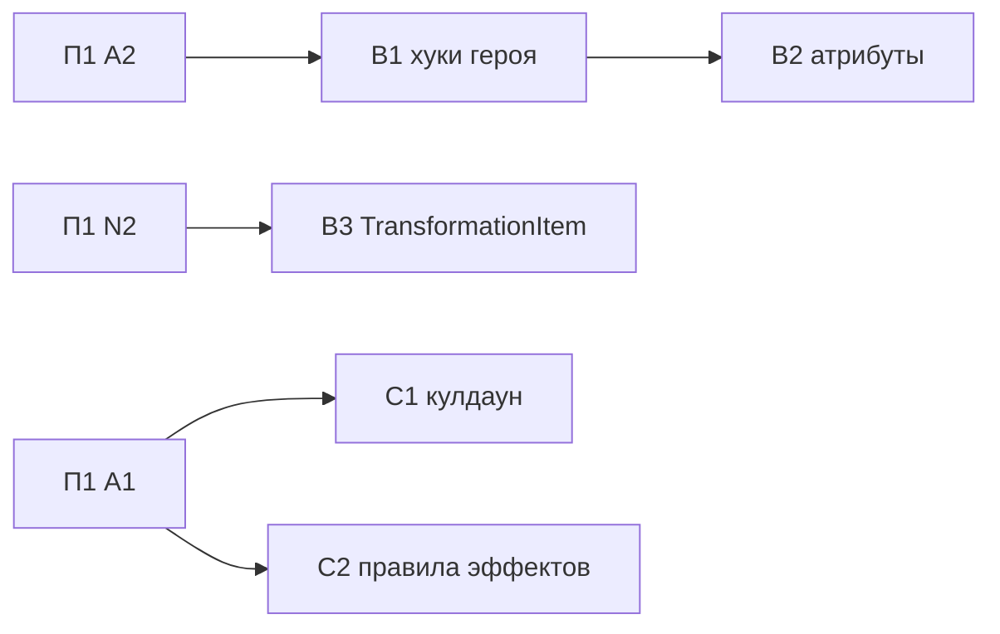

# План 2 — данные героя и контракт способности: Implementation Plan

> **For agentic workers:** REQUIRED SUB-SKILL: Use superpowers:subagent-driven-development (recommended) or superpowers:executing-plans to implement this plan task-by-task. Steps use checkbox (`- [ ]`) syntax for tracking.

**Goal:** Оставшиеся данные героя, которые читает общий код, объявляет сам герой; `AbilityRouter` и `ResourceController` не знают эффектов конкретных героев; кулдаун проверяет только роутер.

**Architecture:** План строится поверх хуков `Hero` из BF11 (#46): оставшиеся 7 таблиц переезжают в хуки того же стиля, значения закреплены golden-тестами, снятыми во время выполнения на старом коде. Наборы пассивных атрибутов и lore предмета трансформации переезжают к герою. Проверки эффектов-блокировщиков (Snap, Vanity, aftermath, безумие) становятся глобальными правилами, которые регистрирует владелец эффекта. Поведение и баланс не меняются.

**Tech Stack:** Java 21, Minecraft 1.21.1 (Mojang mappings), Fabric Loader 0.19.2, Fabric API 0.116.12+1.21.1, Fabric Loom 1.16-SNAPSHOT, JUnit 5.10.2, Fabric GameTest API, ArchUnit 1.5.1 (из П1).

## Global Constraints

- Mod id: `superheroes` — не меняется никогда.
- Персистентные идентификаторы не меняются: id способностей (`superheroes:<ability>`), предметов, сущностей, звуков (`sounds.json`), MobEffect, типов урона, attachments (`hero_data`, `reinhard_state`, `doomsday_progress`, `regulus_madness`, `regulus_bonus_life`, `admin_build`, `suit_variant`, `nano_form`, `control_lock_shadow`, `pandora_revived` и др.), data component `superheroes:bound_weapon`, **ResourceLocation-ы attribute-модификаторов** (`modifiers/<hero>/<stat>` — permanent-пассивки лежат в NBT игроков), имена `KeyMapping` (`key.superheroes.*` — лежат в `options.txt`), lang-ключи.
- Id сетевых payload'ов не персистентны: их можно менять только при семантически оправданном слиянии (стадия L2).
- Геймплей и баланс не меняются в архитектурных PR. Любое изменение поведения — отдельный коммит с пометкой `behavior:` в сообщении и отдельным пунктом в описании PR.
- Server-authoritative: всё клиентское — в `src/client`; `src/main` загружается выделенным сервером.
- Только публичные API: `net.fabricmc.fabric.api.*`, никакого `net.fabricmc.fabric.impl.*`.
- Сеть — типизированные `CustomPacketPayload` + `StreamCodec`.
- `HeroDataStore` — единственный писатель `HERO_DATA` (`ProjectSanityTest.assertHeroDataHasSingleWriter`).
- Lifecycle-очистка — только через `PlayerLifecycle` (серверный поток), никогда через `ServerPlayConnectionEvents.DISCONNECT`.
- Mixins: узкие, `@Unique` для внедрённых членов, `@WrapOperation` предпочтительнее `@Redirect`.
- Звуки только OGG Vorbis; перед новыми ассетами проверять `art-source/`.
- `en_us.json` и `ru_ru.json` меняются вместе.
- `src/main/generated/` — только через `./gradlew runDatagen --no-daemon`; diff обязан быть пустым, если стадия не меняет данные намеренно.
- Финишный гейт каждого PR: `./gradlew qualityGate --no-daemon` зелёный.
- Runtime-изменения (ввод, рендер, HUD, сеть, VFX, сущности) — `./gradlew runClient --no-daemon`; если окружение не может запустить клиент, PR прямо это говорит.
- Никаких Gradle-модулей на героя, никакого big-bang rewrite, никакой перестановки файлов без смены владения.
- PR: заголовок на русском, тело начинается с «Для игрока», ниже — полная техническая часть; коммиты `feat(scope):`/`fix(scope):`/`refactor(scope):`/`test(scope):`/`docs(scope):` на английском.
- `SESSION.md` обновляется в каждом PR этого плана; статус стадии отмечается в таблице «Статус стадий» этого файла.

---

## Как исполнять этот план

- Карта всей миграции, исходное состояние, целевая архитектура и сквозные политики — в [`00-overview.md`](00-overview.md). Другие планы для этой работы читать не нужно.
- Одна стадия = один PR. B1 и C2 расписаны по шагам TDD с кодом. B2, B3, C1 заданы паспортами, и их первый шаг — **«Сверка»**: перечитать перечисленные файлы на актуальном `main` и обновить список касаний в описании PR.
- Если на актуальном коде проблема уже решена иначе — используем существующее решение и фиксируем это в PR и в разделе «Решения» этого плана. Откатывать рабочее решение ради буквального соответствия плану нельзя.
- Пути: `M/` = `src/main/java/com/example/superheroes/`, `C/` = `src/client/java/com/example/superheroes/client/`, `T/` = `src/test/java/com/example/superheroes/`, `G/` = `src/gametest/java/com/example/superheroes/gametest/`.
- Шаблон паспорта: **Цель · Почему · Зависит от · Затрагивает · Создаётся · Мигрируется · Удаляется · Старые пути, которых больше нет · Нельзя менять · Тесты · Runtime · Acceptance · Риски · Страховка.** Global Constraints в паспортах не повторяются.

Каждая стадия заканчивается одинаково (шаги не повторяются в каждой задаче):

- [ ] `./gradlew qualityGate --no-daemon` → `BUILD SUCCESSFUL`.
- [ ] Если стадия трогала datagen-источники: `./gradlew runDatagen --no-daemon` и `git diff --stat src/main/generated` → пусто (или только намеренные изменения, перечисленные в PR).
- [ ] Обновить «Статус стадий» этого плана, `SESSION.md` и при необходимости раздел «Решения».
- [ ] PR по правилам AGENTS.md §12; в технической части — baseline-метрики (`00-overview.md` §3.3) «до/после» для затронутых строк.

### Статус стадий

| Стадия | Статус | PR |
| :-- | :-- | :-- |
| B1 оставшиеся данные героя в хуках | ✅ | #62 |
| B2 пассивные атрибуты у героя | ⏳ PR | |
| B3 `TransformationItem` без подклассов | ⏳ PR | |
| C1 кулдаун проверяет роутер | ✅ | #60 |
| C2 правила для эффектов-состояний | ✅ | #61 |

## Контекст

- Seams bugfix-pass, на которые опирается план: хуки `Hero` из BF11 (`getImpactStyle/getImpactPower`, `getThreatClass`, `canUseAbility/onAbilityDenied`, `isAbilitySuppressedBy`, `getEnergyReserveFor`, `isUraniumWeak`), `HeroDataStore` (единственный писатель `HERO_DATA`), `ResourcePayment`, `ResourceController.charge/refund`, `ABILITY_COOLDOWNS` (BF4), `PassiveReconciler` (BF9), transient `AttributeModifierSet.Builder.abilityScoped()` (BF3), GameTest lane и `TestPlayers`.
- Внешние зависимости (обзор §2.1): A1 — до C1, C2; A2 — до B1; N2 — до B3. `G/TestHeroes` — из П1 A1.6.
- Этот план не делает: клиентскую доступность способностей (C4 — П4); перенос регистрации правил из `SuperheroesMod` в модули героев (П3 D2b); физический перенос файлов героев (П5, П6).

### Ownership: кто что решает при активации способности

| Решение | Владелец | Где |
| :-- | :-- | :-- |
| Эффект-блокировщик на игроке (Snap, Vanity strip, aftermath) | модуль, объявивший эффект → `AbilityRules.blocker` (C2) | `AbilityRouter.activate`, первым |
| Способность принадлежит герою | `Hero.getAbilities()` | роутер |
| Разблокирована ли (тиры Doomsday, камни Thanos, дом Pandora) | `Hero.canUseAbility` + `onAbilityDenied` (BF11) | роутер, до toggle-off |
| Toggle-off активной | роутер | |
| Эксклюзивность (Iron Fists) | `Hero.isAbilitySuppressedBy` (BF11) | роутер, после toggle-off, до кулдауна |
| Кулдаун: проверка | роутер (`AbilityCooldowns`) | |
| Кулдаун: установка | способность | `setCooldownTicks` в момент, определённый дизайном способности |
| Energy lock | роутер (`EnergyLocks`) | |
| Ситуативные предусловия (цель, предмет, земля) | `Ability.canActivate` | |
| Бесплатность стоимости (безумие Homelander) | модуль-владелец → `AbilityRules.freeCost` (C2) | роутер + `ResourceController` |
| Резерв ресурса (Unibeam) | `Hero.getEnergyReserveFor` (BF11) | роутер, в `canPayActivationCost` |
| Списание и возврат | роутер (`ResourceController.charge/refund`) | |
| Флаг активности toggle | роутер через `HeroDataStore` | |

### Решения

| # | Вопрос / расхождение | Что говорит код сейчас | Решение |
| :-- | :-- | :-- | :-- |
| R3 | Модульный: ветки роутера → `canUseAbility`; структурный: роутер владеет гейтингом | BF11 заменил ветки героев хуками в тех же местах цепочки; в начале `activate` остались проверки эффектов героев | Гейтинг героя — хуки BF11. C2 добавляет только глобальные правила для эффектов-состояний (`AbilityRules.blocker`, `freeCost`), которые регистрирует владелец эффекта. Порядок цепочки не меняется |
| R4 | Структурный M3: `Ability.cooldownTicks()` | 98 вызовов `setCooldownTicks` с разными моментами установки | Роутер владеет **проверкой** кулдауна (уже так); дубли `isOnCooldown(своё id)` в `canActivate` удаляются. **Установку** кулдауна оставляем способности — унификация момента установки изменила бы баланс |
| R9 | Модульный §6: Scorpion и Pandora «выпали» из таблиц | Пассивки Scorpion есть в lang, но показывается 0; удар и угроза — дефолты BF11 | Хуки Scorpion и Pandora фиксируют **текущие** фактические значения. Показ пассивок Scorpion и калибровка — отдельный content-PR после B1 |
| R15 | Аудиты предлагали запись `HeroProfile`; внешнее ревью нашло цикл инициализации в её промежуточном шаге | BF11 уже ввёл хуки-методы `Hero` для удара и угрозы | Записи `HeroProfile` нет. Оставшиеся данные — хуки в том же стиле (`getPassiveGlyphs`, `canSuperJump`, `getMeleeBleed`). Защита от «тихого дефолта» — golden-тест `HeroPresentationGameTests`: герой без строки в golden роняет гейт. Снимок legacy-значений снимается во время выполнения, а не в статических инициализаторах |

## Зависимости стадий



B1, B3, C1 и C2 независимы и идут параллельно; B2 — после B1. Выход плана: C2 нужна П3 D2b; весь П2 — до П5 E1 (обзор §2.1).

## File Structure

| Файл | Ответственность | Стадия |
| :-- | :-- | :-- |
| `M/hero/PassiveGlyph.java`, `M/hero/BleedProfile.java` | данные пассивок и кровотечения, которые объявляет герой | B1 |
| `G/HeroPresentationGameTests.java`, `src/gametest/resources/golden/{hero_presentation,passive_glyphs}.txt` | golden всех значений хуков каждого героя | B1 |
| `G/…PassiveAttributes…GameTests`, `golden/passive_modifiers.txt` | id и значения permanent-модификаторов | B2 |
| `M/transform/TransformationLore.java`, `G/TransformationItemLoreIsStable` + golden | lore предмета трансформации данными | B3 |
| `G/CooldownGateGameTests.java` | роутер отвергает способность на кулдауне | C1 |
| `M/core/ability/{AbilityDenial,AbilityBlocker,AbilityRules}.java`, `G/AbilityGateGameTests.java` | правила для эффектов-состояний и характеризация всего гейтинга | C2 |

Удаляемое перечислено в паспортах.

## Стадии

### Стадия B1 — оставшиеся данные героя живут в герое (хуки в стиле BF11)

- **Цель:** 7 оставшихся общих таблиц героев исчезают: каждое значение объявляет сам герой через хук `Hero`, как BF11 уже сделал для удара и угрозы.
- **Почему:** тихие дефолты (Scorpion и Pandora выпали из таблиц), две конвенции тем, пассивки по индексу в трёх местах (аудит 2, S2/S3/S15). BF11 убрал таблицы `CombatImpactEngine` и `JarvisThreatClass`, остальные остались.
- **Зависит от:** A2.
- **Затрагивает:** `M/hero/Hero.java`, `M/hero/*Hero.java` ×22, `M/hero/HeroTheme.java`, `M/hero/HeroHudConfig.java`, `M/effect/SuperJumpController.java`, `M/effect/HeroBleedingController.java`, `M/effect/HeroMeleeImpactController.java`, `C/hud/AbilityDescriptions.java`, `C/hud/PassiveIcons.java`, `C/hud/HudIcons.java`, `C/hud/HeroInfoPanelHud.java`.
- **Создаётся:** `M/hero/PassiveGlyph.java` (бывший `HudIcons.PassiveGlyph`, те же константы в том же порядке), `M/hero/BleedProfile.java`, хуки `Hero.getPassiveGlyphs()`, `Hero.canSuperJump()`, `Hero.getMeleeBleed(ServerPlayer)`, `G/HeroPresentationGameTests.java`, golden-файлы `src/gametest/resources/golden/hero_presentation.txt` и `passive_glyphs.txt`.
- **Мигрируется:** константы `HeroTheme.<HERO>` (11) и `HeroHudConfig.<HERO>` (21) → `private static final` поля своих героев (так уже устроены 10 героев с inline-темами); Pandora перестаёт ссылаться на `RegulusHero.THEME` и держит копию палитры; allow-list суперпрыжка, switch кровотечения и таблицы пассивок → хуки.
- **Удаляется:** константы героев в `HeroTheme` и `HeroHudConfig` (остаются только `DEFAULT`), класс `PassiveIcons`, `AbilityDescriptions.HERO_PASSIVE_COUNT`, `SuperJumpController.ALLOWED_HEROES`, switch в `HeroBleedingController` и его параметр `doomsdayTier`, временные поиски `SuperJumpController.isAllowed` и `HeroBleedingController.bleedFor` из B1.1.
- **Не вводится:** запись `HeroProfile` (R15). Хуки BF11 (`getImpactStyle/getImpactPower`, `getThreatClass`, гейты) не меняются, но входят в golden.
- **Старые пути, которых больше нет:** «добавить героя в таблицу X» для всех 7 таблиц.
- **Нельзя менять:** ни одно значение: цвета, HUD-строки, глифы и их порядок, суперпрыжок, шанс и уровень кровотечения. Scorpion и Pandora сохраняют текущие фактические значения: 0 глифов, без суперпрыжка, без кровотечения; Pandora — `HeroHudConfig.DEFAULT` и палитра Регулуса (R9). `HeroAttributes` не трогается (B2).
- **Тесты:** golden-снимок всех значений снимается **во время выполнения** на старом коде (B1.1), а после переноса те же значения читаются из хуков (B1.3). Никаких вычислений из legacy-таблиц в статических инициализаторах героев: в прошлой версии плана это давало цикл инициализации.
- **Runtime:** `runClient`: панель героя, радиалка и HUD энергии Homelander, Iron Man, Pandora, Scorpion совпадают со скриншотами до стадии; суперпрыжок работает у Regulus и не работает у Scorpion.
- **Acceptance:** в `M/` и `C/` нет ни одной из 7 таблиц; ArchUnit store потерял записи `SuperJumpController → *Hero` и `PandoraHero → RegulusHero`; оба golden-теста зелёные; герой без строки в golden роняет тест.
- **Риски:** опечатка при переносе значений — ловится golden-тестами, снятыми до переноса.
- **Страховка:** 4 коммита (снимок → хуки и значения → потребители → удаление), каждый зелёный.

#### Task B1.1: снимок legacy-значений (фаза на старом коде)

**Files:**
- Create: `M/hero/BleedProfile.java`, `G/HeroPresentationGameTests.java`, `T/client/PassiveGlyphSnapshotTest.java` (временный)
- Modify: `M/effect/SuperJumpController.java`, `M/effect/HeroBleedingController.java`, `src/gametest/resources/fabric.mod.json`

**Interfaces:**
- Produces: `record BleedProfile(float chance, int amplifier)`; временные `SuperJumpController.isAllowed(ResourceLocation heroId)` → `boolean` и `HeroBleedingController.bleedFor(ResourceLocation heroId, int doomsdayTier)` → `@Nullable BleedProfile` (чистые функции над теми же данными, которыми пользуется текущий код).

- [ ] **Step 1: Выделить чистые поиски без изменения поведения**

```java
package com.example.superheroes.hero;

/** Chance and amplifier of the bleeding a hero's melee hit applies. */
public record BleedProfile(float chance, int amplifier) {
}
```

В `SuperJumpController` — `public static boolean isAllowed(ResourceLocation heroId) { return ALLOWED_HEROES.contains(heroId); }`, и существующая проверка вызывает его. В `HeroBleedingController` switch переезжает в `public static @Nullable BleedProfile bleedFor(ResourceLocation heroId, int doomsdayTier)` (те же ветки: `battle_beast` 0.30/0, `kratos` 0.25/0, `omniman` 0.40/1, `invincible` 0.20/0, `doomsday` 0.50/1 при тире ≥ 3, иначе `null`); `tryApplyBleeding` вызывает его и применяет эффект, как раньше.

- [ ] **Step 2: GameTest-дамп серверных значений**

```java
package com.example.superheroes.gametest;

import com.example.superheroes.effect.HeroBleedingController;
import com.example.superheroes.effect.SuperJumpController;
import com.example.superheroes.hero.Hero;
import com.example.superheroes.hero.Heroes;
import net.fabricmc.fabric.api.gametest.v1.FabricGameTest;
import net.minecraft.gametest.framework.GameTest;
import net.minecraft.gametest.framework.GameTestHelper;

import java.nio.file.Files;
import java.nio.file.Path;
import java.util.ArrayList;
import java.util.List;

public final class HeroPresentationGameTests implements FabricGameTest {
	/** One line per hero; every column is read at runtime, after all hero classes are initialized. */
	static String legacyLine(Hero hero) {
		var id = hero.getId();
		return id.getPath() + "|" + hero.getTheme() + "|" + hero.getHudConfig().energyName() + "|" + hero.getHudConfig().energyIcon()
				+ "|" + hero.getHudConfig().hasUltimate() + "|" + hero.getHudConfig().ultimateName()
				+ "|" + hero.getImpactStyle() + "|" + hero.getImpactPower() + "|" + hero.getThreatClass()
				+ "|" + SuperJumpController.isAllowed(id)
				+ "|" + HeroBleedingController.bleedFor(id, 1) + "|" + HeroBleedingController.bleedFor(id, 7);
	}

	@GameTest(template = EMPTY_STRUCTURE)
	public void dumpLegacyPresentation(GameTestHelper helper) throws java.io.IOException {
		List<String> lines = new ArrayList<>();
		for (Hero hero : Heroes.all().values()) {
			lines.add(legacyLine(hero));
		}
		Path out = Path.of("build/golden/hero_presentation.txt");
		Files.createDirectories(out.getParent());
		Files.write(out, lines);
		helper.succeed();
	}
}
```

Тиры 1 и 7 — минимум и максимум Doomsday (`DoomsdayProgress`: начальный тир 1, потолок 7); для остальных героев тир ни на что не влияет.

- [ ] **Step 3: JUnit-дамп клиентских таблиц пассивок** (client-классы есть в test classpath с BF7):

```java
package com.example.superheroes.client;

import com.example.superheroes.client.hud.AbilityDescriptions;
import com.example.superheroes.client.hud.PassiveIcons;
import net.minecraft.resources.ResourceLocation;
import org.junit.jupiter.api.Test;

import java.nio.file.Files;
import java.nio.file.Path;
import java.util.ArrayList;
import java.util.List;

class PassiveGlyphSnapshotTest {
	private static final List<String> HEROES = List.of("homelander", "iron_man", "regulus", "sung_jinwoo", "doomsday", "goku",
			"naruto", "captain_america", "kratos", "loki", "thanos", "reinhard", "raiden_shogun", "invincible", "omniman", "kazuha",
			"scaramouche", "battle_beast", "rem", "a_train", "scorpion", "pandora");

	@Test
	void dumpPassiveGlyphs() throws java.io.IOException {
		List<String> lines = new ArrayList<>();
		for (String path : HEROES) {
			ResourceLocation id = ResourceLocation.fromNamespaceAndPath("superheroes", path);
			int count = AbilityDescriptions.passiveCount(id);
			List<String> glyphs = new ArrayList<>();
			for (int i = 0; i < count; i++) {
				glyphs.add(PassiveIcons.glyph(id, i).name());
			}
			lines.add(path + "|" + String.join(",", glyphs));
		}
		Path out = Path.of("build/golden/passive_glyphs.txt");
		Files.createDirectories(out.getParent());
		Files.write(out, lines);
	}
}
```

Сверка: список `HEROES` совпадает с `Heroes.init()` по составу (22 id).

- [ ] **Step 4: Запуск (оркестратор, на старом коде)**

Run: `./gradlew runGametest test --no-daemon --tests '*PassiveGlyphSnapshotTest*'`
Expected: PASS; появились `build/golden/hero_presentation.txt` (22 строки) и `build/golden/passive_glyphs.txt` (22 строки; у `scorpion`, `pandora`, `raiden_shogun` — пустой список).

- [ ] **Step 5:** Скопировать оба файла в `src/gametest/resources/golden/`, удалить `dumpLegacyPresentation` и `PassiveGlyphSnapshotTest`. Commit:

```bash
git add src/main/java src/gametest src/test
git commit -m "test(hero): snapshot hero presentation values before moving them into heroes"
```

#### Task B1.2: хуки героя и значения в героях

**Files:**
- Create: `M/hero/PassiveGlyph.java`
- Modify: `M/hero/Hero.java`, `M/hero/*Hero.java` ×22, `C/hud/HudIcons.java` (удалить вложенный enum, импортировать `hero.PassiveGlyph`)

**Interfaces:**
- Produces: `enum PassiveGlyph { HEART, FEATHER, STAR, EYE, SHIELD, FLAME, BOLT, FIST, SWORD, MAGIC, LEAF, SPIRAL, ICE, BEAST, SKULL, SHADOW, REACTOR, COSMIC, GENERIC }`; хуки ниже.

- [ ] **Step 1: Хуки**

```java
	/** Glyphs of this hero's passives in the info panel, in lang order {@code hero.<ns>.<id>.passive.<n>}. */
	default java.util.List<PassiveGlyph> getPassiveGlyphs() {
		return java.util.List.of();
	}

	/** Whether the super-jump key works for this hero. */
	default boolean canSuperJump() {
		return false;
	}

	/** Bleeding this hero's melee hit applies right now; {@code null} for none. */
	@Nullable
	default BleedProfile getMeleeBleed(ServerPlayer attacker) {
		return null;
	}
```

Дефолты те же, что у героя, отсутствующего в старых таблицах. «Тихий дефолт» больше не опасен: герой без строки в golden роняет тест B1.3.

- [ ] **Step 2: Значения в героях** — по строкам `passive_glyphs.txt` (`getPassiveGlyphs`), колонке суперпрыжка (`canSuperJump`: regulus, doomsday, kratos, thanos, naruto, reinhard) и колонкам кровотечения (`getMeleeBleed`). `DoomsdayHero.getMeleeBleed(attacker)` читает тир так же, как сейчас `HeroMeleeImpactController.getDoomsdayTier` (сверка), и возвращает `null` при тире < 3, иначе `new BleedProfile(0.50f, 1)`. Константы `HeroTheme.<HERO>`/`HeroHudConfig.<HERO>` копируются в `private static final HeroTheme THEME`/`HeroHudConfig HUD` героя, `getTheme()`/`getHudConfig()` возвращают их. Pandora: `THEME` — копия значений Регулуса с комментарием `// Same palette as Regulus on purpose (House of Vanity shares his madness colors).`

- [ ] **Step 3:** `./gradlew compileJava compileClientJava --no-daemon` → PASS. Commit: `feat(hero): declare passives, super jump and bleeding on each hero`.

#### Task B1.3: потребители читают хуки; golden-проверка

**Files:**
- Modify: `M/effect/SuperJumpController.java`, `M/effect/HeroBleedingController.java`, `M/effect/HeroMeleeImpactController.java`, `C/hud/AbilityDescriptions.java`, `C/hud/HudIcons.java`, `C/hud/HeroInfoPanelHud.java`, `G/HeroPresentationGameTests.java`

- [ ] **Step 1: Переключить чтение**
  - `SuperJumpController`: `Hero hero = Heroes.get(data.heroId()); if (hero == null || !hero.canSuperJump()) return;`.
  - `HeroBleedingController.tryApplyBleeding(Hero hero, ServerPlayer attacker, LivingEntity target)`: `BleedProfile bleed = hero.getMeleeBleed(attacker); if (bleed == null) return;` дальше — прежнее применение эффекта. `HeroMeleeImpactController` передаёт героя и атакующего.
  - `AbilityDescriptions.passiveCount(heroId)` → `Heroes.get(heroId)` → `getPassiveGlyphs().size()` (0 для неизвестного); `passiveKey` без изменений.
  - Вызовы `PassiveIcons.glyph(heroId, index)` в `HeroInfoPanelHud` → `HudIcons.passiveGlyph(Hero hero, int index)` с теми же границами (`index < 0 || index >= size` → `PassiveGlyph.GENERIC`).
- [ ] **Step 2: Golden-проверка** — в `HeroPresentationGameTests`:

```java
	static String hookLine(Hero hero, @org.jetbrains.annotations.Nullable BleedProfile bleedTier1,
			@org.jetbrains.annotations.Nullable BleedProfile bleedTier7) {
		return hero.getId().getPath() + "|" + hero.getTheme() + "|" + hero.getHudConfig().energyName() + "|" + hero.getHudConfig().energyIcon()
				+ "|" + hero.getHudConfig().hasUltimate() + "|" + hero.getHudConfig().ultimateName()
				+ "|" + hero.getImpactStyle() + "|" + hero.getImpactPower() + "|" + hero.getThreatClass()
				+ "|" + hero.canSuperJump() + "|" + bleedTier1 + "|" + bleedTier7;
	}
```

  Тест `presentationMatchesGolden`: для каждого героя из `Heroes.all()` создать игрока (`TestPlayers.join`), `TestHeroes.transform`; для Doomsday выставить тир 1 и 7 через его attachment `DOOMSDAY_PROGRESS` (сверка: как `DoomsdayTierController` пишет тир); сравнить `hookLine` со строкой golden с тем же id; герой без строки в golden — FAIL. Тест `passiveGlyphsMatchGolden`: `hero.getPassiveGlyphs()` против `passive_glyphs.txt`.
- [ ] **Step 3:** `./gradlew runGametest --no-daemon` → PASS. Commit: `refactor(hero): read passives, super jump and bleeding from hero hooks`.

#### Task B1.4: удалить таблицы

- [ ] **Step 1:** Удалить константы героев из `HeroTheme` (оставить `DEFAULT` литералом с палитрой Homelander и javadoc «neutral fallback for no hero») и `HeroHudConfig` (оставить `DEFAULT`); удалить `PassiveIcons`, `HERO_PASSIVE_COUNT`, `ALLOWED_HEROES`, `isAllowed`, `bleedFor`.
- [ ] **Step 2:** `./gradlew qualityGate --no-daemon` → FAIL только на `verifyArchitectureBaseline` (store уменьшился); закоммитить store → PASS.
- [ ] **Step 3: Commit**

```bash
git add -A src/main/java src/client/java src/test/resources/archunit_store src/test/resources/architecture
git commit -m "refactor(hero): drop shared hero tables now owned by heroes"
```

**Follow-up (не часть стадии, отдельный content-PR после B1):** показать 3 пассивки Scorpion (lang `hero.superheroes.scorpion.passive.1..3` уже есть) и откалибровать удар и угрозу Scorpion и Pandora — это изменение того, что видит игрок; значения выбирает владелец.

---

### Стадия B2 — наборы пассивных атрибутов принадлежат герою

- **Цель:** `HeroAttributes` (487 строк, наборы 17+ героев) исчезает; каждый герой держит свой `AttributeModifierSet`.
- **Почему:** последний общий файл с данными каждого героя; STRANGE-хвост; ownership пассивок нужен reconciler'у BF9.
- **Зависит от:** B1.
- **Сверка:** BF9 ввёл `lifecycle/PassiveReconciler.applyAndCapture(player, hero)`, который вызывает `hero.applyPassives(player)` и запоминает наложенные пассивки. Если reconciler работает только через `applyPassives/removePassives` — ввести `AttributeModifierSet Hero.passiveAttributes()` и выразить через него `applyPassives/removePassives` там, где они сводятся к `HeroAttributes.X.apply/remove`; если reconciler уже читает набор модификаторов героя — использовать его контракт.
- **Мигрируется:** для каждого героя: константы `HeroAttributes.<HERO>_*` (ResourceLocation-ы) и набор `HeroAttributes.<HERO>` → `private static final` поля героя; id-строки копируются **байт-в-байт**.
- **Удаляется:** `M/hero/HeroAttributes.java`.
- **Нельзя менять:** ни одной строки `modifiers/<hero>/<stat>` (permanent-модификаторы в сохранениях), значения и операции модификаторов, `abilityScoped()`-наборы (transient, BF3).
- **Тесты:** GameTest `PassiveAttributeIdsAreStable`: для каждого героя применить пассивки к `TestPlayers.join` → собрать `(attribute, id, amount, operation)` всех модификаторов с namespace `superheroes` → сравнить с golden-файлом `golden/passive_modifiers.txt`, сгенерированным **до** переноса (тот же приём, что в B1.2 шаги 3–4).
- **Acceptance:** `HeroAttributes` нет; golden зелёный; пара `hero <-> …` циклов не выросла.
- **Риски:** static-init порядок (набор ссылается на id-константы) — объявлять id выше набора.

### Стадия B3 — предмет трансформации без подкласса на героя

- **Цель:** lore-only подклассы `TransformationItem` исчезают; lore выражается данными.
- **Почему:** аудит 2, S17: новый герой = новый Java-класс ради нескольких lang-ключей.
- **Зависит от:** N2.
- **Сверка:** для каждого подкласса (`grep -rln 'extends TransformationItem' M/`) сравнить тело с `M/item/GokuGiItem.java`. На сводной базе: 15 классов с одной структурой `openDivider(frame)` → строки `flavor(key, color)` → пустая строка → строки `bullet(key, color)` → `closeDivider(frame)` (ATrain, BattleBeast, DoctorStrange, Doomsday, Goku, Homelander, Invincible, IronMan, Kazuha, Omniman, Raiden, Reinhard, RemOniHorn, Scaramouche, ScorpionKunai); 6 классов дополнительно вызывают `TooltipFrame.containsStone(...)` (BladeOfChaos, CaptainAmerica, Loki, NarutoHeadband, Regulus, ShadowMonarchsCloak); у `InfinityGauntletItem` собственное поведение.
- **Создаётся:** `M/transform/TransformationLore.java`:

```java
package com.example.superheroes.transform;

import net.minecraft.ChatFormatting;

import java.util.List;

/** Tooltip of a transformation item: a framed block of flavor lines, an empty line, then bullet lines. */
public record TransformationLore(ChatFormatting frame, List<Line> flavor, List<Line> bullets) {
	public record Line(String key, ChatFormatting color) {
	}

	public TransformationLore {
		flavor = List.copyOf(flavor);
		bullets = List.copyOf(bullets);
	}
}
```

- **Мигрируется:** `TransformationItem` получает конструктор `(ResourceLocation heroId, Item.Properties properties, TransformationLore lore)` и реализует `appendHoverText` ровно по структуре выше через существующие `TooltipFrame.openDivider/flavor/bullet/closeDivider`. 15 lore-only классов → `new TransformationItem(<Hero>.ID, props, new TransformationLore(...))` в `ModItems` с теми же ключами, цветами и порядком.
- **Не мигрируется здесь:** 6 классов с подсказкой камня — `containsStone` принадлежит механике Таноса; они сводятся к `TransformationItem` в П6 I5a, когда подсказки камней переезжают в tooltip-хук модуля Thanos. `InfinityGauntletItem` остаётся классом.
- **Удаляется:** 15 lore-only классов, включая `DoctorStrangeSuitItem` и `ScorpionKunaiItem` (П5 F использует `TransformationItem`).
- **Нельзя менять:** id предметов, lang-ключи, цвета и порядок строк lore, свойства предметов (`stacksTo`, `rarity`, `fireResistant`).
- **Тесты:** GameTest `TransformationItemLoreIsStable`: для каждого предмета трансформации вызвать `appendHoverText(stack, Item.TooltipContext.EMPTY, lines, TooltipFlag.NORMAL)` и записать список `(translation key или «empty»/«divider», цвет)`; golden снимается до изменения (фаза на старом коде), после — сравнение.
- **Runtime:** `runClient` — tooltip трёх предметов (Goku, Scorpion, Pandora) совпадает со скриншотом до стадии.
- **Acceptance:** подклассов `TransformationItem` осталось 7 (6 с камнями + перчатка); golden зелёный.

---

### Стадия C1 — роутер единолично проверяет кулдаун

- **Цель:** удалить 85 дублей `AbilityCooldowns.isOnCooldown(player, <своё id>)` из `canActivate`.
- **Почему:** аудит 2, S4; R4. Единственный вызывающий `canActivate` — `AbilityRouter.activate`, и он проверяет кулдаун раньше (проверено на сводной базе).
- **Зависит от:** A1. Кулдауны с BF4 хранятся в persistent attachment `ABILITY_COOLDOWNS`; API `AbilityCooldowns.isOnCooldown(ServerPlayer, ResourceLocation)` не изменился.
- **Сверка:** `grep -rn '\.canActivate(' src/main/java` — по-прежнему только роутер; порядок в `activate`: кулдаун до `canActivate`.
- **Мигрируется:** в каждом `Ability.canActivate` удалить проверку кулдауна **собственного** id (`getId()` или константа того же id). Проверки кулдауна **другого** id не трогать и перечислить в PR.
- **Создаётся:** замороженное ArchUnit-правило `abilitiesDoNotCheckCooldowns`: классы, реализующие `Ability`, не вызывают `AbilityCooldowns.isOnCooldown`; baseline после чистки содержит только легитимные чужие проверки.

```java
	@Test
	void abilitiesDoNotCheckTheirOwnCooldown() {
		FreezingArchRule.freeze(noClasses().that().implement(com.example.superheroes.ability.Ability.class)
				.should().callMethod(com.example.superheroes.ability.AbilityCooldowns.class, "isOnCooldown",
						net.minecraft.server.level.ServerPlayer.class, net.minecraft.resources.ResourceLocation.class)
				.as("AbilityRouter owns the cooldown check; an ability may only check another ability's cooldown"))
				.check(CodexClasses.main());
	}
```

  Baseline для этого правила создаётся **после** чистки (шаг: удалить дубли → создать store с `allowStoreCreation=true` → в store только чужие проверки).
- **Нельзя менять:** момент и длительность установки кулдаунов; поведение способностей, которые смотрят кулдаун другой способности.
- **Тесты:** GameTest `CooldownGateGameTests.routerRejectsAbilityOnCooldown` (Scaramouche: активировать способность, выставить кулдаун, вторая активация — no-op, ресурс не списан) — написать и прогнать **до** удаления дублей (PASS), затем после (PASS).
- **Acceptance:** `grep -rln 'AbilityCooldowns.isOnCooldown' M/ability | wc -l` = число легитимных чужих проверок (в PR).

### Стадия C2 — роутер не проверяет эффекты конкретных героев

- **Цель:** `AbilityRouter` и `ResourceController` не знают ни одного эффекта конкретного героя.
- **Почему:** BF11 убрал ветки героев из роутера (хуки `canUseAbility`/`onAbilityDenied`, `isAbilitySuppressedBy`, `getEnergyReserveFor`), но в начале `AbilityRouter.activate` остались проверки эффектов Homelander (aftermath), Thanos (Snap, `DISABLED_ABILITIES`) и Pandora (`VANITY_STRIPPED`), а бесплатность в безумии Homelander (`ModEffects.isMadness`) проверяется в `canPayActivationCost` и дважды в `ResourceController`.
- **Зависит от:** A1.
- **Затрагивает:** `M/ability/AbilityRouter.java`, `M/resource/ResourceController.java`, `M/SuperheroesMod.java` (регистрация правил до появления модулей), `G/AbilityGateGameTests.java`.
- **Создаётся:** `M/core/ability/AbilityDenial.java`, `M/core/ability/AbilityBlocker.java`, `M/core/ability/AbilityRules.java`.
- **Мигрируется:** три проверки эффектов → `AbilityRules.blocker` в том же порядке (aftermath → Snap → Vanity); `ModEffects.isMadness` в роутере и `ResourceController` → `AbilityRules.isFree`.
- **Не трогается:** хуки BF11 и порядок цепочки после них.
- **Удаляется:** все обращения к `ModEffects` из `AbilityRouter` и `ResourceController`.
- **Нельзя менять:** порядок проверок, тексты и цвета сообщений; тихие отказы остаются тихими.
- **Тесты:** характеризационные GameTests пишутся и проходят **до** рефакторинга и проходят после; они заодно закрепляют гейты BF11.
- **Runtime:** не обязателен (серверная логика покрыта GameTests).
- **Acceptance:** `grep -n 'ModEffects' M/ability/AbilityRouter.java M/resource/ResourceController.java` → пусто.
- **Риски:** под двумя эффектами сразу игрок видит сообщение первого правила — регистрировать в текущем порядке.

#### Task C2.1: характеризационные тесты текущего гейтинга

**Files:**
- Create: `G/AbilityGateGameTests.java`; Modify: `src/gametest/resources/fabric.mod.json`

**Interfaces:**
- Consumes: `TestHeroes.transform(ServerPlayer, ResourceLocation)` (П1 A1.6).

- [ ] **Step 1: Сверка значений** — прочитать `DoomsdayHero.canUseAbility`, `ThanosHero.canUseAbility/onAbilityDenied`, `PandoraHero.canUseAbility`, `HomelanderHero.isAbilitySuppressedBy`, `IronManHero.getEnergyReserveFor`, `ModEffects.isAftermath/isMadness`, чтобы выбрать способности и состояния для тестов.
- [ ] **Step 2: Тесты** (все через `AbilityRouter.activate`, игрок из `TestPlayers.join`):

```java
	@GameTest(template = EMPTY_STRUCTURE)
	public void snapDisabledPlayerCannotActivate(GameTestHelper helper) {
		ServerPlayer player = TestPlayers.join(helper);
		TestHeroes.transform(player, ScaramoucheHero.ID);
		player.addEffect(new MobEffectInstance(ModEffects.DISABLED_ABILITIES, 200));
		float before = HeroDataStore.get(player).energy();
		AbilityRouter.activate(player, AbilityIds.SCARAMOUCHE_WIND_PRISON);
		helper.assertFalse(HeroDataStore.get(player).isActive(AbilityIds.SCARAMOUCHE_WIND_PRISON), "blocked by Snap");
		helper.assertTrue(HeroDataStore.get(player).energy() == before, "nothing charged");
		helper.succeed();
	}

	@GameTest(template = EMPTY_STRUCTURE)
	public void madnessMakesActivationFree(GameTestHelper helper) {
		ServerPlayer player = TestPlayers.join(helper);
		TestHeroes.transform(player, HomelanderHero.ID);
		player.addEffect(new MobEffectInstance(ModEffects.MADNESS, 200));
		HeroDataStore.update(player, d -> d.withResources(0f, d.mana()));
		AbilityRouter.activate(player, AbilityIds.STUNNING_ROAR);
		helper.assertTrue(AbilityCooldowns.isOnCooldown(player, AbilityIds.STUNNING_ROAR), "madness pays for the roar");
		helper.succeed();
	}
```

  По тому же шаблону: `vanityStrippedPlayerCannotActivate`, `aftermathBlocksSilently` (`ModEffects.MADNESS_AFTERMATH`), `lockedDoomsdayTierAbilityIsRejectedSilently` (`DOOMSDAY_DOOM_GRIP` на тире 1), `pandoraDimensionOnlyAbilityOutsideHouseIsRejected`, `ironFistsBlocksOtherAbilities` (с активным `IRON_FISTS` другая способность не стартует, а сам `IRON_FISTS` выключается повторным нажатием), `unibeamReserveBlocksOtherEnergyAbilities` (Iron Man с энергией `< cost + 100` не может активировать энерго-способность, кроме `UNIBEAM`). Если выбранная способность требует цели или предмета — взять другую, без ситуативных предусловий.
- [ ] **Step 3 (оркестратор, на старом коде):** `./gradlew runGametest --no-daemon` → все PASS. Commit: `test(gametest): characterize ability gating before extracting effect rules`.

#### Task C2.2: правила для эффектов-состояний

**Files:**
- Create: `M/core/ability/AbilityDenial.java`, `M/core/ability/AbilityBlocker.java`, `M/core/ability/AbilityRules.java`
- Modify: `M/ability/AbilityRouter.java`, `M/resource/ResourceController.java`, `M/SuperheroesMod.java`

**Interfaces:**
- Produces: `record AbilityDenial(@Nullable Component message)` с `SILENT`, `of(Component)`, `notify(ServerPlayer)`; `@FunctionalInterface interface AbilityBlocker { @Nullable AbilityDenial check(ServerPlayer player, ResourceLocation abilityId); }`; `final class AbilityRules { static void blocker(AbilityBlocker); static void freeCost(Predicate<ServerPlayer>); static @Nullable AbilityDenial firstBlock(ServerPlayer, ResourceLocation); static boolean isFree(ServerPlayer); }`.

- [ ] **Step 1: Типы**

```java
package com.example.superheroes.core.ability;

import net.minecraft.network.chat.Component;
import net.minecraft.server.level.ServerPlayer;
import org.jetbrains.annotations.Nullable;

/** Why an activation was refused; {@link #SILENT} refuses without telling the player. */
public record AbilityDenial(@Nullable Component message) {
	public static final AbilityDenial SILENT = new AbilityDenial(null);

	public static AbilityDenial of(Component message) {
		return new AbilityDenial(message);
	}

	public void notify(ServerPlayer player) {
		if (message != null) {
			player.displayClientMessage(message, true);
		}
	}
}
```

```java
package com.example.superheroes.core.ability;

import net.minecraft.resources.ResourceLocation;
import net.minecraft.server.level.ServerPlayer;
import org.jetbrains.annotations.Nullable;

/** A state on the player (usually an effect some hero applied) that forbids every ability. */
@FunctionalInterface
public interface AbilityBlocker {
	@Nullable
	AbilityDenial check(ServerPlayer player, ResourceLocation abilityId);
}
```

```java
package com.example.superheroes.core.ability;

import net.minecraft.resources.ResourceLocation;
import net.minecraft.server.level.ServerPlayer;
import org.jetbrains.annotations.Nullable;

import java.util.ArrayList;
import java.util.List;
import java.util.function.Predicate;

/** Cross-hero activation rules owned by whoever declares the state (Snap, Vanity strip, madness). Registration order is evaluation order. */
public final class AbilityRules {
	private static final List<AbilityBlocker> BLOCKERS = new ArrayList<>();
	private static final List<Predicate<ServerPlayer>> FREE_COST = new ArrayList<>();

	private AbilityRules() {
	}

	/** Checked first, before hero membership — states that forbid every ability. */
	public static void blocker(AbilityBlocker blocker) {
		BLOCKERS.add(blocker);
	}

	public static void freeCost(Predicate<ServerPlayer> rule) {
		FREE_COST.add(rule);
	}

	@Nullable
	public static AbilityDenial firstBlock(ServerPlayer player, ResourceLocation abilityId) {
		for (AbilityBlocker blocker : BLOCKERS) {
			AbilityDenial denial = blocker.check(player, abilityId);
			if (denial != null) {
				return denial;
			}
		}
		return null;
	}

	public static boolean isFree(ServerPlayer player) {
		for (Predicate<ServerPlayer> rule : FREE_COST) {
			if (rule.test(player)) {
				return true;
			}
		}
		return false;
	}
}
```

- [ ] **Step 2: Роутер и ресурсы.** Первые три `if` в `AbilityRouter.activate` заменить на:

```java
		AbilityDenial blocked = AbilityRules.firstBlock(player, abilityId);
		if (blocked != null) {
			blocked.notify(player);
			return;
		}
```

  В `canPayActivationCost` и в двух местах `ResourceController` (на сводной базе — строки с `boolean madness = ModEffects.isMadness(player)` и `if (amount <= 0f || ModEffects.isMadness(player))`) заменить `ModEffects.isMadness(player)` на `AbilityRules.isFree(player)`. Остальная цепочка (хуки BF11, кулдаун, `EnergyLocks`, `canActivate`, оплата) не меняется.

- [ ] **Step 3: Регистрация правил** — до появления модулей в `SuperheroesMod.onInitialize()` сразу после `ModEffects.init()` (П3 D2b переносит их в модули Homelander, Thanos, Pandora):

```java
		// Owned by the heroes whose effects they are; moved into their modules in D2b.
		AbilityRules.blocker((player, id) -> ModEffects.isAftermath(player) ? AbilityDenial.SILENT : null);
		AbilityRules.blocker((player, id) -> player.hasEffect(ModEffects.DISABLED_ABILITIES)
				? AbilityDenial.of(Component.translatable("ability.superheroes.disabled_by_snap").withStyle(ChatFormatting.DARK_PURPLE)) : null);
		AbilityRules.blocker((player, id) -> player.hasEffect(ModEffects.VANITY_STRIPPED)
				? AbilityDenial.of(Component.translatable("ability.superheroes.vanity_stripped").withStyle(ChatFormatting.DARK_PURPLE)) : null);
		AbilityRules.freeCost(ModEffects::isMadness);
```

- [ ] **Step 4:** `./gradlew runGametest --no-daemon` → все тесты C2.1 PASS; `./gradlew qualityGate --no-daemon` → при уменьшении store закоммитить его → PASS.

- [ ] **Step 5: Commit**

```bash
git add -A src/main/java src/test/resources/archunit_store src/test/resources/architecture
git commit -m "refactor(ability): replace hero effect checks in AbilityRouter with ability rules"
```

---

## Готово, когда

- В `M/` и `C/` нет ни одной из 7 оставшихся таблиц героев, `HeroAttributes` удалён; golden-тесты хуков, глифов, id модификаторов и lore зелёные.
- Подклассов `TransformationItem` осталось 7 (6 с подсказкой камня до П6 I5a + перчатка).
- `AbilityRouter` и `ResourceController` не ссылаются на `ModEffects`; дубли `isOnCooldown(своё id)` удалены.
- ArchUnit store потерял соответствующие записи и закоммичен.

## Self-Review

- **Покрытие:** B1, B2, B3, C1, C2 перестроены поверх BF11; замечания внешнего ревью (цикл статической инициализации B1, B3 против F, модель lore без цветов и рамок) закрыты; решения R3, R4, R9, R15 — выше.
- **Что используют следующие планы:** хуки `Hero.getPassiveGlyphs()`, `canSuperJump()`, `getMeleeBleed(ServerPlayer)` и хуки BF11; `PassiveGlyph`, `BleedProfile`; `TransformationItem(ResourceLocation, Item.Properties, TransformationLore)`, `TransformationLore.Line`; `AbilityDenial`, `AbilityBlocker`, `AbilityRules.blocker/freeCost/firstBlock/isFree`. Регистрации правил в `SuperheroesMod` (C2.2 шаг 3) П3 D2b переносит в модули.
- **Проверка:** код этого плана не компилировался; имена и сигнатуры сверены со сводной базой.

## Execution Handoff

Исполнение: **Subagent-Driven (рекомендуется)** — свежий субагент на стадию, ревью между стадиями (superpowers:subagent-driven-development), или **Inline** с контрольными точками (superpowers:executing-plans). Первыми можно запускать C1 и C2 (после П1 A1), B1 (после П1 A2) и B3 (после П1 N2).

При параллельном исполнении несколькими субагентами оркестратор раздаёт задачи этого плана по `00-overview.md` §11 «Оркестрация».
