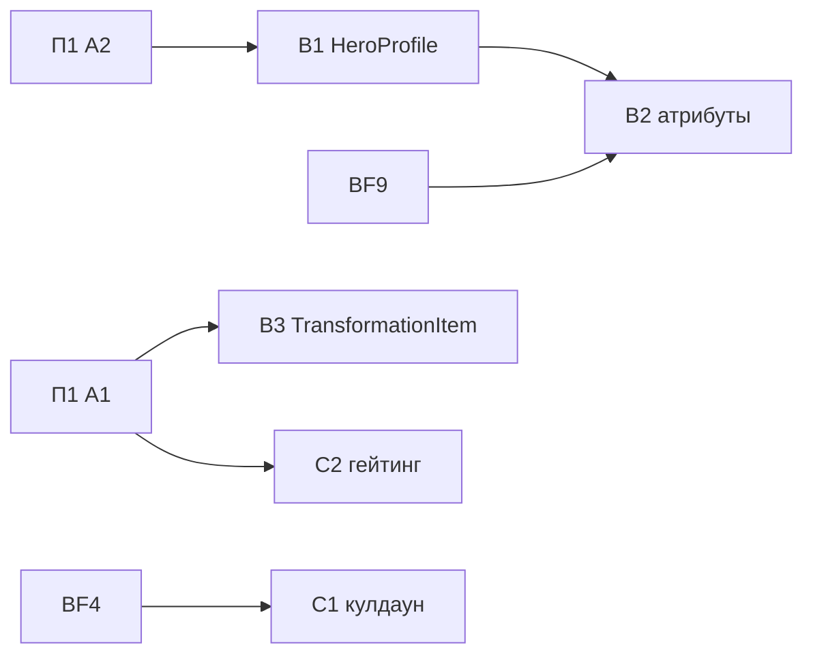

# План 2 — данные героя и контракт способности: Implementation Plan

> **For agentic workers:** REQUIRED SUB-SKILL: Use superpowers:subagent-driven-development (recommended) or superpowers:executing-plans to implement this plan task-by-task. Steps use checkbox (`- [ ]`) syntax for tracking.

**Goal:** Данные героя, которые читает общий код, объявляет сам герой. `AbilityRouter` и `ResourceController` не знают ни одного конкретного героя. Кулдаун проверяет только роутер.

**Architecture:** `Hero.profile()` заменяет 9 общих таблиц, значения закреплены golden-тестами, снятыми с legacy-кода до удаления таблиц. Наборы пассивных атрибутов и lore предмета трансформации переезжают к герою. Ветки роутера заменяются четырьмя точками гейтинга ровно там, где стоят сейчас: глобальные правила регистрирует владелец состояния, остальное решают хуки `Hero`. Поведение и баланс не меняются.

**Tech Stack:** Java 21, Minecraft 1.21.1 (Mojang mappings), Fabric Loader 0.19.2, Fabric API 0.116.12+1.21.1, Fabric Loom 1.16-SNAPSHOT, JUnit 5.10.2, Fabric GameTest API, ArchUnit 1.5.1 (из П1).

## Global Constraints

- Mod id: `superheroes` — не меняется никогда.
- Персистентные идентификаторы не меняются: id способностей (`superheroes:<ability>`), предметов, сущностей, звуков (`sounds.json`), MobEffect, типов урона, attachments (`hero_data`, `reinhard_state`, `doomsday_progress`, `regulus_madness`, `regulus_bonus_life`, `admin_build`, `suit_variant`, `nano_form`, `control_lock_shadow`, `pandora_revived` и др.), data component `superheroes:bound_weapon`, **ResourceLocation-ы attribute-модификаторов** (`modifiers/<hero>/<stat>` — permanent-пассивки лежат в NBT игроков), имена `KeyMapping` (`key.superheroes.*` — лежат в `options.txt`), lang-ключи.
- Id сетевых payload'ов не персистентны: их можно менять только при семантически оправданном слиянии (стадия L2).
- Геймплей и баланс не меняются в архитектурных PR. Любое изменение поведения — отдельный коммит с пометкой `behavior:` в сообщении и отдельным пунктом в описании PR.
- Server-authoritative: всё клиентское — в `src/client`; `src/main` загружается выделенным сервером.
- Только публичные API: `net.fabricmc.fabric.api.*`, никакого `net.fabricmc.fabric.impl.*`.
- Сеть — типизированные `CustomPacketPayload` + `StreamCodec`.
- `HeroDataStore` — единственный писатель `HERO_DATA` (`ProjectSanityTest.assertHeroDataHasSingleWriter`).
- Lifecycle-очистка — только через `PlayerLifecycle` (серверный поток), никогда через `ServerPlayConnectionEvents.DISCONNECT`.
- Mixins: узкие, `@Unique` для внедрённых членов, `@WrapOperation` предпочтительнее `@Redirect`.
- Звуки только OGG Vorbis; перед новыми ассетами проверять `art-source/`.
- `en_us.json` и `ru_ru.json` меняются вместе.
- `src/main/generated/` — только через `./gradlew runDatagen --no-daemon`; diff обязан быть пустым, если стадия не меняет данные намеренно.
- Финишный гейт каждого PR: `./gradlew qualityGate --no-daemon` зелёный.
- Runtime-изменения (ввод, рендер, HUD, сеть, VFX, сущности) — `./gradlew runClient --no-daemon`; если окружение не может запустить клиент, PR прямо это говорит.
- Никаких Gradle-модулей на героя, никакого big-bang rewrite, никакой перестановки файлов без смены владения.
- PR: заголовок на русском, тело начинается с «Для игрока», ниже — полная техническая часть; коммиты `feat(scope):`/`fix(scope):`/`refactor(scope):`/`test(scope):`/`docs(scope):` на английском.
- `SESSION.md` обновляется в каждом PR этого плана; статус стадии отмечается в таблице «Статус стадий» этого файла.

---

## Как исполнять этот план

- Карта всей миграции, исходное состояние, целевая архитектура и сквозные политики — в [`00-overview.md`](00-overview.md). Другие планы для этой работы читать не нужно.
- Одна стадия = один PR. B1 и C2 расписаны по шагам TDD с кодом. B2, B3, C1 заданы паспортами, и их первый шаг — **«Сверка»**: перечитать перечисленные файлы на актуальном `main` и обновить список касаний в описании PR.
- Если на актуальном коде проблема уже решена иначе — используем существующее решение и фиксируем это в PR и в разделе «Решения» этого плана. Откатывать рабочее решение ради буквального соответствия плану нельзя.
- Пути: `M/` = `src/main/java/com/example/superheroes/`, `C/` = `src/client/java/com/example/superheroes/client/`, `T/` = `src/test/java/com/example/superheroes/`, `G/` = `src/gametest/java/com/example/superheroes/gametest/`.
- Шаблон паспорта: **Цель · Почему · Зависит от · Затрагивает · Создаётся · Мигрируется · Удаляется · Старые пути, которых больше нет · Нельзя менять · Тесты · Runtime · Acceptance · Риски · Страховка.** Global Constraints в паспортах не повторяются.

Каждая стадия заканчивается одинаково (шаги не повторяются в каждой задаче):

- [ ] `./gradlew qualityGate --no-daemon` → `BUILD SUCCESSFUL`.
- [ ] Если стадия трогала datagen-источники: `./gradlew runDatagen --no-daemon` и `git diff --stat src/main/generated` → пусто (или только намеренные изменения, перечисленные в PR).
- [ ] Обновить «Статус стадий» этого плана, `SESSION.md` и при необходимости раздел «Решения».
- [ ] PR по правилам AGENTS.md §12; в технической части — baseline-метрики (`00-overview.md` §3.3) «до/после» для затронутых строк.

### Статус стадий

| Стадия | Статус | PR |
| :-- | :-- | :-- |
| B1 `HeroProfile` | ⏳ | |
| B2 пассивные атрибуты у героя | ⏳ | |
| B3 `TransformationItem` без подклассов | ⏳ | |
| C1 кулдаун проверяет роутер | ⏳ | |
| C2 гейтинг без веток героев | ⏳ | |

## Контекст

- Seams bugfix-pass, на которые опирается план: `HeroDataStore` (единственный писатель `HERO_DATA`), `ResourcePayment`, `ResourceController.charge/refund`, порядок `AbilityRouter.deactivate` «флаг → `onDeactivate`», `AttributeModifierSet.Builder.abilityScoped()` (transient-баффы), GameTest lane.
- Внешние зависимости: П1 A1 (ArchUnit store) и A2 (полнота героя) — до B1; П1 A2 создаёт `G/TestHeroes`. BF4 (кулдауны в attachment) — до C1. BF9 (reconciler пассивок) — до B2.
- Этот план не делает: клиентскую доступность способностей (C4 — П4); перенос регистрации правил из `SuperheroesMod` в модули героев (П3 D2b); физический перенос файлов героев (П5, П6).

### Ownership: кто что решает при активации способности

| Решение | Владелец | Где |
| :-- | :-- | :-- |
| Эффект-блокировщик на игроке (Snap, Vanity strip, aftermath) | модуль, объявивший эффект → `AbilityRules.blocker` | `AbilityRouter.activate`, до membership |
| Способность принадлежит герою | `Hero.getAbilities()` | роутер |
| Разблокирована ли (тиры Doomsday, камни Thanos, «только в доме» Pandora, «только с мечом» Reinhard) | `Hero.checkAccess` | роутер, до toggle-off |
| Toggle-off активной | роутер | |
| Эксклюзивность (Iron Fists) | модуль Homelander → `AbilityRules.activationBlocker` | роутер, после toggle-off, до кулдауна |
| Кулдаун: проверка | роутер (`AbilityCooldowns`) | |
| Кулдаун: установка | способность | `setCooldownTicks` в момент, определённый дизайном способности |
| Energy lock | роутер (`EnergyLocks`) | |
| Ситуативные предусловия (цель, предмет, земля) | `Ability.canActivate` | |
| Бесплатность стоимости (безумие Homelander) | `AbilityRules.freeCost(...)` модуля-владельца | роутер + `ResourceController` |
| Резерв ресурса (Unibeam) | `Hero.allowsPayment` | роутер, в `canPayActivationCost` |
| Списание/возврат | роутер (`ResourceController.charge/refund`) | |
| Флаг активности toggle | роутер через `HeroDataStore` | |

### Решения

| # | Вопрос / расхождение | Что говорит код сейчас | Решение |
| :-- | :-- | :-- | :-- |
| R3 | Модульный: ветки роутера → `canUseAbility`; структурный: роутер владеет гейтингом | Порядок проверок в `AbilityRouter.activate` поведенчески значим (toggle-off идёт до Iron Fists и кулдауна) | Четыре точки ровно там, где сейчас стоят ветки: `AbilityRules.blocker` (до membership: Snap, Vanity, aftermath), `Hero.checkAccess` (до toggle-off: тиры Doomsday, камни Thanos, дом Pandora), `AbilityRules.activationBlocker` (после toggle-off, до кулдауна: Iron Fists), `Hero.allowsPayment` (при оплате: резерв Unibeam). Глобальные правила регистрирует модуль-владелец состояния. |
| R4 | Структурный M3: `Ability.cooldownTicks()` | 98 вызовов `setCooldownTicks` с разными моментами установки (после канала, по условию) | Роутер владеет **проверкой** кулдауна (уже так); дубли `isOnCooldown(own id)` в `canActivate` удаляются (единственный вызывающий `canActivate` — роутер, проверено). **Установку** кулдауна оставляем способности — унификация момента установки изменила бы баланс. |
| R9 | Модульный §6: пассивки Scorpion/Pandora «выпали» из таблиц | Scorpion имеет lang `hero.superheroes.scorpion.passive.1..3`, но показывается 0 пассивок; угроза C, стиль `DEFAULT`, сила 1.0 | `HeroProfile` у Scorpion и Pandora фиксирует **текущие** фактические значения (дефолты). Показ реальных пассивок Scorpion и калибровка его боевого профиля — отдельный content-PR после `B1` (не архитектура). |

## Зависимости стадий



B1, B3 и C2 независимы и идут параллельно. C1 ждёт BF4, B2 — BF9 и B1.

## File Structure

| Файл | Ответственность | Стадия |
| :-- | :-- | :-- |
| `M/hero/HeroProfile.java` (+ `CombatProfile`, `BleedProfile`) | данные героя, которые читает shared-код | B1 |
| `M/hero/ThreatClass.java` | бывший `JarvisThreatClass` без таблицы героев | B1 |
| `M/hero/PassiveGlyph.java` | бывший `HudIcons.PassiveGlyph` (чистый enum) | B1 |
| `src/gametest/resources/golden/hero_presentation.txt` + `G/HeroProfileGameTests.java` | snapshot значений старых таблиц | B1 |
| `M/core/ability/{AbilityDenial,AbilityBlocker,AbilityRules}.java`, `G/AbilityGateGameTests.java` | точки гейтинга и их характеризационные тесты | C2 |

B2 создаёт только `G/`-тест с `golden/passive_modifiers.txt`, B3 — тест с golden lore, C1 — `G/CooldownGateGameTests.java`. Удаляемое перечислено в паспортах.

## Стадии

### Стадия B1 — `HeroProfile`: данные героя живут в герое

- **Цель:** все данные «про героя», которые читает shared-код, объявляет сам герой; компилятор требует их у каждого героя.
- **Почему:** 9 таблиц с тихими дефолтами (`00-overview.md` §3.3); рейтинг силы записан дважды (`CombatImpactEngine` и `JarvisThreatClass`); две конвенции тем (аудит 2, S2/S3/S15).
- **Зависит от:** A1, A2.
- **Затрагивает:** `M/hero/*Hero.java` ×22, `M/hero/Hero.java`, `M/hero/HeroTheme.java`, `M/hero/HeroHudConfig.java`, `M/physics/CombatImpactEngine.java`, `M/jarvis/JarvisThreatClass.java` (+ его потребители), `M/effect/SuperJumpController.java`, `M/effect/HeroBleedingController.java`, `M/effect/HeroMeleeImpactController.java` (вызов bleed), `C/hud/AbilityDescriptions.java`, `C/hud/PassiveIcons.java`, `C/hud/HudIcons.java`, `C/ClientHeroState.java`, `C/hud/AbilityBarHud.java`, `C/hud/HeroInfoPanelHud.java`.
- **Создаётся:** `M/hero/HeroProfile.java`, `M/hero/CombatProfile.java`, `M/hero/BleedProfile.java`, `M/hero/ThreatClass.java` (бывший `JarvisThreatClass`), `M/hero/PassiveGlyph.java` (бывший `HudIcons.PassiveGlyph`), `G/HeroProfileGameTests.java`, `src/gametest/resources/golden/hero_presentation.txt`.
- **Мигрируется:** `Hero.getTheme()`/`getHudConfig()` → `Hero.profile().theme()/.hud()`; `CombatImpactEngine.styleFor/heroPower` → `profile().combat()`; `JarvisThreatClass.forHero` → `profile().threat()`; `HERO_PASSIVE_COUNT` + `PassiveIcons.MAP` → `profile().passives()`; `SuperJumpController.ALLOWED_HEROES` → `profile().superJump()`; `HeroBleedingController` switch → `Hero.meleeBleed(ServerPlayer)` (дефолт `profile().bleed()`, Doomsday переопределяет с проверкой тира). Константы `HeroTheme.<HERO>` и `HeroHudConfig.<HERO>` переезжают в `private static final` поля своих героев. `PandoraHero` перестаёт ссылаться на `RegulusHero.THEME` — копирует значения (с комментарием, что палитра намеренно совпадает с Регулусом).
- **Удаляется:** `Hero.getTheme()`, `Hero.getHudConfig()`, все константы героев в `HeroTheme` и `HeroHudConfig` (остаются только `HeroTheme.DEFAULT` — литерал, равный текущей палитре Homelander, — и `HeroHudConfig.DEFAULT`), `CombatImpactEngine.styleFor/heroPower/heroPowerOf` и все импорты героев из него (кроме ветки нано-молота Iron Man `:99` — она уходит в I6), `JarvisThreatClass` (класс), `PassiveIcons` (класс), `AbilityDescriptions.HERO_PASSIVE_COUNT`, `SuperJumpController.ALLOWED_HEROES`, switch в `HeroBleedingController`, параметр `doomsdayTier` у `tryApplyBleeding`.
- **Старые пути, которых больше нет:** «добавить героя в таблицу X» для всех 9 таблиц.
- **Нельзя менять:** ни одно значение (стиль, сила, угроза, глифы и их порядок, суперпрыжок, шанс/уровень кровотечения, цвета, HUD-строки). Scorpion и Pandora получают **текущие фактические** значения: стиль `DEFAULT`, сила `1.0`, угроза `C`, 0 пассивок, без суперпрыжка, без кровотечения; Pandora — `HeroHudConfig.DEFAULT` и палитра Регулуса (R9). `HeroAttributes` не трогается (стадия B2).
- **Тесты:** `HeroProfileGameTests` (литеральная таблица + golden-файл палитр/HUD, сгенерированный из legacy-кода до удаления).
- **Runtime:** `runClient`: панель героя, радиалка, HUD энергии для Homelander, Iron Man, Pandora, Scorpion выглядят как до стадии; Jarvis показывает те же классы угрозы.
- **Acceptance:** в `M/` и `C/` нет ни одной таблицы героев из списка; ArchUnit store потерял все записи `CombatImpactEngine → *Hero` (кроме нано-молота), `JarvisThreatClass → *Hero`, `SuperJumpController → *Hero`; golden-тест зелёный.
- **Риски:** опечатка при переносе значений — ловится тестом, который сначала проверяется против legacy-источников (шаг B1.2).
- **Страховка:** стадия делится на 3 коммита (профиль с legacy-значениями → потребители → удаление таблиц); каждый зелёный.

#### Task B1.1: типы профиля

**Files:**
- Create: `M/hero/HeroProfile.java`, `M/hero/CombatProfile.java`, `M/hero/BleedProfile.java`, `M/hero/ThreatClass.java`, `M/hero/PassiveGlyph.java`
- Modify: `M/hero/Hero.java`, `C/hud/HudIcons.java` (удалить вложенный enum, импортировать `hero.PassiveGlyph`)

**Interfaces:**
- Produces:
  - `record HeroProfile(HeroTheme theme, HeroHudConfig hud, CombatProfile combat, ThreatClass threat, List<PassiveGlyph> passives, boolean superJump, @Nullable BleedProfile bleed)` + `HeroProfile.builder()`.
  - `record CombatProfile(ImpactStyle style, double power)`, `CombatProfile.DEFAULT`.
  - `record BleedProfile(float chance, int amplifier)`.
  - `enum ThreatClass { S, A, B, C, D }` с теми же `label()`, `colorCode()`, `russianDesc()`, `usesExcitedSound()`, что у `JarvisThreatClass`.
  - `enum PassiveGlyph` с теми же константами в том же порядке, что `HudIcons.PassiveGlyph`.
  - `Hero.profile()` — абстрактный; `Hero.meleeBleed(ServerPlayer attacker)` — `default @Nullable BleedProfile`.

- [ ] **Step 1: Код типов**

```java
package com.example.superheroes.hero;

import com.example.superheroes.physics.ImpactStyle;

/** Melee impact identity of a hero: how its hits feel and how hard they scale. */
public record CombatProfile(ImpactStyle style, double power) {
	public static final CombatProfile DEFAULT = new CombatProfile(ImpactStyle.DEFAULT, 1.0);
}
```

```java
package com.example.superheroes.hero;

/** Chance and amplifier of the bleeding a hero's melee hit applies. */
public record BleedProfile(float chance, int amplifier) {
}
```

```java
package com.example.superheroes.hero;

import org.jetbrains.annotations.Nullable;

import java.util.List;
import java.util.Objects;

/**
 * Everything shared code reads about a hero. Every hero declares it explicitly: there is no silent
 * default table a new hero can be forgotten in.
 */
public record HeroProfile(
		HeroTheme theme,
		HeroHudConfig hud,
		CombatProfile combat,
		ThreatClass threat,
		List<PassiveGlyph> passives,
		boolean superJump,
		@Nullable BleedProfile bleed
) {
	public HeroProfile {
		Objects.requireNonNull(theme, "theme");
		Objects.requireNonNull(hud, "hud");
		Objects.requireNonNull(combat, "combat");
		Objects.requireNonNull(threat, "threat");
		passives = List.copyOf(passives);
	}

	public static Builder builder() {
		return new Builder();
	}

	public static final class Builder {
		private HeroTheme theme = HeroTheme.DEFAULT;
		private HeroHudConfig hud = HeroHudConfig.DEFAULT;
		private CombatProfile combat = CombatProfile.DEFAULT;
		private ThreatClass threat = ThreatClass.C;
		private List<PassiveGlyph> passives = List.of();
		private boolean superJump;
		private @Nullable BleedProfile bleed;

		private Builder() {
		}

		public Builder theme(HeroTheme theme) { this.theme = theme; return this; }
		public Builder hud(HeroHudConfig hud) { this.hud = hud; return this; }
		public Builder combat(com.example.superheroes.physics.ImpactStyle style, double power) { this.combat = new CombatProfile(style, power); return this; }
		public Builder threat(ThreatClass threat) { this.threat = threat; return this; }
		public Builder passives(PassiveGlyph... passives) { this.passives = List.of(passives); return this; }
		public Builder superJump() { this.superJump = true; return this; }
		public Builder bleed(float chance, int amplifier) { this.bleed = new BleedProfile(chance, amplifier); return this; }

		public HeroProfile build() {
			return new HeroProfile(theme, hud, combat, threat, passives, superJump, bleed);
		}
	}
}
```

`ThreatClass` — скопировать `JarvisThreatClass` целиком, удалив `HERO_THREATS` и `forHero`. `PassiveGlyph` — `public enum PassiveGlyph { HEART, FEATHER, STAR, EYE, SHIELD, FLAME, BOLT, FIST, SWORD, MAGIC, LEAF, SPIRAL, ICE, BEAST, SKULL, SHADOW, REACTOR, COSMIC, GENERIC }`.

В `Hero.java`:

```java
	/** Data shared systems read about this hero (HUD, impact, Jarvis, passives, super jump, bleeding). */
	HeroProfile profile();

	/** Bleeding this hero's melee hit applies right now; {@code null} for none. */
	@Nullable
	default BleedProfile meleeBleed(ServerPlayer attacker) {
		return profile().bleed();
	}
```

- [ ] **Step 2: Компиляция падает** — `./gradlew compileJava --no-daemon` → FAIL: 22 героя не реализуют `profile()`. Это ожидаемо: следующий шаг заполняет их.

#### Task B1.2: профили героев со значениями из legacy-источников и golden-тест

**Files:**
- Modify: `M/hero/*Hero.java` ×22
- Create: `G/HeroProfileGameTests.java`, `src/gametest/resources/golden/hero_presentation.txt`
- Modify: `src/gametest/resources/fabric.mod.json`

**Interfaces:**
- Consumes: `HeroProfile.builder()`, `CombatImpactEngine.styleOf(ResourceLocation)` и `CombatImpactEngine.heroPowerOf(ResourceLocation)` (оба public, уже есть), `JarvisThreatClass.forHero`.

- [ ] **Step 1: Временная реализация через legacy-источники** — в каждом герое:

```java
	@Override
	public HeroProfile profile() {
		return PROFILE;
	}
```

с `private static final HeroProfile PROFILE = HeroProfile.builder().theme(getTheme()-значение героя).hud(getHudConfig()-значение героя).combat(CombatImpactEngine.styleOf(ID), CombatImpactEngine.heroPowerOf(ID)).threat(ThreatClass.valueOf(JarvisThreatClass.forHero(ID).name())).passives(...).build();` — глифы пассивок, `.superJump()` (regulus, doomsday, kratos, thanos, naruto, reinhard) и `.bleed(chance, amplifier)` (battle_beast 0.30/0, kratos 0.25/0, omniman 0.40/1, invincible 0.20/0, doomsday 0.50/1) — из таблицы `EXPECTED` шага 2 (клиентская таблица глифов и приватные списки суперпрыжка/кровотечения недоступны серверному тесту, поэтому переносятся литералами). Поле объявлять **после** `ID` и констант темы (порядок static-инициализации).

- [ ] **Step 2: Написать тест с литеральными ожиданиями**

```java
package com.example.superheroes.gametest;

import com.example.superheroes.hero.BleedProfile;
import com.example.superheroes.hero.Hero;
import com.example.superheroes.hero.HeroProfile;
import com.example.superheroes.hero.Heroes;
import com.example.superheroes.hero.PassiveGlyph;
import com.example.superheroes.hero.ThreatClass;
import com.example.superheroes.physics.ImpactStyle;
import net.fabricmc.fabric.api.gametest.v1.FabricGameTest;
import net.minecraft.gametest.framework.GameTest;
import net.minecraft.gametest.framework.GameTestHelper;

import java.io.BufferedReader;
import java.io.InputStreamReader;
import java.nio.charset.StandardCharsets;
import java.util.HashMap;
import java.util.List;
import java.util.Map;

import static com.example.superheroes.hero.PassiveGlyph.*;
import static com.example.superheroes.hero.ThreatClass.*;
import static com.example.superheroes.physics.ImpactStyle.*;
import static java.util.Map.entry;

/** Pins every hero's profile to the values the legacy shared tables held before stage B1. */
public final class HeroProfileGameTests implements FabricGameTest {
	private record Expected(ImpactStyle style, double power, ThreatClass threat, List<PassiveGlyph> passives,
			boolean superJump, BleedProfile bleed) {
	}

	private static Expected e(ImpactStyle s, double p, ThreatClass t, List<PassiveGlyph> g, boolean jump, BleedProfile b) {
		return new Expected(s, p, t, g, jump, b);
	}

	private static final Map<String, Expected> EXPECTED = Map.ofEntries(
			entry("homelander", e(BRUTAL, 1.15, A, List.of(HEART, FLAME, FEATHER), false, null)),
			entry("iron_man", e(ENERGY, 1.00, B, List.of(SHIELD, FEATHER, REACTOR), false, null)),
			entry("regulus", e(DEFAULT, 1.10, S, List.of(HEART, SHIELD, STAR, SKULL), true, null)),
			entry("sung_jinwoo", e(DEFAULT, 1.12, A, List.of(SHADOW, SHIELD, EYE, HEART), false, null)),
			entry("doomsday", e(BRUTAL, 1.34, S, List.of(FIST, STAR, HEART, BOLT, SKULL), true, new BleedProfile(0.50f, 1))),
			entry("goku", e(DEFAULT, 1.20, A, List.of(FIST, BOLT, FEATHER), false, null)),
			entry("naruto", e(DEFAULT, 1.00, B, List.of(FIST, BOLT, SKULL), true, null)),
			entry("captain_america", e(DEFAULT, 0.88, B, List.of(SHIELD, FIST, FEATHER), false, null)),
			entry("kratos", e(DEFAULT, 1.16, C, List.of(FIST, SWORD, SHIELD, BOLT), true, new BleedProfile(0.25f, 0))),
			entry("loki", e(DEFAULT, 0.95, D, List.of(MAGIC, FEATHER, BOLT), false, null)),
			entry("thanos", e(DEFAULT, 1.25, S, List.of(FIST, SHIELD, STAR, COSMIC), true, null)),
			entry("reinhard", e(DEFAULT, 1.05, S, List.of(FEATHER, SHIELD, STAR, SWORD, HEART, BOLT), true, null)),
			entry("raiden_shogun", e(WEAPON, 1.05, C, List.of(), false, null)),
			entry("invincible", e(BRUTAL, 1.22, A, List.of(SHIELD, FIST, FEATHER, HEART), false, new BleedProfile(0.20f, 0))),
			entry("omniman", e(BRUTAL, 1.27, S, List.of(FIST, BOLT, FEATHER, HEART), false, new BleedProfile(0.40f, 1))),
			entry("kazuha", e(DEFAULT, 0.95, D, List.of(LEAF, SWORD, FEATHER), false, null)),
			entry("scaramouche", e(DEFAULT, 0.92, D, List.of(SPIRAL, FIST, FEATHER), false, null)),
			entry("battle_beast", e(BRUTAL, 1.28, S, List.of(BEAST, FIST, FLAME), false, new BleedProfile(0.30f, 0))),
			entry("rem", e(WEAPON, 1.08, C, List.of(ICE, SKULL, HEART), false, null)),
			entry("a_train", e(SPEED, 0.95, C, List.of(BOLT, HEART, FIST), false, null)),
			// Scorpion and Pandora were missing from every legacy table: they keep the defaults they had (R9).
			entry("scorpion", e(DEFAULT, 1.00, C, List.of(), false, null)),
			entry("pandora", e(DEFAULT, 1.00, C, List.of(), false, null))
	);

	@GameTest(template = EMPTY_STRUCTURE)
	public void profilesMatchPreMigrationTables(GameTestHelper helper) {
		helper.assertTrue(Heroes.all().size() == EXPECTED.size(),
				"expected " + EXPECTED.size() + " heroes, got " + Heroes.all().keySet());
		for (Hero hero : Heroes.all().values()) {
			Expected expected = EXPECTED.get(hero.getId().getPath());
			helper.assertTrue(expected != null, "no expectation for " + hero.getId());
			HeroProfile p = hero.profile();
			String id = hero.getId().getPath();
			helper.assertTrue(p.combat().style() == expected.style(), id + " style " + p.combat().style());
			helper.assertTrue(p.combat().power() == expected.power(), id + " power " + p.combat().power());
			helper.assertTrue(p.threat() == expected.threat(), id + " threat " + p.threat());
			helper.assertTrue(p.passives().equals(expected.passives()), id + " passives " + p.passives());
			helper.assertTrue(p.superJump() == expected.superJump(), id + " superJump " + p.superJump());
			helper.assertTrue(java.util.Objects.equals(p.bleed(), expected.bleed()), id + " bleed " + p.bleed());
		}
		helper.succeed();
	}

	/** Theme colors and HUD strings, captured from the legacy HeroTheme/HeroHudConfig tables (Task B1.2 step 4). */
	@GameTest(template = EMPTY_STRUCTURE)
	public void themesAndHudMatchGolden(GameTestHelper helper) {
		Map<String, String> golden = new HashMap<>();
		try (BufferedReader in = new BufferedReader(new InputStreamReader(
				HeroProfileGameTests.class.getResourceAsStream("/golden/hero_presentation.txt"), StandardCharsets.UTF_8))) {
			in.lines().filter(line -> !line.isBlank()).forEach(line -> {
				int bar = line.indexOf('|');
				golden.put(line.substring(0, bar), line.substring(bar + 1));
			});
		} catch (java.io.IOException ex) {
			throw new IllegalStateException(ex);
		}
		for (Hero hero : Heroes.all().values()) {
			String id = hero.getId().getPath();
			helper.assertTrue(presentation(hero.profile()).equals(golden.get(id)), id + " theme/hud changed");
		}
		helper.succeed();
	}

	static String presentation(HeroProfile p) {
		return p.theme().toString() + "|" + p.hud().energyName() + "|" + p.hud().energyIcon() + "|"
				+ p.hud().hasUltimate() + "|" + p.hud().ultimateName();
	}
}
```

Зарегистрировать класс в `src/gametest/resources/fabric.mod.json`.

- [ ] **Step 3: Прогнать против legacy-значений** — временно добавить в тест метод `dumpPresentation` (`@GameTest`), который пишет `id + "|" + presentation(hero.profile())` для каждого героя в `build/golden/hero_presentation.txt` и вызывает `helper.succeed()`.

Run: `./gradlew runGametest --no-daemon`
Expected: `profilesMatchPreMigrationTables` PASS — это доказывает, что литералы теста совпадают с legacy-таблицами (профили в шаге 1 читают legacy-источники). Если FAIL — ошибка в литералах теста, исправить тест, а не героя. `themesAndHudMatchGolden` FAIL (golden ещё пуст).

- [ ] **Step 4: Зафиксировать golden** — скопировать `build/golden/hero_presentation.txt` в `src/gametest/resources/golden/hero_presentation.txt`, удалить `dumpPresentation`. Run `./gradlew runGametest --no-daemon` → PASS.

- [ ] **Step 5: Commit**

```bash
git add src/main/java src/client/java src/gametest
git commit -m "feat(hero): declare HeroProfile on every hero, pinned to legacy tables"
```

#### Task B1.3: потребители читают профиль

**Files:**
- Modify: `M/physics/CombatImpactEngine.java`, потребители `JarvisThreatClass` (`grep -rln JarvisThreatClass src/`), `M/effect/SuperJumpController.java`, `M/effect/HeroBleedingController.java`, `M/effect/HeroMeleeImpactController.java`, `C/hud/AbilityDescriptions.java`, потребители `PassiveIcons.glyph` (`grep -rln 'PassiveIcons' src/client`), `C/ClientHeroState.java`, `C/hud/AbilityBarHud.java`, `C/hud/HeroInfoPanelHud.java`, `M/hero/DoomsdayHero.java`.

- [ ] **Step 1: Переключить чтение**
  - `CombatImpactEngine`: `Hero hero = Heroes.get(heroId); CombatProfile combat = hero != null ? hero.profile().combat() : CombatProfile.DEFAULT;` вместо `styleFor/heroPower`; внешние вызовы `heroPowerOf/styleOf` → профиль.
  - Jarvis: `hero.profile().threat()`; при `hero == null` — `ThreatClass.C` (как `getOrDefault`).
  - `SuperJumpController`: `Hero hero = Heroes.get(data.heroId()); if (hero == null || !hero.profile().superJump()) return;`.
  - `HeroBleedingController.tryApplyBleeding(Hero hero, ServerPlayer attacker, LivingEntity target)`: `BleedProfile bleed = hero.meleeBleed(attacker); if (bleed == null) return; if (random < bleed.chance()) target.addEffect(new MobEffectInstance(ModEffects.BLEEDING, 80, bleed.amplifier(), false, true, true));`. В `DoomsdayHero` переопределить `meleeBleed`: вычислить тир тем же способом, что сейчас `HeroMeleeImpactController` (сверка строк `:252-257`), вернуть `null` при тире `< 3`, иначе `profile().bleed()`.
  - `AbilityDescriptions.passiveCount(heroId)` → `Heroes.get(heroId)` → `profile().passives().size()` (0 для неизвестного); `passiveKey` без изменений.
  - `PassiveIcons.glyph(heroId, index)` у вызывающих → `profile().passives()` с теми же границами (`index < 0 || index >= size` → `PassiveGlyph.GENERIC`); вынести в `static PassiveGlyph glyph(Hero hero, int index)` рядом с отрисовкой в `HudIcons`.
  - `ClientHeroState`, `AbilityBarHud`, `HeroInfoPanelHud`: `hero.profile().theme()` / `.hud()`; для `hero == null` — `HeroTheme.DEFAULT`.
- [ ] **Step 2: Прогнать** — `./gradlew runGametest --no-daemon` → PASS; `./gradlew test --no-daemon` → ArchUnit store уменьшился (не коммитить store отдельно — он коммитится в шаге 4 задачи B1.4).

#### Task B1.4: удалить таблицы, значения — в героях

- [ ] **Step 1:** В каждом герое заменить legacy-вызовы в `PROFILE` литералами из таблицы теста (`.combat(ImpactStyle.BRUTAL, 1.15).threat(ThreatClass.A)` …); константы тем и HUD перенести из `HeroTheme`/`HeroHudConfig` в `private static final HeroTheme THEME` / `HeroHudConfig HUD` своего героя (герои с inline-темами уже так устроены — привести к той же форме). Pandora: `THEME` — копия значений `RegulusHero` с комментарием `// Same palette as Regulus on purpose (House of Vanity shares his madness colors).`, `HUD` — `HeroHudConfig.DEFAULT`.
- [ ] **Step 2:** Удалить `getTheme()`/`getHudConfig()` из `Hero` и всех героев; удалить константы героев из `HeroTheme` (оставить `DEFAULT` литералом с палитрой Homelander и javadoc «neutral fallback for no hero»), `HeroHudConfig` (оставить `DEFAULT`); удалить `JarvisThreatClass`, `PassiveIcons`, `HERO_PASSIVE_COUNT`, `ALLOWED_HEROES`, `styleFor`, `heroPower`, `heroPowerOf`, `styleOf`.
- [ ] **Step 3:** `./gradlew runGametest --no-daemon` → PASS (оба теста); `./gradlew qualityGate --no-daemon` → FAIL на `verifyArchitectureBaseline` (store уменьшился) — ожидаемо.
- [ ] **Step 4: Commit** (включая store)

```bash
git add -A src/main/java src/client/java src/test/resources/archunit_store src/test/resources/architecture
git commit -m "refactor(hero): move theme, hud, combat, threat and passive tables into heroes"
```

- [ ] **Step 5:** `./gradlew qualityGate --no-daemon` → PASS.

**Follow-up (не часть стадии, отдельный content-PR после B1):** показать 3 пассивки Scorpion (lang `hero.superheroes.scorpion.passive.1..3` уже есть) и откалибровать боевой профиль/угрозу Scorpion и Pandora — это изменение того, что видит игрок, решение по значениям за владельцем.

---

### Стадия B2 — наборы пассивных атрибутов принадлежат герою

- **Цель:** `HeroAttributes` (483 строки, наборы 17+ героев) исчезает; каждый герой держит свой `AttributeModifierSet`.
- **Почему:** последний общий файл с данными каждого героя; STRANGE-хвост; ownership пассивок нужен reconciler'у BF9.
- **Зависит от:** B1, **BF9** (reconciler пассивок меняет `applyPassives/removePassives`; делать после него, чтобы не конфликтовать и опереться на его контракт).
- **Сверка:** прочитать, как BF9 устроил reconciler (какой метод `Hero` он вызывает). Если BF9 ввёл `Hero.passiveModifiers()` или аналог — использовать его имя; иначе ввести `AttributeModifierSet Hero.passiveAttributes()` и выразить `applyPassives/removePassives` через него там, где они сводятся к `HeroAttributes.X.apply/remove`.
- **Мигрируется:** для каждого героя: константы `HeroAttributes.<HERO>_*` (ResourceLocation-ы) и набор `HeroAttributes.<HERO>` → `private static final` поля героя; id-строки копируются **байт-в-байт**.
- **Удаляется:** `M/hero/HeroAttributes.java`.
- **Нельзя менять:** ни одной строки `modifiers/<hero>/<stat>` (permanent-модификаторы в сохранениях), значения и операции модификаторов, `abilityScoped()`-наборы (transient, BF3).
- **Тесты:** GameTest `PassiveAttributeIdsAreStable`: для каждого героя применить пассивки к `TestPlayers.join` → собрать `(attribute, id, amount, operation)` всех модификаторов с namespace `superheroes` → сравнить с golden-файлом `golden/passive_modifiers.txt`, сгенерированным **до** переноса (тот же приём, что в B1.2 шаги 3–4).
- **Acceptance:** `HeroAttributes` нет; golden зелёный; пара `hero <-> …` циклов не выросла.
- **Риски:** static-init порядок (набор ссылается на id-константы) — объявлять id выше набора.

### Стадия B3 — предмет трансформации без подкласса на героя

- **Цель:** 22 `*SuitItem` (и `ScorpionKunaiItem`) перестают быть отдельными классами, если отличаются только lore.
- **Почему:** аудит 2, S17: новый герой = новый Java-класс ради 4 lang-ключей.
- **Зависит от:** A1.
- **Сверка:** для каждого подкласса `TransformationItem` (`grep -rln 'extends TransformationItem' M/`) сравнить тело с `M/item/GokuGiItem.java`. Классы, где кроме `appendHoverText` есть другое поведение (`use`, `inventoryTick`, компоненты), **остаются** и переезжают в модуль героя в его волне.
- **Мигрируется:** `TransformationItem` получает конструктор `(ResourceLocation heroId, Properties properties, List<String> loreKeys)` и реализует `appendHoverText` по переданному списку ключей (ключи — ровно те, что сейчас выводит каждый подкласс, в том же порядке и с тем же стилем). `ModItems` создаёт `new TransformationItem(<Hero>.ID, props, List.of(...))`.
- **Удаляется:** подклассы без собственного поведения.
- **Нельзя менять:** id предметов, lang-ключи, стили строк lore, свойства предметов (`stacksTo`, `rarity`, `fireResistant`).
- **Тесты:** GameTest `TransformationItemLoreIsStable`: для каждого предмета трансформации вызвать `appendHoverText(stack, Item.TooltipContext.EMPTY, lines, TooltipFlag.NORMAL)` и сравнить список `(translation key, style)` с golden, снятым до изменения.
- **Runtime:** `runClient` — tooltip трёх предметов (Goku, Scorpion, Pandora) совпадает со скриншотом до стадии.
- **Acceptance:** число подклассов `TransformationItem` = число классов с реальным поведением (записать в PR).

---

### Стадия C1 — роутер единолично проверяет кулдаун

- **Цель:** удалить 85 дублей `AbilityCooldowns.isOnCooldown(player, <своё id>)` из `canActivate`.
- **Почему:** аудит 2, S4; R4. Единственный вызывающий `canActivate` — `AbilityRouter.activate:77`, и он проверяет кулдаун раньше (проверено).
- **Зависит от:** **BF4** (кулдауны переезжают в персистентный attachment — API `AbilityCooldowns` может измениться).
- **Сверка:** `grep -rn '\.canActivate(' src/main/java` — по-прежнему только роутер; порядок в `activate`: кулдаун до `canActivate`.
- **Мигрируется:** в каждом `Ability.canActivate` удалить проверку кулдауна **собственного** id (`getId()` или константа того же id). Проверки кулдауна **другого** id не трогать и перечислить в PR.
- **Создаётся:** замороженное ArchUnit-правило `abilitiesDoNotCheckCooldowns`: классы, реализующие `Ability`, не вызывают `AbilityCooldowns.isOnCooldown`; baseline после чистки содержит только легитимные чужие проверки.

```java
	@Test
	void abilitiesDoNotCheckTheirOwnCooldown() {
		FreezingArchRule.freeze(noClasses().that().implement(com.example.superheroes.ability.Ability.class)
				.should().callMethod(com.example.superheroes.ability.AbilityCooldowns.class, "isOnCooldown",
						net.minecraft.server.level.ServerPlayer.class, net.minecraft.resources.ResourceLocation.class)
				.as("AbilityRouter owns the cooldown check; an ability may only check another ability's cooldown"))
				.check(CodexClasses.main());
	}
```

  Baseline для этого правила создаётся **после** чистки (шаг: удалить дубли → создать store с `allowStoreCreation=true` → в store только чужие проверки).
- **Нельзя менять:** момент и длительность установки кулдаунов; поведение способностей, которые смотрят кулдаун другой способности.
- **Тесты:** GameTest `CooldownGateGameTests.routerRejectsAbilityOnCooldown` (Scaramouche: активировать способность, выставить кулдаун, вторая активация — no-op, ресурс не списан) — написать и прогнать **до** удаления дублей (PASS), затем после (PASS).
- **Acceptance:** `grep -rln 'AbilityCooldowns.isOnCooldown' M/ability | wc -l` = число легитимных чужих проверок (в PR).

### Стадия C2 — стадии гейтинга: роутер без веток героев

- **Цель:** `AbilityRouter` и `ResourceController` не знают ни одного героя и ни одного эффекта конкретного героя.
- **Почему:** Opus-долг 4, аудит 2 S4/§4.3: `AbilityRouter` проверяет `DoomsdayHero`, `ThanosHero`, `PandoraHero`, `MirrorDimensionController`, `IRON_FISTS`, `UNIBEAM`, `ModEffects.isAftermath/isMadness`, `DISABLED_ABILITIES`, `VANITY_STRIPPED`.
- **Зависит от:** A1. Не зависит от B1.
- **Затрагивает:** `M/ability/AbilityRouter.java`, `M/resource/ResourceController.java` (ветка безумия), `M/hero/{Hero,DoomsdayHero,ThanosHero,PandoraHero,HomelanderHero,IronManHero}.java`, `M/SuperheroesMod.java` (регистрация правил до появления модулей), `G/AbilityGateGameTests.java`.
- **Создаётся:** `M/core/ability/AbilityDenial.java`, `M/core/ability/AbilityBlocker.java`, `M/core/ability/AbilityRules.java`; два default-хука `Hero` (`checkAccess`, `allowsPayment`).
- **Мигрируется:** каждая ветка роутера → хук в том же месте цепочки (таблица «Ownership» в разделе «Контекст» этого плана).
- **Удаляется:** все импорты героев и `ModEffects`/`MirrorDimensionController` из `AbilityRouter`; `ModEffects.isMadness` из `ResourceController`.
- **Старые пути, которых больше нет:** «добавить `instanceof XHero` в роутер».
- **Нельзя менять:** порядок проверок, тексты/цвета сообщений, тихие отказы остаются тихими.
- **Тесты:** характеризационные GameTests пишутся и проходят **до** рефакторинга, затем проходят после.
- **Runtime:** не обязателен (серверная логика покрыта GameTests); желательно `runClient`: Snap-блокировка показывает то же сообщение.
- **Acceptance:** ArchUnit store: 0 записей `AbilityRouter → *` и `ResourceController → *` про героев; `grep -n 'Hero\b\|ModEffects\|IRON_FISTS\|UNIBEAM\|Mirror' M/ability/AbilityRouter.java` → только `Hero`/`Heroes` (интерфейс и реестр).
- **Риски:** порядок регистрации блокировщиков определяет, какое сообщение увидит игрок под двумя эффектами сразу — регистрировать в текущем порядке: aftermath → Snap → Vanity.

#### Task C2.1: характеризационные тесты текущего гейтинга

**Files:**
- Create: `G/AbilityGateGameTests.java`; Modify: `src/gametest/resources/fabric.mod.json`

**Interfaces:**
- Consumes: `TestHeroes.transform(ServerPlayer, ResourceLocation)` (П1 A2.3).

- [ ] **Step 1: Сверка значений** — прочитать `DoomsdayHero.isAbilityUnlocked`, `ThanosHero.isAbilityUnlocked/notifyMissingStone`, `PandoraHero.isDimensionOnly`, `IronFistsController` (как включается `IRON_FISTS`), `ModEffects.MADNESS`/`isMadness`, чтобы выбрать способности и состояния для тестов.
- [ ] **Step 2: Написать тесты** (все через `AbilityRouter.activate`, игрок из `TestPlayers.join`):

```java
	@GameTest(template = EMPTY_STRUCTURE)
	public void snapDisabledPlayerCannotActivate(GameTestHelper helper) {
		ServerPlayer player = TestPlayers.join(helper);
		TestHeroes.transform(player, ScaramoucheHero.ID);
		player.addEffect(new MobEffectInstance(ModEffects.DISABLED_ABILITIES, 200));
		float before = HeroDataStore.get(player).energy();
		AbilityRouter.activate(player, AbilityIds.SCARAMOUCHE_WIND_PRISON);
		helper.assertFalse(HeroDataStore.get(player).isActive(AbilityIds.SCARAMOUCHE_WIND_PRISON), "blocked by Snap");
		helper.assertTrue(HeroDataStore.get(player).energy() == before, "nothing charged");
		helper.succeed();
	}

	@GameTest(template = EMPTY_STRUCTURE)
	public void lockedDoomsdayTierAbilityIsRejectedSilently(GameTestHelper helper) {
		ServerPlayer player = TestPlayers.join(helper);
		TestHeroes.transform(player, DoomsdayHero.ID); // fresh Doomsday starts below tier 7
		AbilityRouter.activate(player, AbilityIds.DOOMSDAY_DOOM_GRIP);
		helper.assertFalse(AbilityCooldowns.isOnCooldown(player, AbilityIds.DOOMSDAY_DOOM_GRIP), "never started");
		helper.succeed();
	}

	@GameTest(template = EMPTY_STRUCTURE)
	public void madnessMakesActivationFree(GameTestHelper helper) {
		ServerPlayer player = TestPlayers.join(helper);
		TestHeroes.transform(player, HomelanderHero.ID);
		player.addEffect(new MobEffectInstance(ModEffects.MADNESS, 200));
		HeroDataStore.update(player, d -> d.withResources(0f, d.mana()));
		AbilityRouter.activate(player, AbilityIds.STUNNING_ROAR);
		helper.assertTrue(AbilityCooldowns.isOnCooldown(player, AbilityIds.STUNNING_ROAR),
				"madness pays for the roar");
		helper.succeed();
	}
```

  Плюс по тому же шаблону: `vanityStrippedPlayerCannotActivate`, `pandoraDimensionOnlyAbilityOutsideHouseIsRejected`, `ironFistsBlocksOtherAbilities` (с активным `IRON_FISTS` другая способность не стартует, а сам `IRON_FISTS` выключается повторным нажатием), `unibeamReserveBlocksOtherEnergyAbilities` (Iron Man с энергией `< cost + 100` не может активировать энерго-способность, кроме `UNIBEAM`), `aftermathBlocksSilently`. Константы способностей и эффекта aftermath взять при сверке (шаг 1); если выбранная способность требует цели или предмета — выбрать другую, без ситуативных предусловий.

- [ ] **Step 3:** `./gradlew runGametest --no-daemon` → все PASS на текущем коде. Commit: `test(gametest): characterize ability gating before extracting hero hooks`.

#### Task C2.2: хуки и правила

**Files:**
- Create: `M/core/ability/AbilityDenial.java`, `M/core/ability/AbilityBlocker.java`, `M/core/ability/AbilityRules.java`
- Modify: `M/hero/Hero.java`, `M/ability/AbilityRouter.java`, `M/resource/ResourceController.java`, `M/hero/{DoomsdayHero,ThanosHero,PandoraHero,HomelanderHero,IronManHero}.java`, `M/SuperheroesMod.java`

**Interfaces:**
- Produces:
  - `record AbilityDenial(@Nullable Component message)`, `AbilityDenial.SILENT`, `AbilityDenial.of(Component)`, `void notify(ServerPlayer)`.
  - `@FunctionalInterface interface AbilityBlocker { @Nullable AbilityDenial check(ServerPlayer player, ResourceLocation abilityId); }`
  - `final class AbilityRules { static void blocker(AbilityBlocker); static void activationBlocker(AbilityBlocker); static void freeCost(Predicate<ServerPlayer>); static @Nullable AbilityDenial firstBlock(ServerPlayer, ResourceLocation); static @Nullable AbilityDenial firstActivationBlock(ServerPlayer, ResourceLocation); static boolean isFree(ServerPlayer); }`
  - `Hero.checkAccess(ServerPlayer, ResourceLocation) → @Nullable AbilityDenial` (default `null`), `Hero.allowsPayment(ServerPlayer, ResourceLocation, ResourceKind, float, HeroData) → boolean` (default `true`).

- [ ] **Step 1: Типы**

```java
package com.example.superheroes.core.ability;

import net.minecraft.network.chat.Component;
import net.minecraft.server.level.ServerPlayer;
import org.jetbrains.annotations.Nullable;

/** Why an activation was refused; {@link #SILENT} refuses without telling the player. */
public record AbilityDenial(@Nullable Component message) {
	public static final AbilityDenial SILENT = new AbilityDenial(null);

	public static AbilityDenial of(Component message) {
		return new AbilityDenial(message);
	}

	public void notify(ServerPlayer player) {
		if (message != null) {
			player.displayClientMessage(message, true);
		}
	}
}
```

```java
package com.example.superheroes.core.ability;

import net.minecraft.resources.ResourceLocation;
import net.minecraft.server.level.ServerPlayer;
import org.jetbrains.annotations.Nullable;

/** A state on the player (usually an effect some hero applied) that forbids every ability. */
@FunctionalInterface
public interface AbilityBlocker {
	@Nullable
	AbilityDenial check(ServerPlayer player, ResourceLocation abilityId);
}
```

```java
package com.example.superheroes.core.ability;

import net.minecraft.resources.ResourceLocation;
import net.minecraft.server.level.ServerPlayer;
import org.jetbrains.annotations.Nullable;

import java.util.ArrayList;
import java.util.List;
import java.util.function.Predicate;

/**
 * Cross-hero activation rules owned by whoever declares the state (Snap, Vanity strip, madness).
 * Registration order is evaluation order.
 */
public final class AbilityRules {
	private static final List<AbilityBlocker> BLOCKERS = new ArrayList<>();
	private static final List<AbilityBlocker> ACTIVATION_BLOCKERS = new ArrayList<>();
	private static final List<Predicate<ServerPlayer>> FREE_COST = new ArrayList<>();

	private AbilityRules() {
	}

	/** Checked before hero membership — states that forbid every ability. */
	public static void blocker(AbilityBlocker blocker) {
		BLOCKERS.add(blocker);
	}

	/** Checked after an active toggle got its chance to switch off, before cooldown and payment. */
	public static void activationBlocker(AbilityBlocker blocker) {
		ACTIVATION_BLOCKERS.add(blocker);
	}

	public static void freeCost(Predicate<ServerPlayer> rule) {
		FREE_COST.add(rule);
	}

	@Nullable
	public static AbilityDenial firstBlock(ServerPlayer player, ResourceLocation abilityId) {
		return first(BLOCKERS, player, abilityId);
	}

	@Nullable
	public static AbilityDenial firstActivationBlock(ServerPlayer player, ResourceLocation abilityId) {
		return first(ACTIVATION_BLOCKERS, player, abilityId);
	}

	@Nullable
	private static AbilityDenial first(List<AbilityBlocker> blockers, ServerPlayer player, ResourceLocation abilityId) {
		for (AbilityBlocker blocker : blockers) {
			AbilityDenial denial = blocker.check(player, abilityId);
			if (denial != null) {
				return denial;
			}
		}
		return null;
	}

	public static boolean isFree(ServerPlayer player) {
		for (Predicate<ServerPlayer> rule : FREE_COST) {
			if (rule.test(player)) {
				return true;
			}
		}
		return false;
	}
}
```

- [ ] **Step 2: Роутер** — начало `activate` и точки хуков:

```java
	public static void activate(ServerPlayer player, ResourceLocation abilityId) {
		AbilityDenial blocked = AbilityRules.firstBlock(player, abilityId);
		if (blocked != null) {
			blocked.notify(player);
			return;
		}
		HeroData data = HeroDataStore.get(player);
		if (!data.hasHero()) {
			return;
		}
		Hero hero = Heroes.get(data.heroId());
		if (hero == null || !hero.getAbilities().contains(abilityId)) {
			return;
		}
		AbilityDenial access = hero.checkAccess(player, abilityId);
		if (access != null) {
			access.notify(player);
			return;
		}
		Ability ability = AbilityRegistry.get(abilityId);
		if (ability == null) {
			return;
		}
		if (ability.isToggle() && data.isActive(abilityId)) {
			deactivate(player, abilityId);
			return;
		}
		AbilityDenial activation = AbilityRules.firstActivationBlock(player, abilityId);
		if (activation != null) {
			activation.notify(player);
			return;
		}
		// … cooldown, binding, EnergyLocks, canActivate, payment, tryActivate — unchanged
	}
```

  `canPayActivationCost`: `if (cost <= 0f || AbilityRules.isFree(player)) return true; if (!hero.allowsPayment(player, abilityId, binding, cost, data)) return false; return ResourcePayment.pay(...).success();`. В `ResourceController` заменить `ModEffects.isMadness(player)` на `AbilityRules.isFree(player)`.

- [ ] **Step 3: Хуки героев** (тела — ровно перенесённые ветки):
  - `DoomsdayHero.checkAccess`: `return isAbilityUnlocked(player, abilityId) ? null : AbilityDenial.SILENT;`
  - `ThanosHero.checkAccess`: `if (isAbilityUnlocked(player, abilityId)) return null; notifyMissingStone(player, abilityId); return AbilityDenial.SILENT;`
  - `PandoraHero.checkAccess`: `if (isDimensionOnly(abilityId) && !MirrorDimensionController.hasActiveHouse(player)) return AbilityDenial.of(Component.translatable("ability.superheroes.pandora.not_in_house").withStyle(ChatFormatting.DARK_GRAY)); return null;`
  - `IronManHero.allowsPayment`: `return abilityId.equals(AbilityIds.UNIBEAM) || binding != ResourceKind.ENERGY || data.energy() >= cost + 100f;`

  Iron Fists остаётся глобальным правилом (как и сейчас, оно смотрит на флаг у любого героя) — регистрируется в шаге 4 через `activationBlocker`. Ветка Unibeam сейчас срабатывает для героя, у которого `UNIBEAM` в `getAbilities()`; сверка: это только `IronManHero` — тогда `allowsPayment` эквивалентен.

- [ ] **Step 4: Регистрация правил** — до появления модулей (D2a) в `SuperheroesMod.onInitialize()` сразу после `ModEffects.init()`:

```java
		// Owned by the heroes whose effects they are; move into their modules in D2b.
		AbilityRules.blocker((player, id) -> ModEffects.isAftermath(player) ? AbilityDenial.SILENT : null);
		AbilityRules.blocker((player, id) -> player.hasEffect(ModEffects.DISABLED_ABILITIES)
				? AbilityDenial.of(Component.translatable("ability.superheroes.disabled_by_snap").withStyle(ChatFormatting.DARK_PURPLE)) : null);
		AbilityRules.blocker((player, id) -> player.hasEffect(ModEffects.VANITY_STRIPPED)
				? AbilityDenial.of(Component.translatable("ability.superheroes.vanity_stripped").withStyle(ChatFormatting.DARK_PURPLE)) : null);
		AbilityRules.freeCost(ModEffects::isMadness);
		AbilityRules.activationBlocker((player, id) -> HeroDataStore.get(player).isActive(AbilityIds.IRON_FISTS)
				&& !id.equals(AbilityIds.IRON_FISTS) ? AbilityDenial.SILENT : null);
```

- [ ] **Step 5:** `./gradlew runGametest --no-daemon` → все тесты C2.1 PASS; `./gradlew qualityGate --no-daemon` → FAIL только на `verifyArchitectureBaseline`; закоммитить store.

- [ ] **Step 6: Commit**

```bash
git add -A src/main/java src/test/resources/archunit_store src/test/resources/architecture
git commit -m "refactor(ability): replace hero branches in AbilityRouter with gate hooks and rules"
```

---

## Готово, когда

- В `M/` и `C/` нет ни одной из 9 таблиц героев, `HeroAttributes` удалён; golden-тесты профиля, палитр и HUD, id модификаторов и lore зелёные.
- Подклассы `TransformationItem` остались только у предметов с собственным поведением.
- `AbilityRouter` и `ResourceController` не ссылаются на героев и геройские эффекты; дубли `isOnCooldown(своё id)` удалены.
- ArchUnit store потерял все соответствующие записи и закоммичен.

## Self-Review

- **Покрытие:** B1, B2, B3, C1, C2 из исходного плана перенесены целиком; таблица Ownership и решения R3, R4, R9 — выше.
- **Что используют следующие планы:** `Hero.profile()`, `HeroProfile(theme, hud, combat, threat, passives, superJump, bleed)` и `HeroProfile.builder()`, `CombatProfile`, `BleedProfile`, `ThreatClass`, `PassiveGlyph`, `Hero.meleeBleed(ServerPlayer)`; `AbilityDenial`, `AbilityBlocker`, `AbilityRules.blocker/activationBlocker/freeCost/firstBlock/firstActivationBlock/isFree`, `Hero.checkAccess`, `Hero.allowsPayment`. Регистрации правил в `SuperheroesMod` (C2.2 шаг 4) П3 D2b переносит в модули.

## Execution Handoff

Исполнение: **Subagent-Driven (рекомендуется)** — свежий субагент на стадию, ревью между стадиями (superpowers:subagent-driven-development), или **Inline** с контрольными точками (superpowers:executing-plans). Первыми можно запускать B3 и C2 (после П1 A1) и B1 (после П1 A2).
