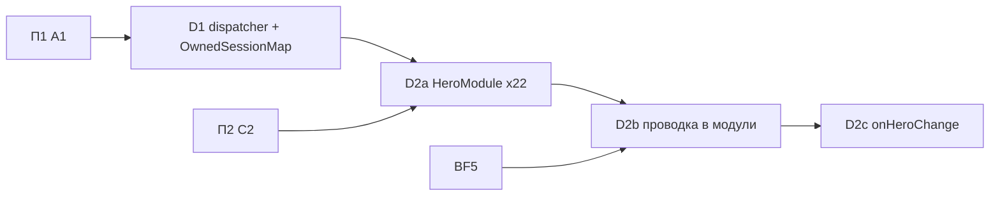

# План 3 — серверные модули героев, тики и lifecycle: Implementation Plan

> **For agentic workers:** REQUIRED SUB-SKILL: Use superpowers:subagent-driven-development (recommended) or superpowers:executing-plans to implement this plan task-by-task. Steps use checkbox (`- [ ]`) syntax for tracking.

**Goal:** Серверная проводка каждого героя принадлежит его `HeroModule`. Один tick-dispatcher, самоочищающееся session state, событие смены героя. `SuperheroesMod` и `HeroTransformService` не знают ни одного героя.

**Architecture:** `HeroTickDispatcher` с фазами заменяет 53 собственные тик-регистрации и цикл в bootstrap. `OwnedSessionMap` и `LifecycleRegistrar` поверх существующего `PlayerLifecycle` заменяют ручные `clear`/`resetAll`. 22 модуля регистрируют способности, тики, lifecycle-хуки и правила через узкие registrar'ы; явный список `HeroModules` — единственное место, где названы герои. Файлы героев физически не переезжают — это П5 и П6.

**Tech Stack:** Java 21, Minecraft 1.21.1 (Mojang mappings), Fabric Loader 0.19.2, Fabric API 0.116.12+1.21.1, Fabric Loom 1.16-SNAPSHOT, JUnit 5.10.2, Fabric GameTest API, ArchUnit 1.5.1 (из П1).

## Global Constraints

- Mod id: `superheroes` — не меняется никогда.
- Персистентные идентификаторы не меняются: id способностей (`superheroes:<ability>`), предметов, сущностей, звуков (`sounds.json`), MobEffect, типов урона, attachments (`hero_data`, `reinhard_state`, `doomsday_progress`, `regulus_madness`, `regulus_bonus_life`, `admin_build`, `suit_variant`, `nano_form`, `control_lock_shadow`, `pandora_revived` и др.), data component `superheroes:bound_weapon`, **ResourceLocation-ы attribute-модификаторов** (`modifiers/<hero>/<stat>` — permanent-пассивки лежат в NBT игроков), имена `KeyMapping` (`key.superheroes.*` — лежат в `options.txt`), lang-ключи.
- Id сетевых payload'ов не персистентны: их можно менять только при семантически оправданном слиянии (стадия L2).
- Геймплей и баланс не меняются в архитектурных PR. Любое изменение поведения — отдельный коммит с пометкой `behavior:` в сообщении и отдельным пунктом в описании PR.
- Server-authoritative: всё клиентское — в `src/client`; `src/main` загружается выделенным сервером.
- Только публичные API: `net.fabricmc.fabric.api.*`, никакого `net.fabricmc.fabric.impl.*`.
- Сеть — типизированные `CustomPacketPayload` + `StreamCodec`.
- `HeroDataStore` — единственный писатель `HERO_DATA` (`ProjectSanityTest.assertHeroDataHasSingleWriter`).
- Lifecycle-очистка — только через `PlayerLifecycle` (серверный поток), никогда через `ServerPlayConnectionEvents.DISCONNECT`.
- Mixins: узкие, `@Unique` для внедрённых членов, `@WrapOperation` предпочтительнее `@Redirect`.
- Звуки только OGG Vorbis; перед новыми ассетами проверять `art-source/`.
- `en_us.json` и `ru_ru.json` меняются вместе.
- `src/main/generated/` — только через `./gradlew runDatagen --no-daemon`; diff обязан быть пустым, если стадия не меняет данные намеренно.
- Финишный гейт каждого PR: `./gradlew qualityGate --no-daemon` зелёный.
- Runtime-изменения (ввод, рендер, HUD, сеть, VFX, сущности) — `./gradlew runClient --no-daemon`; если окружение не может запустить клиент, PR прямо это говорит.
- Никаких Gradle-модулей на героя, никакого big-bang rewrite, никакой перестановки файлов без смены владения.
- PR: заголовок на русском, тело начинается с «Для игрока», ниже — полная техническая часть; коммиты `feat(scope):`/`fix(scope):`/`refactor(scope):`/`test(scope):`/`docs(scope):` на английском.
- `SESSION.md` обновляется в каждом PR этого плана; статус стадии отмечается в таблице «Статус стадий» этого файла.

---

## Как исполнять этот план

- Карта всей миграции, исходное состояние, целевая архитектура и сквозные политики — в [`00-overview.md`](00-overview.md). Другие планы для этой работы читать не нужно.
- Одна стадия = один PR (D2b — два PR-units). D1 и D2a расписаны по шагам TDD с кодом. D2b, D2c заданы паспортами, и их первый шаг — **«Сверка»**: перечитать перечисленные файлы на актуальном `main` и обновить список касаний в описании PR.
- Если на актуальном коде проблема уже решена иначе — используем существующее решение и фиксируем это в PR и в разделе «Решения» этого плана. Откатывать рабочее решение ради буквального соответствия плану нельзя.
- Пути: `M/` = `src/main/java/com/example/superheroes/`, `C/` = `src/client/java/com/example/superheroes/client/`, `T/` = `src/test/java/com/example/superheroes/`, `G/` = `src/gametest/java/com/example/superheroes/gametest/`.
- Шаблон паспорта: **Цель · Почему · Зависит от · Затрагивает · Создаётся · Мигрируется · Удаляется · Старые пути, которых больше нет · Нельзя менять · Тесты · Runtime · Acceptance · Риски · Страховка.** Global Constraints в паспортах не повторяются.

Каждая стадия заканчивается одинаково (шаги не повторяются в каждой задаче):

- [ ] `./gradlew qualityGate --no-daemon` → `BUILD SUCCESSFUL`.
- [ ] Если стадия трогала datagen-источники: `./gradlew runDatagen --no-daemon` и `git diff --stat src/main/generated` → пусто (или только намеренные изменения, перечисленные в PR).
- [ ] Обновить «Статус стадий» этого плана, `SESSION.md` и при необходимости раздел «Решения».
- [ ] PR по правилам AGENTS.md §12; в технической части — baseline-метрики (`00-overview.md` §3.3) «до/после» для затронутых строк.

### Статус стадий

| Стадия | Статус | PR |
| :-- | :-- | :-- |
| D1 tick-dispatcher и `OwnedSessionMap` | ⏳ | |
| D2a `HeroModule` ×22 | ⏳ | |
| D2b-1 тики и `init()` в модули | ⏳ | |
| D2b-2 lifecycle, правила, damage-слушатели в модули | ⏳ | |
| D2c `onHeroChange` | ⏳ | |

## Контекст

- Seams bugfix-pass, на которые опирается план: `PlayerLifecycle` (`onJoin/onLeave/onDeath/onRespawn/onServerStopped`, серверный поток), `SuperheroesMod.registerPlayerLifecycle`, фаза `hero_data_flush` у `HeroDataStore`, `EntityControlLock`, `HeroTransformService.clearHeroRuntimeState`, пропуск мёртвых игроков в bootstrap-тике (B17).
- Внешние зависимости: П1 A1 — до D1; П2 C2 (правила `AbilityRules` в `SuperheroesMod`) — до D2a; BF5 (damage pipeline) — до D2b; `G/TestHeroes` из П1 A2. Если П1 N1 ещё не влита, строка `MeteorSlamAbility` в D1.3 остаётся на месте.
- Межплановые принципы, которые реализует план: R2 (`Hero` — данные и правила, `HeroModule` — только проводка) и R10 (размещение runtime state) — `00-overview.md` §4 и §6.3.
- Этот план не делает: физический перенос файлов героев (П5, П6); клиентские модули (П4); переименование корня (П5 E1).

### Решения

| # | Вопрос / расхождение | Что говорит код сейчас | Решение |
| :-- | :-- | :-- | :-- |
| R1 | Opus: `HeroLifecycleEvents`; модульный аудит: хуки в `HeroModule` | BF3 уже создал `PlayerLifecycle` — здоровый хаб на серверных событиях | Второй системы не создаём. `PlayerLifecycle` остаётся хабом; добавляется одно событие `onHeroChange`; модули регистрируются через `LifecycleRegistrar`, который делегирует в `PlayerLifecycle`. |
| R5 | Opus: `HeroTickDispatcher`; модульный: тики через `registerHooks` | 53 собственных `END_SERVER_TICK` + цикл в bootstrap | Один `core.tick.HeroTickDispatcher` с фазами `EARLY/NORMAL/LATE` и тремя видами хуков (`server`, `players`, `hero(id)`), регистрируется через `TickRegistrar` модуля. Мёртвые игроки пропускаются централизованно (правило B17). Фаза `hero_data_flush` у `HeroDataStore` остаётся как есть. |

## Зависимости стадий



Стадии идут последовательно. D1 можно вести параллельно с П2.

## File Structure

| Файл | Ответственность | Стадия |
| :-- | :-- | :-- |
| `M/core/tick/{TickPhase,TickRegistrar,HeroTickDispatcher}.java` | единый tick | D1 |
| `M/core/lifecycle/{LifecycleRegistrar,OwnedSessionMap}.java` | регистрация lifecycle из модулей, session state | D1 |
| `M/core/module/{HeroModule,HeroModuleContext,HeroModules}.java`, `M/core/ability/AbilitySink.java` | модульный seam | D2a |
| `M/hero/<id>/<Id>Module.java` ×22 | проводка героя | D2a |

D2b добавляет `M/core/module/SharedMechanics.java` (общие механики и content до их переноса) и превращает `init()` контроллеров в `register(HeroModuleContext)`. D2c расширяет `PlayerLifecycle`, `LifecycleRegistrar`, `OwnedSessionMap.ClearOn` и `Hero`.

## Стадии

### Стадия D1 — единый tick-dispatcher и `OwnedSessionMap`

- **Цель:** один серверный тик с явными фазами вместо 53 независимых регистраций и ручного per-player цикла; session state, который сам очищается.
- **Почему:** Opus-долг 3 и 1 (порядок строк `init()` = семантика; 29 `resetAll()` и ~50 `clear` вручную); структурный S16 (bootstrap знает конкретные способности).
- **Зависит от:** A1.
- **Затрагивает:** `M/SuperheroesMod.java` (цикл `END_SERVER_TICK` и регистрации `CapShieldSlamAbility`), `M/ability/CapShieldSlamAbility.java` (демонстрационный потребитель `OwnedSessionMap`), `src/test/**`, `src/gametest/**`.
- **Создаётся:** `M/core/tick/{TickPhase,TickRegistrar,HeroTickDispatcher}.java`, `M/core/lifecycle/{LifecycleRegistrar,PlayerLifecycleRegistrar,OwnedSessionMap}.java`, `T/core/lifecycle/OwnedSessionMapTest.java`, `G/TickDispatcherGameTests.java`.
- **Мигрируется:** лямбда `END_SERVER_TICK` из `SuperheroesMod` → регистрации в dispatcher (фаза `NORMAL`, тот же порядок); условные `NARUTO_SAGE_MODE`/`GOKU_SUPER_SAIYAN_AURA` → `players(NORMAL, …)` с той же проверкой активности; `CapShieldSlamAbility` → `OwnedSessionMap` (удаляются его строки `onLeave/onDeath/resetAll` в bootstrap).
- **Удаляется:** собственный `END_SERVER_TICK.register` в `SuperheroesMod`; проверка `isDeadOrDying` в bootstrap (переезжает в dispatcher).
- **Нельзя менять:** порядок вызовов внутри тика; то, что контроллеры с собственными листенерами (зарегистрированными раньше в `init()`) выполняются до bootstrap-цикла — dispatcher регистрирует свой листенер **в той же точке** `onInitialize`, где был старый (после `SuperheroesCommands.init()`).
- **Тесты:** JUnit `OwnedSessionMapTest`; GameTest порядка фаз, пропуска мёртвых, фильтра по герою и изоляции исключений.
- **Runtime:** не нужен (серверная логика), но в PR — прогон `runGametest` с Kamehameha/Rasengan charge-тестом, если такие есть; иначе GameTest «Rasengan charge tick advances» через `players`-хук.
- **Acceptance:** ArchUnit `onlyTheDispatcherRegistersServerTicks`: запись `SuperheroesMod` ушла из store; в `SuperheroesMod` нет цикла по игрокам.
- **Риски:** изоляция исключений меняет режим отказа (раньше исключение в тик-хуке роняло тик сервера, теперь логируется). Это осознанное изменение: `PlayerLifecycle` уже так работает; в dev/GameTest исключения по-прежнему видны в логе и GameTest-проверках. Отмечается в PR как `behavior:`.
- **Страховка:** revert одного PR.

#### Task D1.1: `OwnedSessionMap` (чистая логика + привязка к lifecycle)

**Files:**
- Create: `M/core/lifecycle/LifecycleRegistrar.java`, `M/core/lifecycle/PlayerLifecycleRegistrar.java`, `M/core/lifecycle/OwnedSessionMap.java`
- Test: `src/test/java/com/example/superheroes/core/lifecycle/OwnedSessionMapTest.java`

**Interfaces:**
- Produces:
  - `interface LifecycleRegistrar { void onJoin(Consumer<ServerPlayer>); void onLeave(Consumer<ServerPlayer>); void onDeath(Consumer<ServerPlayer>); void onRespawn(Consumer<ServerPlayer>); void onServerStopped(Consumer<MinecraftServer>); static LifecycleRegistrar global(); }` (`onHeroChange`, `onHeroApplied` добавляются в D2c).
  - `final class OwnedSessionMap<K, V>`: `static <K, V> OwnedSessionMap<K, V> create(LifecycleRegistrar lifecycle, Set<OwnedSessionMap.ClearOn> clearOn)`, `void put(K key, UUID owner, V value)`, `@Nullable V get(K key)`, `@Nullable V remove(K key)`, `boolean containsKey(K key)`, `int size()`, `Iterator<Map.Entry<K, V>> iterator()` (поддерживает `remove`), `void removeOwnedBy(UUID owner)`, `void clear()`; `enum ClearOn { LEAVE, DEATH }` (`HERO_CHANGE` добавляется в D2c).

- [ ] **Step 1: Падающий тест**

```java
package com.example.superheroes.core.lifecycle;

import org.junit.jupiter.api.Test;

import java.util.Iterator;
import java.util.Map;
import java.util.UUID;

import static org.junit.jupiter.api.Assertions.assertEquals;
import static org.junit.jupiter.api.Assertions.assertFalse;
import static org.junit.jupiter.api.Assertions.assertNull;
import static org.junit.jupiter.api.Assertions.assertTrue;

class OwnedSessionMapTest {
	private final UUID alice = UUID.randomUUID();
	private final UUID bob = UUID.randomUUID();

	@Test
	void removingAnOwnerDropsEveryEntryItOwns() {
		OwnedSessionMap<String, Integer> map = OwnedSessionMap.unbound();
		map.put("pull-1", alice, 1);
		map.put("pull-2", alice, 2);
		map.put("pull-3", bob, 3);

		map.removeOwnedBy(alice);

		assertNull(map.get("pull-1"));
		assertNull(map.get("pull-2"));
		assertEquals(3, map.get("pull-3"));
	}

	@Test
	void reputtingAKeyMovesItToTheNewOwner() {
		OwnedSessionMap<String, Integer> map = OwnedSessionMap.unbound();
		map.put("target", alice, 1);
		map.put("target", bob, 2);

		map.removeOwnedBy(alice);

		assertEquals(2, map.get("target"));
	}

	@Test
	void iteratorRemovalKeepsTheOwnerIndexConsistent() {
		OwnedSessionMap<String, Integer> map = OwnedSessionMap.unbound();
		map.put("a", alice, 1);
		for (Iterator<Map.Entry<String, Integer>> it = map.iterator(); it.hasNext(); ) {
			it.next();
			it.remove();
		}
		map.put("a", bob, 2);
		map.removeOwnedBy(alice);
		assertTrue(map.containsKey("a"));
		map.clear();
		assertFalse(map.containsKey("a"));
		assertEquals(0, map.size());
	}
}
```

Run: `./gradlew test --no-daemon --tests '*OwnedSessionMapTest*'` → FAIL (класса нет).

- [ ] **Step 2: Реализация**

```java
package com.example.superheroes.core.lifecycle;

import net.minecraft.server.MinecraftServer;
import net.minecraft.server.level.ServerPlayer;

import java.util.function.Consumer;

/** Where modules subscribe to player/server lifecycle; backed by {@link com.example.superheroes.lifecycle.PlayerLifecycle}. */
public interface LifecycleRegistrar {
	void onJoin(Consumer<ServerPlayer> hook);

	void onLeave(Consumer<ServerPlayer> hook);

	void onDeath(Consumer<ServerPlayer> hook);

	void onRespawn(Consumer<ServerPlayer> hook);

	void onServerStopped(Consumer<MinecraftServer> hook);

	static LifecycleRegistrar global() {
		return PlayerLifecycleRegistrar.INSTANCE;
	}
}
```

```java
package com.example.superheroes.core.lifecycle;

import com.example.superheroes.lifecycle.PlayerLifecycle;
import net.minecraft.server.MinecraftServer;
import net.minecraft.server.level.ServerPlayer;

import java.util.function.Consumer;

enum PlayerLifecycleRegistrar implements LifecycleRegistrar {
	INSTANCE;

	@Override public void onJoin(Consumer<ServerPlayer> hook) { PlayerLifecycle.onJoin(hook); }
	@Override public void onLeave(Consumer<ServerPlayer> hook) { PlayerLifecycle.onLeave(hook); }
	@Override public void onDeath(Consumer<ServerPlayer> hook) { PlayerLifecycle.onDeath(hook); }
	@Override public void onRespawn(Consumer<ServerPlayer> hook) { PlayerLifecycle.onRespawn(hook); }
	@Override public void onServerStopped(Consumer<MinecraftServer> hook) { PlayerLifecycle.onServerStopped(hook); }
}
```

```java
package com.example.superheroes.core.lifecycle;

import org.jetbrains.annotations.Nullable;

import java.util.EnumSet;
import java.util.HashMap;
import java.util.HashSet;
import java.util.Iterator;
import java.util.LinkedHashMap;
import java.util.Map;
import java.util.Set;
import java.util.UUID;

/**
 * Runtime state that belongs to an online player (the owner) and must never outlive them: entries are
 * dropped when the owner leaves/dies (per {@link ClearOn}) and all entries on server stop. Replaces the
 * hand-maintained static maps plus clear/resetAll registrations. Iteration order is insertion order.
 */
public final class OwnedSessionMap<K, V> implements Iterable<Map.Entry<K, V>> {
	public enum ClearOn { LEAVE, DEATH }

	private record Slot<V>(UUID owner, V value) {
	}

	private final Map<K, Slot<V>> entries = new LinkedHashMap<>();
	private final Map<UUID, Set<K>> byOwner = new HashMap<>();

	private OwnedSessionMap() {
	}

	public static <K, V> OwnedSessionMap<K, V> create(LifecycleRegistrar lifecycle, Set<ClearOn> clearOn) {
		OwnedSessionMap<K, V> map = new OwnedSessionMap<>();
		EnumSet<ClearOn> policy = clearOn.isEmpty() ? EnumSet.noneOf(ClearOn.class) : EnumSet.copyOf(clearOn);
		if (policy.contains(ClearOn.LEAVE)) {
			lifecycle.onLeave(player -> map.removeOwnedBy(player.getUUID()));
		}
		if (policy.contains(ClearOn.DEATH)) {
			lifecycle.onDeath(player -> map.removeOwnedBy(player.getUUID()));
		}
		lifecycle.onServerStopped(server -> map.clear());
		return map;
	}

	/** Not bound to any lifecycle — for unit tests only. */
	static <K, V> OwnedSessionMap<K, V> unbound() {
		return new OwnedSessionMap<>();
	}

	public void put(K key, UUID owner, V value) {
		remove(key);
		entries.put(key, new Slot<>(owner, value));
		byOwner.computeIfAbsent(owner, o -> new HashSet<>()).add(key);
	}

	@Nullable
	public V get(K key) {
		Slot<V> slot = entries.get(key);
		return slot == null ? null : slot.value();
	}

	@Nullable
	public V remove(K key) {
		Slot<V> slot = entries.remove(key);
		if (slot == null) {
			return null;
		}
		unindex(slot.owner(), key);
		return slot.value();
	}

	public boolean containsKey(K key) {
		return entries.containsKey(key);
	}

	public int size() {
		return entries.size();
	}

	public void removeOwnedBy(UUID owner) {
		Set<K> keys = byOwner.remove(owner);
		if (keys != null) {
			keys.forEach(entries::remove);
		}
	}

	public void clear() {
		entries.clear();
		byOwner.clear();
	}

	@Override
	public Iterator<Map.Entry<K, V>> iterator() {
		Iterator<Map.Entry<K, Slot<V>>> raw = entries.entrySet().iterator();
		return new Iterator<>() {
			private Map.Entry<K, Slot<V>> current;

			@Override
			public boolean hasNext() {
				return raw.hasNext();
			}

			@Override
			public Map.Entry<K, V> next() {
				current = raw.next();
				return Map.entry(current.getKey(), current.getValue().value());
			}

			@Override
			public void remove() {
				raw.remove();
				unindex(current.getValue().owner(), current.getKey());
			}
		};
	}

	private void unindex(UUID owner, K key) {
		Set<K> keys = byOwner.get(owner);
		if (keys != null) {
			keys.remove(key);
			if (keys.isEmpty()) {
				byOwner.remove(owner);
			}
		}
	}
}
```

`Map.entry` не допускает `null`-значений: `put` с `value == null` запрещён (`Objects.requireNonNull(value)` в начале `put`).

- [ ] **Step 3:** Run тест → PASS. Commit: `feat(lifecycle): add OwnedSessionMap for self-clearing per-owner runtime state`.

#### Task D1.2: `HeroTickDispatcher`

**Files:**
- Create: `M/core/tick/TickPhase.java`, `M/core/tick/TickRegistrar.java`, `M/core/tick/HeroTickDispatcher.java`
- Test: `G/TickDispatcherGameTests.java`

**Interfaces:**
- Produces: `enum TickPhase { EARLY, NORMAL, LATE }`; `interface TickRegistrar { void server(TickPhase, Consumer<MinecraftServer>); void players(TickPhase, Consumer<ServerPlayer>); void hero(ResourceLocation heroId, TickPhase, Consumer<ServerPlayer>); }`; `final class HeroTickDispatcher implements TickRegistrar` с `public static final HeroTickDispatcher INSTANCE`, `public HeroTickDispatcher()`, `public static void init()`, `public void tick(MinecraftServer server)`.
- Порядок внутри тика: для каждой фазы по порядку — все `server`-хуки (порядок регистрации), затем для каждого **живого** игрока в порядке `PlayerList` — его `players`-хуки, затем `hero`-хуки, чей `heroId` равен текущему герою игрока.

- [ ] **Step 1: Падающий GameTest**

```java
package com.example.superheroes.gametest;

import com.example.superheroes.core.tick.HeroTickDispatcher;
import com.example.superheroes.core.tick.TickPhase;
import com.example.superheroes.hero.ScaramoucheHero;
import net.fabricmc.fabric.api.gametest.v1.FabricGameTest;
import net.minecraft.gametest.framework.GameTest;
import net.minecraft.gametest.framework.GameTestHelper;
import net.minecraft.server.level.ServerPlayer;

import java.util.ArrayList;
import java.util.List;

public final class TickDispatcherGameTests implements FabricGameTest {
	@GameTest(template = EMPTY_STRUCTURE)
	public void phasesRunInOrderAndHeroHooksOnlyForThatHero(GameTestHelper helper) {
		ServerPlayer scaramouche = TestPlayers.join(helper);
		ServerPlayer nobody = TestPlayers.join(helper);
		TestHeroes.transform(scaramouche, ScaramoucheHero.ID);
		List<String> log = new ArrayList<>();
		HeroTickDispatcher dispatcher = new HeroTickDispatcher();
		dispatcher.server(TickPhase.LATE, s -> log.add("late-server"));
		dispatcher.players(TickPhase.NORMAL, p -> log.add("player:" + (p == scaramouche ? "s" : "n")));
		dispatcher.hero(ScaramoucheHero.ID, TickPhase.NORMAL, p -> log.add("hero:" + (p == scaramouche ? "s" : "n")));
		dispatcher.server(TickPhase.EARLY, s -> log.add("early-server"));

		dispatcher.tick(helper.getLevel().getServer());

		helper.assertTrue(log.get(0).equals("early-server"), "EARLY first: " + log);
		helper.assertTrue(log.contains("hero:s") && !log.contains("hero:n"), "hero hook filtered: " + log);
		helper.assertTrue(log.indexOf("player:s") < log.indexOf("hero:s"), "players before hero hooks: " + log);
		helper.assertTrue(log.get(log.size() - 1).equals("late-server"), "LATE last: " + log);
		helper.succeed();
	}

	@GameTest(template = EMPTY_STRUCTURE)
	public void deadPlayersAreSkippedAndFailingHooksDoNotStopOthers(GameTestHelper helper) {
		ServerPlayer dead = TestPlayers.join(helper);
		dead.setHealth(0f);
		List<ServerPlayer> seen = new ArrayList<>();
		HeroTickDispatcher dispatcher = new HeroTickDispatcher();
		dispatcher.server(TickPhase.NORMAL, s -> { throw new IllegalStateException("boom"); });
		dispatcher.players(TickPhase.NORMAL, seen::add);

		dispatcher.tick(helper.getLevel().getServer());

		helper.assertFalse(seen.contains(dead), "dead players get no ability ticks (B17)");
		helper.succeed();
	}
}
```

`TestHeroes.transform(player, heroId)` — помощник из П1 A2.3.

Run: `./gradlew runGametest --no-daemon` → FAIL (компиляция).

- [ ] **Step 2: Реализация**

```java
package com.example.superheroes.core.tick;

/** Order inside one server tick. EARLY holds hooks that previously ran as their own listeners before the bootstrap loop. */
public enum TickPhase {
	EARLY,
	NORMAL,
	LATE
}
```

```java
package com.example.superheroes.core.tick;

import net.minecraft.resources.ResourceLocation;
import net.minecraft.server.MinecraftServer;
import net.minecraft.server.level.ServerPlayer;

import java.util.function.Consumer;

public interface TickRegistrar {
	/** Once per server tick. */
	void server(TickPhase phase, Consumer<MinecraftServer> hook);

	/** Once per living player per tick. */
	void players(TickPhase phase, Consumer<ServerPlayer> hook);

	/** Once per living player whose current hero is {@code heroId}. */
	void hero(ResourceLocation heroId, TickPhase phase, Consumer<ServerPlayer> hook);
}
```

```java
package com.example.superheroes.core.tick;

import com.example.superheroes.SuperheroesMod;
import com.example.superheroes.transform.HeroData;
import com.example.superheroes.transform.HeroDataStore;
import net.fabricmc.fabric.api.event.lifecycle.v1.ServerTickEvents;
import net.minecraft.resources.ResourceLocation;
import net.minecraft.server.MinecraftServer;
import net.minecraft.server.level.ServerPlayer;

import java.util.ArrayList;
import java.util.Collections;
import java.util.EnumMap;
import java.util.IdentityHashMap;
import java.util.List;
import java.util.Map;
import java.util.Set;
import java.util.function.Consumer;

/**
 * The mod's only END_SERVER_TICK listener for gameplay. Dead players get no ability ticks (audit B17).
 * A failing hook is logged once and skipped, so one hero cannot stop every other hero's tick.
 */
public final class HeroTickDispatcher implements TickRegistrar {
	public static final HeroTickDispatcher INSTANCE = new HeroTickDispatcher();

	private record HeroHook(ResourceLocation heroId, Consumer<ServerPlayer> hook) {
	}

	private final Map<TickPhase, List<Consumer<MinecraftServer>>> server = new EnumMap<>(TickPhase.class);
	private final Map<TickPhase, List<Consumer<ServerPlayer>>> players = new EnumMap<>(TickPhase.class);
	private final Map<TickPhase, List<HeroHook>> heroes = new EnumMap<>(TickPhase.class);
	private final Set<Object> reported = Collections.newSetFromMap(new IdentityHashMap<>());

	public HeroTickDispatcher() {
		for (TickPhase phase : TickPhase.values()) {
			server.put(phase, new ArrayList<>());
			players.put(phase, new ArrayList<>());
			heroes.put(phase, new ArrayList<>());
		}
	}

	public static void init() {
		ServerTickEvents.END_SERVER_TICK.register(INSTANCE::tick);
	}

	@Override
	public void server(TickPhase phase, Consumer<MinecraftServer> hook) {
		server.get(phase).add(hook);
	}

	@Override
	public void players(TickPhase phase, Consumer<ServerPlayer> hook) {
		players.get(phase).add(hook);
	}

	@Override
	public void hero(ResourceLocation heroId, TickPhase phase, Consumer<ServerPlayer> hook) {
		heroes.get(phase).add(new HeroHook(heroId, hook));
	}

	public void tick(MinecraftServer minecraftServer) {
		for (TickPhase phase : TickPhase.values()) {
			for (Consumer<MinecraftServer> hook : server.get(phase)) {
				run(hook, minecraftServer);
			}
			List<Consumer<ServerPlayer>> playerHooks = players.get(phase);
			List<HeroHook> heroHooks = heroes.get(phase);
			if (playerHooks.isEmpty() && heroHooks.isEmpty()) {
				continue;
			}
			for (ServerPlayer player : List.copyOf(minecraftServer.getPlayerList().getPlayers())) {
				// Checked per player like the legacy loop: a player killed by an earlier player's hook is skipped.
				if (player.isDeadOrDying()) {
					continue;
				}
				for (Consumer<ServerPlayer> hook : playerHooks) {
					run(hook, player);
				}
				if (heroHooks.isEmpty()) {
					continue;
				}
				HeroData data = HeroDataStore.get(player);
				if (!data.hasHero()) {
					continue;
				}
				for (HeroHook heroHook : heroHooks) {
					if (heroHook.heroId().equals(data.heroId())) {
						run(heroHook.hook(), player);
					}
				}
			}
		}
	}

	private <T> void run(Consumer<T> hook, T argument) {
		try {
			hook.accept(argument);
		} catch (Throwable t) {
			if (reported.add(hook)) {
				SuperheroesMod.LOGGER.error("Tick hook {} failed; further failures of this hook are not logged", hook, t);
			}
		}
	}
}
```

Проверка `isDeadOrDying()` стоит в начале итерации каждого игрока — ровно как в текущем bootstrap-цикле. Копия списка защищает от изменения `PlayerList` хуком (текущий цикл итерирует живой список; поведение совпадает, пока хук не кикает игрока).

- [ ] **Step 3:** Run `./gradlew runGametest --no-daemon` → PASS. Commit: `feat(tick): add HeroTickDispatcher with phases and hero-scoped hooks`.

#### Task D1.3: bootstrap-цикл → dispatcher; первый потребитель `OwnedSessionMap`

**Files:**
- Modify: `M/SuperheroesMod.java`, `M/ability/CapShieldSlamAbility.java`

- [ ] **Step 1:** Заменить регистрацию `END_SERVER_TICK` в `SuperheroesMod` (в той же точке `onInitialize`):

```java
		HeroTickDispatcher ticks = HeroTickDispatcher.INSTANCE;
		ticks.server(TickPhase.NORMAL, server -> com.example.superheroes.effect.DoomGripController.serverTick());
		ticks.server(TickPhase.NORMAL, com.example.superheroes.effect.PandoraDeathController::serverTick);
		ticks.server(TickPhase.NORMAL, server -> {
			for (net.minecraft.server.level.ServerLevel level : server.getAllLevels()) {
				com.example.superheroes.horde.HordeManager.tick(level);
			}
		});
		ticks.players(TickPhase.NORMAL, com.example.superheroes.ability.ChargeTackleAbility::serverTick);
		ticks.players(TickPhase.NORMAL, com.example.superheroes.ability.ViltrumiteChargeAbility::serverTick);
		ticks.players(TickPhase.NORMAL, com.example.superheroes.ability.OmnimanViltrumiteRushAbility::serverTick);
		ticks.players(TickPhase.NORMAL, com.example.superheroes.ability.OmnimanThinkMarkAbility::serverTick);
		ticks.players(TickPhase.NORMAL, com.example.superheroes.ability.ironman.IronManNanoFormController::serverTick);
		ticks.players(TickPhase.NORMAL, com.example.superheroes.ability.GokuKamehamehaAbility::serverTick);
		ticks.players(TickPhase.NORMAL, com.example.superheroes.ability.GokuSpiritBombAbility::serverTick);
		ticks.players(TickPhase.NORMAL, com.example.superheroes.ability.NarutoRasenganAbility::serverTick);
		ticks.players(TickPhase.NORMAL, com.example.superheroes.ability.NarutoOodamaRasenganAbility::serverTick);
		ticks.players(TickPhase.NORMAL, com.example.superheroes.ability.NarutoRasenshurikenAbility::serverTick);
		ticks.players(TickPhase.NORMAL, com.example.superheroes.ability.CapShieldSlamAbility::serverTick);
		ticks.players(TickPhase.NORMAL, com.example.superheroes.ability.RepulsorChargeController::serverTick);
		ticks.players(TickPhase.NORMAL, p -> {
			if (HeroDataStore.get(p).isActive(com.example.superheroes.ability.AbilityIds.NARUTO_SAGE_MODE)) {
				com.example.superheroes.ability.NarutoSageModeAbility.serverTick(p);
			}
		});
		ticks.players(TickPhase.NORMAL, p -> {
			if (HeroDataStore.get(p).isActive(com.example.superheroes.ability.AbilityIds.GOKU_SUPER_SAIYAN_AURA)) {
				com.example.superheroes.ability.GokuSuperSaiyanAuraAbility.serverTick(p);
			}
		});
		HeroTickDispatcher.init();
```

  (`MeteorSlamAbility` к этому моменту удалён стадией N1; если N1 ещё не влита — оставить её строку на своём месте.) Сверка до правки: сравнить список с текущим циклом построчно — порядок один в один.

- [ ] **Step 2: `CapShieldSlamAbility`** — сверка: прочитать её статические карты, `serverTick`, `clear`, `resetAll`. Если состояние — одна `Map<UUID, X>` по игроку: заменить на `private static final OwnedSessionMap<UUID, X> STATE = OwnedSessionMap.create(LifecycleRegistrar.global(), EnumSet.of(ClearOn.LEAVE, ClearOn.DEATH));`, удалить `clear`/`resetAll` и их три регистрации в `SuperheroesMod`. Если структура сложнее — выбрать другой потребитель из `registerPlayerLifecycle` с одной картой и теми же тремя хуками (например, `NarutoRasenganAbility`) и записать выбор в PR.

- [ ] **Step 3:** `./gradlew qualityGate --no-daemon` → FAIL только на baseline; закоммитить store → PASS. Commit: `refactor(tick): route the bootstrap tick loop through HeroTickDispatcher`.

---

### Стадия D2a — `HeroModule`: у каждого героя появляется точка владения

- **Цель:** 22 модуля `hero/<id>/<Id>Module` регистрируют своего героя и его способности; `Heroes.init()` и список `AbilityRegistry.init()` исчезают.
- **Почему:** модульный аудит §5, структурный M7; R2. Это первая смена владения проводкой, после которой физические переносы (F, G, I) становятся локальными.
- **Зависит от:** D1, C2.
- **Затрагивает:** `M/hero/Heroes.java`, `M/ability/AbilityRegistry.java`, `M/SuperheroesMod.java`, `T/ProjectSanityTest.java` (удалить `assertEveryHeroRegistered`), `T/architecture/ArchitectureRulesTest.java`, `G/HeroCompletenessGameTests.java`.
- **Создаётся:** `M/core/module/{HeroModule,HeroModuleContext,CoreModuleContext,HeroModules,SharedAbilities}.java`, `M/core/ability/AbilitySink.java`, `M/hero/<id>/<Id>Module.java` ×22.
- **Мигрируется:** регистрация героев и способностей.
- **Удаляется:** `Heroes.init()`, тело-список `AbilityRegistry.init()` (метод удаляется), `assertEveryHeroRegistered`.
- **Остаётся временно:** статические поля `Heroes.<HERO>` и `AbilityRegistry.<ABILITY>` (на них ссылаются другие классы); они переезжают в модули в физических миграциях героев.
- **Нельзя менять:** порядок героев в реестре (`Heroes.all()` — порядок `HeroModules.ALL` = текущий порядок `Heroes.init()`), состав способностей героя, порядок `getAbilities()` (порядок слотов).
- **Тесты:** GameTest `modulesCoverEveryHero` (порядок и состав), расширение `HeroCompletenessGameTests`: модуль регистрирует ровно способности своего героя (кроме `SharedAbilities`); ArchUnit: каждый `HeroModule` упомянут в `HeroModules`.
- **Acceptance:** `SuperheroesMod` не вызывает `Heroes.init()`/`AbilityRegistry.init()`; ArchUnit store: исчезла запись `Heroes.init → *Hero`.
- **Риски:** `AbilityRegistry.all()` меняет порядок итерации (было — порядок `init()`, станет — shared, затем по героям). Сверка: `grep -rn 'AbilityRegistry.all()' src/` — если порядок где-то виден игроку (список в команде), в PR это отмечается; значения не меняются.

#### Task D2a.1: API модулей

**Files:**
- Create: `M/core/ability/AbilitySink.java`, `M/core/module/HeroModule.java`, `M/core/module/HeroModuleContext.java`, `M/core/module/CoreModuleContext.java`

**Interfaces:**
- Consumes: `TickRegistrar`, `LifecycleRegistrar` (D1).
- Produces:
  - `@FunctionalInterface interface AbilitySink { void register(Ability ability); }`
  - `interface HeroModule { Hero hero(); void register(HeroModuleContext ctx); }`
  - `interface HeroModuleContext { AbilitySink abilities(); TickRegistrar ticks(); LifecycleRegistrar lifecycle(); }` — расширяется только новыми узкими registrar'ами (`content()`, `payloads()` в F; `attachments()` в G1), никаких «универсальных» методов.
  - `final class CoreModuleContext implements HeroModuleContext` с `public static final CoreModuleContext INSTANCE`.

```java
package com.example.superheroes.core.module;

import com.example.superheroes.hero.Hero;

/**
 * Bootstrap-time wiring of one hero: it registers the hero's abilities, ticks and lifecycle hooks through
 * narrow registrars. Runtime rules live on {@link Hero}; this interface never grows gameplay methods.
 */
public interface HeroModule {
	Hero hero();

	void register(HeroModuleContext ctx);
}
```

```java
package com.example.superheroes.core.module;

import com.example.superheroes.core.ability.AbilitySink;
import com.example.superheroes.core.lifecycle.LifecycleRegistrar;
import com.example.superheroes.core.tick.TickRegistrar;

public interface HeroModuleContext {
	AbilitySink abilities();

	TickRegistrar ticks();

	LifecycleRegistrar lifecycle();
}
```

```java
package com.example.superheroes.core.module;

import com.example.superheroes.ability.AbilityRegistry;
import com.example.superheroes.core.ability.AbilitySink;
import com.example.superheroes.core.lifecycle.LifecycleRegistrar;
import com.example.superheroes.core.tick.HeroTickDispatcher;
import com.example.superheroes.core.tick.TickRegistrar;

public final class CoreModuleContext implements HeroModuleContext {
	public static final CoreModuleContext INSTANCE = new CoreModuleContext();

	private CoreModuleContext() {
	}

	@Override
	public AbilitySink abilities() {
		return AbilityRegistry::register;
	}

	@Override
	public TickRegistrar ticks() {
		return HeroTickDispatcher.INSTANCE;
	}

	@Override
	public LifecycleRegistrar lifecycle() {
		return LifecycleRegistrar.global();
	}
}
```

#### Task D2a.2: модули героев и список

**Files:**
- Create: `M/hero/<id>/<Id>Module.java` ×22, `M/core/module/HeroModules.java`, `M/core/module/SharedAbilities.java`
- Modify: `M/hero/Heroes.java`, `M/ability/AbilityRegistry.java`, `M/SuperheroesMod.java`

- [ ] **Step 1: Падающий GameTest** (в `HeroCompletenessGameTests`):

```java
	@GameTest(template = EMPTY_STRUCTURE)
	public void modulesCoverEveryHeroInRegistryOrder(GameTestHelper helper) {
		List<ResourceLocation> fromModules = HeroModules.ALL.stream().map(m -> m.hero().getId()).toList();
		List<ResourceLocation> registered = List.copyOf(Heroes.all().keySet());
		helper.assertTrue(fromModules.equals(registered), "modules " + fromModules + " vs registry " + registered);
		helper.succeed();
	}
```

- [ ] **Step 2: Сверка общих способностей** — определить id, которые перечислены у двух и более героев:

Run: `grep -ho 'AbilityIds\.[A-Z_]*' src/main/java/com/example/superheroes/hero/*Hero.java | sort | uniq -c | awk '$1>1'`
Expected: как минимум `FLIGHT` (4 героя) и `VILTRUMITE_RECOVERY` (2). Каждая такая способность регистрируется в `SharedAbilities`, ни один модуль её не регистрирует.

- [ ] **Step 3: Код**

```java
package com.example.superheroes.core.module;

import com.example.superheroes.hero.Heroes;

import java.util.List;

/** The only place that names hero modules. One line per hero; order = registry order = creative/HUD order. */
public final class HeroModules {
	public static final List<HeroModule> ALL = List.of(
			new com.example.superheroes.hero.homelander.HomelanderModule(),
			new com.example.superheroes.hero.ironman.IronManModule(),
			new com.example.superheroes.hero.regulus.RegulusModule(),
			new com.example.superheroes.hero.sungjinwoo.SungJinwooModule(),
			new com.example.superheroes.hero.doomsday.DoomsdayModule(),
			new com.example.superheroes.hero.goku.GokuModule(),
			new com.example.superheroes.hero.naruto.NarutoModule(),
			new com.example.superheroes.hero.captainamerica.CaptainAmericaModule(),
			new com.example.superheroes.hero.kratos.KratosModule(),
			new com.example.superheroes.hero.loki.LokiModule(),
			new com.example.superheroes.hero.thanos.ThanosModule(),
			new com.example.superheroes.hero.reinhard.ReinhardModule(),
			new com.example.superheroes.hero.raiden.RaidenModule(),
			new com.example.superheroes.hero.invincible.InvincibleModule(),
			new com.example.superheroes.hero.omniman.OmnimanModule(),
			new com.example.superheroes.hero.kazuha.KazuhaModule(),
			new com.example.superheroes.hero.scaramouche.ScaramoucheModule(),
			new com.example.superheroes.hero.battlebeast.BattleBeastModule(),
			new com.example.superheroes.hero.rem.RemModule(),
			new com.example.superheroes.hero.atrain.ATrainModule(),
			new com.example.superheroes.hero.scorpion.ScorpionModule(),
			new com.example.superheroes.hero.pandora.PandoraModule()
	);

	private HeroModules() {
	}

	public static void bootstrap(HeroModuleContext ctx) {
		for (HeroModule module : ALL) {
			Heroes.register(module.hero());
		}
		SharedAbilities.register(ctx.abilities());
		for (HeroModule module : ALL) {
			module.register(ctx);
		}
	}
}
```

  Имена пакетов героев — id героя без `_` (`sung_jinwoo` → `sungjinwoo`, `captain_america` → `captainamerica`, `battle_beast` → `battlebeast`, `a_train` → `atrain`, `iron_man` → `ironman`, `raiden_shogun` → `raiden`). Правило фиксируется в `add-hero` skill (стадия O).

```java
package com.example.superheroes.hero.scorpion;

import com.example.superheroes.ability.AbilityRegistry;
import com.example.superheroes.core.module.HeroModule;
import com.example.superheroes.core.module.HeroModuleContext;
import com.example.superheroes.hero.Hero;
import com.example.superheroes.hero.Heroes;

public final class ScorpionModule implements HeroModule {
	@Override
	public Hero hero() {
		return Heroes.SCORPION;
	}

	@Override
	public void register(HeroModuleContext ctx) {
		ctx.abilities().register(AbilityRegistry.SCORPION_SPEAR);
		ctx.abilities().register(AbilityRegistry.SCORPION_HELLFIRE);
		ctx.abilities().register(AbilityRegistry.SCORPION_FIRE_TELEPORT);
		ctx.abilities().register(AbilityRegistry.SCORPION_HELL_BREATH);
	}
}
```

  Остальные 21 модуль — та же форма: `hero()` возвращает поле `Heroes.<HERO>`, `register` регистрирует ровно те поля `AbilityRegistry`, чьи id есть в `<Hero>.getAbilities()` и которых нет в `SharedAbilities`, **в порядке текущего `AbilityRegistry.init()`**. `SharedAbilities.register(AbilitySink sink)` регистрирует общие способности из шага 2 в порядке `init()`. Затем удалить `Heroes.init()` и `AbilityRegistry.init()`; в `SuperheroesMod` на месте `Heroes.init(); AbilityRegistry.init();` — `HeroModules.bootstrap(CoreModuleContext.INSTANCE);`.

- [ ] **Step 4: ArchUnit-правило «каждый модуль в списке»** (в `ArchitectureRulesTest`):

```java
	@Test
	void everyHeroModuleIsListed() {
		classes().that().implement(com.example.superheroes.core.module.HeroModule.class)
				.should(new ArchCondition<>("be instantiated in HeroModules.ALL") {
					@Override
					public void check(JavaClass module, ConditionEvents events) {
						boolean listed = module.getDirectDependenciesToSelf().stream()
								.anyMatch(d -> d.getOriginClass().getName().equals(ROOT + ".core.module.HeroModules"));
						if (!listed) {
							events.add(SimpleConditionEvent.violated(module, module.getName() + " is not listed in HeroModules.ALL"));
						}
					}
				})
				.check(CodexClasses.main());
	}
```

  Удалить `assertEveryHeroRegistered` из `ProjectSanityTest.main` и сам метод.

- [ ] **Step 5:** `./gradlew qualityGate --no-daemon` → baseline уменьшился → закоммитить → PASS.
- [ ] **Step 6: Commit** — `feat(module): wire every hero through a HeroModule`.

### Стадия D2b — проводка героев переезжает из `SuperheroesMod` в модули

- **Цель:** в `SuperheroesMod` не остаётся ни одного hero-контроллера, тика, lifecycle-хука или правила способности.
- **Почему:** Opus-долг 3; модульный аудит §4.1; ArchUnit-правила `onlyTheDispatcherRegistersServerTicks` и `lifecycleHooksAreRegisteredByModulesOrCore` должны опустеть.
- **Зависит от:** D2a, **BF5** (damage pipeline определяет, как регистрируются `ALLOW_DAMAGE`/`ALLOW_DEATH`/`AFTER_DAMAGE`-слушатели; переносим их уже в его API).
- **Сверка:** перечитать `SuperheroesMod` и все `init()` контроллеров на актуальном `main`; обновить таблицу ниже, если BF4–BF10 добавили/убрали контроллеры.
- **Мигрируется (рецепт для каждого контроллера):**

```java
// before
public static void init() {
	ServerTickEvents.END_SERVER_TICK.register(server -> { tickA(server); tickB(server); });
	UseItemCallback.EVENT.register(ScorpionController::onUse);
}

// after — called from the owning module's register(ctx); non-tick Fabric events stay as they are
public static void register(HeroModuleContext ctx) {
	ctx.ticks().server(TickPhase.EARLY, server -> { tickA(server); tickB(server); });
	UseItemCallback.EVENT.register(ScorpionController::onUse);
}
```

  Собственные тик-листенеры контроллеров → `server(EARLY, …)`: раньше они выполнялись до bootstrap-цикла (`NORMAL`), порядок между ними внутри одного героя сохраняется; между героями становится порядком `HeroModules.ALL`. Сверка: для каждого контроллера проверить, читает ли его тик состояние, которое в том же тике пишет контроллер **другого** героя (ожидаемо — нет; если да — перечислить в PR и сохранить относительный порядок явной фазой). Строки `registerPlayerLifecycle` → `ctx.lifecycle().onX(...)` в модуле-владельце; `resetAll()` из `onServerStopped` → `ctx.lifecycle().onServerStopped(s -> X.resetAll())` в модуле-владельце. Правила из C2 (шаг 4) → `HomelanderModule` (aftermath, madness free cost, Iron Fists), `ThanosModule` (Snap), `PandoraModule` (Vanity) — порядок модулей совпадает с текущим порядком правил. Блок `onDeath/onLeave` для per-player строк bootstrap-тика (`ChargeTackle`, `Kamehameha`, …) → модуль-владелец.
- **Классификация текущих `init()`** (по вершине стека; сверить):

| Владелец | Контроллеры / строки |
| :-- | :-- |
| core (остаётся в `SuperheroesMod`) | `ModAttachments`, `EntityControlLock`, `PlayerLifecycle`, `ModEffects`, `ModEntities`, `HordeEntities`, `ModDataComponents`, `ModItems`, `ModItemGroups`, `ModParticles`, `ModSounds`, `ModNetworking`, `HeroDataStore`, `ResourceController`, `HeroTickDispatcher`, `SuperheroesCommands` |
| общие механики → `core.module.SharedMechanics.register(ctx)` | `HeroLandingTracker`, `HeroEquipmentLock`, `SuperJumpController`, `AutoSaturationController`, `HeroPassiveRegenController`, `HeroMeleeImpactController`, `BallisticBodyTracker`, `FlightController`, `HeavensStrikeController` (механика с вариантами; владелец вариантов — Raiden) |
| content → `SharedMechanics` до стадии IC | `HordeManager` (тик), `AdminBuildSyncController` |
| Scorpion | `ScorpionController` |
| Pandora | `MirrorDimensionController`, `SpatialBindController`, `PandoraDeathController` (тик, damage/death через BF5) |
| Homelander | `MadnessFlightController`, `MadnessAftermathController`, `HomelanderRegenController`, `IronFistsController`, `UraniumDefenseController`, `UraniumOffhandController` |
| Iron Man | `UnibeamController`, `IronManReactorTracker`, `IronManAutoEjectController`, `IronManJarvisController`, `IronManNanoFormController`, `IronManSuitSyncController`, тики `IronManNanoFormController`, `RepulsorChargeController` |
| Regulus | `RegulusTotemController`, `RegulusGreedController`, `GreedCageController`, `RegulusMadnessController` |
| Invincible | `InvincibleCombatController`, тик `ViltrumiteChargeAbility` (если только у Invincible; иначе `SharedMechanics`) |
| Omni-Man | `OmnimanMomentumController`, тики `OmnimanViltrumiteRushAbility`, `OmnimanThinkMarkAbility` |
| Battle Beast | `BattleBeastCurseController` |
| Rem | `RemDemonismController`, `RamCompanionController` |
| Sung Jinwoo | `SungJinwooController`, `MonarchsDomainController` |
| Doomsday | `DoomsdayAdaptationController`, `DoomsdayFootstepsController`, `DoomsdayTierController`, `DoomsdayKryptoniteController`, тики `DoomGripController`, `ChargeTackleAbility` |
| Goku | `GokuKiStackController`, `GokuKiResilienceController`, тики `GokuKamehamehaAbility`, `GokuSpiritBombAbility`, `GokuSuperSaiyanAuraAbility` |
| Naruto | `NarutoWallRunController`, `KawarimiController`, тики трёх Rasengan, `NarutoSageModeAbility` |
| Thanos | `ThanosGauntletStateController`, `ThanosStoneRewardController`, `ThanosSnapWindupController` |
| Kratos | `KratosRageController`, `KratosHandStrikeFxController` |
| Reinhard | `ReinhardTimeSlowController`, `ReinhardController`, `ReinhardSwordDrawCeremonyController`, `ReinhardSwordDrawGateController`, `ReinhardSwordDeathMarkController`, `ReinhardSpeedJudgmentController` |
| Raiden | `RaidenBurstController`, `RaidenAuraController`, `RaidenPlungingLandingController`, `RaidenMusouIsshinController` |
| Captain America | тик `CapShieldSlamAbility` |

- **PR-units:** D2b-1 — тики и `init()` (все герои, механическая правка); D2b-2 — lifecycle-хуки, `resetAll`, правила способностей, damage-слушатели в API BF5.
- **Удаляется:** `SuperheroesMod.registerPlayerLifecycle`; все `public static void init()` у контроллеров (становятся `register(HeroModuleContext)`); `ProjectSanityTest.assertControllersAreWired` (последний шаг D2b-1: после конверсии проверка стала бы вакуумной).
- **Нельзя менять:** порядок хуков внутри героя; порядок правил способностей; семантику damage-слушателей (она определена BF5).
- **Тесты:** весь существующий GameTest-набор (BF1–BF3 покрывают lifecycle-очистку, B2 — тик активных способностей) должен пройти без изменений; ArchUnit-store правил тиков и lifecycle пуст; новое строгое правило «у контроллеров нет статического `init()`»:

```java
	@Test
	void controllersHaveNoStaticInit() {
		noMethods().that().areDeclaredInClassesThat().haveSimpleNameEndingWith("Controller")
				.and().areStatic()
				.should().haveName("init")
				.as("controllers are wired by their module's register(HeroModuleContext)")
				.check(CodexClasses.main());
	}
```

  Если контроллер без регистрации перестаёт работать, это ловят поведенческие GameTests BF-этапов; для героев без GameTest-покрытия — runtime smoke ниже.
- **Runtime:** `runClient` — короткий smoke по 5 героям с тиками (Homelander полёт, Iron Man Unibeam, Doomsday тиры, Reinhard time slow, Pandora дом): поведение как до стадии.
- **Acceptance:** в `SuperheroesMod` ≤ 60 строк тела `onInitialize`; ArchUnit store правил `onlyTheDispatcherRegistersServerTicks` и `lifecycleHooksAreRegisteredByModulesOrCore` пуст (кроме `HeroDataStore`, которому правило разрешает); `grep -c 'effect\.' M/SuperheroesMod.java` = 0.
- **Риски:** межгеройский порядок тиков (см. сверку); забытая регистрация — правило `controllersHaveNoStaticInit` не даёт оставить старый `init()`, а поведение ловят GameTests и smoke.
- **Страховка:** D2b-1 и D2b-2 откатываются независимо.

### Стадия D2c — событие смены героя вместо ручных списков в `HeroTransformService`

- **Цель:** `HeroTransformService` не называет ни одного контроллера и ни одного героя.
- **Почему:** Opus-долг 1 (B23 закрыт симметричным списком, но список ручной — новый герой его забудет); `SuperheroesMod` `AFTER_DEATH` содержит `DoomsdayHero.ID`; `onPlayerRespawn` вызывает `ReinhardController.onRespawn`; `reapplyLifecyclePassives` содержит `DoomsdayHero.ID`; `transform` вызывает `HeroReactionController.onTransformed`.
- **Зависит от:** D2b.
- **Создаётся:** в `PlayerLifecycle`: `onHeroChange(Consumer<ServerPlayer>)` + `fireHeroChange(ServerPlayer)` и `onHeroApplied(BiConsumer<ServerPlayer, ResourceLocation>)` + `fireHeroApplied(ServerPlayer, ResourceLocation)`; те же методы в `LifecycleRegistrar`; `OwnedSessionMap.ClearOn.HERO_CHANGE`; `Hero.keepsHeroOnDeath()` (default `false`, `DoomsdayHero` → `true`); `Hero.reapplyPassivesAfterRespawn(ServerPlayer)` (default `removePassives` + `applyPassives`, `DoomsdayHero` → только `applyPassives`) — **только если BF9 не заменил этот путь** (сверка).
- **Мигрируется:** тело `clearHeroRuntimeState` → `AbilityCooldowns.clearAndSync(player); PlayerLifecycle.fireHeroChange(player);` плюс core-очистки (`EntityControlLock`, если он там вызывается напрямую); каждая удалённая строка — `ctx.lifecycle().onHeroChange(...)` в модуле-владельце, **в том же относительном порядке внутри героя**. `onPlayerLeave`: core-строки (`AbilityCooldowns.clear`, `EnergyLocks.clear`) остаются; `RemDemonismController.clear`, `UnibeamController.clearState` → `onLeave` в модулях Rem/Iron Man. Сверка: эти два метода не читают `HeroData.activeAbilities` (иначе порядок относительно `clearActive` важен — тогда они остаются вызовами до `clearActive` через `onLeave`-хук, зарегистрированный ядром **до** `HeroTransformService.onPlayerLeave`). `ReinhardController.onRespawn` → `onRespawn` в модуле Reinhard. `AFTER_DEATH`-слушатель в `SuperheroesMod` остаётся последним зарегистрированным, проверка Doomsday → `hero.keepsHeroOnDeath()`. `HeroReactionController.onTransformed` → `PlayerLifecycle.fireHeroApplied` в конце `transform`; `HeroReactionController` регистрируется из `SharedMechanics` до волн I3/I6.
- **Удаляется:** все FQN-вызовы контроллеров из `HeroTransformService`; `DoomsdayHero` из `SuperheroesMod` и `HeroTransformService`.
- **Нельзя менять:** порядок очистки внутри героя; то, что `forceUntransform` на смерти идёт после всех death-хуков.
- **Тесты:** существующие `LifecycleGameTests` (B23 симметрия) должны пройти без изменений; новый GameTest `heroChangeFiresOnceForTransformAndUntransform` (хук-счётчик, зарегистрированный тестом через `PlayerLifecycle.onHeroChange`, срабатывает ровно 1 раз на `transform` A→B и 1 раз на `untransform`).
- **Acceptance:** `grep -n 'Controller\|Hero\.ID' M/transform/HeroTransformService.java` → пусто; ArchUnit store — нет записей `HeroTransformService → *Hero`, `SuperheroesMod → *Hero`.

---

## Готово, когда

- В `SuperheroesMod` нет hero-контроллеров, тиков, lifecycle-хуков и правил способностей; `registerPlayerLifecycle` удалён.
- Store правил `onlyTheDispatcherRegistersServerTicks` и `lifecycleHooksAreRegisteredByModulesOrCore` пуст; строгие `controllersHaveNoStaticInit` и `everyHeroModuleIsListed` зелёные.
- `HeroTransformService` не называет ни контроллеров, ни героев.
- Все GameTests bugfix-pass (lifecycle, B2, bound weapons) проходят без изменений.

## Self-Review

- **Покрытие:** D1, D2a, D2b, D2c из исходного плана перенесены целиком; решения R1, R5 — выше.
- **Что используют следующие планы:** `TickPhase`, `TickRegistrar.server/players/hero`, `HeroTickDispatcher.INSTANCE/init/tick`; `LifecycleRegistrar.onJoin/onLeave/onDeath/onRespawn/onServerStopped/onHeroChange/onHeroApplied`, `LifecycleRegistrar.global()`; `OwnedSessionMap.create/put/get/remove/containsKey/size/iterator/removeOwnedBy/clear`, `ClearOn.LEAVE/DEATH/HERO_CHANGE`; `HeroModule.hero/register`, `HeroModuleContext.abilities/ticks/lifecycle`, `CoreModuleContext.INSTANCE`, `HeroModules.ALL/bootstrap`, `SharedAbilities.register`, `SharedMechanics.register`, `AbilitySink`; `Hero.keepsHeroOnDeath()`, `Hero.reapplyPassivesAfterRespawn(ServerPlayer)`.

## Execution Handoff

Исполнение: **Subagent-Driven (рекомендуется)** — свежий субагент на стадию, ревью между стадиями (superpowers:subagent-driven-development), или **Inline** с контрольными точками (superpowers:executing-plans). D1 стартует сразу после П1 A1.

При параллельном исполнении несколькими субагентами оркестратор раздаёт задачи этого плана по `00-overview.md` §11 «Оркестрация».
