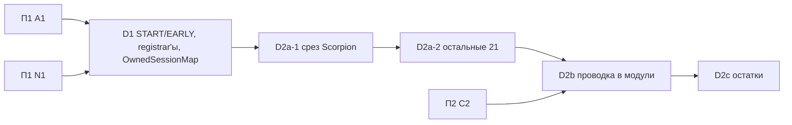

# План 3 — серверные модули героев, тики и lifecycle: Implementation Plan

> **For agentic workers:** REQUIRED SUB-SKILL: Use superpowers:subagent-driven-development (recommended) or superpowers:executing-plans to implement this plan task-by-task. Steps use checkbox (`- [ ]`) syntax for tracking.

**Goal:** Серверная проводка каждого героя принадлежит его `HeroModule`: модули регистрируют способности, тики и lifecycle через узкие registrar'ы поверх `HeroTickDispatcher` и `HeroLifecycle` из BF11. `SuperheroesMod` и `HeroTransformService` не знают ни одного героя.

**Architecture:** Диспетчер BF11 получает фазы `START` и `EARLY` и module-facing `TickRegistrar`; `LifecycleRegistrar` и `OwnedSessionMap` делегируют в `PlayerLifecycle` (BF3) и `HeroLifecycle` (BF11). Контракты модулей — в `core.module`, явный список — в composition root `bootstrap.HeroModules` (R16). Сначала вертикальный срез на Scorpion (R19), затем остальные 21 герой и перенос всей проводки из `SuperheroesMod`. Файлы героев физически не переезжают — это П5 и П6.

**Tech Stack:** Java 21, Minecraft 1.21.1 (Mojang mappings), Fabric Loader 0.19.2, Fabric API 0.116.12+1.21.1, Fabric Loom 1.16-SNAPSHOT, JUnit 5.10.2, Fabric GameTest API, ArchUnit 1.5.1 (из П1).

## Global Constraints

- Mod id: `superheroes` — не меняется никогда.
- Персистентные идентификаторы не меняются: id способностей (`superheroes:<ability>`), предметов, сущностей, звуков (`sounds.json`), MobEffect, типов урона, attachments (`hero_data`, `reinhard_state`, `doomsday_progress`, `regulus_madness`, `regulus_bonus_life`, `admin_build`, `suit_variant`, `nano_form`, `control_lock_shadow`, `pandora_revived` и др.), data component `superheroes:bound_weapon`, **ResourceLocation-ы attribute-модификаторов** (`modifiers/<hero>/<stat>` — permanent-пассивки лежат в NBT игроков), имена `KeyMapping` (`key.superheroes.*` — лежат в `options.txt`), lang-ключи.
- Id сетевых payload'ов не персистентны: их можно менять только при семантически оправданном слиянии (стадия L2).
- Геймплей и баланс не меняются в архитектурных PR. Любое изменение поведения — отдельный коммит с пометкой `behavior:` в сообщении и отдельным пунктом в описании PR.
- Server-authoritative: всё клиентское — в `src/client`; `src/main` загружается выделенным сервером.
- Только публичные API: `net.fabricmc.fabric.api.*`, никакого `net.fabricmc.fabric.impl.*`.
- Сеть — типизированные `CustomPacketPayload` + `StreamCodec`.
- `HeroDataStore` — единственный писатель `HERO_DATA` (`ProjectSanityTest.assertHeroDataHasSingleWriter`).
- Lifecycle-очистка — только через `PlayerLifecycle` (серверный поток), никогда через `ServerPlayConnectionEvents.DISCONNECT`.
- Mixins: узкие, `@Unique` для внедрённых членов, `@WrapOperation` предпочтительнее `@Redirect`.
- Звуки только OGG Vorbis; перед новыми ассетами проверять `art-source/`.
- `en_us.json` и `ru_ru.json` меняются вместе.
- `src/main/generated/` — только через `./gradlew runDatagen --no-daemon`; diff обязан быть пустым, если стадия не меняет данные намеренно.
- Финишный гейт каждого PR: `./gradlew qualityGate --no-daemon` зелёный.
- Runtime-изменения (ввод, рендер, HUD, сеть, VFX, сущности) — `./gradlew runClient --no-daemon`; если окружение не может запустить клиент, PR прямо это говорит.
- Никаких Gradle-модулей на героя, никакого big-bang rewrite, никакой перестановки файлов без смены владения.
- PR: заголовок на русском, тело начинается с «Для игрока», ниже — полная техническая часть; коммиты `feat(scope):`/`fix(scope):`/`refactor(scope):`/`test(scope):`/`docs(scope):` на английском.
- `SESSION.md` обновляется в каждом PR этого плана; статус стадии отмечается в таблице «Статус стадий» этого файла.

---

## Как исполнять этот план

- Карта всей миграции, исходное состояние, целевая архитектура и сквозные политики — в [`00-overview.md`](00-overview.md). Другие планы для этой работы читать не нужно.
- Одна стадия = один PR (D2b — два PR-units). D1, D2a-1 и D2a-2 расписаны по шагам с кодом. D2b, D2c заданы паспортами, и их первый шаг — **«Сверка»**: перечитать перечисленные файлы на актуальном `main` и обновить список касаний в описании PR.
- Если на актуальном коде проблема уже решена иначе — используем существующее решение и фиксируем это в PR и в разделе «Решения» этого плана. Откатывать рабочее решение ради буквального соответствия плану нельзя.
- Пути: `M/` = `src/main/java/com/example/superheroes/`, `C/` = `src/client/java/com/example/superheroes/client/`, `T/` = `src/test/java/com/example/superheroes/`, `G/` = `src/gametest/java/com/example/superheroes/gametest/`.
- Шаблон паспорта: **Цель · Почему · Зависит от · Затрагивает · Создаётся · Мигрируется · Удаляется · Старые пути, которых больше нет · Нельзя менять · Тесты · Runtime · Acceptance · Риски · Страховка.** Global Constraints в паспортах не повторяются.

Каждая стадия заканчивается одинаково (шаги не повторяются в каждой задаче):

- [ ] `./gradlew qualityGate --no-daemon` → `BUILD SUCCESSFUL`.
- [ ] Если стадия трогала datagen-источники: `./gradlew runDatagen --no-daemon` и `git diff --stat src/main/generated` → пусто (или только намеренные изменения, перечисленные в PR).
- [ ] Обновить «Статус стадий» этого плана, `SESSION.md` и при необходимости раздел «Решения».
- [ ] PR по правилам AGENTS.md §12; в технической части — baseline-метрики (`00-overview.md` §3.3) «до/после» для затронутых строк.

### Статус стадий

| Стадия | Статус | PR |
| :-- | :-- | :-- |
| D1 фазы `START`/`EARLY`, registrar'ы, `OwnedSessionMap` | ✅ | #63 |
| D2a-1 срез: Scorpion через `HeroModule` | ✅ merged | |
| D2a-2 `HeroModule` у остальных 21 героя | ⏳ | |
| D2b-1 тики и `init()` в модули | ⏳ | |
| D2b-2 lifecycle, правила, damage-слушатели в модули | ⏳ | |
| D2c остатки hero-веток в `HeroTransformService` | ⏳ | |

## Контекст

- Seams bugfix-pass, на которые опирается план: `lifecycle/HeroTickDispatcher` (BF11: один `END_SERVER_TICK`, фазы `GLOBAL → LEVELS → PLAYERS → ABILITY_ACTIVE`, таблица `registerTickHandlers` в `SuperheroesMod`), `lifecycle/HeroLifecycle` (BF11: `onClear/onTransformed`, `clearHeroRuntimeState` = `fireClear`), `lifecycle/PlayerLifecycle` (BF3), `EntityControlLock`, `PassiveReconciler` (BF9), `ABILITY_COOLDOWNS` (BF4: кулдауны не очищаются при смене героя и выходе), damage-слушатели в форме BF5.
- Внешние зависимости (обзор §2.1): A1, N1 — до D1; C2 — до D2b; `G/TestHeroes` — П1 A1.6.
- Межплановые решения, которые реализует план: R2, R10, R16, R19, R20 (обзор §4, §6.3).
- Этот план не делает: физический перенос файлов героев (П5, П6); клиентские модули (П4); переименование корня (П5 E1).

### Решения

| # | Вопрос / расхождение | Что говорит код сейчас | Решение |
| :-- | :-- | :-- | :-- |
| R1 | Opus: `HeroLifecycleEvents`; модульный аудит: хуки в `HeroModule` | BF3 создал `PlayerLifecycle`, BF11 — `HeroLifecycle` | Третьего хаба нет. `LifecycleRegistrar` модулей делегирует в оба; `OwnedSessionMap` подписывается через него |
| R5 | Opus: `HeroTickDispatcher`; модульный: тики через `registerHooks` | BF11 создал `HeroTickDispatcher` только на `END_SERVER_TICK`; 3 контроллера работают на `START_SERVER_TICK` | Диспетчер BF11 расширяется фазами `START` (отдельный Fabric-listener) и `EARLY` (начало `END`) и адаптером `TickRegistrar`; второй dispatcher не создаётся; изоляция исключений не добавляется |

## Зависимости стадий



Стадии идут последовательно. Выход плана: D2a-1 нужна П4 CL3a-1, D2a-2 — П4 CL3a-2; весь П3 — до П5 E1 (обзор §2.1).

## File Structure

| Файл | Ответственность | Стадия |
| :-- | :-- | :-- |
| `M/lifecycle/TickRegistrar.java`, фазы `START`/`EARLY` в `M/lifecycle/HeroTickDispatcher.java` | модульный доступ к диспетчеру BF11 | D1 |
| `M/lifecycle/{LifecycleRegistrar,GlobalLifecycleRegistrar,OwnedSessionMap}.java`, `T/lifecycle/OwnedSessionMapTest.java` | модульный доступ к lifecycle, самоочищающийся session state | D1 |
| `M/core/module/{HeroModule,HeroModuleContext,CoreModuleContext,AbilitySink}.java` | контракты модульного seam | D2a-1 |
| `M/bootstrap/HeroModules.java` | composition root: явный список модулей | D2a-1 |
| `M/hero/scorpion/ScorpionModule.java` | первый модуль (срез) | D2a-1 |
| `M/hero/<id>/<Id>Module.java` ×21, `M/bootstrap/SharedAbilities.java` | модули остальных героев, общие способности | D2a-2 |
| `M/bootstrap/SharedMechanics.java` | проводка общих механик и content до их переноса | D2b |

D2b превращает `init()` контроллеров в `register(HeroModuleContext)`; D2c добавляет в `Hero` хук `keepsHeroOnDeath()`.

## Стадии

### Стадия D1 — модульный доступ к диспетчеру BF11, фазы `START`/`EARLY`, `OwnedSessionMap`

- **Цель:** модули регистрируют тики и lifecycle через узкие registrar'ы поверх seams BF11; диспетчер различает `START` и `END` тика; session state очищается сам.
- **Почему:** BF11 ввёл `lifecycle/HeroTickDispatcher` (один `END_SERVER_TICK`, фазы `GLOBAL → LEVELS → PLAYERS → ABILITY_ACTIVE`) и `HeroLifecycle`, но ~50 контроллеров всё ещё регистрируют тики сами, три из них — на `START_SERVER_TICK` (`KratosRageController`, `ThanosGauntletStateController`, `MadnessFlightController`), и 30 `resetAll()` плюс десятки `clear` вручную лежат в `SuperheroesMod`. Внешнее ревью: фаза внутри `END` не эквивалентна `START`.
- **Зависит от:** A1, N1 (обзор §2.1).
- **Затрагивает:** `M/lifecycle/HeroTickDispatcher.java`, `M/SuperheroesMod.java` (строка подключения диспетчера), `M/ability/CapShieldSlamAbility.java` (первый потребитель `OwnedSessionMap`), `G/HeroTickDispatcherGameTests.java`, `src/test/**`.
- **Создаётся:** `M/lifecycle/TickRegistrar.java`, `M/lifecycle/LifecycleRegistrar.java`, `M/lifecycle/OwnedSessionMap.java`, `T/lifecycle/OwnedSessionMapTest.java`. Все — в существующем пакете `lifecycle` рядом с seams BF3/BF11; E2 переносит пакет целиком в `core/lifecycle`.
- **Мигрируется:** подключение `END_SERVER_TICK` из `SuperheroesMod` → `HeroTickDispatcher.init()` в той же точке `onInitialize` (порядок относительно собственных листенеров контроллеров сохраняется); `CapShieldSlamAbility` → `OwnedSessionMap`.
- **Не создаётся:** второй dispatcher и второй lifecycle-хаб (R1, R5). Изоляция исключений в хуках не добавляется — BF11 её не делает, поведение отказа не меняется.
- **Удаляется:** `END_SERVER_TICK.register(HeroTickDispatcher::tick)` в `SuperheroesMod`; `clear`/`resetAll` у `CapShieldSlamAbility` и их регистрации.
- **Нельзя менять:** порядок фаз BF11; то, что собственные листенеры контроллеров (зарегистрированные раньше в `init()`) выполняются до фаз диспетчера — до D2b новая фаза `EARLY` пуста.
- **Тесты:** JUnit `OwnedSessionMapTest`; в `HeroTickDispatcherGameTests` (BF11) — `START` выполняется до `END`-фаз того же тика, `EARLY` до `GLOBAL`, `hero(...)` только для игрока с этим героем.
- **Runtime:** не нужен (серверная логика покрыта GameTests).
- **Acceptance:** ArchUnit store `onlyTheDispatcherRegistersServerTicks` потерял запись `SuperheroesMod`; `CapShieldSlamAbility` не регистрируется в `SuperheroesMod`.
- **Страховка:** revert одного PR.

#### Task D1.1: `LifecycleRegistrar` и `OwnedSessionMap`

**Files:**
- Create: `M/lifecycle/LifecycleRegistrar.java`, `M/lifecycle/GlobalLifecycleRegistrar.java`, `M/lifecycle/OwnedSessionMap.java`
- Test: `src/test/java/com/example/superheroes/lifecycle/OwnedSessionMapTest.java`

**Interfaces:**
- Produces:
  - `interface LifecycleRegistrar { void onJoin(Consumer<ServerPlayer>); void onLeave(Consumer<ServerPlayer>); void onDeath(Consumer<ServerPlayer>); void onRespawn(Consumer<ServerPlayer>); void onServerStopped(Consumer<MinecraftServer>); void onHeroClear(Consumer<ServerPlayer>); void onHeroTransformed(BiConsumer<ServerPlayer, ResourceLocation>); static LifecycleRegistrar global(); }` — первые пять делегируют в `PlayerLifecycle` (BF3), последние два — в `HeroLifecycle.onClear/onTransformed` (BF11).
  - `final class OwnedSessionMap<K, V>`: `static <K, V> OwnedSessionMap<K, V> create(LifecycleRegistrar lifecycle, Set<OwnedSessionMap.ClearOn> clearOn)`, `void put(K key, UUID owner, V value)`, `@Nullable V get(K key)`, `@Nullable V remove(K key)`, `boolean containsKey(K key)`, `int size()`, `Iterator<Map.Entry<K, V>> iterator()` (поддерживает `remove`), `void removeOwnedBy(UUID owner)`, `void clear()`; `enum ClearOn { LEAVE, DEATH, HERO_CLEAR }`.

- [ ] **Step 1: Падающий тест**

```java
package com.example.superheroes.lifecycle;

import org.junit.jupiter.api.Test;

import java.util.Iterator;
import java.util.Map;
import java.util.UUID;

import static org.junit.jupiter.api.Assertions.assertEquals;
import static org.junit.jupiter.api.Assertions.assertFalse;
import static org.junit.jupiter.api.Assertions.assertNull;
import static org.junit.jupiter.api.Assertions.assertTrue;

class OwnedSessionMapTest {
	private final UUID alice = UUID.randomUUID();
	private final UUID bob = UUID.randomUUID();

	@Test
	void removingAnOwnerDropsEveryEntryItOwns() {
		OwnedSessionMap<String, Integer> map = OwnedSessionMap.unbound();
		map.put("pull-1", alice, 1);
		map.put("pull-2", alice, 2);
		map.put("pull-3", bob, 3);

		map.removeOwnedBy(alice);

		assertNull(map.get("pull-1"));
		assertNull(map.get("pull-2"));
		assertEquals(3, map.get("pull-3"));
	}

	@Test
	void reputtingAKeyMovesItToTheNewOwner() {
		OwnedSessionMap<String, Integer> map = OwnedSessionMap.unbound();
		map.put("target", alice, 1);
		map.put("target", bob, 2);

		map.removeOwnedBy(alice);

		assertEquals(2, map.get("target"));
	}

	@Test
	void iteratorRemovalKeepsTheOwnerIndexConsistent() {
		OwnedSessionMap<String, Integer> map = OwnedSessionMap.unbound();
		map.put("a", alice, 1);
		for (Iterator<Map.Entry<String, Integer>> it = map.iterator(); it.hasNext(); ) {
			it.next();
			it.remove();
		}
		map.put("a", bob, 2);
		map.removeOwnedBy(alice);
		assertTrue(map.containsKey("a"));
		map.clear();
		assertFalse(map.containsKey("a"));
		assertEquals(0, map.size());
	}
}
```

Run: `./gradlew test --no-daemon --tests '*OwnedSessionMapTest*'` → FAIL (класса нет).

- [ ] **Step 2: Реализация**

```java
package com.example.superheroes.lifecycle;

import net.minecraft.server.MinecraftServer;
import net.minecraft.server.level.ServerPlayer;

import java.util.function.Consumer;

/** Where modules subscribe to player, hero and server lifecycle; backed by {@link PlayerLifecycle} (BF3) and {@link HeroLifecycle} (BF11). */
public interface LifecycleRegistrar {
	void onJoin(Consumer<ServerPlayer> hook);

	void onLeave(Consumer<ServerPlayer> hook);

	void onDeath(Consumer<ServerPlayer> hook);

	void onRespawn(Consumer<ServerPlayer> hook);

	void onServerStopped(Consumer<MinecraftServer> hook);

	/** Hero swap or untransform: {@link HeroLifecycle#onClear}. */
	void onHeroClear(Consumer<ServerPlayer> hook);

	void onHeroTransformed(java.util.function.BiConsumer<ServerPlayer, net.minecraft.resources.ResourceLocation> hook);

	static LifecycleRegistrar global() {
		return GlobalLifecycleRegistrar.INSTANCE;
	}
}
```

```java
package com.example.superheroes.lifecycle;

import net.minecraft.server.MinecraftServer;
import net.minecraft.server.level.ServerPlayer;

import java.util.function.Consumer;

enum GlobalLifecycleRegistrar implements LifecycleRegistrar {
	INSTANCE;

	@Override public void onJoin(Consumer<ServerPlayer> hook) { PlayerLifecycle.onJoin(hook); }
	@Override public void onLeave(Consumer<ServerPlayer> hook) { PlayerLifecycle.onLeave(hook); }
	@Override public void onDeath(Consumer<ServerPlayer> hook) { PlayerLifecycle.onDeath(hook); }
	@Override public void onRespawn(Consumer<ServerPlayer> hook) { PlayerLifecycle.onRespawn(hook); }
	@Override public void onServerStopped(Consumer<MinecraftServer> hook) { PlayerLifecycle.onServerStopped(hook); }
	@Override public void onHeroClear(Consumer<ServerPlayer> hook) { HeroLifecycle.onClear(hook); }
	@Override public void onHeroTransformed(java.util.function.BiConsumer<ServerPlayer, net.minecraft.resources.ResourceLocation> hook) { HeroLifecycle.onTransformed(hook); }
}
```

```java
package com.example.superheroes.lifecycle;

import org.jetbrains.annotations.Nullable;

import java.util.EnumSet;
import java.util.HashMap;
import java.util.HashSet;
import java.util.Iterator;
import java.util.LinkedHashMap;
import java.util.Map;
import java.util.Set;
import java.util.UUID;

/**
 * Runtime state that belongs to an online player (the owner) and must never outlive them: entries are
 * dropped when the owner leaves, dies or clears their hero (per {@link ClearOn}) and all entries on server stop.
 * It only removes entries: side effects of a former clear() stay explicit lifecycle hooks. Replaces the
 * hand-maintained static maps plus clear/resetAll registrations. Iteration order is insertion order.
 */
public final class OwnedSessionMap<K, V> implements Iterable<Map.Entry<K, V>> {
	public enum ClearOn { LEAVE, DEATH, HERO_CLEAR }

	private record Slot<V>(UUID owner, V value) {
	}

	private final Map<K, Slot<V>> entries = new LinkedHashMap<>();
	private final Map<UUID, Set<K>> byOwner = new HashMap<>();

	private OwnedSessionMap() {
	}

	public static <K, V> OwnedSessionMap<K, V> create(LifecycleRegistrar lifecycle, Set<ClearOn> clearOn) {
		OwnedSessionMap<K, V> map = new OwnedSessionMap<>();
		EnumSet<ClearOn> policy = clearOn.isEmpty() ? EnumSet.noneOf(ClearOn.class) : EnumSet.copyOf(clearOn);
		if (policy.contains(ClearOn.LEAVE)) {
			lifecycle.onLeave(player -> map.removeOwnedBy(player.getUUID()));
		}
		if (policy.contains(ClearOn.DEATH)) {
			lifecycle.onDeath(player -> map.removeOwnedBy(player.getUUID()));
		}
		if (policy.contains(ClearOn.HERO_CLEAR)) {
			lifecycle.onHeroClear(player -> map.removeOwnedBy(player.getUUID()));
		}
		lifecycle.onServerStopped(server -> map.clear());
		return map;
	}

	/** Not bound to any lifecycle — for unit tests only. */
	static <K, V> OwnedSessionMap<K, V> unbound() {
		return new OwnedSessionMap<>();
	}

	public void put(K key, UUID owner, V value) {
		remove(key);
		entries.put(key, new Slot<>(owner, value));
		byOwner.computeIfAbsent(owner, o -> new HashSet<>()).add(key);
	}

	@Nullable
	public V get(K key) {
		Slot<V> slot = entries.get(key);
		return slot == null ? null : slot.value();
	}

	@Nullable
	public V remove(K key) {
		Slot<V> slot = entries.remove(key);
		if (slot == null) {
			return null;
		}
		unindex(slot.owner(), key);
		return slot.value();
	}

	public boolean containsKey(K key) {
		return entries.containsKey(key);
	}

	public int size() {
		return entries.size();
	}

	public void removeOwnedBy(UUID owner) {
		Set<K> keys = byOwner.remove(owner);
		if (keys != null) {
			keys.forEach(entries::remove);
		}
	}

	public void clear() {
		entries.clear();
		byOwner.clear();
	}

	@Override
	public Iterator<Map.Entry<K, V>> iterator() {
		Iterator<Map.Entry<K, Slot<V>>> raw = entries.entrySet().iterator();
		return new Iterator<>() {
			private Map.Entry<K, Slot<V>> current;

			@Override
			public boolean hasNext() {
				return raw.hasNext();
			}

			@Override
			public Map.Entry<K, V> next() {
				current = raw.next();
				return Map.entry(current.getKey(), current.getValue().value());
			}

			@Override
			public void remove() {
				raw.remove();
				unindex(current.getValue().owner(), current.getKey());
			}
		};
	}

	private void unindex(UUID owner, K key) {
		Set<K> keys = byOwner.get(owner);
		if (keys != null) {
			keys.remove(key);
			if (keys.isEmpty()) {
				byOwner.remove(owner);
			}
		}
	}
}
```

`Map.entry` не допускает `null`-значений: `put` с `value == null` запрещён (`Objects.requireNonNull(value)` в начале `put`).

- [ ] **Step 3:** Run тест → PASS. Commit: `feat(lifecycle): add OwnedSessionMap for self-clearing per-owner runtime state`.

#### Task D1.2: фазы `START` и `EARLY`, `TickRegistrar`

**Files:**
- Create: `M/lifecycle/TickRegistrar.java`
- Modify: `M/lifecycle/HeroTickDispatcher.java`, `M/SuperheroesMod.java`, `G/HeroTickDispatcherGameTests.java`

**Interfaces:**
- Consumes: `HeroTickDispatcher.PlayerTask`, `onGlobalTick`, `onLevelTick`, `onPlayerTick`, `onActiveAbilityTick` (BF11).
- Produces: `HeroTickDispatcher.Phase { START, EARLY, GLOBAL, LEVELS, PLAYERS, ABILITY_ACTIVE }`; `HeroTickDispatcher.onServerTickStart(Consumer<MinecraftServer>)`, `onEarlyTick(Consumer<MinecraftServer>)`, `onHeroTick(ResourceLocation heroId, PlayerTask)`, `init()`, `registrar()` → `TickRegistrar`; `interface TickRegistrar { void start(Consumer<MinecraftServer>); void early(Consumer<MinecraftServer>); void global(Consumer<MinecraftServer>); void level(BiConsumer<MinecraftServer, ServerLevel>); void player(HeroTickDispatcher.PlayerTask); void hero(ResourceLocation heroId, HeroTickDispatcher.PlayerTask); void activeAbility(ResourceLocation abilityId, HeroTickDispatcher.PlayerTask); }`.

- [ ] **Step 1: Падающий GameTest** (по образцу существующих `HeroTickDispatcherGameTests`, которые регистрируют задачи в статическом диспетчере с проверкой «задача относится к этому тесту»):

```java
	@GameTest(template = EMPTY_STRUCTURE)
	public void startRunsBeforeEndPhasesAndEarlyBeforeGlobal(GameTestHelper helper) {
		List<String> log = new java.util.concurrent.CopyOnWriteArrayList<>();
		java.util.concurrent.atomic.AtomicBoolean armed = new java.util.concurrent.atomic.AtomicBoolean(true);
		HeroTickDispatcher.onGlobalTick(s -> { if (armed.get()) log.add("global"); });
		HeroTickDispatcher.onEarlyTick(s -> { if (armed.get()) log.add("early"); });
		HeroTickDispatcher.onServerTickStart(s -> { if (armed.get()) log.add("start"); });
		helper.runAfterDelay(2, () -> {
			armed.set(false);
			int start = log.indexOf("start");
			helper.assertTrue(start >= 0 && log.indexOf("early") > start && log.indexOf("global") > log.indexOf("early"),
					"START before EARLY before GLOBAL within one tick: " + log);
			helper.succeed();
		});
	}

	@GameTest(template = EMPTY_STRUCTURE)
	public void heroTickRunsOnlyForThatHero(GameTestHelper helper) {
		ServerPlayer scaramouche = TestPlayers.join(helper);
		ServerPlayer nobody = TestPlayers.join(helper);
		TestHeroes.transform(scaramouche, ScaramoucheHero.ID);
		Set<UUID> seen = java.util.concurrent.ConcurrentHashMap.newKeySet();
		HeroTickDispatcher.onHeroTick(ScaramoucheHero.ID, (server, p, data) -> seen.add(p.getUUID()));
		helper.runAfterDelay(2, () -> {
			helper.assertTrue(seen.contains(scaramouche.getUUID()), "the hero's player ticks");
			helper.assertFalse(seen.contains(nobody.getUUID()), "other players do not");
			helper.succeed();
		});
	}
```

Run: `./gradlew runGametest --no-daemon` → FAIL (методов нет).

- [ ] **Step 2: Диспетчер**

```java
	public enum Phase {
		/** START_SERVER_TICK — before vanilla ticks levels and entities. */
		START,
		/** END_SERVER_TICK, before GLOBAL — former self-registered END listeners, in module order. */
		EARLY,
		GLOBAL, LEVELS, PLAYERS, ABILITY_ACTIVE
	}

	private static final List<Consumer<MinecraftServer>> START_TASKS = new ArrayList<>();
	private static final List<Consumer<MinecraftServer>> EARLY_TASKS = new ArrayList<>();

	public static void onServerTickStart(Consumer<MinecraftServer> task) {
		START_TASKS.add(task);
	}

	public static void onEarlyTick(Consumer<MinecraftServer> task) {
		EARLY_TASKS.add(task);
	}

	/** Per-player task for players whose current hero is {@code heroId}, {@link Phase#PLAYERS}. */
	public static void onHeroTick(ResourceLocation heroId, PlayerTask task) {
		onPlayerTick((server, player, data) -> {
			if (data.hasHero() && heroId.equals(data.heroId())) {
				task.tick(server, player, data);
			}
		});
	}

	/** Hooks the dispatcher into Fabric's tick events; call where SuperheroesMod registered END_SERVER_TICK before. */
	public static void init() {
		ServerTickEvents.START_SERVER_TICK.register(server -> START_TASKS.forEach(task -> task.accept(server)));
		ServerTickEvents.END_SERVER_TICK.register(HeroTickDispatcher::tick);
	}

	public static TickRegistrar registrar() {
		return Registrar.INSTANCE;
	}
```

  В начале `tick(MinecraftServer)` — `for (Consumer<MinecraftServer> task : EARLY_TASKS) task.accept(server);`, остальное без изменений. `Registrar` — приватный `enum Registrar implements TickRegistrar { INSTANCE; … }`, каждый метод делегирует в соответствующий статический `on…`. В `SuperheroesMod` строку `…END_SERVER_TICK.register(HeroTickDispatcher::tick)` заменить на `HeroTickDispatcher.init();` **в той же точке**.

- [ ] **Step 3:** `./gradlew runGametest --no-daemon` → PASS. Commit: `feat(tick): add START and EARLY phases and a module-facing tick registrar`.

#### Task D1.3: первый потребитель `OwnedSessionMap`

**Files:**
- Modify: `M/ability/CapShieldSlamAbility.java`, `M/SuperheroesMod.java`

- [ ] **Step 1: Сверка** — прочитать статические карты `CapShieldSlamAbility`, `serverTick`, `clear`, `resetAll` (§6.3 обзора: есть ли у `clear` побочные эффекты кроме удаления записи). Если состояние — одна `Map<UUID, X>` по игроку без побочных эффектов: заменить на `private static final OwnedSessionMap<UUID, X> STATE = OwnedSessionMap.create(LifecycleRegistrar.global(), EnumSet.of(ClearOn.LEAVE, ClearOn.DEATH));`, удалить `clear`/`resetAll` и их три регистрации в `SuperheroesMod`. Если структура сложнее или у `clear` есть побочный эффект — выбрать другой потребитель из `registerPlayerLifecycle` с одной картой и тремя хуками (например, `NarutoRasenganAbility`) и записать выбор в PR.
- [ ] **Step 2:** `./gradlew qualityGate --no-daemon` → при уменьшении store закоммитить → PASS. Commit: `refactor(lifecycle): let the first ability state clear itself through OwnedSessionMap`.

---

### Стадия D2a-1 — вертикальный срез: Scorpion через `HeroModule`

- **Цель:** до массовой конверсии доказать модульный seam на одном герое: контракты в `core.module`, список в `bootstrap`, модуль создаёт героя и способности, строгие правила A1 и ratchet проверяют реальный код и зелёные.
- **Почему:** внешнее ревью — seam проверялся слишком поздно (R19). Прототип этого среза уже прошёл на сводной базе (обзор §10).
- **Зависит от:** D1.
- **Затрагивает:** `M/hero/Heroes.java`, `M/ability/AbilityRegistry.java`, `M/SuperheroesMod.java`.
- **Создаётся:** `M/core/module/{HeroModule,HeroModuleContext,CoreModuleContext,AbilitySink}.java`, `M/bootstrap/HeroModules.java`, `M/hero/scorpion/ScorpionModule.java`.
- **Мигрируется:** регистрация героя Scorpion и его 4 способностей переезжает из `Heroes`/`AbilityRegistry` в модуль; вызов `ScorpionController.init()` — из `SuperheroesMod` в `ScorpionModule.register`. Остальные файлы Scorpion пока не переезжают (П5 F).
- **Удаляется:** поле `Heroes.SCORPION` и его `register`, 4 поля `AbilityRegistry.SCORPION_*` и их `register`. Вне этих двух файлов на поля ссылок нет (проверено на сводной базе).
- **Нельзя менять:** id героя и способностей, порядок `getAbilities()` Scorpion, момент регистрации `ScorpionController` среди собственных тик-листенеров (вызов `HeroModules.bootstrap` стоит в строке, где был `ScorpionController.init()`).
- **Поведенческое изменение (`behavior:`, временное):** Scorpion регистрируется в `Heroes` последним, а не перед Pandora; порядок виден только в подсказках команд (`SuperheroesCommands`). D2a-2 возвращает исходный порядок.
- **Тесты:** ArchUnit — строгие правила теперь непустые: `heroModulesAreReferencedOnlyByThemselvesAndTheModuleList`, `everyHeroModuleIsConstructedInTheModuleList`, `coreDependsOnNothingAboveIt`, `nothingDependsOnCompositionRoots`; `PackageCycleRatchetTest` без изменения baseline; существующие GameTests Scorpion-агностичны и зелёные; новый GameTest `scorpionIsRegisteredThroughItsModule`: `Heroes.get(ScorpionHero.ID)` — тот же экземпляр, что `HeroModules.ALL.get(0).hero()`, и 4 способности есть в `AbilityRegistry`.
- **Runtime:** `runClient` — трансформация кунаем и 4 способности Scorpion работают.
- **Acceptance:** freeze store уменьшился (исчезла запись `Heroes.SCORPION`), baseline циклов не изменился; строгие правила проверяют ≥ 3 класса (временно выключить `allowEmptyShould` в PR и убедиться, что правила не пустые, затем вернуть).
- **Страховка:** revert.

#### Task D2a-1.1: контракты и список

**Interfaces:**
- Consumes: `TickRegistrar`, `LifecycleRegistrar`, `HeroTickDispatcher.registrar()`, `LifecycleRegistrar.global()` (D1).
- Produces: `@FunctionalInterface interface AbilitySink { void register(Ability ability); }`; `interface HeroModule { Hero hero(); void register(HeroModuleContext ctx); }`; `interface HeroModuleContext { AbilitySink abilities(); TickRegistrar ticks(); LifecycleRegistrar lifecycle(); }` — расширяется только узкими registrar'ами (`content()`, `payloads()` в П5 F, `attachments()` в П5 G1, `commands()` в П6 I4d); `final class CoreModuleContext implements HeroModuleContext` с `INSTANCE`; `final class bootstrap.HeroModules` с `ALL` и `bootstrap(HeroModuleContext)`.

- [ ] **Step 1: Код** (проверен прототипом, кроме `ticks()`/`lifecycle()`, которые появились в D1):

```java
package com.example.superheroes.core.module;

import com.example.superheroes.ability.Ability;

@FunctionalInterface
public interface AbilitySink {
	void register(Ability ability);
}
```

```java
package com.example.superheroes.core.module;

import com.example.superheroes.hero.Hero;

/**
 * Bootstrap-time wiring of one hero: registers its hero, abilities, ticks and lifecycle hooks through narrow
 * registrars. Runtime rules live on {@link Hero}; this interface never grows gameplay methods.
 */
public interface HeroModule {
	Hero hero();

	void register(HeroModuleContext ctx);
}
```

```java
package com.example.superheroes.core.module;

import com.example.superheroes.lifecycle.LifecycleRegistrar;
import com.example.superheroes.lifecycle.TickRegistrar;

public interface HeroModuleContext {
	AbilitySink abilities();

	TickRegistrar ticks();

	LifecycleRegistrar lifecycle();
}
```

```java
package com.example.superheroes.core.module;

import com.example.superheroes.ability.AbilityRegistry;
import com.example.superheroes.lifecycle.HeroTickDispatcher;
import com.example.superheroes.lifecycle.LifecycleRegistrar;
import com.example.superheroes.lifecycle.TickRegistrar;

public final class CoreModuleContext implements HeroModuleContext {
	public static final CoreModuleContext INSTANCE = new CoreModuleContext();

	private CoreModuleContext() {
	}

	@Override
	public AbilitySink abilities() {
		return AbilityRegistry::register;
	}

	@Override
	public TickRegistrar ticks() {
		return HeroTickDispatcher.registrar();
	}

	@Override
	public LifecycleRegistrar lifecycle() {
		return LifecycleRegistrar.global();
	}
}
```

```java
package com.example.superheroes.bootstrap;

import com.example.superheroes.core.module.HeroModule;
import com.example.superheroes.core.module.HeroModuleContext;
import com.example.superheroes.hero.Heroes;

import java.util.List;

/** Composition root: the only place that names hero modules. One line per hero; order = registry order. */
public final class HeroModules {
	public static final List<HeroModule> ALL = List.of(
			new com.example.superheroes.hero.scorpion.ScorpionModule()
	);

	private HeroModules() {
	}

	public static void bootstrap(HeroModuleContext ctx) {
		for (HeroModule module : ALL) {
			Heroes.register(module.hero());
		}
		for (HeroModule module : ALL) {
			module.register(ctx);
		}
	}
}
```

#### Task D2a-1.2: модуль Scorpion

- [ ] **Step 1:**

```java
package com.example.superheroes.hero.scorpion;

import com.example.superheroes.ability.ScorpionFireTeleportAbility;
import com.example.superheroes.ability.ScorpionHellBreathAbility;
import com.example.superheroes.ability.ScorpionHellfireAbility;
import com.example.superheroes.ability.ScorpionSpearAbility;
import com.example.superheroes.core.module.HeroModule;
import com.example.superheroes.core.module.HeroModuleContext;
import com.example.superheroes.effect.ScorpionController;
import com.example.superheroes.hero.Hero;
import com.example.superheroes.hero.ScorpionHero;

public final class ScorpionModule implements HeroModule {
	private final ScorpionHero hero = new ScorpionHero();

	@Override
	public Hero hero() {
		return hero;
	}

	@Override
	public void register(HeroModuleContext ctx) {
		ctx.abilities().register(new ScorpionSpearAbility());
		ctx.abilities().register(new ScorpionHellfireAbility());
		ctx.abilities().register(new ScorpionFireTeleportAbility());
		ctx.abilities().register(new ScorpionHellBreathAbility());
		ScorpionController.init();
	}
}
```

- [ ] **Step 2:** Удалить `Heroes.SCORPION` + `register(SCORPION)` и 4 поля/`register` Scorpion в `AbilityRegistry`; в `SuperheroesMod` заменить `com.example.superheroes.effect.ScorpionController.init();` на `com.example.superheroes.bootstrap.HeroModules.bootstrap(com.example.superheroes.core.module.CoreModuleContext.INSTANCE);`. `assertControllersAreWired` (П1 A2.2) видит `ScorpionController.init()` в `ScorpionModule.java`.
- [ ] **Step 3:** `./gradlew qualityGate --no-daemon` → закоммитить уменьшившийся store → PASS. Commit: `feat(module): wire Scorpion through the first HeroModule`.

### Стадия D2a-2 — `HeroModule` у остальных 21 героя; чистые реестры

- **Цель:** все герои регистрируются своими модулями; `Heroes` и `AbilityRegistry` — чистые реестры без полей героев и способностей.
- **Почему:** модульный аудит §5, структурный M7; R2. После этого физические переносы (П5 F, G; П6) становятся локальными.
- **Зависит от:** D2a-1.
- **Затрагивает:** `M/hero/Heroes.java`, `M/ability/AbilityRegistry.java`, `M/SuperheroesMod.java`, `M/bootstrap/HeroModules.java`, `T/ProjectSanityTest.java` (удалить `assertEveryHeroRegistered`), `G/HeroCompletenessGameTests.java`.
- **Создаётся:** `M/hero/<id>/<Id>Module.java` ×21, `M/bootstrap/SharedAbilities.java` (общие способности; composition root, потому что после П6 I3 они живут в `mechanic/ability`, а ядро от `mechanic` не зависит).
- **Мигрируется:** модули создают своих героев и способности (форма — как `ScorpionModule`); `ScorpionModule` становится 21-м в `ALL`, на своё исходное место.
- **Удаляется:** `Heroes.init()` и все поля героев в `Heroes`; `AbilityRegistry.init()` и все поля способностей; `assertEveryHeroRegistered`.
- **Нельзя менять:** порядок героев в реестре (`HeroModules.ALL` = исходный порядок `Heroes.init()`), состав и порядок `getAbilities()` каждого героя.
- **Тесты:** GameTest `modulesCoverEveryHeroInRegistryOrder` (ниже); `everyHeroModuleIsConstructedInTheModuleList` (A1) проверяет все 22 модуля.
- **Acceptance:** `SuperheroesMod` не вызывает `Heroes.init()`/`AbilityRegistry.init()`; в `Heroes.java` и `AbilityRegistry.java` нет ни одного поля конкретного героя или способности; ArchUnit store потерял записи `Heroes → *Hero`.
- **Риски:** `AbilityRegistry.all()` меняет порядок итерации (shared, затем по героям). Сверка: `grep -rn 'AbilityRegistry.all()' src/` — если порядок виден игроку, отметить в PR; значения не меняются.

- [ ] **Step 1: Падающий GameTest** (в `HeroCompletenessGameTests`):

```java
	@GameTest(template = EMPTY_STRUCTURE)
	public void modulesCoverEveryHeroInRegistryOrder(GameTestHelper helper) {
		List<ResourceLocation> fromModules = HeroModules.ALL.stream().map(m -> m.hero().getId()).toList();
		List<ResourceLocation> registered = List.copyOf(Heroes.all().keySet());
		helper.assertTrue(fromModules.equals(registered), "modules " + fromModules + " vs registry " + registered);
		helper.assertTrue(registered.size() == 22, "22 heroes, got " + registered.size());
		helper.succeed();
	}
```

- [ ] **Step 2: Сверка общих способностей:** `grep -ho 'AbilityIds\.[A-Z_]*' src/main/java/com/example/superheroes/hero/*Hero.java | sort | uniq -c | awk '$1>1'` → как минимум `FLIGHT` (4 героя) и `VILTRUMITE_RECOVERY` (2); они регистрируются в `SharedAbilities.register(AbilitySink)` в порядке бывшего `init()`, ни один модуль их не регистрирует.
- [ ] **Step 3: Модули** — `HeroModules.ALL` в исходном порядке `Heroes.init()`: Homelander, Iron Man, Regulus, Sung Jinwoo, Doomsday, Goku, Naruto, Captain America, Kratos, Loki, Thanos, Reinhard, Raiden, Invincible, Omni-Man, Kazuha, Scaramouche, Battle Beast, Rem, A-Train, Scorpion, Pandora. Имя пакета — id героя без `_` (`sung_jinwoo` → `sungjinwoo`, `captain_america` → `captainamerica`, `battle_beast` → `battlebeast`, `a_train` → `atrain`, `iron_man` → `ironman`, `raiden_shogun` → `raiden`). `bootstrap` сначала регистрирует героев, затем `SharedAbilities.register(ctx.abilities())`, затем `module.register(ctx)`. Удалить `Heroes.init()`/`AbilityRegistry.init()` и все их поля; `HeroModules.bootstrap` вызывается там, где был `Heroes.init()` (до `ModItems` и остальных `init`); `ScorpionController.init()` остаётся в `ScorpionModule` — его момент регистрации сдвигается раньше `ModItems.init()`, что для тик-листенеров не меняет порядок относительно других контроллеров (они регистрируются позже).
- [ ] **Step 4:** удалить `assertEveryHeroRegistered` из `ProjectSanityTest.main` и сам метод.
- [ ] **Step 5:** `./gradlew qualityGate --no-daemon` → закоммитить store → PASS. Commit: `feat(module): wire every hero through a HeroModule`.

### Стадия D2b — проводка героев переезжает из `SuperheroesMod` в модули

- **Цель:** в `SuperheroesMod` не остаётся ни одного hero-контроллера, тика, lifecycle-хука или правила способности.
- **Почему:** Opus-долг 3; модульный аудит §4.1; ArchUnit-правила `onlyTheDispatcherRegistersServerTicks` и `lifecycleHooksAreRegisteredThroughRegistrars` должны опустеть.
- **Зависит от:** D2a-2, C2. Damage-слушатели уже в форме BF5 (`AFTER_DAMAGE` для учёта, `ALLOW_DAMAGE` только для отмены, `ALLOW_DEATH` для спасений) и переезжают в модули как есть.
- **Сверка:** перечитать `SuperheroesMod` (включая таблицы `registerTickHandlers` и `registerPlayerLifecycle` BF11) и все `init()` контроллеров на актуальном `main`; обновить таблицу ниже.
- **Мигрируется (рецепт для каждого контроллера):**

```java
// before
public static void init() {
	ServerTickEvents.END_SERVER_TICK.register(server -> { tickA(server); tickB(server); });
	UseItemCallback.EVENT.register(ScorpionController::onUse);
}

// after — called from the owning module's register(ctx); non-tick Fabric events stay as they are
public static void register(HeroModuleContext ctx) {
	ctx.ticks().early(server -> { tickA(server); tickB(server); });
	UseItemCallback.EVENT.register(ScorpionController::onUse);
}
```

  Сопоставление: собственный `END_SERVER_TICK`-листенер → `ctx.ticks().early(...)` (они и сейчас выполняются до фаз BF11, потому что регистрируются раньше диспетчера); собственный `START_SERVER_TICK` (`KratosRageController`, `ThanosGauntletStateController`, `MadnessFlightController`) → `ctx.ticks().start(...)` — **не** в `END`-фазу (внешнее ревью: разрушение блоков и эффекты оказались бы по другую сторону ванильного тика). Строки таблицы `registerTickHandlers` → `ctx.ticks().global/level/player/activeAbility(...)` в модуле-владельце в том же порядке. Порядок внутри героя сохраняется, между героями становится порядком `HeroModules.ALL`; сверка: для каждого контроллера проверить, читает ли его тик состояние, которое в том же тике пишет контроллер **другого** героя (ожидаемо — нет; если да — перечислить в PR и сохранить относительный порядок). Строки `registerPlayerLifecycle` (и `PlayerLifecycle.on*`, и `HeroLifecycle.on*`) → `ctx.lifecycle().onX(...)` в модуле-владельце; `resetAll()` из `onServerStopped` → `ctx.lifecycle().onServerStopped(s -> X.resetAll())`. Правила C2 → `HomelanderModule` (aftermath, бесплатность в безумии), `ThanosModule` (Snap), `PandoraModule` (Vanity) — в прежнем относительном порядке.
- **Классификация текущих `init()`** (по вершине стека; сверить):

| Владелец | Контроллеры / строки |
| :-- | :-- |
| core (остаётся в `SuperheroesMod`) | `ModAttachments`, `EntityControlLock`, `PlayerLifecycle`, `PassiveReconciler`, `HeroTickDispatcher`, `ModEffects`, `ModEntities`, `HordeEntities`, `ModDataComponents`, `ModItems`, `ModItemGroups`, `ModParticles`, `ModSounds`, `ModNetworking`, `HeroDataStore`, `ResourceController`, `HeroTickDispatcher`, `SuperheroesCommands` |
| общие механики → `bootstrap.SharedMechanics.register(ctx)` (composition root: после П5 E2 они в `mechanic/`, а ядро от `mechanic` не зависит) | `HeroLandingTracker`, `HeroEquipmentLock`, `SuperJumpController`, `AutoSaturationController`, `HeroPassiveRegenController`, `HeroMeleeImpactController`, `BallisticBodyTracker`, `FlightController`, `HeavensStrikeController` (механика с вариантами; владелец вариантов — Raiden) |
| content → `SharedMechanics` до стадии IC | `HordeManager` (тик), `AdminBuildSyncController` |
| Scorpion | `ScorpionController` |
| Pandora | `MirrorDimensionController`, `SpatialBindController`, `PandoraDeathController` (тик, damage/death через BF5) |
| Homelander | `MadnessFlightController`, `MadnessAftermathController`, `HomelanderRegenController`, `IronFistsController`, `UraniumDefenseController`, `UraniumOffhandController` |
| Iron Man | `UnibeamController`, `IronManReactorTracker`, `IronManAutoEjectController`, `IronManJarvisController`, `IronManNanoFormController`, `IronManSuitSyncController`, тики `IronManNanoFormController`, `RepulsorChargeController` |
| Regulus | `RegulusTotemController`, `RegulusGreedController`, `GreedCageController`, `RegulusMadnessController` |
| Invincible | `InvincibleCombatController`, тик `ViltrumiteChargeAbility` (если только у Invincible; иначе `SharedMechanics`) |
| Omni-Man | `OmnimanMomentumController`, тики `OmnimanViltrumiteRushAbility`, `OmnimanThinkMarkAbility` |
| Battle Beast | `BattleBeastCurseController` |
| Rem | `RemDemonismController`, `RamCompanionController` |
| Sung Jinwoo | `SungJinwooController`, `MonarchsDomainController` |
| Doomsday | `DoomsdayAdaptationController`, `DoomsdayFootstepsController`, `DoomsdayTierController`, `DoomsdayKryptoniteController`, тики `DoomGripController`, `ChargeTackleAbility` |
| Goku | `GokuKiStackController`, `GokuKiResilienceController`, тики `GokuKamehamehaAbility`, `GokuSpiritBombAbility`, `GokuSuperSaiyanAuraAbility` |
| Naruto | `NarutoWallRunController`, `KawarimiController`, тики трёх Rasengan, `NarutoSageModeAbility` |
| Thanos | `ThanosGauntletStateController`, `ThanosStoneRewardController`, `ThanosSnapWindupController` |
| Kratos | `KratosRageController`, `KratosHandStrikeFxController` |
| Reinhard | `ReinhardTimeSlowController`, `ReinhardController`, `ReinhardSwordDrawCeremonyController`, `ReinhardSwordDrawGateController`, `ReinhardSwordDeathMarkController`, `ReinhardSpeedJudgmentController` |
| Raiden | `RaidenBurstController`, `RaidenAuraController`, `RaidenPlungingLandingController`, `RaidenMusouIsshinController` |
| Captain America | тик `CapShieldSlamAbility` |

- **PR-units:** D2b-1 — тики и `init()` (все герои, механическая правка); D2b-2 — lifecycle-хуки (`PlayerLifecycle` и `HeroLifecycle`), `resetAll`, правила способностей, damage-слушатели.
- **Удаляется:** `SuperheroesMod.registerPlayerLifecycle`; все `public static void init()` у контроллеров (становятся `register(HeroModuleContext)`); `ProjectSanityTest.assertControllersAreWired` (последний шаг D2b-1: после конверсии проверка стала бы вакуумной).
- **Нельзя менять:** порядок хуков внутри героя; порядок правил способностей; семантику damage-слушателей (она определена BF5).
- **Тесты:** весь существующий GameTest-набор bugfix-pass (lifecycle-очистка BF3, тик активных способностей BF2, `HeroSwapGameTests` BF4, `DamagePipelineGameTests` BF5, `HeroTickDispatcherGameTests` BF11 и др.) должен пройти без изменений; перед заменой каждого `clear`/`resetAll` на `OwnedSessionMap` — правило побочных эффектов (обзор §6.3); ArchUnit-store правил тиков и lifecycle пуст; новое строгое правило «у контроллеров нет статического `init()`»:

```java
	@Test
	void controllersHaveNoStaticInit() {
		noMethods().that().areDeclaredInClassesThat().haveSimpleNameEndingWith("Controller")
				.and().areStatic()
				.should().haveName("init")
				.as("controllers are wired by their module's register(HeroModuleContext)")
				.check(CodexClasses.main());
	}
```

  Если контроллер без регистрации перестаёт работать, это ловят поведенческие GameTests BF-этапов; для героев без GameTest-покрытия — runtime smoke ниже.
- **Runtime:** `runClient` — короткий smoke по 5 героям с тиками (Homelander полёт, Iron Man Unibeam, Doomsday тиры, Reinhard time slow, Pandora дом): поведение как до стадии.
- **Acceptance:** в `SuperheroesMod` ≤ 60 строк тела `onInitialize`, таблиц `registerTickHandlers`/`registerPlayerLifecycle` нет; ArchUnit store правил `onlyTheDispatcherRegistersServerTicks` и `lifecycleHooksAreRegisteredThroughRegistrars` пуст (кроме `HeroDataStore`, которому правило разрешает); `grep -c 'effect\.' M/SuperheroesMod.java` = 0.
- **Риски:** межгеройский порядок тиков (см. сверку); забытая регистрация — правило `controllersHaveNoStaticInit` не даёт оставить старый `init()`, а поведение ловят GameTests и smoke.
- **Страховка:** D2b-1 и D2b-2 откатываются независимо.

### Стадия D2c — остатки hero-веток в `HeroTransformService` и на смерти

- **Цель:** `HeroTransformService` и `SuperheroesMod` не называют ни одного контроллера и ни одного героя.
- **Почему:** BF11 заменил ручной список очистки на `HeroLifecycle.fireClear`, но остались: `DoomsdayHero.ID` в `reapplyLifecyclePassives` и в `AFTER_DEATH`-слушателе `SuperheroesMod`, `ReinhardController.onRespawn` в `onPlayerRespawn`, `RemDemonismController.clear` и `UnibeamController.clearState` в `onPlayerLeave` (строки на сводной базе).
- **Зависит от:** D2b.
- **Создаётся:** `Hero.keepsHeroOnDeath()` (default `false`, `DoomsdayHero` → `true`); `Hero.reapplyPassivesAfterRespawn(ServerPlayer)` (default `removePassives` + `applyPassives`, `DoomsdayHero` → только `applyPassives`) — **только если** `PassiveReconciler` (BF9) не заменил этот путь (сверка: как сейчас устроен `reapplyLifecyclePassives`).
- **Мигрируется:** проверка Doomsday на смерти → `hero.keepsHeroOnDeath()` (слушатель остаётся последним зарегистрированным `AFTER_DEATH`); `ReinhardController.onRespawn` → `ctx.lifecycle().onRespawn` модуля Reinhard; `RemDemonismController.clear` и `UnibeamController.clearState` → `ctx.lifecycle().onLeave` модулей Rem и Iron Man. Сверка: читают ли эти два метода `HeroData.activeAbilities`; если да — их `onLeave`-хук регистрируется раньше хука `HeroTransformService.onPlayerLeave` (который вызывает `clearActive`), чтобы порядок сохранился.
- **Удаляется:** все ссылки на контроллеры и героев в `HeroTransformService`; `DoomsdayHero` в `SuperheroesMod`.
- **Нельзя менять:** кулдауны — **ни одна строка этой стадии не вызывает `AbilityCooldowns.clear*`** при смене героя или выходе (BF4: кулдауны очищаются только на смерти, `HeroSwapGameTests`); порядок очистки внутри героя; то, что `forceUntransform` на смерти идёт после всех death-хуков.
- **Тесты:** без изменений проходят `HeroSwapGameTests` (BF4: смена героя и выход сохраняют кулдауны) и `LifecycleGameTests` (BF3: симметрия очистки); новый GameTest `doomsdayKeepsHeroOnDeath` (Doomsday после смерти и респавна — всё ещё Doomsday, другой герой — снят).
- **Acceptance:** `grep -n 'Controller\|Hero\.ID\|DoomsdayHero' M/transform/HeroTransformService.java` → пусто; `grep -n 'DoomsdayHero' M/SuperheroesMod.java` → пусто; ArchUnit store — нет записей `HeroTransformService → *Hero`, `SuperheroesMod → *Hero`.

---

## Готово, когда

- В `SuperheroesMod` нет hero-контроллеров, тиков, lifecycle-хуков и правил способностей; таблицы `registerTickHandlers` и `registerPlayerLifecycle` удалены.
- Store правил `onlyTheDispatcherRegistersServerTicks` и `lifecycleHooksAreRegisteredThroughRegistrars` пуст; строгие `controllersHaveNoStaticInit` и `everyHeroModuleIsConstructedInTheModuleList` зелёные.
- `Heroes` и `AbilityRegistry` — чистые реестры; `HeroTransformService` не называет ни контроллеров, ни героев; кулдауны при смене героя и выходе не трогаются.
- Все GameTests bugfix-pass проходят без изменений.

## Self-Review

- **Покрытие:** D1, D2a-1, D2a-2, D2b, D2c построены поверх BF11; замечания внешнего ревью (возврат сброса кулдаунов в D2c, `START` против `END`, поздняя проверка seam, побочные эффекты `OwnedSessionMap`, `HeroModules` в `core`) закрыты; решения R1, R5 — выше.
- **Что используют следующие планы:** `TickRegistrar.start/early/global/level/player/hero/activeAbility`, `HeroTickDispatcher.registrar()/init()/onServerTickStart/onEarlyTick/onHeroTick`; `LifecycleRegistrar.onJoin/onLeave/onDeath/onRespawn/onServerStopped/onHeroClear/onHeroTransformed`, `LifecycleRegistrar.global()`; `OwnedSessionMap.create/put/get/remove/containsKey/size/iterator/removeOwnedBy/clear`, `ClearOn.LEAVE/DEATH/HERO_CLEAR`; `HeroModule.hero/register`, `HeroModuleContext.abilities/ticks/lifecycle`, `CoreModuleContext.INSTANCE`, `AbilitySink`, `bootstrap.HeroModules.ALL/bootstrap`, `bootstrap.SharedAbilities.register`, `bootstrap.SharedMechanics.register`; `Hero.keepsHeroOnDeath()`.
- **Проверка:** контракты D2a-1 и модуль Scorpion скомпилированы и проверены ArchUnit-правилами прототипом (обзор §10, без `ticks()`/`lifecycle()`); остальной код плана не компилировался.

## Execution Handoff

Исполнение: **Subagent-Driven (рекомендуется)** — свежий субагент на стадию, ревью между стадиями (superpowers:subagent-driven-development), или **Inline** с контрольными точками (superpowers:executing-plans). D1 стартует после П1 A1 и N1.

При параллельном исполнении несколькими субагентами оркестратор раздаёт задачи этого плана по `00-overview.md` §11 «Оркестрация».
