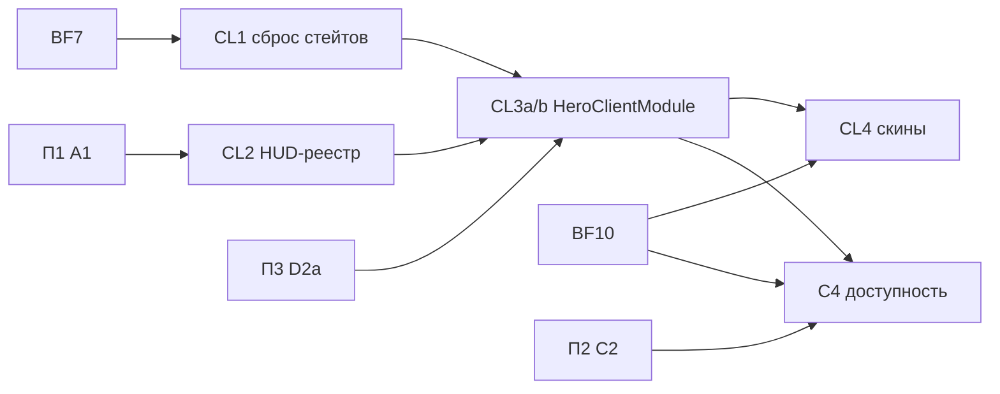

# План 4 — клиентские модули героев: Implementation Plan

> **For agentic workers:** REQUIRED SUB-SKILL: Use superpowers:subagent-driven-development (recommended) or superpowers:executing-plans to implement this plan task-by-task. Steps use checkbox (`- [ ]`) syntax for tracking.

**Goal:** Клиентская сторона героя принадлежит его `HeroClientModule`. Клиентские стейты сбрасываются сами, HUD собирается из реестра, клавиши-действия и скины регистрирует герой, доступность способностей приходит с сервера. `SuperheroesClient` не знает героев.

**Architecture:** Реестры `client/core` (`ClientSessionStates`, `HudLayers`, `HeroActionKeys`, `SkinResolver`, `PlayerLayers`) заменяют ручные списки в `SuperheroesClient`, `ClientNetworking`, `ModKeys`, `HudEditScreen` и ветки в skin-миксинах. Каждый герой получает client-модуль в явном списке `HeroClientModules`. Серверная доступность способностей синхронизируется attachment'ом, клиентская копия правил удаляется.

**Tech Stack:** Java 21, Minecraft 1.21.1 (Mojang mappings), Fabric Loader 0.19.2, Fabric API 0.116.12+1.21.1 (client networking, key binding, HUD render callback), Fabric Loom 1.16-SNAPSHOT, Fabric GameTest API, ArchUnit 1.5.1 (из П1).

## Global Constraints

- Mod id: `superheroes` — не меняется никогда.
- Персистентные идентификаторы не меняются: id способностей (`superheroes:<ability>`), предметов, сущностей, звуков (`sounds.json`), MobEffect, типов урона, attachments (`hero_data`, `reinhard_state`, `doomsday_progress`, `regulus_madness`, `regulus_bonus_life`, `admin_build`, `suit_variant`, `nano_form`, `control_lock_shadow`, `pandora_revived` и др.), data component `superheroes:bound_weapon`, **ResourceLocation-ы attribute-модификаторов** (`modifiers/<hero>/<stat>` — permanent-пассивки лежат в NBT игроков), имена `KeyMapping` (`key.superheroes.*` — лежат в `options.txt`), lang-ключи.
- Id сетевых payload'ов не персистентны: их можно менять только при семантически оправданном слиянии (стадия L2).
- Геймплей и баланс не меняются в архитектурных PR. Любое изменение поведения — отдельный коммит с пометкой `behavior:` в сообщении и отдельным пунктом в описании PR.
- Server-authoritative: всё клиентское — в `src/client`; `src/main` загружается выделенным сервером.
- Только публичные API: `net.fabricmc.fabric.api.*`, никакого `net.fabricmc.fabric.impl.*`.
- Сеть — типизированные `CustomPacketPayload` + `StreamCodec`.
- `HeroDataStore` — единственный писатель `HERO_DATA` (`ProjectSanityTest.assertHeroDataHasSingleWriter`).
- Lifecycle-очистка — только через `PlayerLifecycle` (серверный поток), никогда через `ServerPlayConnectionEvents.DISCONNECT`.
- Mixins: узкие, `@Unique` для внедрённых членов, `@WrapOperation` предпочтительнее `@Redirect`.
- Звуки только OGG Vorbis; перед новыми ассетами проверять `art-source/`.
- `en_us.json` и `ru_ru.json` меняются вместе.
- `src/main/generated/` — только через `./gradlew runDatagen --no-daemon`; diff обязан быть пустым, если стадия не меняет данные намеренно.
- Финишный гейт каждого PR: `./gradlew qualityGate --no-daemon` зелёный.
- Runtime-изменения (ввод, рендер, HUD, сеть, VFX, сущности) — `./gradlew runClient --no-daemon`; если окружение не может запустить клиент, PR прямо это говорит.
- Никаких Gradle-модулей на героя, никакого big-bang rewrite, никакой перестановки файлов без смены владения.
- PR: заголовок на русском, тело начинается с «Для игрока», ниже — полная техническая часть; коммиты `feat(scope):`/`fix(scope):`/`refactor(scope):`/`test(scope):`/`docs(scope):` на английском.
- `SESSION.md` обновляется в каждом PR этого плана; статус стадии отмечается в таблице «Статус стадий» этого файла.

---

## Как исполнять этот план

- Карта всей миграции, исходное состояние, целевая архитектура и сквозные политики (mixin, сеть) — в [`00-overview.md`](00-overview.md). Другие планы для этой работы читать не нужно.
- Одна стадия = один PR (CL3 — два PR-units). Все стадии заданы паспортами с интерфейсами и кодом ключевых типов; первый шаг каждой — **«Сверка»**: перечитать перечисленные файлы на актуальном `main` и обновить список касаний в описании PR.
- Если на актуальном коде проблема уже решена иначе (особенно BF7 и BF10) — используем существующее решение и фиксируем это в PR и в разделе «Решения» этого плана. Откатывать рабочее решение ради буквального соответствия плану нельзя.
- Пути: `M/` = `src/main/java/com/example/superheroes/`, `C/` = `src/client/java/com/example/superheroes/client/`, `T/` = `src/test/java/com/example/superheroes/`, `G/` = `src/gametest/java/com/example/superheroes/gametest/`.
- Шаблон паспорта: **Цель · Почему · Зависит от · Затрагивает · Создаётся · Мигрируется · Удаляется · Старые пути, которых больше нет · Нельзя менять · Тесты · Runtime · Acceptance · Риски · Страховка.** Global Constraints в паспортах не повторяются.

Каждая стадия заканчивается одинаково (шаги не повторяются в каждой задаче):

- [ ] `./gradlew qualityGate --no-daemon` → `BUILD SUCCESSFUL`.
- [ ] Если стадия трогала datagen-источники: `./gradlew runDatagen --no-daemon` и `git diff --stat src/main/generated` → пусто (или только намеренные изменения, перечисленные в PR).
- [ ] Обновить «Статус стадий» этого плана, `SESSION.md` и при необходимости раздел «Решения».
- [ ] PR по правилам AGENTS.md §12; в технической части — baseline-метрики (`00-overview.md` §3.3) «до/после» для затронутых строк.

### Статус стадий

| Стадия | Статус | PR |
| :-- | :-- | :-- |
| CL1 автосброс клиентских стейтов | ⏳ | |
| CL2 реестр HUD-слоёв | ⏳ | |
| CL3a API и receiver'ы client-модулей | ⏳ | |
| CL3b клавиши, HUD, рендереры, стейты в модули | ⏳ | |
| CL4 скины и слои игрока | ⏳ | |
| C4 доступность способностей с сервера | ⏳ | |

## Контекст

- Baseline (`00-overview.md` §3.3): `SuperheroesClient` — 393 строки; 26 `Client*State`, у 13 есть reset/clear; 37 HUD-классов, 9 используют `HudLayoutManager`; 36 клиентских receiver'ов; 19 клиентских mixins.
- Внешние зависимости: П1 A1 (клиентские ArchUnit-правила) — до CL2; П3 D2a (`HeroModules`, порядок героев) — до CL3; П2 C2 (хуки `Hero`) — до C4; BF7 (клиентская сессия, клавиши) — до CL1; BF10 (synced публичный вид героя) — до CL4 и C4.
- Сквозные политики, которые применяет план: mixin policy и сеть — `00-overview.md` §6.1, §6.2 (решение R12).
- Этот план не делает: физический перенос клиентских файлов героев в `client/hero/<id>/` — только регистрации (перенос — П5, П6); лучевые рендереры (П6 L2); звуковой mixin Reinhard и декорации радиалки (П5 G2).

### Решения

Решений уровня плана пока нет; решения, принятые при исполнении, записываются сюда.

## Зависимости стадий



CL1 и CL2 независимы. CL4 и C4 после CL3 идут параллельно.

## File Structure

| Файл | Ответственность | Стадия |
| :-- | :-- | :-- |
| `C/core/session/{ClientSessionState,ClientSessionStates}.java` | единый сброс клиентских стейтов | CL1 |
| `C/core/hud/{HudLayer,MovableHud,HudBounds,HudLayers}.java` | реестр HUD, порядок, перемещаемость | CL2 |
| `C/core/module/{HeroClientModule,HeroClientContext,CoreClientContext,HeroClientModules}.java` | клиентский модульный seam | CL3 |
| `C/core/input/HeroActionKeys.java` | клавиши-действия героев | CL3 |
| `C/hero/<id>/<Id>ClientModule.java` ×22 | клиентская проводка героя | CL3 |
| `C/core/render/{SkinProvider,SkinResolver,PlayerLayers}.java` | скины и feature-слои без веток героев | CL4 |
| `M/core/ability/AbilityAvailability.java` | серверная доступность способностей | C4 |

Удаляется: ручные списки в `SuperheroesClient`, hero-строки в `ClientNetworking` и `ModKeys`, `HudLayoutManager.ALL`, копия layout-математики в `HudEditScreen`, `C/ClientAbilityFilter.java`.

## Стадии

### Стадия CL1 — клиентское состояние сбрасывается само

- **Цель:** каждый `Client*State` зарегистрирован в одном месте сброса; новый стейт не может «залипнуть» между мирами.
- **Почему:** Opus B15 / долг 9, структурный S8: 26 стейтов, ручной сброс 9–13 из них в `SuperheroesClient`.
- **Зависит от:** **BF7** (клиентская сессия с TTL). Если BF7 создал хаб сброса — `ClientSessionStates` **не создаётся**, используется хаб BF7, а ниже меняются только имена; второй хаб запрещён.
- **Создаётся:** `C/core/session/ClientSessionState.java`, `C/core/session/ClientSessionStates.java`.

```java
package com.example.superheroes.client.core.session;

/** Client state that belongs to one connection and must be dropped when it ends or a new one starts. */
@FunctionalInterface
public interface ClientSessionState {
	void reset();
}
```

```java
package com.example.superheroes.client.core.session;

import com.example.superheroes.SuperheroesMod;
import net.fabricmc.fabric.api.client.networking.v1.ClientPlayConnectionEvents;

import java.util.ArrayList;
import java.util.List;

public final class ClientSessionStates {
	private static final List<ClientSessionState> STATES = new ArrayList<>();

	private ClientSessionStates() {
	}

	public static void register(ClientSessionState state) {
		STATES.add(state);
	}

	public static void init() {
		ClientPlayConnectionEvents.DISCONNECT.register((handler, client) -> resetAll());
		ClientPlayConnectionEvents.JOIN.register((handler, sender, client) -> resetAll());
	}

	static void resetAll() {
		for (ClientSessionState state : STATES) {
			try {
				state.reset();
			} catch (Throwable t) {
				SuperheroesMod.LOGGER.error("client session state reset failed", t);
			}
		}
	}
}
```

- **Мигрируется:** блок `ClientPlayConnectionEvents.DISCONNECT` в `SuperheroesClient` → `ClientSessionStates.register(X::clear)` для каждого стейта; 13 стейтов без `clear/reset` получают `static void reset()` (обнуление ровно тех полей, что сбрасывает отключение/новый мир). Сброс на `JOIN` — новое поведение (защищает от краша клиента без `DISCONNECT`) → `behavior:` коммит.
- **Создаётся правило (замороженное):** классы `C/Client*State` имеют статический метод `reset` или `clear`.

```java
	@Test
	void clientStatesCanBeReset() {
		FreezingArchRule.freeze(classes().that().haveSimpleNameStartingWith("Client").and().haveSimpleNameEndingWith("State")
				.should(new ArchCondition<>("declare a static reset() or clear()") {
					@Override
					public void check(JavaClass c, ConditionEvents events) {
						boolean ok = c.getMethods().stream().anyMatch(m -> m.getModifiers().contains(JavaModifier.STATIC)
								&& (m.getName().equals("reset") || m.getName().equals("clear")) && m.getRawParameterTypes().isEmpty());
						if (!ok) {
							events.add(SimpleConditionEvent.violated(c, c.getName() + " cannot be reset"));
						}
					}
				}))
				.check(CodexClasses.mainAndClient());
	}
```

- **Тесты:** JUnit недоступен для клиентских классов (нет клиента в тестовом classpath) — проверка через правило выше и runtime.
- **Runtime:** `runClient`: войти в мир как Reinhard, включить Time Slow, выйти в меню, зайти в другой мир — звуки мира слышны (Opus B15); повторить для Pandora-ролика.
- **Acceptance:** в `SuperheroesClient` нет ручного списка сброса; store правила пуст.

### Стадия CL2 — реестр HUD-слоёв

- **Цель:** порядок отрисовки, перемещаемость и превью в редакторе выводятся из одного реестра.
- **Почему:** структурный S9: 24 жёстких вызова HUD в `SuperheroesClient:161-199`, фиксированный `HudLayoutManager.ALL`, `HudEditScreen` с копией layout-математики каждого HUD (`:198-243`).
- **Зависит от:** A1.
- **Сверка:** прочитать `SuperheroesClient` (регистрация HUD), `HudLayoutManager`, `HudEditScreen`; выписать текущий порядок HUD и 7 id перемещаемых элементов (id **персистентны** — лежат в клиентском конфиге раскладки).
- **Создаётся:** `C/core/hud/{HudLayer,MovableHud,HudBounds,HudLayers}.java`.

```java
package com.example.superheroes.client.core.hud;

import net.minecraft.client.DeltaTracker;
import net.minecraft.client.gui.GuiGraphics;

@FunctionalInterface
public interface HudLayer {
	void render(GuiGraphics graphics, DeltaTracker delta);
}
```

```java
package com.example.superheroes.client.core.hud;

/** A HUD element the player can drag in the HUD editor. {@link #layoutId()} is persisted in the layout config. */
public interface MovableHud {
	String layoutId();

	/** Where the element is drawn at the current offset — the same math its render uses. */
	HudBounds bounds(int screenWidth, int screenHeight);
}
```

```java
package com.example.superheroes.client.core.hud;

public record HudBounds(int x, int y, int width, int height) {
}
```

```java
package com.example.superheroes.client.core.hud;

import net.fabricmc.fabric.api.client.rendering.v1.HudRenderCallback;
import net.minecraft.resources.ResourceLocation;
import org.jetbrains.annotations.Nullable;

import java.util.ArrayList;
import java.util.Comparator;
import java.util.List;

/** Single HudRenderCallback for the mod; layers draw in ascending {@code order}, ties in registration order. */
public final class HudLayers {
	public record Entry(int order, ResourceLocation id, HudLayer layer, @Nullable MovableHud movable) {
	}

	private static final List<Entry> ENTRIES = new ArrayList<>();
	private static List<Entry> sorted = List.of();

	private HudLayers() {
	}

	public static void register(int order, ResourceLocation id, HudLayer layer) {
		add(new Entry(order, id, layer, null));
	}

	public static void registerMovable(int order, ResourceLocation id, HudLayer layer, MovableHud movable) {
		add(new Entry(order, id, layer, movable));
	}

	public static void init() {
		HudRenderCallback.EVENT.register((graphics, delta) -> {
			for (Entry entry : sorted) {
				entry.layer().render(graphics, delta);
			}
		});
	}

	public static List<MovableHud> movables() {
		return sorted.stream().map(Entry::movable).filter(java.util.Objects::nonNull).toList();
	}

	private static void add(Entry entry) {
		ENTRIES.add(entry);
		List<Entry> copy = new ArrayList<>(ENTRIES);
		copy.sort(Comparator.comparingInt(Entry::order));
		sorted = List.copyOf(copy);
	}
}
```

- **Мигрируется:** каждый вызов HUD в `SuperheroesClient` → `HudLayers.register(order, id, X::render)` с `order` = позиция в текущем списке × 100 (оставляет место для вставок); 5 перемещаемых HUD реализуют `MovableHud` (их `bounds` — та же математика, что сейчас продублирована в `HudEditScreen`); `HudLayoutManager.ALL` → `HudLayers.movables()`; `HudEditScreen` итерирует `movables()` и рисует `bounds(...)`. Обёртка `MeleeChargeHud` из `SuperheroesClient.java:187-194` становится его собственным `MovableHud`.
- **Удаляется:** жёсткий список HUD в `SuperheroesClient`, `switch` с копией математики в `HudEditScreen`, `HudLayoutManager.ALL`.
- **Нельзя менять:** z-order, id раскладки, внешний вид. Геройские HUD на этой стадии регистрируются **из `SuperheroesClient`** (они переедут в client-модули в CL3b/волнах).
- **Runtime:** `runClient`: скриншоты HUD Homelander, Iron Man, Reinhard, Regulus до/после совпадают; редактор HUD показывает те же 7 элементов в тех же рамках; перетаскивание сохраняется между перезапусками.
- **Acceptance:** `grep -c 'Hud.render\|Hud::render' C/SuperheroesClient.java` → 0 (только `HudLayers.register`).

### Стадия CL3 — `HeroClientModule`: клиентская точка владения героя

- **Цель:** у каждого героя есть `client/hero/<id>/<Id>ClientModule`, через который он регистрирует receiver'ы своих payload'ов, клавиши-действия, HUD-слои, рендереры сущностей и сброс стейтов.
- **Почему:** модульный аудит §5 (client), структурный S10 (клавиши героев в entrypoint, ветки `IronManHero.ID` в `SuperheroesClient`), Opus-долг 9.
- **Зависит от:** CL1, CL2, D2a.
- **Создаётся:** `C/core/module/{HeroClientModule,HeroClientContext,CoreClientContext,HeroClientModules}.java`, `C/core/input/HeroActionKeys.java`, 22 `C/hero/<id>/<Id>ClientModule.java`.

```java
package com.example.superheroes.client.core.module;

import net.minecraft.resources.ResourceLocation;

public interface HeroClientModule {
	ResourceLocation heroId();

	void register(HeroClientContext ctx);
}
```

```java
package com.example.superheroes.client.core.module;

import com.example.superheroes.client.core.hud.HudLayer;
import com.example.superheroes.client.core.hud.MovableHud;
import com.example.superheroes.client.core.session.ClientSessionState;
import net.fabricmc.fabric.api.client.networking.v1.ClientPlayNetworking;
import net.minecraft.client.KeyMapping;
import net.minecraft.client.Minecraft;
import net.minecraft.network.protocol.common.custom.CustomPacketPayload;
import net.minecraft.resources.ResourceLocation;

import java.util.function.Consumer;

public interface HeroClientContext {
	<T extends CustomPacketPayload> void receive(CustomPacketPayload.Type<T> type, ClientPlayNetworking.PlayPayloadHandler<T> handler);

	void sessionState(ClientSessionState state);

	void hud(int order, ResourceLocation id, HudLayer layer);

	void movableHud(int order, ResourceLocation id, HudLayer layer, MovableHud movable);

	/**
	 * Registers a hero action key. {@code onPress} runs once per press, only while the local player is this module's
	 * hero. The mapping's name must stay the one already in players' options.txt.
	 */
	KeyMapping actionKey(KeyMapping mapping, Consumer<Minecraft> onPress);
}
```

  `CoreClientContext` создаётся на каждый модуль (`new CoreClientContext(module.heroId())`), потому что `actionKey` фильтрует по герою модуля; `HeroActionKeys` держит пары `(mapping, heroId, onPress)`, регистрирует `KeyBindingHelper.registerKeyBinding` и один `ClientTickEvents.END_CLIENT_TICK`, в котором `while (mapping.consumeClick())` вызывает `onPress`, если текущий герой = `heroId` (механизм опроса — тот, что выбрал BF7; если BF7 перевёл клавиши на `consumeClick`, использовать его реализацию).
- **PR-units:**
  - **CL3a:** API + 22 тонких client-модуля + `HeroClientModules` (явный список в том же порядке, что `HeroModules`) + перенос **hero-specific receiver'ов** из `C/network/ClientNetworking` в client-модули (core-receiver'ы — активация, привязка, `HeroData`, ресурсы, кулдауны, тряска — остаются в `ClientNetworking`, который становится `C/core/net`-частью в E2).
  - **CL3b:** клавиши `RAIDEN_SWORD_DRAW`, `NANO_WEAPON`, `ESP_TOGGLE` → `actionKey` модулей Raiden/Iron Man (имена `KeyMapping` без изменений); ветки `IronManHero.ID.equals` в `SuperheroesClient:248-252,296-317` → обработчики модуля Iron Man; регистрации геройских HUD (из CL2) → `ctx.hud`; рендереры геройских сущностей (`ShadowSoldier`, `KageBunshin`, `ShieldProjectile`, `SmartMissile`, `Ram`, `IronLegionDrone`) → их client-модули; стейты → `ctx.sessionState`.
- **Удаляется:** hero-specific строки в `ClientNetworking`, `ModKeys`, `SuperheroesClient`.
- **Нельзя менять:** имена `KeyMapping` и дефолтные клавиши; число слотов способностей (8) и их подписи; поведение клавиш.
- **Тесты:** ArchUnit `sharedClientCodeDoesNotDependOnConcreteHeroes` — store теряет записи `SuperheroesClient`, `ClientNetworking`, `ModKeys`; `clientHeroModulesAreReferencedOnlyByThemselvesAndTheModuleList` строго зелёное.
- **Runtime:** `runClient`: у Raiden срабатывает Sword Draw, у Iron Man — нано-оружие и ESP; у другого героя эти клавиши ничего не делают (как раньше); `options.txt` после перезапуска сохраняет переназначенные клавиши.
- **Acceptance:** `SuperheroesClient` не импортирует ни одного героя; `ClientNetworking` содержит только core-receiver'ы.

**Дополнение к CL3b (mixin policy):**

Accessor, нужный только клиенту (`LightningBoltAccessor` используется `client.render.lightning`), переезжает в клиентский mixin-конфиг (стадия CL3b) — это разрывает ребро `client.render.lightning → mixin`.

### Стадия CL4 — скины и слои игрока через резолвер

- **Цель:** два skin-миксина и регистрация feature-слоёв не знают героев.
- **Почему:** модульный аудит §3 (Sung: второй скин выбирается в двух миксинах по разным условиям), структурный S7/S8; Opus B14.
- **Зависит от:** **BF10** (synced публичный вид героя), CL3.
- **Сверка:** тип публичного вида героя, который ввёл BF10 (ниже — `PublicHeroView`; если BF10 назвал иначе — использовать его тип и имя в сигнатурах), и точные условия в `AbstractClientPlayerSkinMixin:26-56`, `PlayerRendererMixin:39-58`, `PlayerModelPoseMixin`.
- **Создаётся:** `C/core/render/{SkinProvider,SkinResolver,PlayerLayers}.java`.

```java
package com.example.superheroes.client.core.render;

import net.minecraft.client.player.AbstractClientPlayer;
import net.minecraft.resources.ResourceLocation;
import org.jetbrains.annotations.Nullable;

/** Hero-owned skin choice. Both methods return {@code null} to fall back to the hero's default skin / vanilla model. */
public interface SkinProvider {
	@Nullable
	ResourceLocation skin(AbstractClientPlayer player, PublicHeroView view);

	@Nullable
	default Boolean slimModel(AbstractClientPlayer player, PublicHeroView view) {
		return null;
	}
}
```

  `SkinResolver.register(ResourceLocation heroId, SkinProvider provider)` (через `HeroClientContext.skin(SkinProvider)`, метод добавляется в контекст этой стадией) и `SkinResolver.resolve(AbstractClientPlayer)`: вид героя → провайдер его героя → `Hero.getSkinTexture()` → `null`. Миксины вызывают только `SkinResolver`. `PlayerLayers.register(Function<PlayerRenderer, RenderLayer<…>>)` (через `HeroClientContext.playerLayer(...)`) заменяет перечисление `RemOniHornFeatureRenderer`, `ReinhardScabbardLayer`, `IronManNanoFormLayer`, `NanoSuitUpLayer` в `SuperheroesClient:99-104`.
- **Мигрируется:** ветки Homelander/Sung/Thanos/Iron Man из skin-миксинов → `SkinProvider` соответствующих client-модулей; **оба** текущих условия Sung (`hasShadows` для текстуры, `isPhase2` для рендера) сохраняются как есть, каждое в своём методе провайдера, с комментарием о расхождении (выравнивание — отдельное решение владельца).
- **Нельзя менять:** какой скин видит владелец и другие игроки в каждом состоянии.
- **Runtime:** `runClient` + второй клиент (или `runClient` с ботом-игроком через `/player`, если доступен Carpet — иначе один клиент и F5): Sung фаза 1/2, Thanos с камнями, Iron Man варианты костюма, Homelander.
- **Acceptance:** ArchUnit store: нет записей skin-миксинов → героев.

---

### Стадия C4 — клиент получает доступность способностей от сервера

- **Цель:** удалить `C/ClientAbilityFilter` (клиентская копия тиров Doomsday, камней Thanos, дома Pandora, режима Rem).
- **Почему:** дублирование серверных правил на клиенте (Opus-долг 4, аудит 2 §4.3); расхождение уже есть (таблица тиров записана дважды).
- **Зависит от:** C2, CL3, **BF10** (паттерн synced attachment).
- **Сверка:** прочитать `ClientAbilityFilter.visible()` и всех его потребителей: какие состояния нужны (скрыта / показана заблокированной / доступна).
- **Создаётся:** `M/core/ability/AbilityAvailability.java` — `record AbilityAvailability(Map<ResourceLocation, Visibility> entries)` с `enum Visibility { AVAILABLE, LOCKED, HIDDEN }`, `CODEC` и `STREAM_CODEC`; attachment `superheroes:ability_availability` (non-persistent, sync только владельцу — тем же механизмом, что выбрал BF10); хук `Hero.visibility(ServerPlayer, ResourceLocation) → Visibility` (default `AVAILABLE`), реализации у Doomsday, Thanos, Pandora, Rem — ровно логика `ClientAbilityFilter`, переписанная на серверные источники; dispatcher-хук `players(LATE, …)` пересчитывает и пишет attachment **только при изменении**.
- **Удаляется:** `C/ClientAbilityFilter.java`, клиентские копии таблиц тиров.
- **Нельзя менять:** что игрок видит в радиалке/панели при каждом состоянии.
- **Тесты:** GameTest: Doomsday тир 1 → `DOOMSDAY_DOOM_GRIP` = `HIDDEN|LOCKED` (как сейчас на клиенте); после повышения тира — `AVAILABLE`; attachment меняется не чаще, чем меняется состояние.
- **Runtime:** `runClient`: радиалка Doomsday/Thanos/Pandora/Rem на разных состояниях совпадает со скриншотами до стадии.

---

## Готово, когда

- `SuperheroesClient` не импортирует ни одного героя; `ClientNetworking` содержит только core-receiver'ы.
- Store правил `sharedClientCodeDoesNotDependOnConcreteHeroes` и `clientStatesCanBeReset` не содержит записей `SuperheroesClient`, `ClientNetworking`, `ModKeys`, skin-миксинов и `Client*State`.
- `ClientAbilityFilter` удалён; радиалка и панель показывают то же, что до плана.
- Runtime-чек-листы CL1–CL4 и C4 пройдены (или в PR прямо указано, что игру запустить не удалось).

## Self-Review

- **Покрытие:** CL1, CL2, CL3, CL4, C4 из исходного плана перенесены целиком, плюс пункт mixin policy про `LightningBoltAccessor`.
- **Что используют следующие планы:** `ClientSessionState.reset`, `ClientSessionStates.register/init`; `HudLayer`, `MovableHud.layoutId/bounds`, `HudBounds`, `HudLayers.register/registerMovable/init/movables`; `HeroClientModule.heroId/register`, `HeroClientContext.receive/sessionState/hud/movableHud/actionKey/skin/playerLayer`, `HeroClientModules`; `SkinProvider`, `SkinResolver.register/resolve`, `PlayerLayers.register`; `AbilityAvailability`, `Hero.visibility(ServerPlayer, ResourceLocation)`.

## Execution Handoff

Исполнение: **Subagent-Driven (рекомендуется)** — свежий субагент на стадию, ревью между стадиями (superpowers:subagent-driven-development), или **Inline** с контрольными точками (superpowers:executing-plans). CL2 стартует сразу после П1 A1, CL1 — после BF7.

При параллельном исполнении несколькими субагентами оркестратор раздаёт задачи этого плана по `00-overview.md` §11 «Оркестрация».
