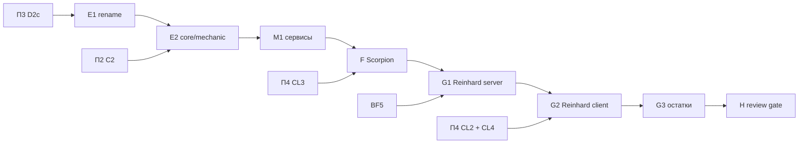

# План 5 — слои, сервисы механик и пилоты Scorpion и Reinhard: Implementation Plan

> **For agentic workers:** REQUIRED SUB-SKILL: Use superpowers:subagent-driven-development (recommended) or superpowers:executing-plans to implement this plan task-by-task. Steps use checkbox (`- [ ]`) syntax for tracking.

**Goal:** Перевести проект в конечную раскладку пакетов и доказать seam на двух героях: Scorpion (пилот) и Reinhard (stress-test) целиком живут в своих модулях, после чего review gate решает, можно ли тиражировать seam.

**Architecture:** Один механический PR переименовывает корень. Затем контракты ядра переезжают в `core/`, общие механики — в `mechanic/`, и строгие ArchUnit-правила начинают охранять реальный код. Сервисы `Motion`, `FxBroadcast`, `Targeting` забирают правила, которые сейчас скопированы по героям. Registrar'ы контента, payload'ов и attachments появляются там, где они впервые нужны: у Scorpion и Reinhard.

**Tech Stack:** Java 21, Minecraft 1.21.1 (Mojang mappings), Fabric Loader 0.19.2, Fabric API 0.116.12+1.21.1, Fabric Loom 1.16-SNAPSHOT, JUnit 5.10.2, Fabric GameTest API, ArchUnit 1.5.1 (из П1), Veil 4.1.2 (опционально на клиенте).

## Global Constraints

- Mod id: `superheroes` — не меняется никогда.
- Персистентные идентификаторы не меняются: id способностей (`superheroes:<ability>`), предметов, сущностей, звуков (`sounds.json`), MobEffect, типов урона, attachments (`hero_data`, `reinhard_state`, `doomsday_progress`, `regulus_madness`, `regulus_bonus_life`, `admin_build`, `suit_variant`, `nano_form`, `control_lock_shadow`, `pandora_revived` и др.), data component `superheroes:bound_weapon`, **ResourceLocation-ы attribute-модификаторов** (`modifiers/<hero>/<stat>` — permanent-пассивки лежат в NBT игроков), имена `KeyMapping` (`key.superheroes.*` — лежат в `options.txt`), lang-ключи.
- Id сетевых payload'ов не персистентны: их можно менять только при семантически оправданном слиянии (стадия L2).
- Геймплей и баланс не меняются в архитектурных PR. Любое изменение поведения — отдельный коммит с пометкой `behavior:` в сообщении и отдельным пунктом в описании PR.
- Server-authoritative: всё клиентское — в `src/client`; `src/main` загружается выделенным сервером.
- Только публичные API: `net.fabricmc.fabric.api.*`, никакого `net.fabricmc.fabric.impl.*`.
- Сеть — типизированные `CustomPacketPayload` + `StreamCodec`.
- `HeroDataStore` — единственный писатель `HERO_DATA` (`ProjectSanityTest.assertHeroDataHasSingleWriter`).
- Lifecycle-очистка — только через `PlayerLifecycle` (серверный поток), никогда через `ServerPlayConnectionEvents.DISCONNECT`.
- Mixins: узкие, `@Unique` для внедрённых членов, `@WrapOperation` предпочтительнее `@Redirect`.
- Звуки только OGG Vorbis; перед новыми ассетами проверять `art-source/`.
- `en_us.json` и `ru_ru.json` меняются вместе.
- `src/main/generated/` — только через `./gradlew runDatagen --no-daemon`; diff обязан быть пустым, если стадия не меняет данные намеренно.
- Финишный гейт каждого PR: `./gradlew qualityGate --no-daemon` зелёный.
- Runtime-изменения (ввод, рендер, HUD, сеть, VFX, сущности) — `./gradlew runClient --no-daemon`; если окружение не может запустить клиент, PR прямо это говорит.
- Никаких Gradle-модулей на героя, никакого big-bang rewrite, никакой перестановки файлов без смены владения.
- PR: заголовок на русском, тело начинается с «Для игрока», ниже — полная техническая часть; коммиты `feat(scope):`/`fix(scope):`/`refactor(scope):`/`test(scope):`/`docs(scope):` на английском.
- `SESSION.md` обновляется в каждом PR этого плана; статус стадии отмечается в таблице «Статус стадий» этого файла.

---

## Как исполнять этот план

- Карта всей миграции, исходное состояние, целевая архитектура (§5) и сквозные политики — в [`00-overview.md`](00-overview.md). Другие планы для этой работы читать не нужно.
- Одна стадия = один PR (F — F1 server и F2 client; G — G1, G2, G3). F расписан по шагам с кодом. Остальные стадии заданы паспортами, и их первый шаг — **«Сверка»**: перечитать перечисленные файлы на актуальном `main` и обновить список касаний в описании PR.
- Если на актуальном коде проблема уже решена иначе — используем существующее решение и фиксируем это в PR и в разделе «Решения» этого плана. Откатывать рабочее решение ради буквального соответствия плану нельзя.
- Пути: `M/` = `src/main/java/com/example/superheroes/`, `C/` = `src/client/java/com/example/superheroes/client/`, `T/` = `src/test/java/com/example/superheroes/`, `G/` = `src/gametest/java/com/example/superheroes/gametest/`. После стадии `E1` корень пакета меняется (см. `E1`), относительные пути остаются теми же; `<root>` в коде ниже — новый корень.
- Шаблон паспорта: **Цель · Почему · Зависит от · Затрагивает · Создаётся · Мигрируется · Удаляется · Старые пути, которых больше нет · Нельзя менять · Тесты · Runtime · Acceptance · Риски · Страховка.** Global Constraints в паспортах не повторяются.

Каждая стадия заканчивается одинаково (шаги не повторяются в каждой задаче):

- [ ] `./gradlew qualityGate --no-daemon` → `BUILD SUCCESSFUL`.
- [ ] Если стадия трогала datagen-источники: `./gradlew runDatagen --no-daemon` и `git diff --stat src/main/generated` → пусто (или только намеренные изменения, перечисленные в PR).
- [ ] Обновить «Статус стадий» этого плана, `SESSION.md` и при необходимости раздел «Решения».
- [ ] PR по правилам AGENTS.md §12; в технической части — baseline-метрики (`00-overview.md` §3.3) «до/после» для затронутых строк.

### Статус стадий

| Стадия | Статус | PR |
| :-- | :-- | :-- |
| E1 переименование корня (барьер) | ⏳ | |
| E2 скелет `core/` и `mechanic/` | ⏳ | |
| M1 `Motion`, `FxBroadcast`, `Targeting` | ⏳ | |
| F1 Scorpion — сервер | ⏳ | |
| F2 Scorpion — клиент | ⏳ | |
| G1 Reinhard — сервер | ⏳ | |
| G2 Reinhard — клиент | ⏳ | |
| G3 Reinhard — межгеройские остатки | ⏳ | |
| H architecture review gate | ⏳ | |

## Контекст

- Внешние зависимости: П3 закончен (D2c — до E1); П4 закончен (CL3 — до F, CL2 и CL4 — до G2); П2 закончен (C2 — до E2; B2 желательна до F); BF5 (B11 time slow) — до G1; решение владельца R14 — до E1; барьер E1 — ни одного открытого PR, трогающего `src/`.
- Межплановые принципы: R6 (циклы рвутся владением, rename — один барьер) и R7 (где живёт Veil/compat) — `00-overview.md` §4. Целевая раскладка и правила зависимостей — `00-overview.md` §5.
- Этот план не делает: перенос остальных 20 героев, content-модулей и слияние лучей — всё это П6.

### Проверенные footprints пилотов

**Scorpion** (свои файлы: `M/hero/ScorpionHero`, `M/ability/Scorpion{Spear,Hellfire,FireTeleport,HellBreath}Ability`, `M/effect/ScorpionController` (264 строки, статические `SPEAR_PULLS`, `BREATHS`, собственный `END_SERVER_TICK`, `isScorpion`-проверка), `M/effect/ScorpionFx`, `M/item/ScorpionKunaiItem` (предмет трансформации), `M/network/ScorpionFxS2CPayload`, `C/fx/ClientScorpionFx`, `C/fx/VeilScorpionFx`). Shared-касания: `SuperheroesMod:44`, `AbilityIds:139-142`, `AbilityRegistry:139-142,262-265`, `HeroAttributes:402-407,437-443`, `HeroHudConfig:49`, `HeroTheme:233`, `Heroes:32,59`, `ModItemGroups:71`, `ModItems:210-212`, `ModNetworking:55`, `ModSounds:33`, `ClientNetworking:86-87`. `SPEAR_PULLS`/`BREATHS` не очищаются ни на leave, ни на `SERVER_STOPPED` (не попали в списки BF3).

**Reinhard**: 37 своих файлов (8 способностей, 8 контроллеров в `effect/`, `ReinhardState` + attachment `REINHARD_STATE`, 7 payload'ов, `ReinhardSuitItem`, `RoyalIcicleItem` (bound weapon), 5 `ClientReinhard*State`, 3 HUD-оверлея, `ReinhardWishScreen`, `ReinhardScabbardLayer`) и shared-касания: `AbilityIds.isReinhardSwordOnly:153-158`, `SuperJumpController:38`, `HeavensStrikeController:38` (мёртвый `Variant.REINHARD`), `AdminAbilityDebug:11`, `RadialMenuHud:275-278`, `SoundEngineMixin:16-20`, `HeroTransformService:156,195`, `ReinhardController:419-424` (перечень чужих лучевых типов урона), `ReinhardTimeSlowController:135` (`setTickRate`, B11), `CombatImpactEngine:316`, `JarvisThreatClass:46`, `HeroAttributes`, `HeroTheme`, `HeroHudConfig`, `Heroes`, `ModItems`, `ModItemGroups`, `ModAttachments`, `ModNetworking`, `ModSounds`, `ClientNetworking`, `SuperheroesClient:102`, `AbilityDescriptions`, `PassiveIcons`.

### Решения

| # | Вопрос / расхождение | Что говорит код сейчас | Решение |
| :-- | :-- | :-- | :-- |
| R11 | Структурный M6: `Feedback.actionBar` | `displayClientMessage` — однострочный ванильный вызов без правил | Сервис `Feedback` не создаём (нет правила, которое могло бы разойтись). `Motion`, `Targeting`, `FxBroadcast` создаём — у них есть правила (синхронизация скорости, PvP/союзники/спектаторы, адресаты). |
| R14 | Имя нового корневого пакета | `com.example.superheroes` | Предлагаемое по умолчанию: `io.github.grebeshok105.codex`. Это решение владельца; `E1` не стартует без подтверждения, остальные стадии от имени не зависят. |

## Зависимости стадий



Стадии строго последовательны: каждая опирается на раскладку и registrar'ы предыдущей.

## File Structure

| Файл / пакет | Ответственность | Стадия |
| :-- | :-- | :-- |
| весь `src/**` | переименование корня `com.example.superheroes` → `<root>` | E1 |
| `<root>/core/{hero,ability,resource,transform,lifecycle,attachment,net}/` | контракты ядра, перенесённые из плоских пакетов | E2 |
| `<root>/mechanic/boundweapon/` | бывший `item/bound/` | E2 |
| `<root>/mechanic/motion/Motion.java`, `mechanic/fx/FxBroadcast.java`, `mechanic/targeting/{Targeting,TargetFilter}.java` | правила скорости, адресатов FX и выбора целей | M1 |
| `<root>/core/content/{ContentRegistrar,ModContent,CreativeTabContents}.java`, `core/net/PayloadRegistrar.java` | контент и payload'ы из модулей | F |
| `<root>/hero/scorpion/**`, `<root>/client/hero/scorpion/**` | модуль Scorpion (дерево — в стадии F) | F |
| `<root>/hero/reinhard/**`, `<root>/client/hero/reinhard/**`, `AttachmentRegistrar` | модуль Reinhard, attachments из модулей | G1, G2 |
| `<root>/core/net/C2SGuards.java` | проверка «игрок — тот герой» в C2S-handler'ах | G1 |
| `<root>/client/core/audio/ClientSoundFilters.java`, `client/core/hud/AbilityDecorations.java` | звуковой фильтр и декорации радиалки без веток героев | G2 |
| `data/superheroes/tags/damage_type/beam.json` (datagen) | лучевые типы урона тегом | G1 |
| `.agents/skills/migrate-hero/SKILL.md` | процедура переноса героя для П6 | H |

## Стадии

### Стадия E1 — переименование корневого пакета (барьер)

- **Цель:** убрать `com.example` из идентичности кода одним механическим PR.
- **Почему:** SESSION «Open work»; модульный аудит §7.0; все последующие физические переносы происходят уже в финальном корне.
- **Зависит от:** D2c; решение R14 (имя) подтверждено владельцем; **ни одного открытого PR, трогающего `src/`** (координация с bugfix-pass: этот PR сливается в окно, когда BF-ветки влиты или ещё не начаты).
- **Мигрируется:** `git mv` дерева `com/example/superheroes` → `<root>` во всех source set'ах (`main`, `client`, `test`, `gametest`, datagen); `package`/`import`/FQN-строки; `superheroes.mixins.json` и `superheroes.client.mixins.json` (`package`); `fabric.mod.json` entrypoints (main, client, fabric-datagen); `src/gametest/resources/fabric.mod.json`; `gradle.properties` `maven_group`; `ProjectSanityTest` пути (`SUPERHEROES_MOD`, `Heroes.java`); `CodexClasses.ROOT`; ArchUnit store — заменить старый корень новым (`sed` по файлам store; описания нарушений содержат FQN); `package-cycles-baseline.txt` не меняется (он относительный).
- **Нельзя менять:** mod id `superheroes`, id gametest-мода `superheroes-gametest`, ни одного ресурса и ассета.
- **Тесты:** весь `qualityGate`; `auditReleaseJarIsolation` проверяет, что в jar нет старого корня (`grep -c 'com/example' <jar list>` = 0 — добавить в задачу аудита).
- **Runtime:** `runClient` — мир загружается, герой из существующего сохранения на месте (persisted id не затронуты).
- **Acceptance:** `grep -rn 'com\.example' src/ build.gradle gradle.properties` → пусто.
- **Риски:** массовые конфликты — отсюда барьер. Внешние моды, ссылающиеся на классы по имени (falbiks), — сверка `grep -rn 'superheroes' src/main/java/**/falbiks src/main/java/**/ThanosCrossModSnapHook*` (там наши имена не используются, только чужие).
- **Страховка:** механический PR, откат revert; перед мержем — rebase на свежий `main` и повторный `qualityGate`.

### Стадия E2 — скелет `core/` и `mechanic/` со строгими слоями

- **Цель:** контракты ядра физически отделены; строгие правила `coreDependsOnNothingAboveIt`/`mechanicsDependOnlyOnCore` начинают охранять реальный код.
- **Почему:** структурный §2.2 (кольцо `ability ↔ hero ↔ effect ↔ transform ↔ network ↔ resource ↔ attachment`), M5; R6.
- **Зависит от:** E1, C2 (роутер без героев), D2c (transform без героев).
- **Мигрируется (только классы, которые проходят строгие правила; каждый перенос — вместе с владением):**
  - `hero/{Hero,Heroes,HeroProfile,CombatProfile,BleedProfile,ThreatClass,PassiveGlyph,HeroTheme,HeroHudConfig,AttributeModifierSet,LandingImpact}` + `physics/ImpactStyle` → `core/hero/`;
  - `ability/{Ability,AbilityRouter,AbilityRegistry,AbilityCooldowns}` → `core/ability/` (`AbilityIds` остаётся в `ability/` до раздела по героям);
  - `resource/*` → `core/resource/`; `transform/*` → `core/transform/`; `lifecycle/*` → `core/lifecycle/`;
  - shared attachments (`HERO_DATA`, `HERO_DATA_RESOURCES_DIRTY`, `CONTROL_LOCKS`, `HELD_LOCKS`, `CONTROL_LOCK_SHADOW`, `TRANSFORM_TICK`) → `core/attachment/CoreAttachments`; геройские остаются в `attachment/ModAttachments` до своих волн; id не меняются;
  - core-payload'ы и их регистрация (`ModNetworking`: активация, привязка, `HeroData`/ресурсы, кулдауны, тряска экрана, обломки) → `core/net/`; появляется `core/net/PayloadRegistrar` (сигнатуры в стадии F);
  - `item/bound/*` → `mechanic/boundweapon/`.
- **Не мигрируется здесь:** `flight/`, `physics/CombatImpactEngine` (ветка Iron Man), `effect/*` — они переедут с владельцами.
- **Удаляется:** пустые legacy-пакеты.
- **Нельзя менять:** поведение; id.
- **Тесты:** весь `qualityGate`; baseline циклов должен **уменьшиться** (записать число пар до/после).
- **Acceptance:** `coreDependsOnNothingAboveIt` и `mechanicsDependOnlyOnCore` проверяют > 0 классов (временно выключить `allowEmptyShould` в PR и убедиться, что правило не пустое, затем вернуть).

### Стадия M1 — сервисы механик: `Motion`, `FxBroadcast`, `Targeting`

- **Цель:** правила синхронизации скорости, адресатов FX и выбора целей живут в одном месте; герои используют их, а не копируют идиомы.
- **Почему:** структурный S5/S11: 124 `hurtMarked = true`, 78 ручных `ClientboundSetEntityMotionPacket`, 5 копий цикла `PlayerLookup.tracking`, 100 inline-предикатов целей (Opus B19 — PvP/союзники игнорируются в 21 копии).
- **Зависит от:** E2.
- **Создаётся:** `mechanic/motion/Motion.java`, `mechanic/fx/FxBroadcast.java`, `mechanic/targeting/{Targeting,TargetFilter}.java`, JUnit/GameTests.

```java
package <root>.mechanic.motion;

import net.minecraft.network.protocol.game.ClientboundSetEntityMotionPacket;
import net.minecraft.server.level.ServerPlayer;
import net.minecraft.world.entity.Entity;
import net.minecraft.world.phys.Vec3;

/** Server-side velocity changes that clients must see this tick. */
public final class Motion {
	public enum Sync {
		/** Mark only: vanilla's entity tracker sends the velocity on its next update. */
		MARK,
		/** Mark and push a motion packet to the entity itself right now if it is a player (client-authoritative movement). */
		MARK_AND_SEND_TO_PLAYER
	}

	private Motion() {
	}

	public static void set(Entity entity, Vec3 velocity, Sync sync) {
		entity.setDeltaMovement(velocity);
		entity.hurtMarked = true;
		if (sync == Sync.MARK_AND_SEND_TO_PLAYER && entity instanceof ServerPlayer player) {
			player.connection.send(new ClientboundSetEntityMotionPacket(player));
		}
	}

	public static void add(Entity entity, Vec3 delta, Sync sync) {
		set(entity, entity.getDeltaMovement().add(delta), sync);
	}
}
```

```java
package <root>.mechanic.fx;

import net.fabricmc.fabric.api.networking.v1.PlayerLookup;
import net.fabricmc.fabric.api.networking.v1.ServerPlayNetworking;
import net.minecraft.network.protocol.common.custom.CustomPacketPayload;
import net.minecraft.server.level.ServerLevel;
import net.minecraft.server.level.ServerPlayer;
import net.minecraft.world.entity.Entity;
import net.minecraft.world.phys.Vec3;

/** Who receives a visual-only payload. Pick the variant the call site used before; do not widen audiences silently. */
public final class FxBroadcast {
	private FxBroadcast() {
	}

	public static void tracking(Entity source, CustomPacketPayload payload) {
		for (ServerPlayer observer : PlayerLookup.tracking(source)) {
			ServerPlayNetworking.send(observer, payload);
		}
	}

	public static void trackingAndSelf(ServerPlayer source, CustomPacketPayload payload) {
		tracking(source, payload);
		ServerPlayNetworking.send(source, payload);
	}

	public static void around(ServerLevel level, Vec3 center, double radius, CustomPacketPayload payload) {
		for (ServerPlayer near : PlayerLookup.around(level, center, radius)) {
			ServerPlayNetworking.send(near, payload);
		}
	}
}
```

```java
package <root>.mechanic.targeting;

import net.minecraft.world.entity.Entity;
import net.minecraft.world.entity.LivingEntity;
import org.jetbrains.annotations.Nullable;

import java.util.function.Predicate;

/**
 * Explicit target rules. Every flag defaults to "off" so migrating a call site keeps its old predicate exactly;
 * turning on {@link #respectPvp}/{@link #excludeAllies} is a gameplay change (audit B19) and ships separately.
 */
public record TargetFilter(@Nullable Entity owner, boolean excludeOwner, boolean aliveOnly, boolean excludeSpectators,
		boolean respectPvp, boolean excludeAllies, @Nullable Predicate<LivingEntity> extra) {
	public static TargetFilter of(@Nullable Entity owner) {
		return new TargetFilter(owner, false, false, false, false, false, null);
	}

	public TargetFilter withoutOwner() { return new TargetFilter(owner, true, aliveOnly, excludeSpectators, respectPvp, excludeAllies, extra); }
	public TargetFilter alive() { return new TargetFilter(owner, excludeOwner, true, excludeSpectators, respectPvp, excludeAllies, extra); }
	public TargetFilter withoutSpectators() { return new TargetFilter(owner, excludeOwner, aliveOnly, true, respectPvp, excludeAllies, extra); }
	public TargetFilter and(Predicate<LivingEntity> more) { return new TargetFilter(owner, excludeOwner, aliveOnly, excludeSpectators, respectPvp, excludeAllies, extra == null ? more : extra.and(more)); }

	public boolean test(LivingEntity candidate) {
		if (excludeOwner && candidate == owner) return false;
		if (aliveOnly && !candidate.isAlive()) return false;
		if (excludeSpectators && candidate.isSpectator()) return false;
		if (respectPvp && owner instanceof net.minecraft.server.level.ServerPlayer attacker
				&& candidate instanceof net.minecraft.world.entity.player.Player victim && !attacker.canHarmPlayer(victim)) return false;
		if (excludeAllies && owner != null && owner.isAlliedTo(candidate)) return false;
		return extra == null || extra.test(candidate);
	}
}
```

  `Targeting.living(ServerLevel level, AABB box, TargetFilter filter)` → `level.getEntitiesOfClass(LivingEntity.class, box, filter::test)`.
- **Мигрируется в этой стадии:** 5 циклов `PlayerLookup.tracking` в `core/net`/`ModNetworking` → `FxBroadcast` (тот же набор адресатов в каждом месте). Геройские вызовы мигрируют в своих волнах (не big-bang).
- **Создаётся правило (замороженное):** `noClasses().that().doNotHaveSimpleName("Motion").should().callConstructor(ClientboundSetEntityMotionPacket.class, Entity.class)` + то же для `PlayerLookup.tracking`/`around` вне `FxBroadcast` и `core.net`.
- **Тесты:** GameTest `Motion.set(zombie, v, MARK)` → `zombie.hurtMarked` и скорость; `TargetFilter` — GameTest с зомби, наблюдателем-спектатором и владельцем: каждый флаг отсекает ровно своё.
- **Acceptance:** в `core/net` нет собственных циклов рассылки.

---

### Стадия F — пилот: Scorpion становится модулем

- **Цель:** первый герой, который целиком живёт в `hero/scorpion/` + `client/hero/scorpion/` и касается shared-кода ровно двумя строками (`HeroModules`, `HeroClientModules`).
- **Почему:** модульный аудит §7.3 — Scorpion сравнительно изолирован (≈1000 строк, 10 своих файлов, 12 shared-касаний, нет межгеройских ссылок); на нём дешевле всего обнаружить недостающие registrar'ы.
- **Зависит от:** M1, CL3, D2c (и E2 — чтобы файлы переезжали один раз). B2 желательна; если B2 ещё не влита, набор атрибутов Scorpion переносится здесь с байт-в-байт id.
- **Затрагивает:** все файлы footprint'а Scorpion (раздел «Контекст» этого плана), `M/core/module/HeroModuleContext.java` (+`content()`, `payloads()`), `M/item/ModItemGroups.java`, `M/sound/ModSounds.java`, `M/item/ModItems.java`, `M/ability/AbilityIds.java`, `M/ability/AbilityRegistry.java`, `M/hero/Heroes.java`, `C/network/ClientNetworking.java`.
- **Создаётся:**

```text
<root>/hero/scorpion/
  ScorpionModule.java          ScorpionHero.java           ScorpionAbilities.java (4 id)
  ScorpionItems.java           ScorpionSounds.java
  ability/ ScorpionSpearAbility, ScorpionHellfireAbility, ScorpionFireTeleportAbility, ScorpionHellBreathAbility
  runtime/ ScorpionController.java   (spear pulls, breath, passive — state in OwnedSessionMap)
  item/    ScorpionKunaiItem.java    (если B3 не свела его к TransformationItem)
  net/     ScorpionFxS2CPayload.java, ScorpionFx.java
<root>/client/hero/scorpion/
  ScorpionClientModule.java
  fx/ ClientScorpionFx.java   fx/veil/VeilScorpionFx.java
<root>/core/content/ ContentRegistrar.java, ModContent.java, CreativeTabContents.java
<root>/core/net/     PayloadRegistrar.java
```

- **Удаляется:** Scorpion-строки из `AbilityIds`, `AbilityRegistry`, `Heroes` (поле `SCORPION`), `ModItems`, `ModItemGroups`, `ModSounds`, `ModNetworking`/`core/net`, `ClientNetworking`; старые файлы в `ability/`, `effect/`, `item/`, `network/`, `client/fx/`.
- **Старые пути, которых больше нет:** для Scorpion — любые правки в перечисленных shared-файлах.
- **Нельзя менять:** id `scorpion`, `scorpion_spear`, `scorpion_hellfire`, `scorpion_fire_teleport`, `scorpion_hell_breath`, `scorpion_kunai`, `scorpion_fx` (payload — можно было бы, но причины нет), звук `scorpion.get_over_here`, модификаторы `modifiers/scorpion/*`, баланс (константы `ScorpionController`), поведение Veil/ванильного fallback.
- **Поведенческие изменения (отдельные коммиты `behavior:`):** состояние притяжения и дыхания очищается при выходе/смерти владельца и на `SERVER_STOPPED` (сейчас не очищается — класс B8/B17); порядок кунаи во вкладке творчества становится «после legacy-предметов» до конца миграции (косметика; финальный порядок = порядок модулей).
- **Тесты:** `G/ScorpionGameTests.java`; ArchUnit строгие правила модулей теперь проверяют реальные классы.
- **Runtime:** `runClient` с Veil и без него (для второго прогона временно отфильтровать Veil из `runtimeClasspath` клиентского run-конфига тем же приёмом, что `build.gradle` уже применяет к GameTest-серверу; не коммитить): трансформация кунаем; 4 способности; «GET OVER HERE»; FX; кунай во вкладке; перезаход во время дыхания — после входа дыхания нет.
- **Acceptance:** `grep -rli scorpion src/main/java src/client/java | grep -v '/hero/scorpion/'` → только `core/module/HeroModules.java` и `client/core/module/HeroClientModules.java`; ArchUnit store — 0 записей со `scorpion`; `runDatagen` diff пуст.
- **Риски:** static-init: предмет должен регистрироваться во время `onInitialize` (модуль вызывает `ScorpionItems.register(ctx.content())`, что инициализирует класс); datagen провайдеры моделей предметов должны находить кунай через реестр, а не через `ModItems` (сверка `M/datagen/ModItemModelProvider`).
- **Страховка:** PR делится на F1 (server) и F2 (client) — откатываются независимо, F2 зависит от F1.

#### Task F.1: registrar'ы контента и payload'ов

**Files:**
- Create: `M/core/content/{ContentRegistrar,ModContent,CreativeTabContents}.java`, `M/core/net/PayloadRegistrar.java`
- Modify: `M/core/module/{HeroModuleContext,CoreModuleContext}.java`, `M/item/ModItemGroups.java`

**Interfaces:**
- Produces:
  - `final class ModContent { static <T extends Item> T item(String path, T item); static SoundEvent sound(String path); }` — ровно то, что сейчас делают `ModItems.register` и `ModSounds.register` (сверка: скопировать их тела, включая способ создания `SoundEvent`).
  - `interface ContentRegistrar { void creativeTab(ItemLike item); }`; `CreativeTabContents.all()` → `List<ItemLike>` в порядке регистрации.
  - `interface PayloadRegistrar { <T extends CustomPacketPayload> void s2c(CustomPacketPayload.Type<T> type, StreamCodec<? super RegistryFriendlyByteBuf, T> codec); <T extends CustomPacketPayload> void c2s(CustomPacketPayload.Type<T> type, StreamCodec<? super RegistryFriendlyByteBuf, T> codec, ServerPlayNetworking.PlayPayloadHandler<T> handler); }`
  - `HeroModuleContext.content()` → `ContentRegistrar`, `HeroModuleContext.payloads()` → `PayloadRegistrar`.

```java
package <root>.core.net;

import net.fabricmc.fabric.api.networking.v1.PayloadTypeRegistry;
import net.fabricmc.fabric.api.networking.v1.ServerPlayNetworking;
import net.minecraft.network.RegistryFriendlyByteBuf;
import net.minecraft.network.codec.StreamCodec;
import net.minecraft.network.protocol.common.custom.CustomPacketPayload;

public interface PayloadRegistrar {
	<T extends CustomPacketPayload> void s2c(CustomPacketPayload.Type<T> type, StreamCodec<? super RegistryFriendlyByteBuf, T> codec);

	<T extends CustomPacketPayload> void c2s(CustomPacketPayload.Type<T> type, StreamCodec<? super RegistryFriendlyByteBuf, T> codec,
			ServerPlayNetworking.PlayPayloadHandler<T> handler);

	PayloadRegistrar FABRIC = new PayloadRegistrar() {
		@Override
		public <T extends CustomPacketPayload> void s2c(CustomPacketPayload.Type<T> type, StreamCodec<? super RegistryFriendlyByteBuf, T> codec) {
			PayloadTypeRegistry.playS2C().register(type, codec);
		}

		@Override
		public <T extends CustomPacketPayload> void c2s(CustomPacketPayload.Type<T> type, StreamCodec<? super RegistryFriendlyByteBuf, T> codec,
				ServerPlayNetworking.PlayPayloadHandler<T> handler) {
			PayloadTypeRegistry.playC2S().register(type, codec);
			ServerPlayNetworking.registerGlobalReceiver(type, handler);
		}
	};
}
```

  `ModItemGroups`: после legacy-списка `for (ItemLike item : CreativeTabContents.all()) output.accept(item);`.

- [ ] **Step 1:** GameTest `ContentRegistrationGameTests.moduleItemsAppearInTheModTab`: `CreativeTabContents.all()` содержит кунай после F.2 — на этом шаге тест падает (кунай ещё в `ModItems`). Commit вместе с F.2.

#### Task F.2: перенос сервера Scorpion

- [ ] **Step 1: Характеризационные тесты до переноса** — `G/ScorpionGameTests.java`:

```java
public final class ScorpionGameTests implements FabricGameTest {
	@GameTest(template = EMPTY_STRUCTURE)
	public void scorpionOwnsExactlyItsFourAbilitiesInSlotOrder(GameTestHelper helper) {
		Hero scorpion = Heroes.get(ModId.of("scorpion"));
		helper.assertTrue(scorpion != null, "scorpion registered");
		helper.assertTrue(scorpion.getAbilities().equals(List.of(ModId.of("scorpion_spear"), ModId.of("scorpion_hellfire"),
				ModId.of("scorpion_fire_teleport"), ModId.of("scorpion_hell_breath"))), "slot order " + scorpion.getAbilities());
		for (ResourceLocation id : scorpion.getAbilities()) {
			helper.assertTrue(AbilityRegistry.get(id) != null, id + " registered");
		}
		helper.succeed();
	}

	@GameTest(template = EMPTY_STRUCTURE, timeoutTicks = 120)
	public void hellBreathEndsAfterItsDuration(GameTestHelper helper) {
		ServerPlayer player = TestPlayers.join(helper);
		TestHeroes.transform(player, ModId.of("scorpion"));
		AbilityRouter.activate(player, ModId.of("scorpion_hell_breath"));
		helper.assertTrue(ScorpionController.isBreathing(player), "breath started");
		helper.runAfterDelay(60, () -> {
			helper.assertFalse(ScorpionController.isBreathing(player), "50-tick breath is over");
			helper.succeed();
		});
	}
}
```

  `ScorpionController` импортируется из текущего пакета `effect` до переноса и из `hero.scorpion.runtime` после. Сверка: если `SCORPION_HELL_BREATH` требует ситуативного условия в `canActivate`, вызвать `ScorpionController.startBreath(player)` напрямую. Run `runGametest` → PASS на старом коде.

- [ ] **Step 2: Перенос файлов** (`git mv`, чтобы сохранить историю): способности, `ScorpionHero`, `ScorpionController` → `runtime/`, `ScorpionFx` + payload → `net/`, `ScorpionKunaiItem` → `item/`. `AbilityIds.SCORPION_*` → `ScorpionAbilities` (`public static final ResourceLocation SPEAR = ModId.of("scorpion_spear");` …); все ссылки обновить.

- [ ] **Step 3: Модуль**

```java
package <root>.hero.scorpion;

public final class ScorpionModule implements HeroModule {
	private static final ScorpionHero HERO = new ScorpionHero();

	@Override
	public Hero hero() {
		return HERO;
	}

	@Override
	public void register(HeroModuleContext ctx) {
		ctx.abilities().register(new ScorpionSpearAbility());
		ctx.abilities().register(new ScorpionHellfireAbility());
		ctx.abilities().register(new ScorpionFireTeleportAbility());
		ctx.abilities().register(new ScorpionHellBreathAbility());
		ScorpionItems.register(ctx.content());
		ScorpionSounds.register();
		ctx.payloads().s2c(ScorpionFxS2CPayload.TYPE, ScorpionFxS2CPayload.STREAM_CODEC);
		ScorpionController.register(ctx);
	}
}
```

```java
package <root>.hero.scorpion;

public final class ScorpionItems {
	public static final ScorpionKunaiItem KUNAI = ModContent.item("scorpion_kunai",
			new ScorpionKunaiItem(new Item.Properties().stacksTo(1).fireResistant().rarity(Rarity.EPIC)));

	private ScorpionItems() {
	}

	static void register(ContentRegistrar content) {
		content.creativeTab(KUNAI);
	}
}
```

  `ScorpionSounds.GET_OVER_HERE = ModContent.sound("scorpion.get_over_here")`, `register()` — пустой метод, вызов которого инициализирует класс (javadoc: «forces registration during onInitialize»). Удалить `Heroes.SCORPION`, поля/регистрации Scorpion в `AbilityRegistry`, `ModItems`, `ModItemGroups`, `ModSounds`, `ModNetworking`.

- [ ] **Step 4: Runtime state** — в `ScorpionController`:

```java
	private static final OwnedSessionMap<UUID, SpearPull> SPEAR_PULLS =
			OwnedSessionMap.create(LifecycleRegistrar.global(), EnumSet.of(OwnedSessionMap.ClearOn.LEAVE, OwnedSessionMap.ClearOn.DEATH));
	private static final OwnedSessionMap<UUID, Breath> BREATHS =
			OwnedSessionMap.create(LifecycleRegistrar.global(), EnumSet.of(OwnedSessionMap.ClearOn.LEAVE, OwnedSessionMap.ClearOn.DEATH));

	static void register(HeroModuleContext ctx) {
		ctx.ticks().server(TickPhase.EARLY, server -> {
			tickSpearPulls(server);
			tickBreaths(server);
		});
		ctx.ticks().hero(ScorpionHero.ID, TickPhase.EARLY, ScorpionController::tickPassive);
	}
```

  `SPEAR_PULLS.put(target.getUUID(), player.getUUID(), new SpearPull(...))` (ключ — жертва, владелец — Scorpion); `BREATHS.put(player.getUUID(), player.getUUID(), …)`. Итерации `HashMap.entrySet().iterator()` → `SPEAR_PULLS.iterator()` (порядок становится порядком вставки — отметить в PR). Остальное — по текущему коду `ScorpionController` (проверено на вершине стека):

```java
	// was tickPassives(server): loop over all players + isScorpion(); the hero hook already filters by hero
	private static void tickPassive(ServerPlayer player) {
		long tick = player.server.getTickCount();
		if (tick % PASSIVE_REFRESH_INTERVAL == 0) {
			player.addEffect(new MobEffectInstance(MobEffects.FIRE_RESISTANCE, 60, 0, true, false, false));
			if (player.isOnFire()) {
				player.clearFire();
			}
		}
		if (tick % 5 == 0) {
			player.serverLevel().sendParticles(ParticleTypes.SMALL_FLAME,
					player.getX(), player.getY() + 0.15, player.getZ(), 2, 0.30, 0.05, 0.30, 0.01);
		}
	}

	// was: setDeltaMovement + hurtMarked + motion packet to a pulled player
	private static void setPullMotion(LivingEntity target, Vec3 motion) {
		Motion.set(target, motion, Motion.Sync.MARK_AND_SEND_TO_PLAYER);
	}

	// was: target != owner && isAlive && !isSpectator && !(creative player)
	private static boolean isValidTarget(ServerPlayer owner, LivingEntity target) {
		return TargetFilter.of(owner).withoutOwner().alive().withoutSpectators()
				.and(candidate -> !(candidate instanceof Player player && player.isCreative()))
				.test(target);
	}
```

  Единственное отличие `tickPassive` от старого цикла: мёртвый Scorpion не получает Fire Resistance и частицы (dispatcher пропускает мёртвых, B17) — отметить в PR. `ScorpionFx.broadcast` → `FxBroadcast.around(level, center, 64.0, payload)` (тот же радиус и тот же `PlayerLookup.around`).

- [ ] **Step 5: Поведенческий тест очистки** (коммит `behavior(scorpion): drop pulls and breaths when the owner leaves or dies`):

```java
	@GameTest(template = EMPTY_STRUCTURE)
	public void spearPullIsReleasedWhenScorpionLeaves(GameTestHelper helper) {
		ServerPlayer scorpion = TestPlayers.join(helper);
		TestHeroes.transform(scorpion, ModId.of("scorpion"));
		Zombie zombie = helper.spawn(EntityType.ZOMBIE, 3, 1, 3);
		ScorpionController.startSpearPull(scorpion, zombie);
		TestPlayers.leave(scorpion);
		helper.assertFalse(ScorpionController.isPulled(zombie), "pull dies with its owner's session");
		helper.succeed();
	}
```

  `static boolean isPulled(LivingEntity target)` — новый запрос в `ScorpionController` (`SPEAR_PULLS.containsKey(target.getUUID())`), используется тестом.

- [ ] **Step 6:** `./gradlew qualityGate --no-daemon` (baseline уменьшился → закоммитить) → PASS; `./gradlew runDatagen --no-daemon` → diff пуст. Commit: `refactor(scorpion): move Scorpion into its hero module`.

#### Task F.3: клиент Scorpion

- [ ] **Step 1:** `git mv` `C/fx/ClientScorpionFx` → `client/hero/scorpion/fx/`, `C/fx/VeilScorpionFx` → `client/hero/scorpion/fx/veil/`.
- [ ] **Step 2:**

```java
package <root>.client.hero.scorpion;

public final class ScorpionClientModule implements HeroClientModule {
	@Override
	public ResourceLocation heroId() {
		return ScorpionHero.ID;
	}

	@Override
	public void register(HeroClientContext ctx) {
		ctx.receive(ScorpionFxS2CPayload.TYPE, (payload, context) -> context.client().execute(() -> ClientScorpionFx.play(payload)));
	}
}
```

  Удалить receiver из `ClientNetworking`, заменить строку в `HeroClientModules` на `new ScorpionClientModule()` (если CL3a создал тонкий модуль — он и дописывается).
- [ ] **Step 3:** runtime-чек-лист стадии; скриншоты FX с Veil и без — в PR.
- [ ] **Step 4:** acceptance-команда стадии → только два файла-списка. Commit: `refactor(scorpion): move Scorpion client FX into its client module`.

#### Task F.4: правило «S2C payload героя имеет receiver в его client-модуле»

Выполняется в F1 (сервер Scorpion) и начинает проверять реальный код, как только у Scorpion есть payload и client-модуль.

**Правило «S2C payload героя имеет receiver в его client-модуле»** (строгое ArchUnit, появляется в F):

```java
	@Test
	void everyHeroS2CPayloadHasAClientReceiverInItsModule() {
		classes().that(IN_HERO_MODULE).and().haveSimpleNameEndingWith("S2CPayload")
				.should(new ArchCondition<>("be referenced by the matching client hero module") {
					@Override
					public void check(JavaClass payload, ConditionEvents events) {
						String heroId = heroModuleRoot(payload.getPackageName(), ROOT + ".hero.").substring((ROOT + ".hero.").length());
						boolean received = payload.getDirectDependenciesToSelf().stream()
								.anyMatch(d -> d.getOriginClass().getPackageName().startsWith(ROOT + ".client.hero." + heroId));
						if (!received) {
							events.add(SimpleConditionEvent.violated(payload, payload.getName() + " has no receiver in client.hero." + heroId));
						}
					}
				})
				.allowEmptyShould(true)
				.check(CodexClasses.mainAndClient());
	}
```

---

### Стадии G1–G3 — Reinhard: stress-test всех точек расширения

Reinhard использует почти каждый seam: persistent+copyOnDeath attachment (`REINHARD_STATE`), bound weapon (Royal Icicle), control locks (церемония), C2S + экран (`ReinhardWishConfirmC2SPayload`, `ReinhardWishScreen`), 7 payload'ов, 5 клиентских стейтов, 3 HUD, feature-слой, звуковой mixin, кросс-геройские знания (лучевые типы урона), гейт «только с мечом», суперпрыжок, time slow (B11), respawn-хук, admin-debug. Если какой-то seam не выдерживает — это выясняется здесь, до массовой миграции.

#### G1 — сервер Reinhard

- **Зависит от:** F; **BF5** (B11: time slow больше не меняет глобальный tick rate; без этого перенос `ReinhardTimeSlowController` перенесёт баг).
- **Создаётся:** `hero/reinhard/{ReinhardModule,ReinhardHero,ReinhardAbilities,ReinhardItems,ReinhardSounds,ReinhardAttachments}`, `ability/` (8), `runtime/` (`ReinhardController`, `ReinhardTimeSlowController`, `ReinhardSwordDrawCeremonyController`, `ReinhardSwordDrawGateController`, `ReinhardSwordDeathMarkController`, `ReinhardSpeedJudgmentController`, `ReinhardWorthyOpponent`, `ReinhardState`), `item/` (`RoyalIcicleItem` extends `mechanic.boundweapon.BoundWeaponItem`, suit), `net/` (7 payload'ов + C2S handler wish confirm); `HeroModuleContext.attachments()` → `AttachmentRegistrar` (новый узкий registrar: `<A> AttachmentType<A> persistent(String path, Codec<A> codec, boolean copyOnDeath)` и `<A> AttachmentType<A> transientType(String path)` — тела копируют текущие вызовы `AttachmentRegistry.<A>builder()…buildAndRegister(ModId.of(path))`).
- **Мигрируется:** `REINHARD_STATE` → `ReinhardAttachments.STATE` (id `reinhard_state` — байт-в-байт, persistent + copyOnDeath как сейчас); `AbilityIds.isReinhardSwordOnly` → `ReinhardHero.checkAccess` (сверка: где сейчас вызывается `isReinhardSwordOnly` и какой отказ — повторить отказ в той же точке цепочки; если проверка стоит внутри способностей, а не в роутере, она остаётся в способностях и лишь переезжает в `ReinhardAbilities`); `HeroTransformService:156` `onRespawn` → `ctx.lifecycle().onRespawn`; `clearAdaptations` → `onHeroChange`; `ReinhardController:419-424` — явный перечень чужих лучевых типов урона → тег типов урона `#superheroes:beam` (datagen, `ModDamageTypeTagProvider`), в который входят **ровно** перечисленные сейчас ключи (`eye_laser`, `repulsor`, `unibeam`, `homelander_eye_laser`, `homelander_heat_vision`, `goku_kamehameha`); эвристика по пути (`laser`/`beam`/`heat_vision`) остаётся — она генерическая и ловит типы урона других модов; `AdminAbilityDebug.MOB_TARGET_ABILITIES` → `AdminAbilityDebug.allowMobTarget(ResourceLocation)`, вызываемый модулем Reinhard (`content/admin` владеет механизмом, Reinhard — данными).
- **Создаётся также (политика C2S, `00-overview.md` §6.2 п.5):** `core/net/C2SGuards` с `requireHero(ServerPlayer, ResourceLocation heroId)` и `requireActiveAbility(ServerPlayer, ResourceLocation abilityId)`; первый потребитель — handler `ReinhardWishConfirmC2SPayload`. GameTest: пакет от игрока «не того» героя — no-op.
- **Удаляется:** все Reinhard-строки из `AbilityIds`, `AbilityRegistry`, `Heroes`, `ModItems`, `ModItemGroups`, `ModAttachments`, `ModNetworking`, `ModSounds`, `SuperJumpController` (уже через профиль после B1), `HeroTransformService`, `AdminAbilityDebug`, `ReinhardController` → чужие типы урона.
- **Нельзя менять:** id `reinhard_state`, `royal_icicle`, `reinhard_*` способностей/звуков/payload'ов, значения, тексты, поведение церемонии/меча/метки/time slow (кроме того, что изменил BF5).
- **Тесты:** существующие BF-тесты Reinhard (`BoundWeaponGameTests` Royal Icicle, lifecycle-церемония) — без изменений; новые: `ReinhardGameTests.stateSurvivesDeath` (persistent+copyOnDeath сохранены: выставить значение в `STATE`, убить, респавн — значение на месте), `beamTagMatchesLegacyList` (тег содержит ровно 6 ключей), `swordOnlyAbilitiesRequireTheSword` (характеризационный, до переноса).
- **Runtime:** `runClient`: церемония меча, 8 способностей, Wish-экран (C2S), time slow, метка смерти, перезаход с активным состоянием.
- **Acceptance:** `grep -rliE 'reinhard|royal_?icicle' src/main/java | grep -v '/hero/reinhard/'` → `HeroModules.java` + (временно) `HeavensStrikeController.java` (уходит в G3).

#### G2 — клиент Reinhard

- **Зависит от:** G1, CL2, CL4.
- **Создаётся:** `client/hero/reinhard/{ReinhardClientModule, state/ (5 стейтов), hud/ (3 оверлея), screen/ReinhardWishScreen, render/ReinhardScabbardLayer}`; в client core — `client/core/audio/ClientSoundFilters` (`register(Predicate<SoundInstance> mute)`; общий `SoundEngineMixin` в `client/core/mixin` спрашивает реестр) и `client/core/hud/AbilityDecorations` (`register(ResourceLocation abilityId, AbilityDecoration)`; `RadialMenuHud` рисует зарегистрированные декорации вместо ветки `REINHARD_SWORD_DRAW` в `:275-278`).
- **Мигрируется:** `SoundEngineMixin` → общий mixin + фильтр, который регистрирует Reinhard (условие `ClientReinhardTimeSlowState.active()` и исключение `superheroes:reinhard` — байт-в-байт); ореол «меч готов» → `AbilityDecoration` модуля Reinhard; receiver'ы 7 payload'ов, стейты (`ctx.sessionState`), HUD (`ctx.hud` с прежним `order`), слой ножен (`ctx.playerLayer`).
- **Удаляется:** Reinhard-ветки в `SoundEngineMixin`, `RadialMenuHud`, `SuperheroesClient`, `ClientNetworking`, `AbilityDescriptions`/`PassiveIcons` (уже B1).
- **Нельзя менять:** звук во время time slow, внешний вид радиалки и HUD.
- **Runtime:** скриншоты радиалки с ореолом, 3 HUD-оверлеев, Wish-экрана до/после; time slow: мир тихий, звуки Reinhard слышны.
- **Acceptance:** `grep -rliE 'reinhard' src/client/java | grep -v '/client/hero/reinhard/'` → `HeroClientModules.java`.

#### G3 — межгеройские знания и остатки

- **Мигрируется/удаляется:** `HeavensStrikeController.Variant.REINHARD` — сверка `grep -rn 'Variant.REINHARD' src/` = только объявление → удалить (мёртвый); `HeavensStrikeController` остаётся общей механикой с вариантами (владелец вариантов — Raiden, перенос в I4 как `mechanic/strike`); потребители тега `#superheroes:beam` вне Reinhard (Doomsday адаптация — в I4) пока используют старый список — отметить в SESSION.
- **Acceptance G (итог):** Reinhard касается shared-кода только строками в `HeroModules`, `HeroClientModules`, тегом `data/superheroes/tags/damage_type/beam.json` (datagen) и lang/ассетами. Число shared-файлов со ссылками на Reinhard: было ~20 → стало 2 (записать в PR командой из acceptance G1/G2).

---

### Стадия H — architecture review gate (обязательный барьер перед волнами)

- **Цель:** решить на фактах, выдержал ли seam Reinhard, прежде чем тиражировать его на 19 героев.
- **Зависит от:** G3.
- **Процедура:**
  1. Независимое ревью субагентом профиля `review` (не автором F/G): вход — `00-overview.md` и планы 1–6, диффы F1–F3, G1–G3, ArchUnit store, baseline-метрики `00-overview.md` §3.3 до/после; вопросы — ниже.
  2. Замер метрик `00-overview.md` §8 на текущем `main` (таблица в PR).
  3. Решения по каждому пункту чек-листа фиксируются в `00-overview.md` §4 или в разделе «Решения» затронутого плана.
- **Чек-лист go/no-go:**
  - [ ] Для Scorpion и Reinhard shared-касания ровно те, что в acceptance F и G.
  - [ ] Ни один registrar не содержит геройских понятий; каждый новый registrar/хук имеет ≥ 2 правдоподобных потребителя в оставшихся героях (перечислить) или помечен «single-consumer, оправдано потому что…».
  - [ ] `HeroModuleContext` ≤ 7 методов, каждый возвращает узкий интерфейс; `Hero` не получил методов, нужных только одному герою.
  - [ ] Не появилось второго способа делать то же самое (два lifecycle-хаба, два сброса клиентских стейтов, два способа регистрировать тики).
  - [ ] Стоимость переноса: сколько строк shared-кода пришлось **добавить** для Reinhard (кроме удалений) — если > 150, найти, что должно было быть общим механизмом раньше.
  - [ ] `qualityGate` время прогона выросло не более чем на 20% относительно A1.
  - [ ] Поведенческие изменения F/G все помечены `behavior:` и перечислены.
- **Выход:** PR `docs(architecture): review gate after Reinhard` с (а) обновлением планов 5–6 и `00-overview.md`, если seam меняется, (б) новым skill `.agents/skills/migrate-hero/SKILL.md` — процедура переноса героя, выведенная из F и G (чек-лист файлов, порядок коммитов, характеризационные тесты до переноса, команды acceptance, типовые ловушки static-init/datagen/порядка тиков), (в) подтверждённым порядком волн.
- **No-go:** волны не начинаются; исправления seam — отдельные PR, затем повтор гейта.

---

## Готово, когда

- Корень переименован, `grep -rn 'com\.example' src/ build.gradle gradle.properties` пусто.
- Строгие `coreDependsOnNothingAboveIt` и `mechanicsDependOnlyOnCore` проверяют непустой набор классов; baseline циклов уменьшился.
- Scorpion и Reinhard касаются shared-кода только строками в `HeroModules` и `HeroClientModules` (Reinhard — ещё тег `beam.json`, lang и ассеты).
- Review gate H пройден (go), решения записаны, skill `migrate-hero` создан, порядок волн П6 подтверждён.

## Self-Review

- **Покрытие:** E1, E2, M1, F, G1–G3, H из исходного плана перенесены целиком; footprints пилотов, решения R11, R14, правило receiver'ов (F.4) и `C2SGuards` (G1) — выше.
- **Что используют следующие планы:** `Motion.set/add` + `Motion.Sync`, `FxBroadcast.tracking/trackingAndSelf/around`, `TargetFilter` (+`withoutOwner/alive/withoutSpectators/and/test`), `Targeting.living`; `ModContent.item/sound`, `ContentRegistrar.creativeTab`, `CreativeTabContents.all`, `PayloadRegistrar.s2c/c2s/FABRIC`; `HeroModuleContext.content()/payloads()/attachments()`, `AttachmentRegistrar.persistent/transientType`; `C2SGuards.requireHero/requireActiveAbility`; `ClientSoundFilters.register`, `AbilityDecorations.register`; тег `#superheroes:beam`; skill `migrate-hero`.

## Execution Handoff

Исполнение: **Subagent-Driven (рекомендуется)** — свежий субагент на стадию, ревью между стадиями (superpowers:subagent-driven-development), или **Inline** с контрольными точками (superpowers:executing-plans). Ревью в H делает субагент профиля `review`, не автор F и G.

При параллельном исполнении несколькими субагентами оркестратор раздаёт задачи этого плана по `00-overview.md` §11 «Оркестрация».
