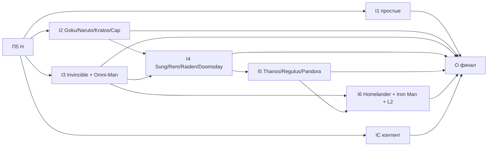

# План 6 — перенос остальных героев, контент и финал: Implementation Plan

> **For agentic workers:** REQUIRED SUB-SKILL: Use superpowers:subagent-driven-development (recommended) or superpowers:executing-plans to implement this plan task-by-task. Steps use checkbox (`- [ ]`) syntax for tracking.

**Goal:** Перенести оставшихся 20 героев и content-подсистемы в модули по процедуре, проверенной на пилотах, слить лучевые payload'ы, обновить документацию, создать skill `add-hero` и выполнить конечные критерии архитектуры.

**Architecture:** Волны по возрастанию связанности. Каждый перенос следует skill `migrate-hero` (создан в П5 H): характеризационные тесты, затем перенос, затем удаление shared-строк. Общие механики (`charge`, `summon`, `strike`, `flight`, `impact`) извлекаются в той волне, где у них появляется первый реальный потребитель. Поведенческие фиксы, найденные при переносе, идут отдельными PR.

**Tech Stack:** Java 21, Minecraft 1.21.1 (Mojang mappings), Fabric Loader 0.19.2, Fabric API 0.116.12+1.21.1, Fabric Loom 1.16-SNAPSHOT, JUnit 5.10.2, Fabric GameTest API, ArchUnit 1.5.1, Veil 4.1.2 (опционально), GeckoLib ≥4.5.0.

## Global Constraints

- Mod id: `superheroes` — не меняется никогда.
- Персистентные идентификаторы не меняются: id способностей (`superheroes:<ability>`), предметов, сущностей, звуков (`sounds.json`), MobEffect, типов урона, attachments (`hero_data`, `reinhard_state`, `doomsday_progress`, `regulus_madness`, `regulus_bonus_life`, `admin_build`, `suit_variant`, `nano_form`, `control_lock_shadow`, `pandora_revived` и др.), data component `superheroes:bound_weapon`, **ResourceLocation-ы attribute-модификаторов** (`modifiers/<hero>/<stat>` — permanent-пассивки лежат в NBT игроков), имена `KeyMapping` (`key.superheroes.*` — лежат в `options.txt`), lang-ключи.
- Id сетевых payload'ов не персистентны: их можно менять только при семантически оправданном слиянии (стадия L2).
- Геймплей и баланс не меняются в архитектурных PR. Любое изменение поведения — отдельный коммит с пометкой `behavior:` в сообщении и отдельным пунктом в описании PR.
- Server-authoritative: всё клиентское — в `src/client`; `src/main` загружается выделенным сервером.
- Только публичные API: `net.fabricmc.fabric.api.*`, никакого `net.fabricmc.fabric.impl.*`.
- Сеть — типизированные `CustomPacketPayload` + `StreamCodec`.
- `HeroDataStore` — единственный писатель `HERO_DATA` (`ProjectSanityTest.assertHeroDataHasSingleWriter`).
- Lifecycle-очистка — только через `PlayerLifecycle` (серверный поток), никогда через `ServerPlayConnectionEvents.DISCONNECT`.
- Mixins: узкие, `@Unique` для внедрённых членов, `@WrapOperation` предпочтительнее `@Redirect`.
- Звуки только OGG Vorbis; перед новыми ассетами проверять `art-source/`.
- `en_us.json` и `ru_ru.json` меняются вместе.
- `src/main/generated/` — только через `./gradlew runDatagen --no-daemon`; diff обязан быть пустым, если стадия не меняет данные намеренно.
- Финишный гейт каждого PR: `./gradlew qualityGate --no-daemon` зелёный.
- Runtime-изменения (ввод, рендер, HUD, сеть, VFX, сущности) — `./gradlew runClient --no-daemon`; если окружение не может запустить клиент, PR прямо это говорит.
- Никаких Gradle-модулей на героя, никакого big-bang rewrite, никакой перестановки файлов без смены владения.
- PR: заголовок на русском, тело начинается с «Для игрока», ниже — полная техническая часть; коммиты `feat(scope):`/`fix(scope):`/`refactor(scope):`/`test(scope):`/`docs(scope):` на английском.
- `SESSION.md` обновляется в каждом PR этого плана; статус стадии отмечается в таблице «Статус стадий» этого файла.

---

## Как исполнять этот план

- Карта всей миграции, целевая архитектура, сквозные политики (mixin, сеть, runtime state, поведенческие изменения) и конечные критерии — в [`00-overview.md`](00-overview.md). Процедура переноса героя — skill `.agents/skills/migrate-hero/SKILL.md`. Другие планы для этой работы читать не нужно.
- Одна строка волны = один PR (или несколько PR, перечисленных в строке). Первый шаг каждой — **«Сверка»**: перечитать файлы героя на актуальном `main` и обновить список касаний в описании PR.
- Если на актуальном коде проблема уже решена иначе — используем существующее решение и фиксируем это в PR и в разделе «Решения» этого плана. Откатывать рабочее решение ради буквального соответствия плану нельзя.
- Пути: `<root>/` — корень пакета после П5 E1; `hero/<id>/` и `client/hero/<id>/` — модули героев.
- Шаблон паспорта: **Цель · Почему · Зависит от · Затрагивает · Создаётся · Мигрируется · Удаляется · Старые пути, которых больше нет · Нельзя менять · Тесты · Runtime · Acceptance · Риски · Страховка.** Global Constraints в паспортах не повторяются.

Каждая стадия заканчивается одинаково (шаги не повторяются в каждой задаче):

- [ ] `./gradlew qualityGate --no-daemon` → `BUILD SUCCESSFUL`.
- [ ] Если стадия трогала datagen-источники: `./gradlew runDatagen --no-daemon` и `git diff --stat src/main/generated` → пусто (или только намеренные изменения, перечисленные в PR).
- [ ] Обновить «Статус стадий» этого плана, `SESSION.md` и при необходимости раздел «Решения».
- [ ] PR по правилам AGENTS.md §12; в технической части — baseline-метрики (`00-overview.md` §3.3) «до/после» для затронутых строк.

### Статус стадий

| Стадия | Статус | PR |
| :-- | :-- | :-- |
| I1a Kazuha + Scaramouche | ⏳ | |
| I1b Loki + A-Train | ⏳ | |
| I1c Battle Beast | ⏳ | |
| I2a Goku + Naruto | ⏳ | |
| I2b Kratos | ⏳ | |
| I2c Captain America | ⏳ | |
| I3 Invincible + Omni-Man | ⏳ | |
| I4a Sung Jinwoo | ⏳ | |
| I4b Rem | ⏳ | |
| I4c Raiden | ⏳ | |
| I4d Doomsday | ⏳ | |
| I5a Thanos | ⏳ | |
| I5b Regulus | ⏳ | |
| I5c Pandora | ⏳ | |
| I6a Homelander | ⏳ | |
| I6b Iron Man + L2 | ⏳ | |
| IC1 орда | ⏳ | |
| IC2 босс Хоумлендер | ⏳ | |
| IC3 admin и команды | ⏳ | |
| O документация и финальная приёмка | ⏳ | |

## Контекст

- Внешние зависимости (обзор §2.1): П5 H — go (без него волны не начинаются); стек bugfix-pass (BF5 damage, BF6 разрушение мира, BF8 House of Vanity, BF9 пассивки) уже в базе. Используются registrar'ы и сервисы П3–П5: `HeroModuleContext` (+`content/payloads/attachments`), `HeroClientContext`, `TickRegistrar`, `LifecycleRegistrar`, `OwnedSessionMap`, `Motion`, `FxBroadcast`, `Targeting`, `SkinResolver`, `HudLayers`, `AbilityDecorations`, `ClientSoundFilters`.
- Сквозные политики, которые применяет план: mixin policy (`00-overview.md` §6.1), сеть и synced attachments (§6.2, решение R12), размещение runtime state (§6.3), поведенческие изменения (§6.4).

### Решения

Решений уровня плана пока нет; решения, принятые при исполнении (в том числе про GeckoLib в IC1), записываются сюда.

## Зависимости стадий

I1, I2, I3 и IC идут параллельно разными агентами; мерж последовательный, с rebase.

## File Structure

| Пакет / файл | Ответственность | Стадия |
| :-- | :-- | :-- |
| `<root>/hero/<id>/**`, `<root>/client/hero/<id>/**` | модули 20 героев | I1–I6 |
| `<root>/mechanic/charge/ChargeSession.java` | «накопить → выпустить» | I2a |
| `<root>/mechanic/ability/` (+`SharedAbilityIds`) | общие способности `FLIGHT`, `VILTRUMITE_RECOVERY`, `ViltrumiteCharge` | I3 |
| `<root>/mechanic/summon/` | призывы с `OwnableEntity` | I4a |
| `<root>/mechanic/strike/HeavensStrike.java` | удар с вариантами, варианты задаёт Raiden | I4c |
| `HeroModuleContext.commands()` registrar | команды героев | I4d |
| `<root>/compat/falbiks/` | Snap-хук и strip-mixin другого мода | I5a, I5c |
| `<root>/client/core/{input/InputLock,text/TextObfuscationLayers}`, `FovModifiers`, `HudJitter` | общие клиентские хуки для Pandora и Regulus | I5b, I5c |
| `<root>/client/compat/iris/` | Iris-мост | I5c |
| `<root>/mechanic/flight/`, `<root>/mechanic/impact/` | полёт как реестр профилей, движок удара | I6 |
| `<root>/core/net/BeamFxS2CPayload.java`, `<root>/client/core/render/BeamRenderer.java` | один лучевой payload и рендерер со стилями | L2 |
| `<root>/content/{horde,boss/homelander,admin,command}/` | content-модули | IC |
| `.agents/skills/add-hero/SKILL.md` | добавление героя и способности | O |

## Стадии

### Волны I1–I6 и IC — остальные герои

Общее для каждой волны (процедура — skill `migrate-hero` из стадии H; ниже — только то, что специфично):

- до переноса — характеризационные GameTests для поведения, которое трогает перенос (lifecycle-очистка, гейты, тики);
- перенос сервера и клиента героя в `hero/<id>/` и `client/hero/<id>/`; id-константы → `<Id>Abilities`; экземпляры способностей создаются в модуле; `Heroes.<HERO>` и `AbilityRegistry.<ABILITY>` поля удаляются;
- статические `Map/Set<UUID…>` героя → `OwnedSessionMap` или non-persistent attachment на игроке (`00-overview.md` §6.3); ручные `clear`/`resetAll` исчезают **только если** они лишь удаляли записи — если старый `clear` забирал оружие, снимал `EntityControlLock`, модификаторы, эффекты, удалял сущности или слал пакет, этот побочный эффект остаётся явным хуком `ctx.lifecycle()`, и до замены на него пишется характеризационный GameTest;
- геройские вызовы `hurtMarked`/motion-пакетов/рассылок/поиска целей → `Motion`/`FxBroadcast`/`Targeting` с сохранением точной семантики каждого места;
- долгоживущее состояние, которое сейчас гоняется «метровым» payload'ом + `Client*State`, → synced attachment героя, если BF10 подтвердил механизм (`00-overview.md` §6.2); разовые FX остаются payload'ами модуля;
- acceptance волны: `grep -rliE '<id-паттерны героя>' src/main/java src/client/java | grep -v '/hero/<id>/'` → только списки модулей (+ перечисленные исключения волны); ArchUnit store без записей героя; baseline циклов не вырос;
- runtime: `runClient`-чек-лист каждой способности героя + HUD/скин; в PR — скриншоты.

| Волна | Герои (PR) | Доп. зависимости | Специфика (что именно уходит из shared-кода и что появляется) | Поведенческие риски |
| :-- | :-- | :-- | :-- | :-- |
| **I1** | I1a Kazuha + Scaramouche; I1b Loki + A-Train; I1c Battle Beast | H | Минимальные герои (6–7 файлов). A-Train: стиль `SPEED` уже в хуке BF11. Battle Beast: `BattleBeastCurseController.reapplyOnJoin` → `onJoin` модуля; curse-модификаторы уже transient (BF3). Scaramouche: Wind Prison — регрессия B2 (`windPrisonEndsWhenItsZoneExpires`) должна остаться зелёной. | низкие |
| **I2** | I2a Goku + Naruto (вместе); I2b Kratos; I2c Captain America | H | I2a создаёт `mechanic/charge/ChargeSession` — общая механика «накопить → выпустить» (≥ 5 потребителей: Kamehameha, Spirit Bomb, три Rasengan; далее Repulsor, ChargeTackle, ViltrumiteCharge, CapShieldSlam): per-player состояние в `OwnedSessionMap`, тик через dispatcher, отмена на death/leave; каждая способность сохраняет свои тайминги. Условные тики `NARUTO_SAGE_MODE`/`GOKU_SUPER_SAIYAN_AURA` → `hero()`-хуки модулей с той же проверкой активности (сверка: не дублируют ли они `onTickActive` — если да, это баг двойного тика, отдельный `behavior:` коммит с тестом). I2b: `SpartanRageHud` содержит ветку Kratos+Rem — разделить на `KratosRageHud` (Kratos) и оставить Rem-часть до I4 в том же классе под именем Rem. | тайминги зарядов — характеризационные тесты «через N тиков выпущено» до переноса |
| **I3** | Invincible + Omni-Man (вместе) | H | Общие способности `FLIGHT` (4 героя), `VILTRUMITE_RECOVERY` (2), `ViltrumiteCharge` → `mechanic/ability/` + `mechanic/ability/SharedAbilityIds` (иконка под героя уже поддерживается `AbilityIcons`). `InvincibleCombatController:55` (проверка `IRON_FISTS`) и `:117` (звук Homelander) → строковые id через `ModId.of(...)`/звук по id, без импорта чужих классов. `HeroReactionController` (реплики Homelander↔Omni-Man) → по одному правилу в модулях Omni-Man и Homelander через `ctx.lifecycle().onHeroTransformed` (BF11 `HeroLifecycle.onTransformed`), id другого героя — строкой. Think Mark уже на `EntityControlLock` (BF3). | нет |
| **I4** | I4a Sung Jinwoo; I4b Rem; I4c Raiden; I4d Doomsday | I2, I3 | I4a: `mechanic/summon/` — `OwnableEntity` для `ShadowSoldier` (и позже Ram, дроны, клоны); армия в статике (Opus B18) → owner-scoped состояние; B18-фикс (армия не спавнится повторно после рестарта) — отдельный `behavior:` PR после переноса. Два условия скина Sung уже в `SkinProvider` (CL4). I4b: `RemDemonismController`, `RamCompanionController` (живая ссылка на сущность → UUID + поиск, Opus «Ram может дублироваться» — `behavior:` фикс отдельно), Rem-часть `SpartanRageHud`, Rem-ветки `ClientAbilityFilter` уже ушли в C4. I4c: `HeavensStrikeController` → `mechanic/strike/HeavensStrike` + `Variant` задаёт Raiden; `RaidenState` attachment → модуль. I4d: тиры → `DoomsdayHero.canUseAbility` (BF11) и `visibility` (C4) уже, `DoomsdayAdaptationController:71-81` → тег `#superheroes:beam` и новые теги урона, если нужны; `LivingEntityEffectMixin`, `KryptoniteShardPickupMixin` → `mixin/hero/doomsday/` либо общий хук (`00-overview.md` §6.1); `SuperheroesCommands:63-67,283-298` → `HeroModuleContext.commands()`-registrar (появляется здесь; `CommandRegistrationCallback` внутри). | B18/Ram — только отдельными PR |
| **I5** | I5a Thanos; I5b Regulus; I5c Pandora | I4 | I5a: соответствие «герой → камень» в 7 местах (`ThanosStoneRewardController:36-41` + `TooltipFrame.containsStone` в предметах 6 героев) → данные модуля Thanos (`InfinityStones.rewardFor(ResourceLocation heroId)`, id героев строками) + клиентский tooltip-хук (`ItemTooltipCallback` в client-модуле Thanos) — предметы других героев больше не вызывают `TooltipFrame.containsStone`, и 6 оставшихся подклассов предметов трансформации (BladeOfChaos, CaptainAmerica, Loki, NarutoHeadband, Regulus, ShadowMonarchsCloak) сводятся к `TransformationItem` + `TransformationLore` (П2 B3), lore-golden B3 остаётся зелёным; `ThanosBlockBreakingMixin` → `WorldDestructionPolicy` BF6 + `mixin/hero/thanos/` если хук невозможен; `ThanosCrossModSnapHook` → `compat/falbiks/`; лучевой payload Thanos — в L2 вместе с I6. I5b: HUD/миксины безумия (`BloodRainHud`, `ClientHudGlitch`, `CracksOverlayHud`, `GuiVanillaGlitchMixin`, `GameRendererFovMixin`) → client-модуль Regulus через реестры `client/core` (`FovModifiers`, `HudJitter` — создаются здесь, `00-overview.md` §6.1); `RegulusMadnessController:138-146` (выключает `IRON_MAN_FLIGHT`/`SUPERSONIC` по id) → `FlightAbilityState.isFlightAbility`; `LivingEntityFallDamageMixin` — после BF9 (per-player fall-иммунитет); `AbilitiesTooltipHud:225` ветка → `AbilityDecorations`. I5c: 4 `PandoraCinematic*Mixin` → общий `client/core/input/InputLock` (один набор миксинов, причина блокировки регистрирует Pandora; отпускание клавиш не отменяется — Opus B15); `FontVanityCipherMixin` → `client/core/text/TextObfuscationLayers` + правило Pandora; `HeroComponentStripMixin` → `compat/falbiks/` без `@Shadow` на чужом поле (`@Pseudo`, `require = 0`, доступ через accessor-интерфейс или рефлексию с кешем); Iris-мост → `client/compat/iris/`; остатки Doctor Strange уже убраны N2. | InputLock — `runClient` ролика целиком |
| **I6** | I6a Homelander; I6b Iron Man | I3, I5 | Подсистема полёта наполовину принадлежит им: `FlightMode.IRON_MAN/SUPERSONIC`, `FlightAbilityState:13-33`, `FlightProfiles:10-28`, `FlightController:34,147,173-232`, `FlightAbility:37-38`, `LocalPlayerFlightMixin:44` → `mechanic/flight/FlightProfiles` становится реестром профилей и модификаторов, которые регистрируют Homelander (лимиты, уран, «молочное безумие») и Iron Man (режимы костюма); healthy-математика `flight/` и её 4 теста переезжают в `mechanic/flight/` без изменений. I6a: переименование Java-классов безумия Homelander (`MadnessFlightController` → `HomelanderMadnessFlightController` и т. д.; id эффекта `madness` не меняется); уран-предметы; `SunWindupHud`; `LowResourceVignetteHud` удалён N1. I6b: Jarvis (`jarvis/`, `JarvisOverlayHud`, угроза из профиля B1) → модуль Iron Man; `HeroInfoPanelHud` панель костюма → HUD-слой Iron Man; `GuiHotbarMixin:48` → хук hotbar-оверлея; нано-молот `CombatImpactEngine:99-108` → `Hero.modifyImpact(ImpactContext)` (default — без изменений) → после этого `CombatImpactEngine` переезжает в `mechanic/impact/`; сущности дронов/ракет; ESP. L2 (лучи) — здесь. | полёт — характеризационные JUnit на `FlightMotionMath` уже есть; добавить GameTest режимов Iron Man до переноса |
| **IC** | IC1 `content/horde/`; IC2 `content/boss/homelander/`; IC3 `content/admin/` + `content/command/` | H (параллельно I1–I3) | Орда (собственный реестр 25 сущностей, `HordeManager`, GeckoLib) — content-модуль с `ContentModule` (тот же registrar-контракт без `Hero`); GeckoLib: `BaseHordeEntity implements GeoEntity` при ванильных рендерерах и неиспользуемом `HordeGeoRenderer` (N1) — удалить зависимость **только** если `runClient` показывает, что ни одна модель не рендерится через GeckoLib (решение фиксируется в разделе «Решения» этого плана; иначе оставить); босс Хоумлендер (сущность, 10 AI-целей, рендерер, Vought Signal, типы урона `HOMELANDER_*`) отделяется от героя Homelander; `AdminBuildSyncController`, `AdminAbilityDebug`, `SuperheroesCommands` → `content/admin`, `content/command`. | орда без игроков (Opus «потенциальные») — не трогать в рамках переноса |

Волны внутри одной строки можно вести параллельно разными агентами; мерж — последовательный, с rebase (конфликты сводятся к удалению строк из общих списков, которых к I6 почти не остаётся).

---

### Стадия L2 — один лучевой payload и рендерер (вместе с I6b)

**L2 — лучи** (в I5a/I6): `LaserFiredS2CPayload`, `RepulsorBlastS2CPayload`, `ThanosCosmicBeamS2CPayload` (все `(UUID shooter, Vec3 start, Vec3 end)`) → `core/net/BeamFxS2CPayload(ResourceLocation style, UUID shooter, Vec3 start, Vec3 end)`; три рендерера → `client/core/render/BeamRenderer` + реестр стилей, которые регистрируют Homelander, Iron Man, Thanos (цвет, ширина, время жизни — байт-в-байт из текущих рендереров). Тест: GameTest/скриншоты трёх лучей до/после.

---

### Стадия O — документация, `add-hero`, финальная приёмка

- **Зависит от:** I1, I2, I3, I4, I5, I6, IC (все волны; обзор §2.1).
- **Мигрируется:** `AGENTS.md` §2 — описание текущей раскладки заменяется новой моделью: герой = `hero/<id>/<Id>Module` + `client/hero/<id>/<Id>ClientModule`; `HeroProfile`; хуки `Hero`; registrar'ы; `HeroTickDispatcher`; `PlayerLifecycle`/`OwnedSessionMap`; ArchUnit как гейт архитектуры. `AGENTS.md` §7 — ссылка на `00-overview.md` §5.2 правил зависимостей и на `ArchitectureRulesTest`. `README.md` — раздел для разработчиков (если описывает структуру).
- **Создаётся:** `.agents/skills/add-hero/SKILL.md` — шаблон модуля (server + client), чек-лист ресурсов (`lang` ×2, `models/item/<item>.json`, `textures/entity/hero/<id>.png`, `textures/gui/abilities/<ability>.png`, `sounds.json`, `sounds/<id>/`), правило имени пакета (D2a-2), обязательные GameTests (строки героя в golden `hero_presentation.txt`/`passive_glyphs.txt`, полнота), команды проверки; раздел «добавить способность существующему герою» (файлы только внутри `hero/<id>/` + lang + иконка).
- **Удаляется:** `.agents/skills/migrate-hero/` (процедура миграции больше не нужна); пустой `ability/AbilityIds` (общие id — в `mechanic/ability/SharedAbilityIds`); legacy-пакеты `effect/`, `network/`, `item/` (кроме общих предметов), `physics/`, `flight/`, `jarvis/`, `attachment/ModAttachments` (если опустел); `ClientNetworking` в корне клиента; ArchUnit freeze-store правил, которые опустели (правило становится строгим — `FreezingArchRule.freeze(...)` снимается); `package-cycles-baseline.txt` → пустой (правило остаётся).
- **Acceptance:** метрики `00-overview.md` §8 выполнены и записаны в PR; `SESSION.md` передаёт проект в режим «новый контент».

---

## Готово, когда

Выполнены все конечные критерии `00-overview.md` §8 и записаны в PR стадии O.

## Self-Review

- **Покрытие:** волны I1–I6 и IC, стадия O и пункт «лучи» (L2) из исходного плана перенесены целиком.
- **Что создаётся для будущего контента:** `ChargeSession`, `mechanic/ability`, `mechanic/summon`, `HeavensStrike`, реестр профилей полёта, `Hero.modifyImpact(ImpactContext)`, `BeamFxS2CPayload` + стили, `InputLock`, `TextObfuscationLayers`, `FovModifiers`, `HudJitter`, `HeroModuleContext.commands()`, skill `add-hero`.

## Execution Handoff

Исполнение: **Subagent-Driven (рекомендуется)** — субагент на строку волны, ревью между PR (superpowers:subagent-driven-development), или **Inline** с контрольными точками (superpowers:executing-plans). Волны I1, I2, I3 и IC можно раздать разным агентам одновременно.

При параллельном исполнении несколькими субагентами оркестратор раздаёт задачи этого плана по `00-overview.md` §11 «Оркестрация».
